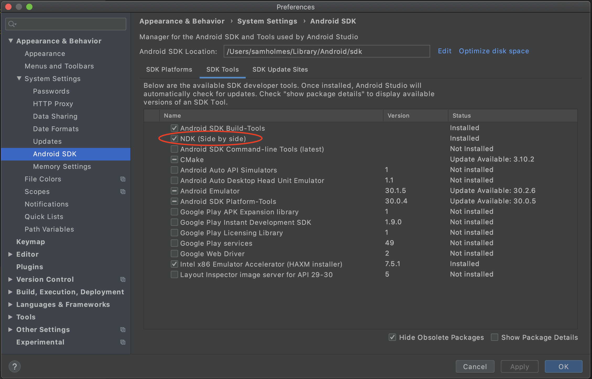

# Edge Wallet

## A multicurrency mobile wallet for Bitcoin, Bitcoin Cash, Ethereum, Dash, Litecoin, Ripple/XRP and Monero

<br>

Edge Wallet is:

- simple
- secure
- private
- decentralized
- multi-currency
- cross-platform
- mobile first
- open source


<br>
<br>
<br>
<br>

# Working with the Source Code
<br>

#### __Note:__ _This guide __assumes a Mac/OSX environment.__ You can setup a windows/linux environment with small adaptations to the insturctions._

<br>

## Requirements

<br>

Edge is known to build with this exact tool set. Updated versions of these toolsets may break the build or app. If you have issues, try mirroring these exact versions.

- macOS Catalina 10.15.6
- Xcode 12.1
- Android Studio 4.1
- CocoaPods 1.10.0
- Android NDK r21d
- NodeJS 14.15.0
- NPM 6.14.8
- Yarn 1.22.10
- OpenJDK Java 1.8

<br>
<br>
<br>
<br>

## Getting Started - General

### Install NodeJS & NPM

    https://nodejs.org/en/download/

### Install Yarn

    https://yarnpkg.com

### Install React Native CLI

    npm install -g react-native-cli

### Checkout develop branch & install node_modules

    cd edge-react-gui
    yarn

### Run the bundler

    yarn start

<br>
<br>
<br>
<br>

## Getting Started - iOS Setup

### Install CocoaPods

    sudo gem install cocoapods

### XCode Setup - Use Legacy Build System

    Open edge-react-gui/ios/edge.xcworkspace in Xcode
    File -> Workspace Settings
    Set `Build System` to `Legacy Build System`

<br>
<br>
<br>
<br>

## Getting Started - Android Setup


### Android NDK Setup

Use Android Studio's Preferences to install NDK (Side by side):



1. Open Preferences
2. Navigate to `Appearance & Behavior -> System Settings -> Android SDK` in the sidebar
3. Navigate to `SDK Tools` tab
4. Check `NDK (Side by side)` checkbox
5. Click OK or Apply and follow the download instructions.

> If the NDK is already installed from Android Studio, it should be in `/Users/[user]/Library/Android/sdk/ndk-bundle` (macOS) or `C:\Users\[username]\AppData\Local\Android\Sdk\ndk-bundle` (Windows).

<br>
<br>

### Environment Variables

The following environment variables should be exported from your `.bashrc` or equivalent file.

    export ANDROID_NDK_HOME=/Users/[username]/Library/Android/sdk/ndk-bundle
    export NDK_HOME=/Users/[username]/Library/Android/sdk/ndk-bundle
    export SDK_HOME=/Users/[username]/Library/Android/sdk
    export ANDROID_HOME=/Users/[username]/Library/Android/sdk
    export JAVA_HOME="/Applications/Android Studio.app/Contents/jre/jdk/Contents/Home"

<br>
<br>

### Java(OpenJDK)

For best results, please consider using the following versions (up-to-date as of 2021-5-4)

- ```brew install --cask adoptopenjdk14``` 
[github](https://github.com/AdoptOpenJDK/homebrew-openjdk)

<br>
<br>

### Add API Key to "env.json"

A public API key is built into the edge-core-js which can be used to build and test the Edge app. This key is severely rate limited and should not be used for production. For production use, get an API key by emailing info@edge.app.

Copy the `env.example.json` to `env.json` and change the `AIRBITZ_API_KEY` to the API key you received from Edge. To use the public API key, leave `AIRBITZ_API_KEY` blank.

<br>
<br>

---

<br>
<br>
<br>
<br>

## Build/Run(Debug)

<br>

### iOS(Debug)

- Open `edge-react-gui/ios/edge.xcworkspace` in Xcode
- Choose a target device or simulator and tap the Play button on the top nav bar

<br>
<br>

### Android(Debug)

    cd android
    ./gradlew assembleDebug

- The resulting APK will be in `./app/build/outputs/apk/debug/app-debug.apk`
- Copy the APK to a simulator like Genymotion or a real device via Email or messaging app

<br>
<br>
<br>
<br>

## Build/Run(Release)

First, run `./scripts/updateVersion.js` to copy the `package.json` version into the native project files, and to assign a unique build number.

<br>

### iOS(Release)

- Open `edge-react-gui/ios/edge.xcworkspace` in Xcode
- Hold [ option/alt ] and click on the Edge button on the top bar to the right of the Play and Stop icons.
- Change 'Build Configuration' to Release
- Uncheck 'Debug Executable'
- Close window
- Choose a device and hit Play

<br>
<br>

### Android(Release)

    cd android
    ./gradlew assembleRelease

- The resulting APK will be in `./app/build/outputs/apk/release/app-release.apk`
- Copy the APK to a simulator like Genymotion or a real device via Email or messaging app

<br>
<br>

---

<br>
<br>
<br>
<br>

## Deploying

The included `deploy.js` is a script to automate building, signing, and deploying release builds of Edge. It provides the following:

- Auto sign Android APK with Android keystore files
- Auto sign iOS IPA with provisioning profiles

<br>
<br>

### Build for Deploy

- Run `./scripts/updateVersion.js` to set up your build number & version.
- Set the env var KEYCHAIN_PASSWORD to the keychain password of the current user
- Copy the `deploy-config.sample.json` to `deploy-config.json` and edit the parameters accordingly. You'll need a HockeyApp account to get ids and keys
- Put any Android keystore files into `edge-react-gui/keystores/`
- If using Firebase, put your account's `google-services.json` and `GoogleService-Info.plist` into `edge-react-gui/`
- Install xcpretty `sudo gem install xcpretty`

<br>
<br>

### Execute deploy

    ./deploy.js edge ios master
    ./deploy.js edge android master

<br>
<br>

---

<br>
<br>
<br>
<br>

## Debugging

As with any modern React Native app, [Flipper](https://fbflipper.com/) is the officially-supported debugging app. Use the "React Native Hermes Debugger" to debug Javascript running in the UI.

## Contributing

Please follow the coding conventions defined in [Edge Conventions](https://github.com/Airbitz/edge-conventions)
