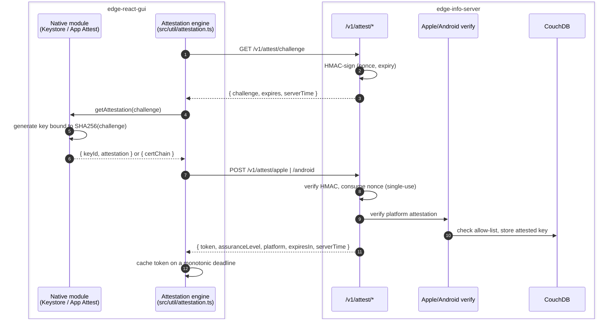
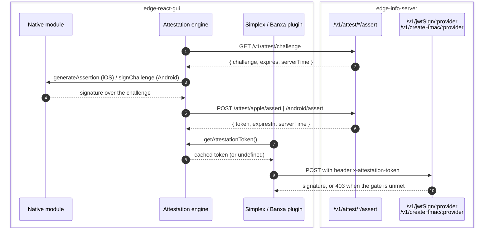
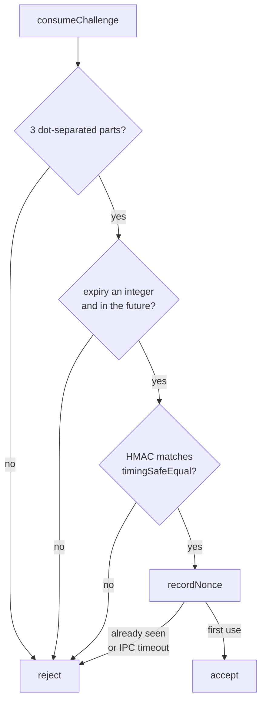
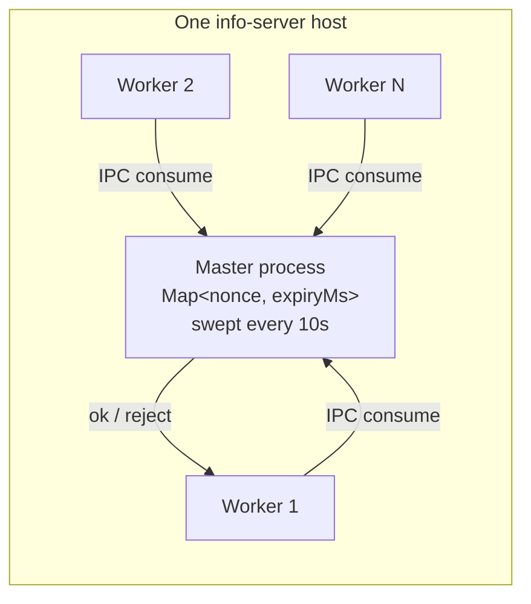
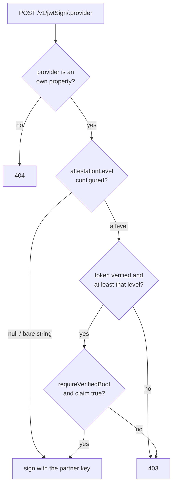
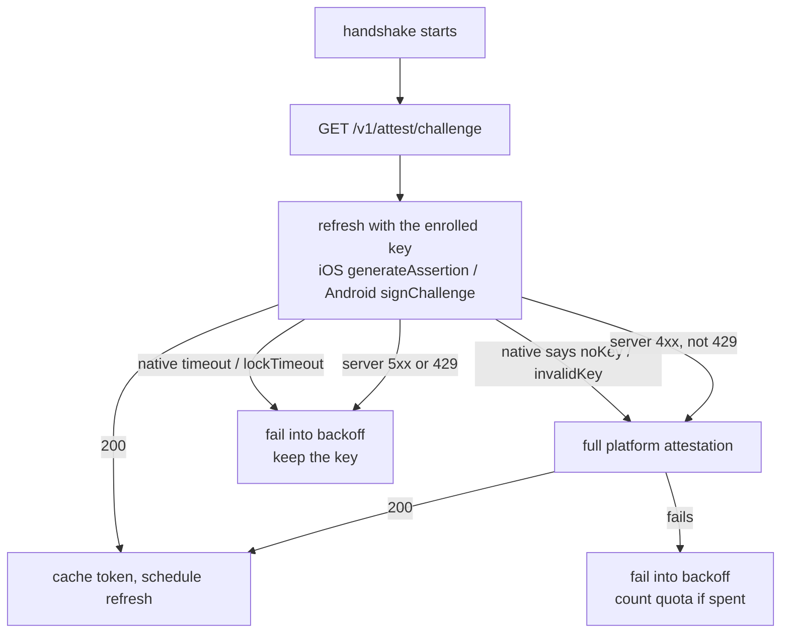

# App attestation for gated info-server requests: prove the caller is the real Edge app on real hardware

| | |
|---|---|
| Status | In review |
| Authors | Paul Puey (implementation, repo docs), Jon Tzeng (this document) |
| Reviewer | Jon Tzeng (code review, 2026-08-07: 8 comments, 6 fixed, 2 declined) |
| Last updated | 2026-08-07 |
| Repos | [edge-info-server](https://github.com/EdgeApp/edge-info-server), [edge-react-gui](https://github.com/EdgeApp/edge-react-gui) |
| Implementation | info [#156](https://github.com/EdgeApp/edge-info-server/pull/156) (merged), info [#158](https://github.com/EdgeApp/edge-info-server/pull/158), gui [#6137](https://github.com/EdgeApp/edge-react-gui/pull/6137) |
| Supersedes | - |
| Related | [Asana task](https://app.asana.com/0/1215088146871429/1216536848508307) |

This document describes what is built on the branches above: `paul/attestationLifetimeFloor` in edge-info-server (on top of the merged #156) and `paul/appAttestationV2` in edge-react-gui. Each code block below is captioned with a link to that file pinned at the branch commit it was taken from.

## Contents

1. [Problem](#1-problem)
2. [Prior art](#2-prior-art)
3. [Goals and non-goals](#3-goals-and-non-goals)
4. [Design overview](#4-design-overview)
5. [Detailed design: edge-info-server](#5-detailed-design-edge-info-server)
6. [Detailed design: edge-react-gui](#6-detailed-design-edge-react-gui)
7. [Testing](#7-testing)
8. [Phase history](#8-phase-history)
9. [Decisions](#9-decisions)
10. [Glossary](#10-glossary)
11. [References](#11-references)

## 1. Problem

The info server signs on behalf of Edge's ramp partners. `POST /v1/jwtSign/:provider` mints a [JWT](#jwt-json-web-token) with a partner secret, and `POST /v1/createHmac/:provider` returns an [HMAC](#hmac-hash-based-message-authentication-code) over caller-supplied data with a partner key. Simplex and Banxa both accept those signatures as proof that the request came from Edge.

Neither endpoint can tell who is calling. They are reachable by anyone who can reach the host, so any script can obtain a signature that Simplex and Banxa will honor as Edge's. The partner secrets never leave the server, but the ability to use them does not.

What the server needs is evidence that the caller is the genuine Edge app running on a real device, checkable server-side and cheap enough to sit in front of a purchase flow.

## 2. Prior art

**A shared API key or bearer token in the app.** Anything shipped in the binary is extractable. It raises the effort to pull a key out of an APK, and nothing more.

**Play Integrity / SafetyNet.** Google's hosted attestation answers the question directly, but it is closed source. Edge ships an open-source app, and a build that depends on Google's proprietary SDK cannot be reproduced from source by the people who audit it. That rules it out on licensing grounds before any technical comparison.

**Platform attestation on every request.** Apple [App Attest](#app-attest) and [Android Keystore attestation](#android-keystore-key-attestation) are both rate limited and slow (a network round trip to Apple, a certificate chain to build on Android). The Banxa order poll runs every 3 seconds; attesting per request would trip the platform limits and lock out the devices it was meant to protect.

**A per-request [nonce](#nonce) in Redis (the V1 design, built and then removed).** Redis gives every worker a shared single-use store, which is the obvious way to stop challenge replay across a cluster. It costs a managed database per region, and it puts a network dependency in front of enrollment. See [decision 1](#91-self-validating-hmac-challenges-instead-of-a-redis-nonce-store) for why it was replaced and [section 8](#8-phase-history) for what changed.

## 3. Goals and non-goals

Goals:

- Prove application identity (the genuine `co.edgesecure.app` binary) and hardware backing, using only open platform APIs.
- Gate the two signing endpoints per provider, switchable from data with no code deploy, so rollout and rollback are a Couch edit.
- Keep every pre-existing info-server route working when attestation is degraded or misconfigured.
- Spend a rate-limited platform attestation only when nothing cheaper can work.
- Survive a device whose wall clock is wrong.

Non-goals:

- Per-user authentication. Attestation proves the app and the device, never the account.
- Blocking rooted or jailbroken devices outright. `requireVerifiedBoot` exists per provider and gates on [verified boot](#verified-boot), but the default posture accepts a [TEE](#tee-trusted-execution-environment)-backed key on an unlocked bootloader.
- Protecting anything beyond the two signing endpoints. edge-core-js does not participate.
- Cross-host replay protection inside the challenge window. See [decision 2](#92-per-host-nonce-cache-on-the-cluster-master).

## 4. Design overview

Two repos, one seam: the client obtains a short-lived attestation token from the info server and attaches it to the two gated endpoints.

| Repo | Deliverable | Scope |
|---|---|---|
| edge-info-server | [#156](https://github.com/EdgeApp/edge-info-server/pull/156) merged, [#158](https://github.com/EdgeApp/edge-info-server/pull/158) open | Challenge mint and verify, Apple/Android verification, token mint, per-provider gate. [Section 5](#5-detailed-design-edge-info-server) |
| edge-react-gui | [#6137](https://github.com/EdgeApp/edge-react-gui/pull/6137) open | Native attestation modules, the background token engine, header injection at the Simplex and Banxa call sites. [Section 6](#6-detailed-design-edge-react-gui) |

The full enrollment handshake, with participants grouped by repo:



Every later handshake refreshes with the enrolled key and never touches Apple or Google:



The token is an [ES256](#es256) [JWT](#jwt-json-web-token) the server signs with a key held in Couch. Any Edge service can verify one offline from the published [JWKS](#jwks-json-web-key-set), so a gate does not have to call the info server per request.

## 5. Detailed design: edge-info-server

### 5.1 Challenges are self-validating

A challenge is a string with three parts: a random [nonce](#nonce), an absolute expiry in whole seconds, and an [HMAC](#hmac-hash-based-message-authentication-code) over the first two, dot-joined and [base64url](#base64url)-encoded.

[`src/attestation/challenges.ts`](https://github.com/EdgeApp/edge-info-server/blob/0640c285d335179a1d62dbff070abdea7ec0d3cd/src/attestation/challenges.ts)
```ts
export const createChallenge = async (): Promise<Challenge> => {
  const lifetimeSec = appAttestation.doc.data.challengeLifetimeSec
  const expSec = Math.floor(Date.now() / 1000) + lifetimeSec
  const nonce = base64url.encode(randomBytes(NONCE_BYTES))
  const payload = `${nonce}.${expSec}`
  const key = await getChallengeHmacKey()
  const sig = signPayload(key, payload)
  return {
    challenge: `${payload}.${sig}`,
    expires: expSec * 1000,
    serverTime: new Date().toISOString()
  }
}
```

The HMAC key is derived with [HKDF](#hkdf-hmac-based-key-derivation-function) from the same private [JWK](#jwk-json-web-key) that signs tokens, so there is one secret to provision and rotate. Any worker on any host can verify a challenge it never issued, which is what removes the shared store.

Verification rejects a malformed shape, a non-integer or past expiry, and a signature that fails a length check followed by `timingSafeEqual`. Only after all of that does it try to consume the nonce.



### 5.2 Single use lives on the cluster master

The server runs a Node cluster. Workers do not share memory, so the nonce record lives in one Map on the [cluster master](#cluster-master) and workers ask over cluster [IPC](#ipc-inter-process-communication).



The request carries a 2 second timeout and fails closed: a worker that gets no answer treats the challenge as unusable rather than risk accepting a replay. The master replies only through a guard that checks `worker.isConnected()` first, because an unguarded `send` to a worker that has already exited raises `ERR_IPC_CHANNEL_CLOSED` as an unhandled error event and takes the master down. The master is also the supervisor that re-forks workers, so losing it degrades every route, not just attestation.

### 5.3 Platform verification

iOS submits an [App Attest](#app-attest) attestation object; Android submits an X.509 certificate chain from Keystore. Both paths end at an `AttestationResult` carrying the [assurance level](#assurance-level).

| Level | Meaning | Order |
|---|---|---|
| `debug` | Debug-keystore-signed build, whatever the hardware reports | 0 |
| `software` | No hardware backing | 1 |
| `hardware` | [TEE](#tee-trusted-execution-environment)-backed key (`trustedEnvironment`) | 2 |
| `secureElement` | [StrongBox](#strongbox) / dedicated secure element | 3 |

Android verification anchors the chain to Google's bundled hardware roots, checks every serial against Google's published [CRL](#crl-certificate-revocation-list), and reads [`attestationApplicationId`](#attestationapplicationid) for the package name and signing-certificate digests, which must match the allow-list in Couch. A debug-signed build is forced to `debug` regardless of the hardware it reports, so a debug build can never satisfy a `hardware` gate.

iOS checks the App Attest object against Apple's root, binds it to `SHA256(challenge)`, and pins the team id from the allow-list. The App Attest environment decides the level: the development environment maps to `debug`, the production environment to `secureElement` (the key lives in the [Secure Enclave](#secure-enclave)).

A successful attest upserts one Couch doc per key in `info_attestation_keys` (`_id = platform:keyId`; on Android the keyId is the base64url [SHA-256](#sha-256) of the leaf certificate's public key). The doc records the public key, the assurance level, the chain serials for later CRL re-checks, and the [verified boot](#verified-boot) outcome at enrollment. Trust anchors (Apple's App Attest root, Google's hardware roots) are bundled in `src/attestation/roots.ts`, so verification needs no fetch beyond the CRL.

### 5.3.1 Refresh verification (assert)

`POST /v1/attest/apple/assert` and `/android/assert` refresh a token without touching Apple or Google. Both load the stored key doc (unknown key is a 400, which the client reads as "re-enroll"), re-check the allow-list so an operator can revoke an app id, verify the signature over the challenge against the stored public key, and reuse the assurance level recorded at enrollment. The level is never recomputed on assert; what was proven once about the hardware does not change by signing again.

Anti-clone differs by platform. iOS assertions carry a counter that must strictly increase over the stored `signCount`; the new value is persisted, and a concurrent assertion (Couch 409) fails the request so the client retries. Android signatures carry no counter, so the non-extractable [TEE](#tee-trusted-execution-environment)/[StrongBox](#strongbox) key is the compensating control; instead, asserts re-check the stored chain serials against the [CRL](#crl-certificate-revocation-list), which catches a keybox revoked after enrollment. Key docs written before serials were recorded skip that re-check and age out through re-enrollment.

### 5.4 Token mint and the wire contract

A successful attest or assert mints an [ES256](#es256) [JWT](#jwt-json-web-token). The response gives the client a relative lifetime and the server's clock, not an absolute deadline:

[`src/attestation/index.ts`](https://github.com/EdgeApp/edge-info-server/blob/0640c285d335179a1d62dbff070abdea7ec0d3cd/src/attestation/index.ts)
```ts
const { token, expiresIn, serverTime } = await mintAttestationToken(result)
return { token, assuranceLevel: result.assuranceLevel, platform: result.platform, expiresIn, serverTime }
```

`expiresIn` is seconds and `serverTime` is ISO 8601. The client needs neither its own clock nor agreement with the server's to know when the token dies. See [decision 3](#93-relative-expiresin-plus-servertime-instead-of-an-absolute-expiry). `serverTime` is derived from the same floored second as the JWT's `exp`, so `serverTime + expiresIn` lands exactly on `exp`; a first cut captured it after signing, overshooting by up to a second, and `src/__tests__/attestationMint.test.ts` now pins the equality.

The token itself is stateless: nothing is stored per mint. Claims are `assuranceLevel`, `platform`, `appId`, `keyId`, and `verifiedBoot`, plus `iat`/`exp`/`jti`, with issuer `edge-info-server/attest` and audience `edge-info-server`. `verifiedBoot` is `true` when the device proved [verified boot](#verified-boot) with a locked bootloader at enrollment; on iOS it is always `true`, since App Attest only succeeds on an unmodified boot chain. Tokens minted before the claim existed omit it, and the verifier collapses anything but literal `true` to `false`. Any Edge service can verify a token offline with `verifyAttestationToken` from `src/public/attestation.ts` after fetching the [JWKS](#jwks-json-web-key-set) once; the signing [JWK](#jwk-json-web-key) auto-provisions on first use and is warmed at master boot. Multi-host deployments must replicate `info_data` so every host shares that one JWK; without it, challenges and tokens minted on one host fail verification on the other.

Both lifetimes are operator-editable remote config and are clamped when read:

[`src/types.ts`](https://github.com/EdgeApp/edge-info-server/blob/0640c285d335179a1d62dbff070abdea7ec0d3cd/src/types.ts)
```ts
const asLifetimeSec =
  (defaultSec: number, minSec: number): Cleaner<number> =>
  raw => {
    const value = asMaybe(asNumber)(raw)
    const resolved =
      value == null || !Number.isFinite(value) ? defaultSec : value
    return Math.max(minSec, Math.floor(resolved))
  }
```

`attestationTokenLifetimeSec` has a 15 minute floor because the client refreshes 5 minutes before expiry; a shorter lifetime would leave no gap between refreshes. `challengeLifetimeSec` defaults to 30 seconds with a 10 second floor. The whole-document fallback is built by running the cleaner over `{}` rather than a hand-maintained literal, so the never-provisioned-Couch path cannot escape the clamps.

### 5.5 The per-provider gate

`withAttestation` parses the `x-attestation-token` header and hands each route an assurance level of `none`, `failed`, or a verified level. It never rejects on its own; each route decides.



A provider stored as a bare string is ungated, which is what makes rollout incremental: providers stay strings until the attesting app is live, then become `{ key, attestationLevel }`. `requireVerifiedBoot` sits inside the gated branch, so it can never apply to an ungated provider. The provider lookup uses an own-property check, so a name like `__proto__` cannot resolve to an inherited member and skip the 404.

Per-provider `requireVerifiedBoot` is distinct from the global enrollment-time `appAttestation.requireVerifiedBoot`: the global flag rejects the attestation itself, while the provider flag rejects a signing request whose token's `verifiedBoot` claim is not literally `true` (403 "Verified boot required"). One rollout wrinkle follows: an Android device enrolled before the claim was recorded asserts tokens with `verifiedBoot: false`, so a provider gated on it returns 403 until the token expires and the device re-attests, recording its real boot state. Failure messages distinguish the cases: missing token, invalid token, assurance level too low, verified boot required.

### 5.6 Failure isolation

Attestation is reachable only from `attestRoutes`, `withAttestation`, and the two signing routes. No pre-existing route imports anything from `src/attestation`. At boot, `provisionSigningKey()` is wrapped in a `catch`, so a signing-key failure logs and lets `forkChildren()` proceed. A completely broken attestation subsystem still leaves every existing endpoint serving.

## 6. Detailed design: edge-react-gui

### 6.1 The engine and its clock

`src/util/attestation.ts` runs one background engine that keeps a token cached. `initInfoServer` calls `initAttestation()` from the app's NetInfo listener, so the engine starts on the first connected event at boot and is poked again on every reconnect; `initAttestation()` is idempotent (it returns immediately while a token is live, and the handshake is single-flighted and rate-limited below), so a flapping connection cannot become a handshake storm. `fetchInfo` itself carries no attestation logic; the gated plugins attach the header themselves ([section 6.5](#65-call-sites)).

Every deadline is monotonic. `CachedToken.expiresMono` is `monotonicNow()` at receipt plus the server's `expiresIn`, and it is only ever compared against `monotonicNow()`:

[`src/util/attestation.ts`](https://github.com/EdgeApp/edge-react-gui/blob/fc803174d734753dc4df47b539911941f1705254/src/util/attestation.ts)
```ts
interface CachedToken {
  token: string
  expiresMono: number
}
```

A user changing the device date cannot revive an expired token or kill a live one. `serverTime` is read only to warn about clock skew above two minutes, and never enters the deadline.

Server responses are parsed with `cleaners` (`asChallengeResponse`, `asTokenResponse`), matching every other info-server response shape in the client. Two checks stay outside the cleaners on purpose: `expiresIn` must be positive, finite, and longer than the 5 second skew margin (a token unusable on arrival is a failed handshake, not a cache entry), and the skew warning runs before validation so a malformed body still warns about a bad device clock.

### 6.2 Refresh before attestation

A full platform attestation is rate limited on both platforms, so the engine reaches for it last.



Two rules keep an outage from becoming a fleet-wide re-enrollment:

- `isKeyRejection` treats only a sub-500, non-429 response as the server judging the key. A 5xx or a 429 says the server could not answer, which is not evidence about the key.
- `TRANSIENT_NATIVE_CODES` (`timeout`, `lockTimeout`) mean the native module gave up without learning anything about the key, so the cheap path is retried rather than escalated.

`UNSPENT_NATIVE_CODES` holds only `lockTimeout`, which Android reports before it takes the Keystore lock, so nothing was generated. iOS `timeout` is deliberately excluded: it fires while waiting on `attestKey`, so Apple may already have counted the attempt. Over-counting a spent attestation is the cheaper mistake.

### 6.3 Concurrency and backoff

Handshakes are single-flighted, and each attempt carries a generation. A watchdog at 150 seconds releases the in-flight lock so a lost bridge message cannot wedge the engine forever, and the generation check stops the abandoned attempt from writing state a newer one now owns. That guard covers every terminal write, including the one that retires the engine: a `false` from `isSupported()` is terminal (the device can never attest, so the engine stops rather than waking forever to ask again), but only the current attempt may say so; a watchdog-retired attempt whose `isSupported()` finally answers has no standing, and a regression test hangs one past the watchdog to prove a live token keeps refreshing. A retired attempt may still land a late valid token, which is taken only when its monotonic deadline outlives whatever is cached, so the cached expiry never moves backwards.

| Constant | Value | Purpose |
|---|---|---|
| `REFRESH_LEAD_MS` | 5 min | Refresh ahead of expiry, above the worst-case recovery path |
| `MIN_REFRESH_MS` | 60 s | Floor on a scheduled refresh, since the lifetime is remote config |
| `MIN_HANDSHAKE_SPACING_MS` | 30 s | Floor between handshake starts on the success path |
| `GET_TOKEN_TIMEOUT_MS` | 3 s | Longest a gated caller waits on the initial handshake |
| `HANDSHAKE_WATCHDOG_MS` | 150 s | Backstop for a native call that never answers |
| `FAILURE_BACKOFF_MS` | 60 s | Base backoff after a failure |
| `MAX_BACKOFF_MS` | 30 min | Ceiling once attempts start burning platform quota |

The backoff grows only when an attempt actually consumed a platform attestation, tracked per attempt by `usedAttestation` and reversible once by `countedFailure` when a later verdict proves nothing was spent.

### 6.4 Native modules

Both platforms serialize all key operations, because the JS watchdog can start a second handshake while an older native call is still running.

Android holds a `ReentrantLock` with a 60 second acquisition timeout and reports `lockTimeout` when it gives up, before the lock is held and before any key exists; an interrupt while waiting reports the same code and restores the thread's interrupt flag. Each call runs on its own spawned thread rather than the shared native-modules thread, since attested key generation can hold the lock for seconds and would otherwise stall every other native module. iOS runs a serial `DispatchQueue`, holds it across the async [App Attest](#app-attest) callback with a semaphore, and caps one operation at 120 seconds. Both timeouts sit below the JS watchdog so native answers first and JS gets a real rejection instead of timing out blind; the bridge test asserts the ordering (60s lock, 120s operation, 150s watchdog) by reading the constants out of the three files.

The Android key is enrolled once under the stable `edge_attestation_key` alias, [StrongBox](#strongbox) first with a [TEE](#tee-trusted-execution-environment) fallback. It survives app updates, is destroyed by uninstall or factory reset, and never transfers through a backup, so those events surface as an unknown key the server answers with a 400 and the client re-enrolls. Late iOS callbacks cannot damage newer state: a timed-out `attestKey` that later succeeds does not enroll its key (the server never verified it), and every clear from a callback is conditional on the stored id still being the one that operation worked on.

iOS keeps two Keychain entries: `keyId` for an attested key and `pendingKeyId` for a key that was generated but whose attestation failed in a way Apple says to retry. Both use `kSecAttrAccessibleAfterFirstUnlockThisDeviceOnly`, so a handshake behind a locked screen can still read the enrolled id, and a restored backup cannot name a [Secure Enclave](#secure-enclave) key that does not exist on the new device.

`clearKey(keyId?)` takes the id the caller means to discard, and native drops the key only while it is still the stored one, so a slow clear cannot delete a key a newer handshake just enrolled.

### 6.5 Call sites

`getAttestationToken()` resolves with the cached token, or `undefined` after at most 3 seconds; while the engine is backing off it starts nothing and returns `undefined` immediately, so a polling caller (the Banxa order screen polls every 3 seconds) cannot outrun the backoff. The Simplex and Banxa providers attach the token as `x-attestation-token` when present and send the request either way, so the server decides. Each provider exists twice, once under `src/plugins/gui/providers` and once under `src/plugins/ramps`, and all five call sites go through one shared `attestedJsonHeaders()` helper in `attestation.ts` (content type plus the conditional header), so a change to the header name or null policy lands once; tests pin both the attached and the omitted case.

## 7. Testing

Numbered cases, all runnable today.

1. **Challenge single use, one process.** `src/__tests__/challenges.test.ts`: create then consume succeeds once; a replay, an expired challenge, a tampered signature, an empty string, and a malformed string all fail.
2. **Challenge single use across workers.** Not reachable from mocha, because `cluster.isWorker` is false there and `recordNonce` takes its in-process fallback. Verified by forking a real 4-worker cluster and racing the same [nonce](#nonce): exactly 1 accepted, 3 rejected.
3. **Config clamping.** `src/__tests__/appAttestationConfig.test.ts`: a lifetime below the floor, a non-numeric value, and a fractional value all resolve to a clamped whole-second lifetime.
4. **Whole-document fallback.** `asAppAttestationDoc({})`, the never-provisioned-Couch path that returns the fallback without running field cleaners, resolves `attestationTokenLifetimeSec` to 900. It returned a hardcoded 600 before the fallback was derived from the cleaner.
5. **Apple and Android verification.** `appleAssert.test.ts`, `androidAssert.test.ts`, `attestationVerify.test.ts`, `revocation.test.ts` cover assertion counters, chain anchoring, and the revocation fail-open.
6. **Route gating.** `withAttestation.test.ts`: `none` and `failed` never satisfy a gate; levels compare by order; an ungated provider signs without a token.
7. **Live server, end to end.** A real 2-worker server against local CouchDB: health serves, a pre-existing non-attestation route serves, `GET /v1/attest/challenge` mints a 3-part challenge, the same challenge POSTed twice is accepted once and then rejected as consumed, a forged signature is rejected, and the live config resolves to 900 and 30 seconds. The raw Couch doc is read through an `asStoredAttestationDoc` cleaner, so a Couch-side field rename fails `tsc` rather than surfacing as an `undefined` read at run time.
8. **Master survival.** An unguarded `send` to an exited worker crashes the master with `ERR_IPC_CHANNEL_CLOSED` on Node 24; through the guard the master survives.
9. **Wire-contract alignment.** `src/__tests__/attestationMint.test.ts`: `Date.parse(serverTime) / 1000 + expiresIn` equals the [JWT](#jwt-json-web-token)'s `exp` exactly, and `serverTime` lands on a whole second matching the floored `iat`. Reverting the [section 5.4](#54-token-mint-and-the-wire-contract) fix fails it on a sub-second overshoot.
10. **Client engine.** `src/__tests__/util/attestation.test.ts` and `attestationNativeBridge.test.ts`, 69 cases: monotonic expiry, refresh scheduling floors, watchdog release, backoff growth and the unspent-code refund, native code routing, the watchdog-retired `isSupported()` guard, and `attestedJsonHeaders()` attaching or omitting the header.
11. **On real hardware.** The V2 Android handshake was driven end to end by Jon on a physical device: enrollment and a refresh with the enrolled key both verified against a live info server. iOS [App Attest](#app-attest) was likely exercised by Paul on a physical device during development (the entitlement, Xcode wiring, and Keychain handling all imply on-device runs), but no iOS run is recorded here, so the confirmed matrix still lists it as unverified. (Historical: Jon drove the V1 handshake on a Galaxy S9 whose factory attestation certificates expired 2026-05-24.)

## 8. Phase history

### V1: Redis-backed challenges

Shipped in [#156](https://github.com/EdgeApp/edge-info-server/pull/156) and the first GUI PR ([#6076](https://github.com/EdgeApp/edge-react-gui/pull/6076), superseded).

| Sketched | Shipped |
|---|---|
| Random challenge stored in Redis with a native [TTL](#ttl-time-to-live), consumed by atomic `GETDEL` | Built as designed |
| Absolute `expires` on the token response | Built as designed |
| Client token cache keyed on `Date.now()` | Built as designed |

Divergence found in review: the Redis client used node-redis defaults, whose reconnect strategy retries forever, so `connect()` never rejected and a challenge request hung indefinitely while Redis was down. It was fixed with a bounded reconnect budget and a connect timeout, then the whole store was removed in V2.

### V2: HMAC challenges, monotonic client clock

Shipped in [#158](https://github.com/EdgeApp/edge-info-server/pull/158) and [#6137](https://github.com/EdgeApp/edge-react-gui/pull/6137).

| Diverged in | Shipped as |
|---|---|
| Challenge storage | Removed. Challenges carry their own [HMAC](#hmac-hash-based-message-authentication-code) and expiry; single use moved to a master-process [nonce](#nonce) cache over cluster [IPC](#ipc-inter-process-communication) |
| Token wire contract | `expires` (absolute epoch ms) became `expiresIn` (seconds) plus `serverTime` (ISO) |
| Client expiry | Monotonic deadline via `src/util/monotonicTime.ts`, so device clock changes cannot affect it |
| Lifetimes | Clamped by `asLifetimeSec`: 15 minute token floor, 30 second challenge default with a 10 second floor |
| Native concurrency | Explicit serialization on both platforms with timeouts below the JS watchdog, plus a native error-code taxonomy that decides refresh vs re-attest |

Review fixes folded into #158: the whole-document config fallback now runs through the cleaner instead of a literal that had drifted below the new floor, and the master's IPC reply is guarded so a worker dying mid-request cannot kill the cluster supervisor.

Deferred: an iOS timeout can leave `pendingKeyId` set while the original `attestKey` is still in flight, so a later handshake can attest the same key twice and discard a successful attestation. The outcome is bounded and self-healing (the retry fails, the pending slot clears, the next handshake enrolls a fresh key), and both remedies cost something real, so the tradeoff is left to the feature owner. Raised on [#6137](https://github.com/EdgeApp/edge-react-gui/pull/6137).

### Review round, 2026-08-07

An independent multi-agent review of both PRs produced 8 comments; 6 landed as fixups and 2 were declined with evidence.

| Fixed | Where |
|---|---|
| `serverTime` now derives from the same floored second as `exp`, with a wire-contract test pinning the equality | info [#158](https://github.com/EdgeApp/edge-info-server/pull/158) |
| Live test reads the raw Couch doc through a cleaner instead of `any` | info #158 |
| Generation guard on the terminal `unsupported` write, with a regression test | gui [#6137](https://github.com/EdgeApp/edge-react-gui/pull/6137) |
| Server responses parsed via `cleaners`, matching the rest of the diff | gui #6137 |
| The 5 copy-pasted header blocks became one `attestedJsonHeaders()` helper, with tests | gui #6137 |
| Android restores the thread interrupt flag before rejecting `lockTimeout` | gui #6137 |

Declined, both correctly: annotating `catch (error: unknown)` (the repo compiles with `strict`, so the variable is already `unknown` and the annotation is a no-op), and replacing the engine's timer with `makePeriodicTask` (it reschedules when the task settles, and `runHandshake` is fire-and-forget, so every real reschedule would race a stale gap).

## 9. Decisions

### 9.1 Self-validating HMAC challenges instead of a Redis nonce store

**Chosen.** The challenge carries its own [nonce](#nonce), expiry, and [HMAC](#hmac-hash-based-message-authentication-code). Any worker verifies it without shared state; single use is enforced separately.

**Evidence.** The V1 Redis dependency added a managed database per region to the deployment, and its failure mode was worse than the feature it protected: with Redis unreachable, `createChallenge` hung rather than failing, because node-redis retries connection forever by default.

**Rejected: keep Redis.** Correct across hosts, but it is infrastructure to provision, monitor, and pay for in every region, in front of a flow whose whole purpose is a purchase. The replay window it closes is 30 seconds wide and already needs a valid platform attestation over that exact challenge.

**Rejected: store challenges in CouchDB.** No new infrastructure, but it puts a write and a delete in the enrollment path on a database the rest of the server reads through synced documents, and Couch document ids are awkward for high-churn ephemeral keys.

**Reopens if** the threat model starts caring about cross-host replay inside the challenge lifetime, or if challenge volume makes the master-process Map a memory concern.

### 9.2 Per-host nonce cache on the cluster master

**Chosen.** One in-memory Map on the master, reached from workers over cluster [IPC](#ipc-inter-process-communication), swept every 10 seconds, fail-closed on a 2 second timeout.

**Evidence.** Workers cannot share memory, and the master already exists as the supervisor. A 4-worker race on one nonce accepts exactly one.

**Rejected: per-worker caches.** Simplest, and wrong: with N workers a challenge could be consumed N times, which defeats single use on a single host.

**Rejected: a shared store (Redis, Couch).** That is [decision 1](#91-self-validating-hmac-challenges-instead-of-a-redis-nonce-store) again.

**Accepted cost.** Two hosts do not share the cache, so a challenge consumed on info1 can be replayed to info2 within its lifetime. The attacker still needs a valid platform attestation bound to that challenge, and the window is the challenge lifetime. Documented in `docs/APP_ATTESTATION.md`.

**Reopens if** a multi-region deployment starts routing the same client across hosts mid-handshake often enough for the window to matter.

### 9.3 Relative `expiresIn` plus `serverTime` instead of an absolute expiry

**Chosen.** The token response carries seconds-until-expiry and the server's ISO clock. The client converts to a monotonic deadline on arrival.

**Evidence.** An absolute epoch deadline is only meaningful if the device clock agrees with the server's. A device with a wrong date either discards live tokens or trusts dead ones, and users do change their clocks.

**Rejected: absolute `expires` (the V1 shape).** Requires the device clock to be right, which is the assumption being removed.

**Rejected: absolute expiry plus a client-computed skew correction.** Workable, but it keeps wall-clock arithmetic in the hot path and adds a correction that is itself wrong whenever the clock moves mid-session. A monotonic deadline has no such failure.

**Reopens if** a consumer outside the app needs to reason about token expiry without having made the request that minted it.

### 9.4 Refresh with the enrolled key, attest only when forced

**Chosen.** Every handshake after enrollment signs the challenge with the already-attested key. A full platform attestation runs only when the key cannot sign or the server rejects it.

**Evidence.** Both platform attestations are rate limited. The Banxa order poll runs every 3 seconds, so a design that attests per handshake trips the limits and locks out devices.

**Rejected: attest on every handshake.** Simpler control flow, and it walks into the rate limits.

**Rejected: a long-lived token with no refresh.** Fewer round trips, but a stolen token stays useful for its whole life, and revocation gets no purchase.

**Reopens if** the platforms relax their attestation quotas enough that the distinction stops mattering.

### 9.5 Per-provider gating from Couch data

**Chosen.** A provider entry is either a bare string secret (ungated) or `{ key, attestationLevel, requireVerifiedBoot? }`.

**Evidence.** Rollout has to be reversible without a deploy: the app population updates over weeks, and a gate turned on too early blocks buyers on older builds.

**Rejected: a global on/off flag.** One switch for all providers means the slowest partner integration decides when anyone gets protection.

**Rejected: gate in code per route.** Every rollout or rollback becomes a deploy.

**Reopens if** the provider list grows enough that per-provider entries become unwieldy, which would argue for a default level plus overrides.

### 9.6 Fail open on the Android revocation list

**Chosen.** When Google's attestation status endpoint cannot be reached, serve the last good copy, or an empty set if there has never been one, and log.

**Evidence.** The list is fetched from `android.googleapis.com`. Treating an outage as "revoke everything" would stop all Android enrollment during a Google incident.

**Rejected: fail closed.** Strictly safer against a leaked keybox, and it hands Google's availability a veto over Edge purchases.

**Reopens if** a keybox leak is known to be circulating, where the tradeoff inverts for the duration.

## 10. Glossary

Terms this design leans on, in the order a reader meets them. Each entry says what the thing is and what it does here, with a source for the full definition.

### Nonce
A number used once. Here it is 32 random bytes inside each challenge, and the server records it as spent so the same challenge cannot be replayed. Source: [RFC 4949, Internet Security Glossary](https://datatracker.ietf.org/doc/html/rfc4949).

### HMAC (hash-based message authentication code)
A short tag computed over a message with a secret key. Anyone holding the key can recompute the tag to prove the message is unmodified and came from someone who has the key; anyone without it cannot forge one. The challenge carries an HMAC over its nonce and expiry, which is what lets any worker on any host trust a challenge it never issued. Source: [RFC 2104](https://datatracker.ietf.org/doc/html/rfc2104).

### HKDF (HMAC-based key derivation function)
A standard way to turn one secret into other independent keys. The challenge-signing key is derived from the token-signing private key this way, so the deployment has one secret to provision and rotate instead of two. Source: [RFC 5869](https://datatracker.ietf.org/doc/html/rfc5869).

### base64url
Base64 text encoding with the two characters that are unsafe in URLs replaced, and padding dropped. Nonces, signatures, and key ids travel in this form so they survive being embedded in a URL or a dot-separated string. Source: [RFC 4648 section 5](https://datatracker.ietf.org/doc/html/rfc4648#section-5).

### JWT (JSON Web Token)
A signed token in three dot-separated base64url parts: a header, a set of claims, and a signature. The attestation token is a JWT, so any service holding the public key can check its claims offline instead of calling the info server. Source: [RFC 7519](https://datatracker.ietf.org/doc/html/rfc7519).

### JWK (JSON Web Key)
A cryptographic key expressed as JSON. The token-signing key is stored as a JWK in CouchDB, which is what lets every worker and host load the same key. Source: [RFC 7517](https://datatracker.ietf.org/doc/html/rfc7517).

### JWKS (JSON Web Key Set)
A JSON document holding the public half of one or more JWKs, published at a URL. `GET /v1/attest/jwks` serves one so other Edge services can verify attestation tokens without asking the info server per request. Source: [RFC 7517 section 5](https://datatracker.ietf.org/doc/html/rfc7517#section-5).

### ES256
The signing algorithm naming ECDSA on the P-256 curve with SHA-256. It is what signs the attestation token: widely supported, and its signatures are small enough to sit in a header on every gated request. Source: [RFC 7518 section 3.4](https://datatracker.ietf.org/doc/html/rfc7518#section-3.4).

### App Attest
Apple's service for proving a request comes from a genuine build of your app on genuine Apple hardware. The iOS client calls it to attest a key and later to sign challenges with that key. Source: [Apple DCAppAttestService](https://developer.apple.com/documentation/devicecheck/dcappattestservice).

### Secure Enclave
A separate hardware security processor in Apple devices. App Attest private keys live inside it and cannot be exported, so a key id restored onto a different device names a key that does not exist there. Source: [Apple Platform Security, Secure Enclave](https://support.apple.com/guide/security/secure-enclave-sec59b0b31ff/web).

### Android Keystore key attestation
The Android platform feature that generates a key inside secure hardware and returns a certificate chain proving the key's properties, signed up to a Google root. It is the Android half of this design and needs no closed-source Google SDK. Source: [Android key attestation](https://developer.android.com/privacy-and-security/security-key-attestation).

### TEE (trusted execution environment)
An isolated execution environment on the main processor, separate from the normal operating system. A key generated there attests at `trustedEnvironment`, which this design maps to the `hardware` assurance level. Source: [Android hardware-backed Keystore](https://source.android.com/docs/security/features/keystore).

### StrongBox
A dedicated secure element chip, separate from the main processor, that some Android devices ship with. A key generated there attests one tier above a TEE key and maps to `secureElement`. Source: [Android StrongBox Keymaster](https://source.android.com/docs/security/best-practices/hardware).

### Verified boot
The Android chain of checks proving the device booted an unmodified operating system with a locked bootloader. Its result is recorded at enrollment and can be required per provider. Source: [Android Verified Boot](https://source.android.com/docs/security/features/verifiedboot).

### attestationApplicationId
A field inside the Android attestation certificate, written by secure hardware rather than the app, holding the calling package name and the digests of its signing certificates. It is what proves the request came from the genuine Edge binary and not a repackaged one. Source: [Android attestation extension schema](https://developer.android.com/privacy-and-security/security-key-attestation#certificate_schema).

### SHA-256
A cryptographic hash function producing a 32-byte digest. It appears throughout this design: challenges are bound to keys via `SHA256(challenge)`, Android key ids are digests of the leaf public key, and allow-lists hold digests of signing certificates. Source: [FIPS 180-4](https://csrc.nist.gov/pubs/fips/180-4/upd1/final).

### CRL (certificate revocation list)
A published list of certificates that should no longer be trusted. Android verification checks every chain serial against Google's attestation status list at enrollment and again at each assert, cached in-process for 24 hours and failing open on a fetch error. Source: [RFC 5280 section 5](https://datatracker.ietf.org/doc/html/rfc5280#section-5).

### Assurance level
This design's own four-tier ranking of how strongly a key is protected: `debug`, `software`, `hardware`, `secureElement`. A provider gate names the minimum tier it accepts. Source: [`ASSURANCE_ORDER` in src/public/attestation.ts](https://github.com/EdgeApp/edge-info-server/blob/master/src/public/attestation.ts).

### Cluster master
In Node's cluster model one master process forks worker processes that share a listening socket. Workers cannot share memory, so the master holds the single-use nonce cache and answers workers over IPC. Source: [Node.js cluster](https://nodejs.org/api/cluster.html).

### IPC (inter-process communication)
Message passing between separate processes. Node's cluster gives each worker a channel to the master, which is how a worker asks whether a nonce is still unspent. Source: [Node.js child process IPC](https://nodejs.org/api/child_process.html#subprocesssendmessage-sendhandle-options-callback).

### TTL (time to live)
How long a cached value stays valid before it is refetched. The revocation list carries a 24 hour TTL, with a shorter back-off after a failed refresh. Source: [MDN, HTTP caching](https://developer.mozilla.org/en-US/docs/Web/HTTP/Caching).

## 11. References

- [edge-info-server `docs/APP_ATTESTATION.md`](https://github.com/EdgeApp/edge-info-server/blob/0640c288860e17e64ba98fddcfd310f0b243a2c9/docs/APP_ATTESTATION.md) (the doc this one replaces, at its last standalone revision; keeps the full HTTP request/response bodies and Couch document shapes)
- [edge-react-gui `docs/APP_ATTESTATION.md`](https://github.com/EdgeApp/edge-react-gui/blob/fc803174df2b2e2b8cbcd8b2be1c9de8ff62861a/docs/APP_ATTESTATION.md) (the doc this one replaces, at its last standalone revision; keeps the per-file source map and local-testing notes)
- [Apple App Attest](https://developer.apple.com/documentation/devicecheck/dcappattestservice)
- [Android key attestation](https://developer.android.com/privacy-and-security/security-key-attestation)
- [Asana task 1216536848508307](https://app.asana.com/0/1215088146871429/1216536848508307), including the deployment runbook attachment
