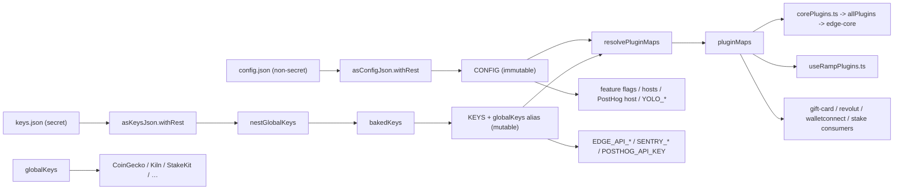

# Edge React GUI - Config & Keys Architecture

## Overview

Historically the app was configured through a single, gitignored `env.json`
file that mixed non-secret settings (feature flags, hosts, debug options,
plugin enablement) with real credential material (API keys, secrets, tokens) in
one flat, `ALLCAPS_*_INIT`-keyed blob.

This refactor splits that single file into three gitignored inputs and reshapes
the schema so that plugin configuration is keyed by real plugin ID:

- **`config.json`** — non-secret app/debug settings and the non-secret halves of
  each plugin's init options. Safe to commit to a private build-config repo.
- **`keys.json`** — every secret (API keys, tokens, credentials), including the
  secret halves of plugin init options — **except** the Edge login HMAC
  credentials when using the native signer.
- **`edgeKey.json`** — `{ apiKey, apiSecret }` for Edge login HMAC. Build-time
  only: `scripts/makeApiSigner.ts` embeds XOR-split native shards from it and
  `scripts/makeNativeHeaders.ts` reads the public `apiKey`. The Metro bundle
  never loads it, so `KEYS.EDGE_API_KEY` / `KEYS.EDGE_API_SECRET` are absent in
  native-signer builds and every consumer must handle that (native
  `EdgeApiSigner` or JS fallback).

At runtime the config/keys files stay separate accessors rather than flattening into one
`ENV` singleton:

- **`CONFIG`** (`src/config.ts`) — immutable cleaned `config.json`. Never updated
  by remote getKeys overlays.
- **`KEYS`** / **`globalKeys`** (`src/keys.ts`) — mutable cleaned keys. Partner
  secrets live only under `KEYS.globalKeys`; `globalKeys` is a live alias of that
  same object (no top-level flatten onto `KEYS`).
- **`pluginMaps`** (`src/pluginMaps.ts`) — the four resolved plugin init maps,
  produced by `resolvePluginMaps(CONFIG, KEYS)` and rebuilt in place when keys
  overlays apply.

The split is about _where a field lives_ and _which accessor a consumer imports_.
A golden-equivalence test still proves the merged plugin maps are
behavior-identical to the legacy `env.json` shape for plugin inits.

## Data flow



Each file is validated and cleaned by its own cleaner exactly once. There is no
union `asEnvConfig` pass over a merged blob: that would re-run single-shot codecs
such as `EDGE_API_SECRET`'s `asBase16` transform (string ⇄ `Uint8Array`) a second
time and fail. Runtime types are `ConfigJson`, `KeysJson`, and `RuntimeKeys`
(after flat partner fields have been nested under `globalKeys`).

### Plugin inits are no longer validated field-by-field

The plugin maps hold each plugin's init options as-is. The legacy flat cleaner
declared a cleaner per `*_INIT` field, which also meant it supplied defaults for
fields a config file left out — `thorname: 'ej'`, `affiliateFeeBasis: '50'`,
`appId: 'edge'`, FIO's `tpid`, and so on.

Those defaults were duplicates: every plugin cleans its own init options and
declares the same default itself, so an omitted field still ends up with the
same value. The one exception was `pluginApiKeys.paybis.partnerUrl`, whose
consumer required the field outright, so that default now lives in
`paybisProvider.ts` where it is used.

The remaining difference is Rango: it applies a referral only when
`referrerAddress` and `referrerFee` are both set, and no longer invents a
`referrerFee` of `'0.75'` for a config that sets an address but no fee. Such a
config was always ambiguous; it now takes no referral rather than a rate nobody
wrote down.

## Key modules

| File                                    | Responsibility                                                                                                                                                                                   |
| --------------------------------------- | ------------------------------------------------------------------------------------------------------------------------------------------------------------------------------------------------ |
| `src/config.ts`                         | Cleans `config.json` with `asConfigJson.withRest` and exports immutable `CONFIG`.                                                                                                                |
| `src/keys.ts`                           | Cleans `keys.json`, nests flat partner secrets via `nestGlobalKeys`, exports immutable merge-base `bakedKeys`, mutable `KEYS`, live `globalKeys` alias, and `applyRuntimeKeys`.                  |
| `src/pluginMaps.ts`                     | Builds `pluginMaps` via `resolvePluginMaps(CONFIG, KEYS)` and exports `rebuildPluginMaps` for in-place updates after key overlays.                                                               |
| `src/util/keysStore.ts`                 | Tier selection, the remote/cache/baked-in resolution promise, the local-only strip list, and `applyKeys` (mutates `KEYS`/`globalKeys`, then `rebuildPluginMaps` + `rebuildAllPlugins`). Prefers native `apiSigner` for getKeys when linked. |
| `src/util/keysServer.ts`                | Signs and issues `GET /v1/getKeys` (JS HMAC or `apiSigner`), and validates the response shape.                                                                                                                                                 |
| `src/util/edgeApiSigner.ts`             | Detects the native `EdgeApiSigner` module, builds the core's `apiSigner`, and caches the public `apiKey` for push / notification callers.                                                                                                     |
| `src/configKeysMerge.ts`                | Runtime merge layer: `deepMerge`, `mergePluginInit`, `nestGlobalKeys`, `resolvePluginMaps`, and `asMergeableKeys`. Also holds redaction helpers for unit tests.                                  |
| `src/configKeysSchema.ts`               | Per-file cleaners `asConfigJson` (non-secret) and `asKeysJson` (secret), `globalKeysShape` / `asGlobalKeys`, and the `ConfigJson` / `KeysJson` / `RuntimeKeys` / `GlobalKeys` types.             |
| `scripts/splitEnvJson.ts`               | Migration-only CLI (`npm run split-env-json`) that classifies a legacy `env.json` and writes `config.json` + `keys.json` + `edgeKey.json`. Never prints secrets; `--force` to overwrite. Not imported by the app. |
| `src/__tests__/configKeysMerge.test.ts` | Golden-equivalence + deep-merge + redaction unit tests.                                                                                                                                          |
| `scripts/configure.ts`                  | Runs `makeConfig(asConfigJson.withRest, 'config.json')` and `makeConfig(asKeysJson.withRest, 'keys.json')` so `prepare` can bootstrap both files without writing secrets into `config.json`.     |

## The CONFIG / KEYS / pluginMaps schema

`asConfigJson` and `asKeysJson` (`src/configKeysSchema.ts`) define the two
on-disk shapes. Only plugin-owned data was re-keyed; everything else keeps its
historical name and shape (`ACTION_QUEUE`, `LOG_CONFIG`, `LOG_SERVER`,
`THEME_SERVER`, `DEBUG_*`, `APP_CONFIG`, `EDGE_API_KEY`, `SENTRY_*`, `KILN_*`,
`YOLO_*`, etc.) — but consumers now import the accessor that owns the field.

**Schema is not the same as a data file.** Each cleaner validates one file.
A secret field such as `EDGE_API_KEY` or `SENTRY_DSN_URL` appearing in
`asKeysJson` does **not** mean its value lives in `config.json` — the value comes
from `keys.json`; the cleaner only types that file.

There is no runtime union cleaner that splat-merges both shapes into one object.
Ownership is enforced by keeping the accessors separate:

```ts
export const asConfigJson = asObject({
  corePlugins, swapPlugins, pluginApiKeys, rampPlugins, // shared plugin maps
  ...non-secret config fields
})

export const asKeysJson = asObject({
  pluginApiKeys, rampPlugins, // secret-bearing plugin maps
  globalKeys: asOptional(asGlobalKeys, () => ({})),
  ...globalKeysShape, // legacy flat partner keys still accepted on disk
  ...secret fields // EDGE_API_*, SENTRY_*, POSTHOG_API_KEY, …
})

// RuntimeKeys = KeysJson without flat partner fields, with nested globalKeys
```

(`.withRest` on each cleaner preserves legacy/extra keys and the JSON "comment"
separators the files carry.)

Both per-file cleaners are actually used:

- `src/config.ts` runs `asConfigJson.withRest(CONFIG_JSON)` at startup.
- `src/keys.ts` runs `asKeysJson.withRest(KEYS_JSON)`, then `nestGlobalKeys`, so
  **each file is validated on its own** (a malformed `keys.json`, or a secret
  misfiled into `config.json`, fails loudly) before runtime nesting / map
  resolution.
- `scripts/configure.ts` runs `makeConfig` with the same cleaners for both
  files, so `makeConfig` can never default or write a secret field into
  `config.json`.

The four plugin maps, each `Record<pluginId, init>`, live on `pluginMaps` after
`resolvePluginMaps`:

- **`corePlugins`** — edge-core currency plugin inits keyed by real edge-core
  plugin ID (`bitcoin`, `ethereum`, `binancesmartchain`, `thorchainrune`, ...).
  Each value is the same `object | true | false` union as before.
- **`swapPlugins`** — swap plugin inits keyed by real swap plugin ID
  (`changehero`, `thorchain`, `0xgasless`, ...).
- **`pluginApiKeys`** — GUI provider keys (formerly `PLUGIN_API_KEYS`), plus the
  migrated `walletconnect` (`projectId`) and `posthog` (`apiKey`, `apiHost`)
  entries where those still appear as plugin-shaped maps.
- **`rampPlugins`** — ramp plugin inits (formerly `RAMP_PLUGIN_INITS`). Kept
  distinct from `pluginApiKeys` on purpose: `banxa` exists in both maps with
  different shapes, so merging them would collide.

There are **no `*_INIT` fields** left in the schema or in any consumer. The dead
`WYRE_CLIENT_INIT` (0 consumers) and unmapped legacy `*_INIT` fields were dropped.

## File ownership rule

- **`config.json`** holds non-secret app/debug fields and the non-secret plugin
  fields: `enabled` flags, `appId`, `affiliateFeeBasis`, `integrator`,
  `thorname`, `apiHost`, `apiUrl`, `widgetUrl`, `partnerUrl`, `referralId`,
  `feePercentage`, `feeReceiveAddress`, `host`, `port`, and the like.
- **`keys.json`** holds all credential material: `apiKey`, `nowNodesApiKey`,
  `evmScanApiKey`, `ninerealmsClientId`, `thorswapApiKey`, `privateKeyB64`,
  `hmacUser`, `jwtTokenProvider`, `clientSecret`, `heliusApiKey`,
  `alchemyApiKey`, `blockfrostProjectId`, `glifApiKey`, `subscanApiKey`,
  `tonCenterApiKeys`, `projectId` (walletconnect), auth/telemetry top-level
  fields (`EDGE_API_KEY`/`EDGE_API_SECRET`, `SENTRY_*`, `BUGSNAG_API_KEY`,
  `POSTHOG_API_KEY`), and the partner secrets — the "global keys". On disk those
  partner secrets may still appear **flat** at the top level for legacy files;
  load and overlay paths run `nestGlobalKeys` so the runtime `KEYS` object keeps
  them only under `KEYS.globalKeys` (`AZTECO_API_KEY`, `COINGECKO_API_KEY`,
  `IP_API_KEY`, `STAKEKIT_API_KEY`, `UNSTOPPABLE_DOMAINS_API_KEY`, `KILN_*`, …).
  A `GET /v1/getKeys` payload delivers the same partner secrets nested under a
  `globalKeys` section; the client keeps that nesting (no top-level flatten onto
  `KEYS`). `YOLO_*` and `POSTHOG_API_HOST` live in `config.json` (local-only
  developer / host wiring, never served).

Both files are gitignored (`.gitignore` lists `/config.json` and `/keys.json`
alongside the retained `/env.json`).

## Merge semantics (`resolvePluginMaps` / `nestGlobalKeys`)

`src/configKeysMerge.ts` combines config enablement with keys secrets into the
resolved `pluginMaps`, and normalizes partner secrets under `globalKeys`:

1. **`CONFIG` top-level fields** stay on `CONFIG` only. They are never overwritten
   by getKeys overlays (`keysStore` also drops non-`asKeysJson` fields from
   overlays via `keepKeysFields`).
2. **`KEYS` top-level secret fields** (`EDGE_API_*`, `SENTRY_*`, `POSTHOG_API_KEY`,
   plugin maps, …) live on `KEYS`. Remote/cache overlays deep-merge onto
   `bakedKeys` with keys winning on collision.
3. **Partner `globalKeys`** — flat on-disk partner fields and any nested
   `globalKeys` section are normalized by `nestGlobalKeys`. Consumers read
   `globalKeys.COINGECKO_API_KEY` (or `KEYS.globalKeys.…`); there is no
   top-level `KEYS.COINGECKO_API_KEY` after nesting.
4. **Currency & swap plugins** — for each ID present in
   `CONFIG.corePlugins` / `CONFIG.swapPlugins`, the non-secret config value is
   combined with the matching secret from `KEYS.pluginApiKeys[id]` via
   `mergePluginInit`:
   - a `false` config value keeps the plugin disabled (secrets ignored);
   - a `true`/absent config value with an object secret becomes the secret
     object (an object always wins over a bare boolean enablement flag);
   - otherwise the two are deep-merged with the keys side winning.
5. **GUI provider keys (`pluginApiKeys`)** — every `pluginApiKeys` ID that is
   _not_ a currency or swap plugin (those secrets live inside
   `corePlugins`/`swapPlugins` after resolve). Config and keys are deep-merged
   per ID.
6. **Ramp plugins (`rampPlugins`)** — `CONFIG.rampPlugins[id]` deep-merged with
   `KEYS.rampPlugins[id]` per ID.

Objects are merged field-by-field; arrays and primitives replace wholesale;
`undefined` on either side yields the other side.

## How the legacy file was split (`scripts/splitEnvJson.ts`)

`splitEnv` converts a flat legacy `env.json` object into `{ config, keys }`:

- `CURRENCY_INIT_MAP` / `SWAP_INIT_MAP` map each `*_INIT` field name to its real
  edge-core plugin ID (e.g. `THORCHAIN_INIT` → `thorchainrune` for currency and
  `thorchain` for swap).
- `isSecretField` (a field-name regex) and `isSecretTopLevel` classify each
  field. Secret-looking fields go to `keys.json`; the rest go to `config.json`.
- `PLUGIN_API_KEYS` → `pluginApiKeys`, `RAMP_PLUGIN_INITS` → `rampPlugins`.
- `POSTHOG_INIT` → `config.POSTHOG_API_HOST` + a flat `keys.POSTHOG_API_KEY`
  (PostHog is not a plugin; the api key stays top-level on `KEYS` at runtime).
- `WALLET_CONNECT_INIT` → `pluginApiKeys.walletconnect`.
- Loose partner secrets (`AZTECO_*`, `KILN_*`, CoinGecko, …) → flat top-level
  fields in `keys.json` (nested under `globalKeys` at runtime load).
- `YOLO_*` stays in `config.json`.
- `WYRE_CLIENT_INIT` and any remaining unmapped `*_INIT` fields are dropped.

This same function is what the golden test uses to synthesize `config`/`keys`
in memory from the historical `env.json`, and what
`scripts/splitEnvJson.ts` (`npm run split-env-json`) uses to write the real
files on disk — guaranteeing the split is value-preserving.

## Consumers

Every reader was re-pointed from the old flat `ENV` / `*_INIT` /
`PLUGIN_API_KEYS` / `RAMP_PLUGIN_INITS` surface to the matching accessor:

- Import **`CONFIG`** for non-secret settings (`APP_CONFIG`, `DEBUG_*`,
  `LOG_SERVER`, `POSTHOG_API_HOST`, `YOLO_*`, feature flags, …).
- Import **`KEYS`** for top-level secrets (`EDGE_API_KEY`, `EDGE_API_SECRET`,
  `SENTRY_*`, `POSTHOG_API_KEY`, …).
- Import **`globalKeys`** for partner secrets (`COINGECKO_API_KEY`, `KILN_*`,
  `STAKEKIT_API_KEY`, …).
- Import **`pluginMaps`** for resolved plugin inits:
  - `src/util/corePlugins.ts` — maps each edge-core plugin ID to
    `pluginMaps.corePlugins[id]` / `pluginMaps.swapPlugins[id]`, preserving the
    existing `true`/`false` hardcodes. Note `thorchainrune` and
    `thorchainrunestagenet` both read `corePlugins.thorchainrune`.
  - `src/hooks/useRampPlugins.ts` — `pluginMaps.rampPlugins[pluginId]`.
  - `src/plugins/gui/util/initializeProviders.ts`, `fetchRevolut.ts`, and the
    gift-card / WalletConnect paths — `pluginMaps.pluginApiKeys.*`.
  - Inner-field readers: `FioAddressUtils.ts` (`pluginMaps.corePlugins.fio`),
    `thorchainYield.ts` + `stakePlugins.ts` (`pluginMaps.swapPlugins.thorchain`),
    `fantomEcosystem.ts` (`pluginMaps.corePlugins.fantom`),
    `WalletConnectService.tsx` (`pluginMaps.pluginApiKeys.walletconnect.projectId`),
    `tracking.ts` (`KEYS.POSTHOG_API_KEY` + `CONFIG.POSTHOG_API_HOST`).

## Scripts

All build/deploy scripts were retargeted from `env.json` to the new files:
`secretFiles.ts` (copies `config.json` + `keys.json`), `makeNativeHeaders.ts`
(reads `EDGE_API_KEY` from `keys.json`), `patchFiles.ts` (`SENTRY_*` from
`keys.json`), `loggingServer.ts` + `themeServer.ts` (point at `config.json`),
`configure.ts` (config- and keys-scoped cleaners), and `deploy.ts` + `cleaners.ts`
(`configJson` / `keysJson` branch-override fields — already shaped like the
files they patch).

---

## Status of remaining Env config code

The following pieces still reference the old configuration world. Each is
listed with why it remains.

### 1. `env.json` on disk — retained intentionally

`env.json` is still present in the worktree and still gitignored
(`.gitignore` and `.cursorignore`). **No active runtime code reads it.** It is
kept as the migration source and a historical copy, per the plan's locked
decision. The golden-equivalence test reads it opportunistically (guarded by an
existence check) to prove parity, but the app itself does not depend on it.

### 2. `scripts/splitEnvJson.ts` — committed legacy bridge

The CLI deliberately contains the legacy `*_INIT` maps and the `splitEnv`
classifier. It remains because it is the bridge that:

- powers the golden-equivalence test (`src/__tests__/configKeysMerge.test.ts`),
  and
- regenerates local `config.json` / `keys.json` from an `env.json`
  (`npm run split-env-json`).

It references legacy names by design; it is the one place that is _supposed_ to
know about the old shape. If `env.json` is ever fully retired, this module, the
CLI script, and the golden test can be removed together.

### 3. Temporary `[pipe]` runtime-verification logging — removed

The temporary `[pipe]` harness (`logPipe` and its call sites) has been removed.
`redactKey` / `redactValue` remain in `src/configKeysMerge.ts` for unit tests
only.

### 4. Comment / documentation references to `env.json`

Non-functional mentions of `env.json` still exist in `README.md`,
`ios/Sentry.swift`, `android/.../MainApplication.kt`, and `CHANGELOG.md`. These
are comments/docs, not runtime code, so they do not affect behavior. They are
reasonable follow-up cleanup (update README setup instructions and native
comments to reference `config.json` / `keys.json`) but were out of the strict
refactor scope.

## Verification status

- **Static:** deep-merge, nest/global-keys, and redaction unit tests pass;
  `tsc --noEmit` and lint are clean across the edited files. Local
  `config.json` / `keys.json` golden checks in `configKeysMerge.test.ts` are
  skipped when those files are absent (typical CI), so they do not substitute
  for a built-in fixture — run them on a developer machine that has real local
  files when validating a split.
- **Cross-repo:** the HMAC signing vector is asserted from both sides —
  `src/__tests__/util/hmacAuth.test.ts` here and `src/__tests__/hmacAuth.test.ts`
  in edge-info-server assert the same base64 digest, so the canonical signed
  string cannot drift on one side unnoticed.
- **Runtime pipe comparison:** abandoned; temporary logging removed.

## Follow-up notes

- Temporary `[pipe]` logging and the iOS/Android runtime pipe comparison are
  removed.
- Private build-config repos must ship `config.json` + `keys.json` instead of
  `env.json` before release builds use this branch.
- Deploy deep-merges explicit `configJson` / `keysJson` per-branch overrides into
  the matching files and does not run overrides through `splitEnv`. Legacy
  `envJson` is ignored (with a migration error when a branch block exists only
  there) so the same file can still serve older GUI builds that read it.
- Optional: update `README.md` and native comments to reference the new files;
  eventually retire `env.json` + `scripts/splitEnvJson.ts` together.

## Remote keys via the info server (`GET /v1/getKeys`)

Client support for remote keys is implemented on this branch (`keysStore`,
`keysServer`, DeviceSettings `keysCache`, EdgeCoreManager gate). The design
notes below remain the source of truth for layering and fallbacks.

The goal is to move the secrets in `keys.json` onto the Edge info server, which
serves them from a new authenticated endpoint. `config.json` / `CONFIG` are
unaffected — they hold no secrets and stay local, synchronous, and immutable.

### Resolution order

Keys resolve through three tiers, and `getKeysTier()` reports which one won so a
runtime check can prove the remote path was exercised:

| Tier       | Source                               | When it applies                                                     |
| ---------- | ------------------------------------ | ------------------------------------------------------------------- |
| `cache`    | `keysCache` in `DeviceSettings.json` | Any launch with a mergeable on-disk cache (does not expire)         |
| `remote`   | `GET /v1/getKeys` on the info server | Cold start (no usable cache), fetch succeeded within budget         |
| `baked-in` | `keys.json` compiled into the binary | Cold start where the fetch failed/missed budget and no usable cache |

The cache takes precedence over the network rather than the other way round.
That is deliberate and follows from "never hot-swap a running core" (see
[Launch sequencing](#launch-sequencing)): a launch that already has keys must not
stall on the network, so it serves the cache and refreshes in the background for
the _next_ launch. Only a cold start with no cache has anything to wait for.

A cache whose payload will not merge counts as no cache at all, so that launch
takes the cold-start path and pays its budget. The alternative — keeping the
cache's fast launch and skipping the fetch — would strand the app on baked-in
keys for as long as the bad payload sits on disk, since only a successful fetch
overwrites it. Paying the budget once repairs it.

Both tiers are held to the same definition of "will not merge", `asMergeableKeys`
in `configKeysMerge.ts`: a top-level object whose `pluginApiKeys`, `rampPlugins`,
and `globalKeys` are objects if present. It is checked in `applyKeys`, which
every tier passes through, and again at the fetch so a bad response never reaches
disk. Validating only the fetch would leave the cache unguarded, and because
`deepMerge` replaces rather than merges when the two sides disagree on type, a
map that came back as a string or `null` would overwrite the whole baked-in map
and strip every secret in it while the launch still reported tier `cache`.

A cold start that falls through to `baked-in` because the budget expired keeps
waiting on that fetch in the background and caches whatever it returns. The gate
closing does not cancel the request, so without this the answer would be
discarded and every later launch would pay the full budget again. The late
payload is only written to disk, never folded into the running `KEYS` /
`pluginMaps`, which is the same rule the warm path follows. A fetch that failed
outright has nothing to wait for and simply does nothing.

The on-disk cache does **not** expire. Any mergeable `keysCache` is used as a
warm start so later launches never block on the network; a background refresh
updates the cache for the _next_ launch. `fetchedAt` may still be recorded for
diagnostics, but it does not gate the warm path. There is no TTL.

The baked-in file is the **base layer** of a `deepMerge`, not a wholesale
replacement, so a partial remote payload degrades gracefully instead of blanking
fields the build already knew. Boot never blocks on the network and never shows
an error scene for key retrieval; a failed fetch falls to the next tier and
retries in the background.

Two consequences worth stating plainly:

- **`keys.json` does not go away.** It keeps its full schema with every field
  optional; only `EDGE_API_KEY` and `EDGE_API_SECRET` are required, since those
  are the credentials used to authenticate the fetch. A release build may ship
  either a minimal bootstrap file or a fully populated fallback file.
- **A shipped binary may therefore still contain every secret.** This work
  _reduces_ secret exposure and enables server-side rotation; it does not make
  the IPA/APK secret-free.

### Authentication

The endpoint reuses the login server's HMAC-signed `Authorization` scheme
(`edge-login-server/src/middleware/with-api-key.ts`), with one deliberate
divergence — a required, signed `X-Timestamp`:

```
GET /v1/getKeys
Authorization:       HMAC {edgeApiKey} {base64(hmacSha256(signedString, secret))}
X-Timestamp:         {unix seconds}
x-attestation-token: {ES256 JWT}   // optional
```

The signed string is the login server's `METHOD\nURL\nBODY` plus a timestamp
line, with an empty body because this is a GET:

```
GET\n/v1/getKeys\n\n{timestamp}
```

The login server itself has **no** signature freshness window, so there is no
existing window to match. The window instead follows the info server's clamped,
operator-editable remote-config pattern used for attestation challenge
lifetimes, defaulting to 300 s with a 30 s floor. The wider default reflects
that `X-Timestamp` comes from a device clock that can drift by minutes, unlike a
server-issued challenge.

### Attestation-level layering

The payload is composed by **cumulative ascending deep merge**: `default` is the
base, then every defined level whose rank is at or below the caller's attested
rank is merged in ascending order, later levels winning. Ranks are the info
server's existing assurance levels — `debug` 0, `software` 1, `hardware` 2,
`secureElement` 3. An unattested caller receives `default` alone; a key with no
`default` returns an empty payload to an unattested caller, which is a valid way
to require attestation.

Because `debug` participates in the cumulative chain, production material must
never be placed under `debug`.

### App ID scoping

Keys differ per app, since white-label apps ship from this codebase with their
own provider credentials. The request carries the logical app ID in the signed
query string, reusing the same value already sent to `infoRollup`
(`config.appId ?? 'edge'` in `src/util/network.ts`).

Two distinct identifiers are both called `appId`, and they must not be
conflated:

|        | Logical app ID                           | Attested app ID                                    |
| ------ | ---------------------------------------- | -------------------------------------------------- |
| Value  | Build-config slug, e.g. `edge`           | Bundle id / package name, e.g. `co.edgesecure.app` |
| Source | `config.appId`, from `CONFIG.APP_CONFIG` | The `appId` claim in the attestation JWT           |
| Trust  | Unverified build-time label              | Cryptographically bound                            |

The document therefore maps each logical app ID to its iOS and Android
identifiers, and the server verifies the attestation token's claim against that
mapping. A token whose bundle id belongs to a different app in the same document
is rejected rather than downgraded.

**Security invariant:** an unattested caller can name any allowed app ID and
receive that app's `default` payload, because nothing proves which binary is
asking. So `default` may only hold keys acceptable to hand to any holder of that
Edge API key and secret; anything genuinely app-scoped belongs at `software` or
above, where the bundle id is proven. Apps needing mutually isolated defaults
need separate Edge API keys.

### `info_keys` document shape

A new CouchDB database `info_keys` holds one document per API-key partner. Each
document carries an `appIds` allow-list and multiple Edge API keys, mirroring the
login server's `login-api-keys` layout. Each key holds its own HMAC secret plus
per-app payloads, nested app then attestation level so layering never crosses app
boundaries:

```
info_keys/<partnerSlug>
  appIds: [<logicalAppId>, ...]        // allow-list
  apiKeys
    <edgeApiKey>
      type, secret, enabled, created, comment
      apps
        <logicalAppId>
          ios:     [<bundleId>, ...]   // verified against the attestation claim
          android: [<packageName>, ...]
          keys
            default        -> keys.json-shaped payload
            debug          -> partial override
            software       -> partial override
            hardware       -> partial override
            secureElement  -> partial override
```

Each API key's `apps` set must be a subset of the document's `appIds`; the
operator CLI enforces this so the two cannot drift.

The secret is stored in `info_keys` itself rather than read from the login
server, keeping the two services decoupled at the cost of two places to rotate a
given Edge API key.

### Never served

The endpoint strips these even if an operator pastes them into a document:

- `EDGE_API_KEY` and `EDGE_API_SECRET` — they _are_ the credentials.
- All telemetry keys — `SENTRY_*`, `BUGSNAG_API_KEY`, and `POSTHOG_API_KEY`
  (stripped from the payload's top-level and any `globalKeys` section; legacy
  `pluginApiKeys.posthog` is also stripped). These stay permanently local
  because `Sentry.init`
  (`src/app.ts`) and the PostHog setup (`src/util/tracking.ts`) both run at
  module scope, before any gate can exist, and crash reporting must cover the
  launch path that fetches the keys. The consequence is that rotating a Sentry DSN
  requires an app update.
- Any pasted `YOLO_*` / `SENTRY_*` top-level fields (matched by prefix). YOLO
  credentials themselves live in `config.json` on the client and are not part of
  the keys payload.

Partner globals such as `KILN_*`, `STAKEKIT_API_KEY`, and `COINGECKO_API_KEY`
**are** served in the payload's `globalKeys` section. The client keeps them
nested under `KEYS.globalKeys` / the exported `globalKeys` alias (no top-level
flatten).

### Impact on this document's architecture

The one structural change to what is described above: secrets on `KEYS` /
`globalKeys` / `pluginMaps` cannot be assumed final at module-evaluation time,
because the remote fetch is asynchronous. `CONFIG` reads stay synchronous and
immutable, while secrets move behind an awaited keys store that must be
populated before `EdgeCoreManager` builds `allPlugins`.

#### Consumers must read secrets lazily

`applyKeys` mutates `KEYS` / `globalKeys` in place and then rebuilds
`pluginMaps` (and `allPlugins`), so a consumer that reads
`KEYS.SOME_SECRET`, `globalKeys.SOME_SECRET`, or `pluginMaps.…` **inside a
function** picks up the remote value, while one that copies it into a
module-scope constant does not. Metro evaluates the whole static import graph
synchronously during bundle load, which is strictly before any network fetch can
resolve, so a module-scope copy is always the baked-in value — permanently, and
silently.

This is a real constraint, not a theoretical one: `stakeKitUtils.ts`,
`cardanoKilnPool.ts`, `ethereumKilnPool.ts`, `thorchainYield.ts`, and
`fantomEcosystem.ts` all originally captured secrets this way and had to be
converted to functions or property getters. `corePlugins.ts` is the one case that
does not need this for the compiled plugin table, because `applyKeys` calls
`rebuildAllPlugins()` and the `allPlugins` export is a live binding.

When adding a consumer of a remotely-servable secret, read it at the point of
use. Anything that genuinely must be read at module scope belongs in the
never-served set below, alongside `SENTRY_*` and PostHog.

### Launch sequencing

Cold start (no cache) blocks on the network fetch before core plugins are built.
Every later launch blocks only on the cache read and refreshes keys in the
background, writing the result for the _next_ launch; refreshed keys are never
hot-swapped into a running core.

The resolution promise starts at module scope in
`src/components/services/EdgeCoreManager.tsx`, which Metro evaluates during the
initial bundle load, so the disk read and the getKeys fetch overlap the rest of
startup. The WebView is gated behind keys and does **not** overlap that work.
The component's effect then awaits the same single-flighted promise, which has
usually already resolved, making the warm-start gate approximately free. The
native splash is still up at that point, so the gate is not visible.

`initializeKeys()` is idempotent and **never rejects**. Both properties matter:
it has two callers, and `EdgeCoreManager` renders `LoadingSplashScreen` until it
resolves, so a rejection cached in the memoized promise would leave the app on
the splash screen with no way to recover. Every failure inside it simply selects
a lower tier.

Cold-start budget, worst case:

| Stage                  | Budget | Constant (`keysStore.ts`) | Enforced          |
| ---------------------- | ------ | ------------------------- | ----------------- |
| Wait for a first token | 5 s    | `ATTESTATION_BUDGET_MS`   | yes, inside fetch |
| `GET /v1/getKeys`      | 8 s    | `COLD_FETCH_TIMEOUT_MS`   | no, share only    |
| **Deadline raced**     | 13 s   | `COLD_TOTAL_TIMEOUT_MS`   | yes, the gate     |

Only two things are actually timed: the attestation wait, and the combined
deadline the app waits on. The two stages share that one deadline rather than
being timed separately, because attestation happens inside the promise being
raced, and the deadline is their sum so that a slow first attestation cannot
spend the fetch's share and abandon a request that was about to answer. The
fetch's 8 s is therefore a share used to size the total, not a timer of its own:
whatever is left of the 13 s once attestation settles is what the fetch gets.

The network call uses `FETCH_TIMEOUT_MS` (5 s) in `keysServer.ts` as the
`asyncWaterfall` per-server stagger (same as the helper's default), not as a
hard ceiling on the whole getKeys call. With more than one server configured the
waterfall can outlast the 8 s share, which is why the 13 s gate — not the
stagger — is what bounds the launch.

These are ceilings on a first install with no network, not typical cost. The
cache write is deliberately left outside the race and not awaited: a slow disk
must not be able to discard keys already in hand, and losing the write costs one
refetch on the next launch.

If attestation finishes inside its budget the fetch goes out attested and
receives the full payload immediately; otherwise it goes out unattested and takes
the `default` tier, and the background refresh upgrades the cached payload for the
next launch. A feature needing a key absent from the current payload can trigger
an on-demand foreground escalation.

### Where the cache lives

The cache is a `keysCache` field inside **`DeviceSettings.json`**. That file is
already read for theme setup in `src/app.ts`; the keys promise itself starts in
`EdgeCoreManager.tsx` and awaits the same single-flighted `initDeviceSettings`
load.

The other three launch-window files (`remoteConfigSticky.json`, `firstOpen3.json`,
`utilityServer.json`) are deliberately **left untouched**. Folding them in was
considered and rejected for two reasons:

- Two of them silently regenerate sticky data when their read fails.
  `experimentConfig` re-randomizes the A/B variant, and `firstOpen` mints a new
  `deviceId`, resets `firstOpenEpoch`, and reports `isFirstOpen: 'true'`, making an
  existing install look brand new. Leaving them alone removes that failure mode
  instead of mitigating it.
- There is no latency to gain. `firstOpen3.json` and `utilityServer.json` are read
  from a `Providers` effect after the core already exists, and the
  `experimentConfig` read fires during initial bundle evaluation through a fully
  static import chain, so it has long resolved before `Main` checks its gate. That
  gate therefore stays as-is.

`logins/*` and `fingerprint.json` are read by `edge-core-js` and
`edge-login-ui-rn` respectively, and are outside this repo's control.

The tradeoff of hosting the cache here is write amplification rather than read
cost. `DeviceSettings.json` is the most frequently written of the four, and
`writeDefaultScreen` fires on every tap of the Home or Assets tab, so writes are
**serialized immediately** (not debounced) and `DeviceSettingsActions.ts` is the
single owner of the file, holding the authoritative in-memory copy and chaining
writes so concurrent patches cannot interleave `setText` calls. The keys store
mutates the cache through that owner rather than writing the file itself.

`readDeviceSettings` collapses any read failure into `asDeviceSettings({})`, so a
corrupt file already resets user preferences today. Since the payload is now larger
and rewritten more often, `keysCache` is cleaned with `asMaybe` so a malformed
cache degrades to a miss instead of wiping preferences, and a malformed preference
does not discard the cache. Losing the cache is recoverable by refetching or
falling back to the baked-in file — which is precisely why this file is a safe host
and the sticky files are not.

Migration is additive: an existing `DeviceSettings.json` simply lacks `keysCache`,
which reads as a miss and triggers a fetch.

`initDeviceSettings` is single-flighted, because it now has two callers: the
existing fire-and-forget theme setup in `app.ts` and the awaited call in the
keys store. Without that, the read that resolved last would replace the whole
in-memory settings object and could discard a `keysCache` written in between.
The theme setup itself is still fire-and-forget, so the pre-existing `themeMode`
flash on first render is unchanged by this work.
