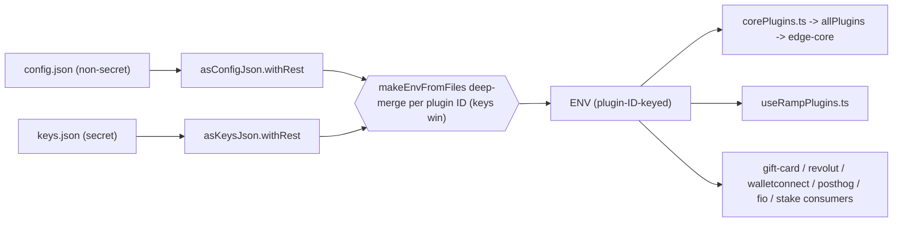

# Edge React GUI - Config & Keys Architecture

## Overview

Historically the app was configured through a single, gitignored `env.json`
file that mixed non-secret settings (feature flags, hosts, debug options,
plugin enablement) with real credential material (API keys, secrets, tokens) in
one flat, `ALLCAPS_*_INIT`-keyed blob.

This refactor splits that single file into two gitignored inputs and reshapes
the schema so that plugin configuration is keyed by real plugin ID:

- **`config.json`** — non-secret app/debug settings and the non-secret halves of
  each plugin's init options. Safe to commit to a private build-config repo.
- **`keys.json`** — every secret (API keys, tokens, credentials), including the
  secret halves of plugin init options — **except** the Edge login HMAC
  credentials.
- **`edgeKey.json`** — `{ apiKey, apiSecret }` for Edge login HMAC. Used by
  `scripts/makeApiSigner.ts` to embed XOR-split native shards, and folded into
  `ENV` at boot for getKeys bootstrap / JS fallbacks.

At runtime the two files are deep-merged per plugin ID, cleaned, and exposed as
a single `ENV` object with the same effective values the app always had. The
split is purely about _where a field lives_, not _what value reaches a
consumer_: a golden-equivalence test proves the merged result is behavior-identical
to the legacy `env.json`.

## Data flow



Each file is validated and cleaned by its own cleaner exactly once, and the two
cleaned halves are merged into `ENV`. There is no second `asEnvConfig` pass over
the merged object: that would re-run single-shot codecs such as
`EDGE_API_SECRET`'s `asBase16` transform (string ⇄ `Uint8Array`) a second time
and fail. `asEnvConfig` still exists as the union cleaner (used by
`scripts/themeServer.ts`) and as the source of the exported `EnvConfig` type.

### Plugin inits are no longer validated field-by-field

The plugin maps hold each plugin's init options as-is. The legacy flat cleaner
declared a cleaner per `*_INIT` field, which also meant it supplied defaults for
fields a config file left out — `thorname: 'ej'`, `affiliateFeeBasis: '50'`,
`appId: 'edge'`, FIO's `tpid`, and so on.

Those defaults were duplicates: every plugin cleans its own init options and
declares the same default itself, so an omitted field still ends up with the
same value. The one exception was `pluginApiKeys.paybis.partnerUrl`, whose
consumer required the field outright, so that default now lives in
`paybisProvider.ts` where it is used.

The remaining difference is Rango: it applies a referral only when
`referrerAddress` and `referrerFee` are both set, and no longer invents a
`referrerFee` of `'0.75'` for a config that sets an address but no fee. Such a
config was always ambiguous; it now takes no referral rather than a rate nobody
wrote down.

## Key modules

| File                             | Responsibility                                                                                                                                                                                           |
| -------------------------------- | -------------------------------------------------------------------------------------------------------------------------------------------------------------------------------------------------------- |
| `src/env.ts`                     | Cleans `config.json` with `asConfigJson.withRest` and `keys.json` with `asKeysJson.withRest`, merges via `makeEnvFromFiles`, folds `edgeKey.json` into `EDGE_API_KEY` / `EDGE_API_SECRET` on the baked keys half, and exports `ENV` plus `bakedConfig` / `bakedKeys` for the keys store. |
| `src/util/keysStore.ts`          | Tier selection, the remote/cache/baked-in resolution promise, the local-only strip list, and the in-place `ENV` update.                                                                                  |
| `src/util/keysServer.ts`         | Signs and issues `GET /v1/getKeys`, and validates the response shape.                                                                                                                                    |
| `src/envFiles.ts`                | The runtime merge layer: `deepMerge`, `mergePluginInit`, and `makeEnvFromFiles` (returns the `EnvConfig` type). Also holds temporary redaction/logging helpers (see "Remaining code").                   |
| `src/envConfig.ts`               | Full per-file cleaners `asConfigJson` (non-secret) and `asKeysJson` (secret), the union cleaner `asEnvConfig` (splat of both `.shape`s), and the `EnvConfig` type.                                       |
| `src/envSplit.ts`                | Classification helpers that convert the legacy flat `env.json` shape into `{ config, keys }`. Shared by the golden test and `scripts/splitEnvJson.ts`.                                                   |
| `scripts/splitEnvJson.ts`        | Committed CLI (`npm run split-env-json`) that reads `env.json` and writes `config.json` + `keys.json` via `splitEnv`. Never prints secrets; `--force` to overwrite.                                      |
| `src/__tests__/envFiles.test.ts` | Golden-equivalence + deep-merge + redaction unit tests.                                                                                                                                                  |
| `scripts/configure.ts`           | Runs `makeConfig(asConfigJson.withRest, 'config.json')`, reusing the exact `config.json` cleaner so `makeConfig` only defaults/writes non-secret fields during `prepare` and never materializes secrets. |

## The `ENV` schema

`asEnvConfig` (`src/envConfig.ts`) produces the object the whole app reads. Only
plugin-owned data was re-keyed; everything else keeps its historical name and
shape (`ACTION_QUEUE`, `LOG_CONFIG`, `LOG_SERVER`, `THEME_SERVER`, `DEBUG_*`,
`APP_CONFIG`, `EDGE_API_KEY`, `SENTRY_*`, `KILN_*`, `YOLO_*`, etc.).

**Schema is not the same as a data file.** `asEnvConfig` validates the
_merged_ `ENV` object, so it must declare every field that can appear at
runtime regardless of which file supplies the value. A secret field such as
`EDGE_API_KEY` or `SENTRY_DSN_URL` appearing in the cleaner does **not** mean
its value lives in `config.json` — the value comes from `keys.json`; the
cleaner only types the union.

Because `ENV` is literally the union of the two files, each file gets its own
full cleaner, and `asEnvConfig` is composed by splatting their `.shape`:

```ts
export const asConfigJson = asObject({
  corePlugins, swapPlugins, pluginApiKeys, rampPlugins, // shared plugin maps
  ...non-secret config fields
})

export const asKeysJson = asObject({
  pluginApiKeys, rampPlugins, // secret-bearing plugin maps
  ...secret fields
})

export const asEnvConfig = asObject({
  ...asConfigJson.shape,
  ...asKeysJson.shape
}).withRest
```

(`.shape` is exposed by the base `asObject(...)` cleaner; `.withRest` on the
composed cleaner preserves legacy/extra keys and the JSON "comment" separators
the files carry.)

This makes the config/keys ownership rule the single source of truth. Both
per-file cleaners are actually used:

- `src/env.ts` runs `asConfigJson.withRest(CONFIG_JSON)` and
  `asKeysJson.withRest(KEYS_JSON)` at startup, so **each file is validated on
  its own** (a malformed `keys.json`, or a secret misfiled into `config.json`,
  fails loudly) before the two are merged into `ENV`.
- `scripts/configure.ts` runs `makeConfig(asConfigJson.withRest, 'config.json')`
  using the _same_ `config.json` cleaner, so `makeConfig` can never default or
  write a secret field into `config.json`.

The four plugin maps, each `Record<pluginId, init>`:

- **`corePlugins`** — edge-core currency plugin inits keyed by real edge-core
  plugin ID (`bitcoin`, `ethereum`, `binancesmartchain`, `thorchainrune`, ...).
  Each value is the same `object | true | false` union as before.
- **`swapPlugins`** — swap plugin inits keyed by real swap plugin ID
  (`changehero`, `thorchain`, `0xgasless`, ...).
- **`pluginApiKeys`** — GUI provider keys (formerly `PLUGIN_API_KEYS`), plus the
  migrated `walletconnect` (`projectId`) and `posthog` (`apiKey`, `apiHost`)
  entries.
- **`rampPlugins`** — ramp plugin inits (formerly `RAMP_PLUGIN_INITS`). Kept
  distinct from `pluginApiKeys` on purpose: `banxa` exists in both maps with
  different shapes, so merging them would collide.

There are **no `*_INIT` fields** left in the schema or in any consumer. The dead
`WYRE_CLIENT_INIT` (0 consumers) and unmapped legacy `*_INIT` fields were dropped.

## File ownership rule

- **`config.json`** holds non-secret app/debug fields and the non-secret plugin
  fields: `enabled` flags, `appId`, `affiliateFeeBasis`, `integrator`,
  `thorname`, `apiHost`, `apiUrl`, `widgetUrl`, `partnerUrl`, `referralId`,
  `feePercentage`, `feeReceiveAddress`, `host`, `port`, and the like.
- **`keys.json`** holds all credential material: `apiKey`, `nowNodesApiKey`,
  `evmScanApiKey`, `ninerealmsClientId`, `thorswapApiKey`, `privateKeyB64`,
  `hmacUser`, `jwtTokenProvider`, `clientSecret`, `heliusApiKey`,
  `alchemyApiKey`, `blockfrostProjectId`, `glifApiKey`, `subscanApiKey`,
  `tonCenterApiKeys`, `projectId` (walletconnect), plus secret top-level fields
  (`EDGE_API_KEY`/`EDGE_API_SECRET`, `SENTRY_*`, `KILN_*`, `STAKEKIT_API_KEY`,
  `AZTECO_API_KEY`, `COINGECKO_API_KEY`, `IP_API_KEY`,
  `UNSTOPPABLE_DOMAINS_API_KEY`, `YOLO_*`, ...).

Both files are gitignored (`.gitignore` lists `/config.json` and `/keys.json`
alongside the retained `/env.json`).

## Merge semantics (`makeEnvFromFiles`)

`src/envFiles.ts` combines the two files into the flat `ENV` shape:

1. **Top-level, non-plugin fields** are shallow-merged; `keys.json` wins on any
   collision.
2. **Currency & swap plugins** — for each ID present in
   `config.corePlugins` / `config.swapPlugins`, the non-secret config value is
   combined with the matching secret from `keys.pluginApiKeys[id]` via
   `mergePluginInit`:
   - a `false` config value keeps the plugin disabled (secrets ignored);
   - a `true`/absent config value with an object secret becomes the secret
     object (an object always wins over a bare boolean enablement flag);
   - otherwise the two are deep-merged with the keys side winning.
3. **GUI provider keys (`pluginApiKeys`)** — every `pluginApiKeys` ID that is
   _not_ a currency or swap plugin (those secrets live inside
   `corePlugins`/`swapPlugins`). Config and keys are deep-merged per ID.
4. **Ramp plugins (`rampPlugins`)** — `config.rampPlugins[id]` deep-merged with
   `keys.rampPlugins[id]` per ID.

Objects are merged field-by-field; arrays and primitives replace wholesale;
`undefined` on either side yields the other side.

## How the legacy file was split (`envSplit.ts`)

`splitEnv` converts a flat legacy `env.json` object into `{ config, keys }`:

- `CURRENCY_INIT_MAP` / `SWAP_INIT_MAP` map each `*_INIT` field name to its real
  edge-core plugin ID (e.g. `THORCHAIN_INIT` → `thorchainrune` for currency and
  `thorchain` for swap).
- `isSecretField` (a field-name regex) and `isSecretTopLevel` classify each
  field. Secret-looking fields go to `keys.json`; the rest go to `config.json`.
- `PLUGIN_API_KEYS` → `pluginApiKeys`, `RAMP_PLUGIN_INITS` → `rampPlugins`.
- `POSTHOG_INIT` and `WALLET_CONNECT_INIT` are migrated into
  `pluginApiKeys.posthog` / `pluginApiKeys.walletconnect`.
- `WYRE_CLIENT_INIT` and any remaining unmapped `*_INIT` fields are dropped.

This same function is what the golden test uses to synthesize `config`/`keys`
in memory from the historical `env.json`, and what
`scripts/splitEnvJson.ts` (`npm run split-env-json`) uses to write the real
files on disk — guaranteeing the split is value-preserving.

## Consumers

Every reader was re-pointed from `ENV.*_INIT` / `ENV.PLUGIN_API_KEYS` /
`ENV.RAMP_PLUGIN_INITS` to the new maps:

- `src/util/corePlugins.ts` — maps each edge-core plugin ID to
  `ENV.corePlugins[id]` / `ENV.swapPlugins[id]`, preserving the existing
  `true`/`false` hardcodes. Note `thorchainrune` and `thorchainrunestagenet`
  both read `corePlugins.thorchainrune`.
- `src/hooks/useRampPlugins.ts` — `ENV.rampPlugins[pluginId]`.
- `src/plugins/gui/util/initializeProviders.ts`, `fetchRevolut.ts`,
  `HomeScene.tsx`, `SideMenu.tsx`, and the gift-card scenes —
  `ENV.pluginApiKeys.*`.
- Inner-field readers: `FioAddressUtils.ts` (`ENV.corePlugins.fio`),
  `thorchainYield.ts` + `stakePlugins.ts` (`ENV.swapPlugins.thorchain`),
  `fantomEcosystem.ts` (`ENV.corePlugins.fantom`),
  `WalletConnectService.tsx` (`ENV.pluginApiKeys.walletconnect.projectId`),
  `tracking.ts` (`ENV.pluginApiKeys.posthog`).

## Scripts

All build/deploy scripts were retargeted from `env.json` to the new files:
`secretFiles.ts` (copies `config.json` + `keys.json` + `edgeKey.json`),
`makeApiSigner.ts` / `makeNativeHeaders.ts` (read `apiKey` / `apiSecret` from
`edgeKey.json`), `patchFiles.ts` (`SENTRY_*` from `keys.json`),
`loggingServer.ts` + `themeServer.ts` (point at `config.json`),
`configure.ts` (config-scoped cleaner), and `deploy.ts` + `cleaners.ts`
(`configJson` / `keysJson` branch-override fields — already shaped like the
files they patch).

---

## Status of remaining Env config code

The following pieces still reference the old configuration world. Each is
listed with why it remains.

### 1. `env.json` on disk — retained intentionally

`env.json` is still present in the worktree and still gitignored
(`.gitignore` and `.cursorignore`). **No active runtime code reads it.** It is
kept as the migration source and a historical copy, per the plan's locked
decision. The golden-equivalence test reads it opportunistically (guarded by an
existence check) to prove parity, but the app itself does not depend on it.

### 2. `src/envSplit.ts` + `scripts/splitEnvJson.ts` — committed legacy bridge

`envSplit.ts` deliberately contains the legacy `*_INIT` maps and the `splitEnv`
classifier. It remains because it is the bridge that:

- powers the golden-equivalence test (`src/__tests__/envFiles.test.ts`), and
- backs the committed CLI `scripts/splitEnvJson.ts` (`npm run split-env-json`)
  that regenerates local `config.json` / `keys.json` from an `env.json`.

It references legacy names by design; it is the one place that is _supposed_ to
know about the old shape. If `env.json` is ever fully retired, this module, the
CLI script, and the golden test can be removed together.

### 3. Temporary `[pipe]` runtime-verification logging — removed

The temporary `[pipe]` harness (`logPipe` and its call sites) has been removed.
`redactKey` / `redactValue` remain in `src/envFiles.ts` for unit tests only.

### 4. Comment / documentation references to `env.json`

Non-functional mentions of `env.json` still exist in `README.md`,
`ios/Sentry.swift`, `android/.../MainApplication.kt`, and `CHANGELOG.md`. These
are comments/docs, not runtime code, so they do not affect behavior. They are
reasonable follow-up cleanup (update README setup instructions and native
comments to reference `config.json` / `keys.json`) but were out of the strict
refactor scope.

## Verification status

- **Static:** golden-equivalence, deep-merge, and redaction unit tests pass;
  `tsc --noEmit` and lint are clean across the edited files. The golden suite
  falls back to a built-in legacy-shaped fixture when no local `env.json` is
  present, so it runs in CI rather than silently skipping.
- **Cross-repo:** the HMAC signing vector is asserted from both sides —
  `src/__tests__/util/hmacAuth.test.ts` here and `src/__tests__/hmacAuth.test.ts`
  in edge-info-server assert the same base64 digest, so the canonical signed
  string cannot drift on one side unnoticed.
- **Runtime pipe comparison:** abandoned; temporary logging removed.

## Follow-up checklist

- [x] Remove all temporary `[pipe]` logging (item 3) and re-run static checks.
- [x] Drop the iOS/Android runtime pipe comparison.
- [ ] Ensure private build-config repos ship `config.json` + `keys.json`
      instead of `env.json` before release builds use this branch.
- [x] Require explicit `configJson` / `keysJson` per-branch overrides in
      `deploy-config.json` for this branch. Deploy deep-merges each side into
      the matching file and does not run overrides through `splitEnv`. Legacy
      `envJson` is ignored so the same file can still serve older GUI builds
      that read it; keep both shapes in private `deploy-config.json` until
      those builds are retired.
- [ ] (Optional) Update `README.md` and native comments to reference the new
      files; eventually retire `env.json` + `src/envSplit.ts` together.

## Remote keys via the info server (`GET /v1/getKeys`)

Client support for remote keys is implemented on this branch (`keysStore`,
`keysServer`, DeviceSettings `keysCache`, EdgeCoreManager gate). The design
notes below remain the source of truth for layering and fallbacks. The
executable plan lives at
`~/.cursor/plans/info_server_get_keys_a41c7e02.plan.md`.

The goal is to move the secrets in `keys.json` onto the Edge info server, which
serves them from a new authenticated endpoint. `config.json` is unaffected — it
holds no secrets and stays local and synchronous.

### Resolution order

Keys resolve through three tiers, and `getKeysTier()` reports which one won so a
runtime check can prove the remote path was exercised:

| Tier      | Source                                 | When it applies                                     |
| --------- | -------------------------------------- | --------------------------------------------------- |
| `cache`   | `keysCache` in `DeviceSettings.json`   | Any launch where a cache exists                      |
| `remote`  | `GET /v1/getKeys` on the info server   | Cold start (no cache), fetch succeeded within budget |
| `baked-in`| `keys.json` compiled into the binary   | Cold start where the fetch failed or timed out       |

The cache takes precedence over the network rather than the other way round.
That is deliberate and follows from "never hot-swap a running core" (see
[Launch sequencing](#launch-sequencing)): a launch that already has keys must not
stall on the network, so it serves the cache and refreshes in the background for
the *next* launch. Only a cold start with no cache has anything to wait for.

A cache whose payload will not merge counts as no cache at all, so that launch
takes the cold-start path and pays its budget. The alternative — keeping the
cache's fast launch and skipping the fetch — would strand the app on baked-in
keys for as long as the bad payload sits on disk, since only a successful fetch
overwrites it. Paying the budget once repairs it.

A cached payload is used regardless of age. `ttlSeconds` is recorded alongside it
purely as provenance for debugging — nothing expires the cache, because the tier
below it (the baked-in file) is older still, so discarding a stale cache could
only ever make the payload worse.

The baked-in file is the **base layer** of a `deepMerge`, not a wholesale
replacement, so a partial remote payload degrades gracefully instead of blanking
fields the build already knew. Boot never blocks on the network and never shows
an error scene for key retrieval; a failed fetch falls to the next tier and
retries in the background.

Two consequences worth stating plainly:

- **`keys.json` does not go away.** It keeps its full schema with every field
  optional; only `EDGE_API_KEY` and `EDGE_API_SECRET` are required, since those
  are the credentials used to authenticate the fetch. A release build may ship
  either a minimal bootstrap file or a fully populated fallback file.
- **A shipped binary may therefore still contain every secret.** This work
  _reduces_ secret exposure and enables server-side rotation; it does not make
  the IPA/APK secret-free.

### Authentication

The endpoint reuses the login server's HMAC-signed `Authorization` scheme
(`edge-login-server/src/middleware/with-api-key.ts`), with one deliberate
divergence — a required, signed `X-Timestamp`:

```
GET /v1/getKeys
Authorization:       HMAC {edgeApiKey} {base64(hmacSha256(signedString, secret))}
X-Timestamp:         {unix seconds}
x-attestation-token: {ES256 JWT}   // optional
```

The signed string is the login server's `METHOD\nURL\nBODY` plus a timestamp
line, with an empty body because this is a GET:

```
GET\n/v1/getKeys\n\n{timestamp}
```

The login server itself has **no** signature freshness window, so there is no
existing window to match. The window instead follows the info server's clamped,
operator-editable remote-config pattern used for attestation challenge
lifetimes, defaulting to 300 s with a 30 s floor. The wider default reflects
that `X-Timestamp` comes from a device clock that can drift by minutes, unlike a
server-issued challenge.

### Attestation-level layering

The payload is composed by **cumulative ascending deep merge**: `default` is the
base, then every defined level whose rank is at or below the caller's attested
rank is merged in ascending order, later levels winning. Ranks are the info
server's existing assurance levels — `debug` 0, `software` 1, `hardware` 2,
`secureElement` 3. An unattested caller receives `default` alone; a key with no
`default` returns an empty payload to an unattested caller, which is a valid way
to require attestation.

Because `debug` participates in the cumulative chain, production material must
never be placed under `debug`.

### App ID scoping

Keys differ per app, since white-label apps ship from this codebase with their
own provider credentials. The request carries the logical app ID in the signed
query string, reusing the same value already sent to `infoRollup`
(`config.appId ?? 'edge'` in `src/util/network.ts`).

Two distinct identifiers are both called `appId`, and they must not be
conflated:

|        | Logical app ID                        | Attested app ID                                    |
| ------ | ------------------------------------- | -------------------------------------------------- |
| Value  | Build-config slug, e.g. `edge`        | Bundle id / package name, e.g. `co.edgesecure.app` |
| Source | `config.appId`, from `ENV.APP_CONFIG` | The `appId` claim in the attestation JWT           |
| Trust  | Unverified build-time label           | Cryptographically bound                            |

The document therefore maps each logical app ID to its iOS and Android
identifiers, and the server verifies the attestation token's claim against that
mapping. A token whose bundle id belongs to a different app in the same document
is rejected rather than downgraded.

**Security invariant:** an unattested caller can name any allowed app ID and
receive that app's `default` payload, because nothing proves which binary is
asking. So `default` may only hold keys acceptable to hand to any holder of that
Edge API key and secret; anything genuinely app-scoped belongs at `software` or
above, where the bundle id is proven. Apps needing mutually isolated defaults
need separate Edge API keys.

### `info_keys` document shape

A new CouchDB database `info_keys` holds one document per API-key partner. Each
document carries an `appIds` allow-list and multiple Edge API keys, mirroring the
login server's `login-api-keys` layout. Each key holds its own HMAC secret plus
per-app payloads, nested app then attestation level so layering never crosses app
boundaries:

```
info_keys/<partnerSlug>
  appIds: [<logicalAppId>, ...]        // allow-list
  apiKeys
    <edgeApiKey>
      type, secret, enabled, created, comment
      apps
        <logicalAppId>
          ios:     [<bundleId>, ...]   // verified against the attestation claim
          android: [<packageName>, ...]
          keys
            default        -> keys.json-shaped payload
            debug          -> partial override
            software       -> partial override
            hardware       -> partial override
            secureElement  -> partial override
```

Each API key's `apps` set must be a subset of the document's `appIds`; the
operator CLI enforces this so the two cannot drift.

The secret is stored in `info_keys` itself rather than read from the login
server, keeping the two services decoupled at the cost of two places to rotate a
given Edge API key.

### Never served

The endpoint strips these even if an operator pastes them into a document:

- Edge login HMAC credentials (`EDGE_API_KEY` / `EDGE_API_SECRET`) — they _are_
  the credentials used to authenticate getKeys, and they live in `edgeKey.json`
  (folded into ENV at boot) rather than being served remotely.
- All `YOLO_*` fields — per-developer test credentials, not per-partner config.
- All telemetry keys — `SENTRY_*`, `BUGSNAG_API_KEY`, and
  `pluginApiKeys.posthog`. These stay permanently local because `Sentry.init`
  (`src/app.ts`) and the PostHog setup (`src/util/tracking.ts`) both run at
  module scope, before any gate can exist, and crash reporting must cover the
  launch path that fetches the keys. The consequence is that rotating a Sentry DSN
  requires an app update.

The `YOLO_` and `SENTRY_` families are matched **by prefix**, not by an
enumerated list of field names, so a field added to either family later is
stripped without anyone having to remember this file. The rule is applied twice
on purpose: `stripNeverServe` (`src/types/infoKeys.ts` on the server) decides what
leaves the server, and `stripLocalOnlyFields` (`src/util/keysStore.ts` on the
client) decides what a payload is allowed to overwrite, so a misconfigured or
hostile server still cannot rotate the credentials used to authenticate the fetch.

### Impact on this document's architecture

The one structural change to what is described above: `ENV` can no longer expose
secrets at module-evaluation time, because the remote fetch is asynchronous.
`config.json` reads stay synchronous, while secrets move behind an awaited keys
store that must be populated before `EdgeCoreManager` builds `allPlugins`.

#### Consumers must read secrets lazily

`applyKeysToEnv` mutates the `ENV` object in place, so a consumer that reads
`ENV.SOME_SECRET` **inside a function** picks up the remote value, while one that
copies it into a module-scope constant does not. Metro evaluates the whole static
import graph synchronously during bundle load, which is strictly before any
network fetch can resolve, so a module-scope copy is always the baked-in value —
permanently, and silently.

This is a real constraint, not a theoretical one: `stakeKitUtils.ts`,
`cardanoKilnPool.ts`, `ethereumKilnPool.ts`, `thorchainYield.ts`, and
`fantomEcosystem.ts` all originally captured secrets this way and had to be
converted to functions or property getters. `corePlugins.ts` is the one case that
does not need this, because `applyKeysToEnv` calls `rebuildAllPlugins()` and the
`allPlugins` export is a live binding.

When adding a consumer of a remotely-servable secret, read it at the point of
use. Anything that genuinely must be read at module scope belongs in the
never-served set below, alongside `SENTRY_*` and posthog.

### Launch sequencing

Cold start (no cache) blocks on the network fetch before core plugins are built.
Every later launch blocks only on the cache read and refreshes keys in the
background, writing the result for the _next_ launch; refreshed keys are never
hot-swapped into a running core.

The resolution promise starts at module scope in
`src/components/services/EdgeCoreManager.tsx`, which Metro evaluates during the
initial bundle load, so the disk read and the fetch overlap edge-core's WebView
boot. The component's effect then awaits the same single-flighted promise, which
has usually already resolved, making the warm-start gate approximately free. The
native splash is still up at that point, so the gate is not visible.

`initializeKeys()` is idempotent and **never rejects**. Both properties matter:
it has two callers, and `EdgeCoreManager` renders `LoadingSplashScreen` until it
resolves, so a rejection cached in the memoized promise would leave the app on
the splash screen with no way to recover. Every failure inside it simply selects
a lower tier.

Cold-start budget, worst case:

| Stage                  | Budget | Constant (`keysStore.ts`) | Enforced          |
| ---------------------- | ------ | ------------------------- | ----------------- |
| Wait for a first token | 5 s    | `ATTESTATION_BUDGET_MS`   | yes, inside fetch |
| `GET /v1/getKeys`      | 8 s    | `COLD_FETCH_TIMEOUT_MS`   | no, share only    |
| **Deadline raced**     | 13 s   | `COLD_TOTAL_TIMEOUT_MS`   | yes, the gate     |

Only two things are actually timed: the attestation wait, and the combined
deadline the app waits on. The two stages share that one deadline rather than
being timed separately, because attestation happens inside the promise being
raced, and the deadline is their sum so that a slow first attestation cannot
spend the fetch's share and abandon a request that was about to answer. The
fetch's 8 s is therefore a share used to size the total, not a timer of its own:
whatever is left of the 13 s once attestation settles is what the fetch gets.

The network call is separately capped **per info server** by `FETCH_TIMEOUT_MS`
(5 s) in `keysServer.ts`. With more than one server configured the waterfall can
outlast the 8 s share, which is why the 13 s gate — not the share — is what
bounds the launch.

These are ceilings on a first install with no network, not typical cost. The
cache write is deliberately left outside the race and not awaited: a slow disk
must not be able to discard keys already in hand, and losing the write costs one
refetch on the next launch.

If attestation finishes inside its budget the fetch goes out attested and
receives the full payload immediately; otherwise it goes out unattested and takes
the `default` tier, and the background refresh upgrades the cached payload for the
next launch. A feature needing a key absent from the current payload can trigger
an on-demand foreground escalation.

### Where the cache lives

The cache is a `keysCache` field inside **`DeviceSettings.json`**. This adds no new
file read, because that file is already read at module scope in `src/app.ts` —
exactly where the keys promise starts.

The other three launch-window files (`remoteConfigSticky.json`, `firstOpen3.json`,
`utilityServer.json`) are deliberately **left untouched**. Folding them in was
considered and rejected for two reasons:

- Two of them silently regenerate sticky data when their read fails.
  `experimentConfig` re-randomizes the A/B variant, and `firstOpen` mints a new
  `deviceId`, resets `firstOpenEpoch`, and reports `isFirstOpen: 'true'`, making an
  existing install look brand new. Leaving them alone removes that failure mode
  instead of mitigating it.
- There is no latency to gain. `firstOpen3.json` and `utilityServer.json` are read
  from a `Providers` effect after the core already exists, and the
  `experimentConfig` read fires during initial bundle evaluation through a fully
  static import chain, so it has long resolved before `Main` checks its gate. That
  gate therefore stays as-is.

`logins/*` and `fingerprint.json` are read by `edge-core-js` and
`edge-login-ui-rn` respectively, and are outside this repo's control.

The tradeoff of hosting the cache here is write amplification rather than read
cost. `DeviceSettings.json` is the most frequently written of the four, and
`writeDefaultScreen` fires on every tap of the Home or Assets tab, so writes are
**debounced** and `DeviceSettingsActions.ts` becomes the single owner of the file,
holding the authoritative in-memory copy and serializing writes. The keys store
mutates the cache through that owner rather than writing the file itself.

`readDeviceSettings` collapses any read failure into `asDeviceSettings({})`, so a
corrupt file already resets user preferences today. Since the payload is now larger
and rewritten more often, `keysCache` is cleaned with `asMaybe` so a malformed
cache degrades to a miss instead of wiping preferences, and a malformed preference
does not discard the cache. Losing the cache is recoverable by refetching or
falling back to the baked-in file — which is precisely why this file is a safe host
and the sticky files are not.

Migration is additive: an existing `DeviceSettings.json` simply lacks `keysCache`,
which reads as a miss and triggers a fetch.

`initDeviceSettings` is single-flighted, because it now has two callers: the
existing fire-and-forget theme setup in `app.ts` and the awaited call in the keys
store. Without that, the read that resolved last would replace the whole
in-memory settings object and could discard a `keysCache` written in between.
The theme setup itself is still fire-and-forget, so the pre-existing `themeMode`
flash on first render is unchanged by this work.
