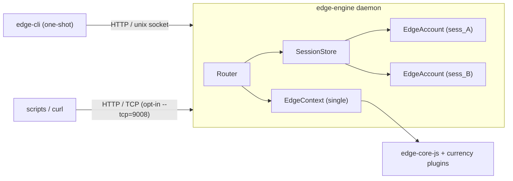

# Edge CLI

A command-line interface for the Edge platform. Useful for account management,
wallet operations, debugging, and scripting against edge-core-js.

The CLI is a **thin one-shot client**. A long-lived **engine daemon** owns the
`EdgeContext`, keeps logged-in accounts alive across invocations, and exposes a
JSON REST API over a Unix domain socket (TCP is optional).

For the full REST surface (request/response bodies, status codes, errors), see
[EDGE_CLI_API.md](./EDGE_CLI_API.md).

## Overview

| Piece | Role |
|-------|------|
| `edge-engine` | Long-lived daemon. Owns one `EdgeContext` and N `EdgeAccount`s keyed by `sessionId`. Serves HTTP. |
| `edge-cli` | One-shot client. Parses argv, auto-spawns the engine if needed, talks over the Unix socket, prints results. |

By default the client uses only the Unix socket at
`~/.edge-cli/run/<profile>/engine.sock`. Enable loopback TCP with
`--tcp=9008` on the engine (useful for `curl` / scripts).

## Running

**Development (from source):**

```bash
npm run cli -- help                 # One-shot via client (auto-spawns engine)
npm run cli -- password-login u p   # Login; sessionId is persisted
npm run cli -- balance <walletId>   # Reuses the engine + session

npm run engine                      # Start the engine alone
npm run engine -- -t                # Engine against tester servers
npm run engine -- --tcp=9008        # Also listen on 127.0.0.1:9008
```

**Built artifact:**

```bash
npm run build:cli                   # → lib/edgeCli.js + lib/edgeEngine.js
node lib/edgeCli.js help
node lib/edgeEngine.js -t --tcp=9008
```

**Published (npm):**

```bash
npx edge-cli help
npx edge-cli -t password-login <user> <pass>
```

### Engine / client flags

| Flag | Who | Description |
|------|-----|-------------|
| `-t, --test` | both | Use the six `-tester` servers (see below) |
| `-d, --directory` | both | Working directory for local Edge data |
| `-a, --app-id` | both | Application ID |
| `-k, --api-key` | both | Override API key from `keys.json` |
| `--locale <tag>` | both | Language tag (BCP 47 or POSIX). Also `EDGE_CLI_LOCALE` or `locale` in the config file |
| `--tcp=9008` | engine | Bind TCP on `127.0.0.1` (off by default; bare `--tcp` is an error; `--tcp=0` = ephemeral) |
| `--idle-timeout <sec>` | engine | Self-shutdown after idle with no sessions (default `300`; `0` = never) |
| `--no-spawn` | client | Do not auto-start the engine; fail if none is running |
| `--session <id>` | client | Override the persisted sessionId |
| `--solve-captcha` | client | On `CHALLENGE_REQUIRED`, auto-solve ALTCHA PoW and retry |
| `-h, --help` | both | Show options |

API keys load from `./keys.json`, then `~/.edge-cli/keys.json`
(`edgeApiKey`, `edgeApiSecret`, `pluginApiKeys`).

When the native Edge API HMAC signer is available, the engine prefers it over
`keys.json` secrets for **both** `edge-core-js` and `GET /v1/getKeys` on the
info server. Plugin secrets (including Monero LWS `edgeApiKey`) come from that
fetch and overlay local `pluginApiKeys`. Set `EDGE_CLI_FORCE_KEYS_JSON=1`
(or pass `-k`) to force the JSON key/secret pair instead — useful for tester
embeds and debugging. `-t` signs getKeys against `info-tester.edge.app`.

Locale (one tag drives language tables and number format): `--locale`, then
`locale` in `edge-cli.conf`, then `EDGE_CLI_LOCALE`, then `LC_ALL` /
`LC_MESSAGES` / `LANG`, then `Intl`, then `en-US`. An already-running engine
keeps its locale; the client warns on mismatch and continues. `GET /v1/status`
reports `locale`, `decimalSeparator`, and `groupingSeparator`.

## Tester servers

**Always use `-t` / `--test` for testing. Never hit production in tests.**

`-t` points the engine at these six hosts (the only `*-tester.edge.app`
names that resolve):

| Host | `EdgeContextOptions` field |
|------|----------------------------|
| `https://login-tester.edge.app` | `loginServer` |
| `https://info-tester.edge.app` | `infoServer` |
| `https://sync-tester-us1.edge.app` | `syncServer` (array) |
| `https://sync-tester-us2.edge.app` | `syncServer` |
| `https://sync-tester-us3.edge.app` | `syncServer` |
| `https://change-tester.edge.app` | `changeServer` |

```bash
npm run cli -- -t account-create alice 'pass' 1234
npm run cli -- -t password-login alice 'pass'
```

Confirm with `edge-cli engine-config` — `testMode` should be true and every
server URL should be a `*-tester.edge.app` host.

## Architecture



ASCII equivalent:

```
edge-cli  ──HTTP──►  engine.sock  ──►  edge-engine
                                         │
                                         ├─ EdgeContext (one)
                                         └─ accounts by sessionId
                                            (sess_… → EdgeAccount)
```

A *profile* is a hash of `{ appId, directory, testMode, loginServer }`.
Distinct profiles get distinct run directories, so a tester engine and a
production engine can coexist.

## Discovery

Under `~/.edge-cli/run/<profile>/` (files mode `0600`):

| File | Purpose |
|------|---------|
| `engine.json` | Discovery / lock: pid, apiVersion, socketPath, tcpPort, appId, testMode, startedAt |
| `engine.sock` | Unix domain socket (always on) |
| `session.json` | Last `sessionId` written by the client |

Example `engine.json`:

```json
{
  "pid": 40123,
  "apiVersion": "1.0.0",
  "socketPath": "/Users/you/.edge-cli/run/8f3a.../engine.sock",
  "tcpPort": null,
  "appId": "",
  "testMode": true,
  "startedAt": "2026-08-06T04:55:00.000Z"
}
```

Client flow: read `engine.json` → `GET /v1/status` → on miss, spawn the
engine (unless `--no-spawn`), poll readiness up to 30 s, retry.

```bash
# Manual status check over the socket
curl --unix-socket ~/.edge-cli/run/<profile>/engine.sock \
  http://localhost/v1/status
```

## Sessions

Successful login returns an opaque `sessionId` (`sess_` + base58 of 16 random
bytes). Account-scoped REST paths look like:

```
/v1/accounts/{sessionId}/wallets/{walletId}/balances
```

There is **no transport-level auth**. Core authenticates via password / PIN /
key / recovery; `sessionId` scopes everything after that.

The client persists the latest id in `session.json` so commands chain without
re-typing. Override with `--session <id>` or `EDGE_CLI_SESSION`.

**Auto-logout** mirrors the GUI: the engine reads `autoLogoutTimeInSeconds`
from the account’s synced `Settings.json` (default `3600`, `0` = disabled) and
logs the account out after that much idle time since the last REST call that
touched the session. `edge-cli session-touch` is an explicit keepalive.

**Engine idle shutdown:** after ~5 minutes with no sessions and no traffic, the
engine closes the context, unlinks the socket / run file, and exits. Configure
with `--idle-timeout` (`0` = never).

```bash
edge-cli -t password-login alice 'pass'   # prints + stores sessionId
edge-cli wallet-list                      # uses persisted session
edge-cli session-list
edge-cli session-touch
edge-cli logout
```

## CAPTCHA

`usernameAvailable`, `createAccount`, and `loginWithPassword` can raise a
login-server CAPTCHA. The engine does **not** solve it. It returns:

```json
{
  "error": {
    "code": "CHALLENGE_REQUIRED",
    "status": 403,
    "message": "Login requires a CAPTCHA",
    "details": {
      "challengeId": "GTNMhqW1...",
      "challengeUri": "https://login-tester.edge.app/api/v2/captcha/..."
    }
  }
}
```

Options:

1. **CLI helper** — `edge-cli password-login ... --solve-captcha` headlessly
   solves ALTCHA PoW at `challengeUri` and retries with `challengeId`.
2. **Manual** — open the URI in a browser, then re-run the command with
   `--challenge-id <id>` (or pass `challengeId` in the REST body).
3. **Prefetch** — `edge-cli challenge-create` → `POST /v1/challenge`.

Automated tests use the same ALTCHA solver (see `src/cli/client/solveCaptcha.ts`).

## Edge login (QR / barcode)

`edge-cli edge-login` requests a pending Edge login and prints JSON the
approving device can use:

```json
{
  "pendingId": "sess-pending_7Qk3...",
  "lobbyId": "HbC9mVJ2xR4tN8pL",
  "uri": "edge://edge/HbC9mVJ2xR4tN8pL",
  "state": "pending"
}
```

Approve from another logged-in Edge device (Scan QR), or paste `uri` /
`lobbyId` via **Scan QR → Enter** (useful with Maestro on the iOS simulator).
Poll with `GET /v1/login/edge/{pendingId}` until `state` is `done` (includes
the session) or `error`.

## Command reference

Commands talk to the engine REST API. Paths below omit the `/v1` prefix in the
“Endpoint” column for brevity where the pattern is obvious; full contracts live
in [EDGE_CLI_API.md](./EDGE_CLI_API.md).

Session-scoped routes need a current session (`session.json`, `--session`, or
`EDGE_CLI_SESSION`).

### Engine management

| Command | Description | Endpoint |
|---------|-------------|----------|
| `engine-status` | Engine pid, uptime, session count, idle shutdown | `GET /v1/status` |
| `engine-config` | appId, servers, testMode, plugins | `GET /v1/config` |
| `engine-stop` | Graceful shutdown | `POST /v1/shutdown` |

### Account & Authentication

| Command | Description | Endpoint |
|---------|-------------|----------|
| `account-available <username>` | Check if a username is taken | `GET /v1/username-available` |
| `account-create <user> <pass> <pin>` | Create a new account | `POST /v1/login/create` |
| `account-info` | Show the current session / account | `GET /v1/accounts/{sessionId}` |
| `account-key` | Show the account login key | `GET /v1/accounts/{sessionId}/login-key` |
| `password-login <user> <pass> [otp]` | Log in with password | `POST /v1/login/password` |
| `key-login <user> <key>` | Log in with an account key | `POST /v1/login/key` |
| `pin-login <user> <pin>` | Log in with a device PIN | `POST /v1/login/pin` |
| `recovery2-login <key> <user> <answers...>` | Log in with recovery answers | `POST /v1/login/recovery2` |
| `edge-login` | Request QR / lobby Edge login | `POST /v1/login/edge` |
| `challenge-create` | Prefetch a CAPTCHA challenge | `POST /v1/challenge` |
| `logout` | Log out of the current session | `DELETE /v1/accounts/{sessionId}` |

### Username Management

| Command | Description | Endpoint |
|---------|-------------|----------|
| `username-list` | List local usernames on this device | `GET /v1/users` |
| `username-delete <username>` | Forget a username from this device | `DELETE /v1/users/{loginIdOrUsername}` |
| `messages-fetch` | Fetch login messages for local users | `GET /v1/login-messages` |

### Password, PIN & OTP

| Command | Description | Endpoint |
|---------|-------------|----------|
| `password-setup <password>` | Create or change the password | `PUT /v1/accounts/{sessionId}/password` |
| `pin-setup <pin>` | Create or change the PIN | `PUT /v1/accounts/{sessionId}/pin` |
| `pin-delete` | Remove the PIN | `DELETE /v1/accounts/{sessionId}/pin` |
| `otp-status` | Show OTP status | `GET /v1/accounts/{sessionId}/otp` |
| `otp-enable [timeout]` | Enable OTP | `PUT /v1/accounts/{sessionId}/otp` |
| `otp-disable` | Disable OTP | `DELETE /v1/accounts/{sessionId}/otp` |
| `otp-reset-cancel` | Cancel a pending OTP reset | `DELETE /v1/accounts/{sessionId}/otp/reset` |
| `otp-reset-request <user> <token>` | Request an OTP reset | `POST /v1/otp-reset` |

### Recovery

| Command | Description | Endpoint |
|---------|-------------|----------|
| `recovery2-setup [<q> <a>]...` | Set recovery questions and answers | `PUT /v1/accounts/{sessionId}/recovery` |
| `recovery2-questions <key> <user>` | Show a user's recovery questions | `GET /v1/recovery2-questions` |

### Wallet Management

| Command | Description | Endpoint |
|---------|-------------|----------|
| `wallet-create <type> [<name>]` | Create a currency wallet | `POST /v1/accounts/{sessionId}/wallets` |
| `wallet-list` | List wallets | `GET /v1/accounts/{sessionId}/wallets` |
| `wallet-info <walletId>` | Show wallet details | `GET .../wallets/{walletId}` |
| `wallet-rename <walletId> <name>` | Rename a wallet | `PATCH .../wallets/{walletId}` |
| `wallet-archive <walletId>` | Archive a wallet | `PATCH .../wallet-states` |
| `wallet-unarchive <walletId>` | Unarchive a wallet | `PATCH .../wallet-states` |
| `wallet-undelete <walletId>` | Undelete a wallet | `PATCH .../wallet-states` |
| `plugin-list` | List currency configs for `wallet-create` | `GET /v1/currency-configs` |

`{walletId}` accepts a full id or a unique prefix.

### Keys

| Command | Description | Endpoint |
|---------|-------------|----------|
| `key-list` | List all keys in the account | `GET /v1/accounts/{sessionId}/keys` |
| `key-add <json>` | Create a wallet from raw key JSON | `POST /v1/accounts/{sessionId}/keys` |
| `key-get <walletId>` | Read a raw private key | `GET .../keys/{walletId}/private-raw` |
| `key-undelete <walletId>` | Clear a key's deleted flag | `PATCH .../wallet-states` |
| `export-public <walletId>` | Export public key (xpub, etc.) | `GET .../keys/{walletId}/public-display` |
| `export-private <walletId>` | Export private key (WIF, seed, etc.) | `GET .../keys/{walletId}/private-display` |

### Balances & Transactions

| Command | Description | Endpoint |
|---------|-------------|----------|
| `balance <walletId> [<tokenId>]` | Native and exchange balance | `GET .../wallets/{walletId}/balances[/{tokenId}]` |
| `address <walletId>` | Receive addresses | `GET .../wallets/{walletId}/addresses` |
| `tx-list <walletId> [<tokenId>] [<limit>] [<startDate>] [<endDate>] [<search>]` | List transactions (metadata filled like the GUI list) | `GET .../wallets/{walletId}/transactions` |

Use the literal path segment `null` for the native asset when a `tokenId` is
required in a URL.

### Spending

| Command | Description | Endpoint |
|---------|-------------|----------|
| `spend <walletId> <addr> <amount> [<tokenId>] [--dry-run]` | Send funds (make/sign/broadcast/save). `--dry-run` returns an `objectId` handle | `POST .../wallets/{walletId}/spend` |
| `spend-max <walletId> <addr> [<tokenId>] [--dry-run]` | Send entire balance | `POST .../wallets/{walletId}/spend` (`useMax`) |
| `max-spendable <walletId> <addr> [<tokenId>]` | Calculate max spendable amount | `POST .../wallets/{walletId}/max-spendable` |
| `make-spend <walletId> <addr> <amount> [<tokenId>]` | Build unsigned tx; returns `objectId` (5 min TTL) | `POST .../make-spend` |
| `sign-tx <walletId> <objectId>` | Sign a staged transaction | `POST .../sign-tx` |
| `broadcast-tx <walletId> <objectId>` | Broadcast a signed transaction | `POST .../broadcast-tx` |
| `save-tx <walletId> <objectId>` | Save tx and release the handle | `POST .../save-tx` |
| `object-get <objectId>` | Inspect an ephemeral handle | `GET .../objects/{objectId}` |
| `object-delete <objectId>` | Release a handle early | `DELETE .../objects/{objectId}` |

Staged spend objects follow the **ephemeral object handle** pattern: each
method-bearing core value returned by the engine includes `objectId` +
`expiresAt` (5 minutes). See `docs/EDGE_CLI_API.md` § Ephemeral object
handles.

### Rates & Swap

| Command | Description | Endpoint |
|---------|-------------|----------|
| `rates-query <jsonBody>` | Batch crypto/fiat rates (omit `date` → now) | `POST /v1/rates/query` |
| `rates-usd-to-native <usd> <pluginId> [<tokenId>]` | Convert USD → native amount via rates3/4 | `POST /v1/rates/usd-to-native` |
| `swap-quote <fromWid> <toWid> <nativeAmount> [from\|to\|max] [<pluginId>]` | Fetch quotes; each is a `swap_` handle | `POST .../swap/quotes` |
| `swap-quote-get <objectId>` | Inspect a quote handle | `GET .../swap/quotes/{objectId}` |
| `swap-approve <objectId>` | Execute quote / release handle | `POST .../swap/quotes/{objectId}/approve` |
| `swap-quote-close <objectId>` | Close quote without executing | `DELETE .../swap/quotes/{objectId}` |

### Tokens

| Command | Description | Endpoint |
|---------|-------------|----------|
| `token-list <walletId>` | List available / enabled tokens | `GET .../wallets/{walletId}/tokens` |
| `token-enable <walletId> <tokenId>` | Enable a token | `PUT` / `POST .../enabled-tokens` |
| `token-disable <walletId> <tokenId>` | Disable a token | `DELETE .../enabled-tokens/{tokenId}` |
| `token-detected <walletId>` | Detected but unenabled tokens | `GET .../wallets/{walletId}/tokens` |

### Data Store

| Command | Description | Endpoint |
|---------|-------------|----------|
| `data-store-list [storeId]` | List stores, or items in a store | `GET .../data-stores` / `.../data-stores/{storeId}` |
| `data-store-get <storeId> <itemId>` | Read an item | `GET .../data-stores/{storeId}/items/{itemId}` |
| `data-store-set <storeId> <itemId> <text>` | Write an item | `PUT .../data-stores/{storeId}/items/{itemId}` |
| `data-store-delete <storeId> [itemId]` | Delete an item or store | `DELETE .../items/{itemId}` or `DELETE .../data-stores/{storeId}` |

### Lobby

| Command | Description | Endpoint |
|---------|-------------|----------|
| `lobby-login-fetch <lobbyId>` | Fetch an Edge login request | `GET .../lobbies/{lobbyId}` |
| `lobby-login-approve <lobbyId>` | Approve an Edge login request | `POST .../lobbies/{lobbyId}/approve` |

### Admin

Internal / debugging commands over `context.$internalStuff`. Prefixed with
`admin-` so they stay out of normal workflows.

| Command | Description | Endpoint |
|---------|-------------|----------|
| `admin-auth-request <method> <path> [body]` | Raw auth server request | `POST /v1/admin/auth-request` |
| `admin-hash-username <username>` | Hash a username like the login server | `GET /v1/admin/hash-username` |
| `admin-lobby-create [json] [period]` | Create a lobby (returns `objectId` handle) | `POST /v1/admin/lobby` |
| `admin-lobby-fetch <lobbyId>` | Fetch a lobby's contents | `GET /v1/admin/lobby/{lobbyId}` |
| `admin-lobby-reply <lobbyId> <json> [reply]` | Send a reply to a lobby | `POST /v1/admin/lobby/{lobbyId}/reply` |
| `admin-repo-sync <syncKey>` | Sync a repo | `POST /v1/admin/repos/sync` |
| `admin-repo-list <syncKey> <dataKey> [path]` | List repo contents | `GET /v1/admin/repos/{syncKey}/{dataKey}/files` |
| `admin-repo-get <syncKey> <dataKey> <path>` | Read a repo file | `GET /v1/admin/repos/{syncKey}/{dataKey}/file` |
| `admin-repo-set <syncKey> <dataKey> <path> <text>` | Write a repo file | `PUT /v1/admin/repos/{syncKey}/{dataKey}/file` |
| `admin-repo-delete <syncKey> <dataKey> <path>` | Delete a repo file | `DELETE /v1/admin/repos/{syncKey}/{dataKey}/file` |

### Help / Session

| Command | Description | Endpoint |
|---------|-------------|----------|
| `help [command]` | Show help | (local) |
| `session-list` | List active engine sessions | `GET /v1/sessions` |
| `session-touch` | Keepalive; refresh auto-logout timer | `POST /v1/accounts/{sessionId}/touch` |

### Exit codes

| Code | Meaning |
|------|---------|
| `0` | Success |
| `1` | Generic failure |
| `2` | Usage / bad argv |
| `3` | Auth / session |
| `4` | Not found |
| `5` | Validation / funds |
| `6` | Network |
| `7` | Engine unavailable |

## Source layout

```
src/cli/
  engine/
    index.ts           # Daemon entry, argv, signals
    makeCoreContext.ts # Plugin registration + makeEdgeContext
    server.ts          # HTTP handler; unix (+ optional TCP) listeners
    router.ts          # Method + path dispatch
    sessions.ts        # SessionStore + auto-logout ticker
    idleShutdown.ts    # Idle self-shutdown
    discovery.ts       # Profile hash, run-file, socket paths
    errors.ts          # EngineError + core → HTTP mapping
    json.ts            # Body parse / Uint8Array·Date·Map codec
    resolve.ts         # walletId prefix, tokenId parsing
    events.ts          # SSE hub
    testerServers.ts   # The six -tester hosts
    routes/            # status, login, account, wallets, …
  client/
    apiClient.ts       # HTTP over socketPath or TCP
    spawnEngine.ts     # Auto-spawn + readiness poll
    sessionFile.ts     # Persisted sessionId
    output.ts          # JSON / table / plain + exit codes
  commands/            # Argv → apiClient → output (no core imports)
  index.ts             # One-shot (+ REPL) front-end
```

## REST API

Full method/path/body/error documentation:
**[docs/EDGE_CLI_API.md](./EDGE_CLI_API.md)**.
