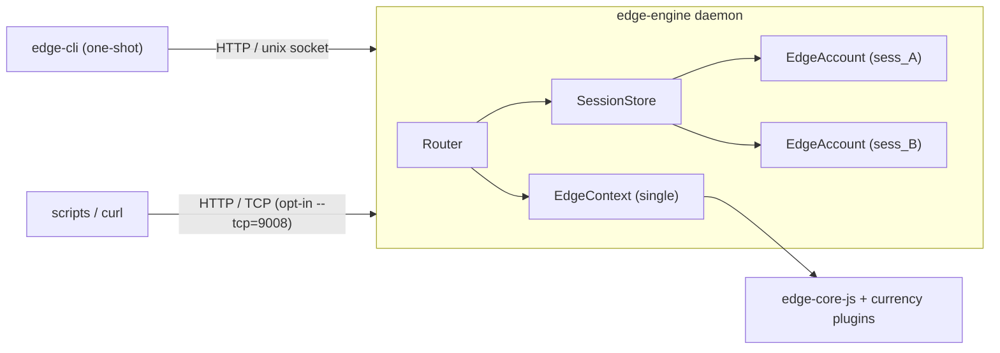

# Edge CLI

A command-line interface for the Edge platform. Useful for account management,
wallet operations, debugging, and scripting against edge-core-js.

The CLI is a **thin one-shot client**. A long-lived **engine daemon** owns the
`EdgeContext`, keeps logged-in accounts alive across invocations, and exposes a
JSON REST API over a Unix domain socket (TCP is optional).

For the full surface — every command, its REST call, and the `edge-core-js`
call behind it — see the generated reference at
[docs/api/dist/index.html](./api/dist/index.html), built from `docs/api/`.

## Overview

| Piece | Role |
|-------|------|
| `edge-engine` | Long-lived daemon. Owns one `EdgeContext` and N `EdgeAccount`s keyed by `sessionId`. Serves HTTP. |
| `edge-cli` | One-shot client. Parses argv, auto-spawns the engine if needed, talks over the Unix socket, prints results. |

By default the client uses only the Unix socket at
`~/.edge-cli/run/<profile>/engine.sock`. Enable loopback TCP with
`--tcp=9008` on the engine (useful for `curl` / scripts).

## Running

**Development (from source):**

```bash
npm run cli -- help                              # One-shot via client (auto-spawns engine)
npm run cli -- login-with-password u --password=p     # Login; sessionId is persisted
npm run cli -- balance-map <walletId>                # Reuses the engine + session

npm run engine                      # Start the engine alone
npm run engine -- -t                # Engine against tester servers
npm run engine -- --tcp=9008        # Also listen on 127.0.0.1:9008
```

**Built artifact:**

```bash
npm run build:cli                   # → lib/edgeCli.js + lib/edgeEngine.js
node lib/edgeCli.js help
node lib/edgeEngine.js -t --tcp=9008
```

**Published (npm):**

```bash
npx edge-cli help
npx edge-cli -t login-with-password <user> --password=<pass>
```

### Engine / client flags

| Flag | Who | Description |
|------|-----|-------------|
| `-t, --test` | both | Use the six `-tester` servers (see below) |
| `-d, --directory` | both | Working directory for local Edge data |
| `-a, --app-id` | both | Application ID |
| `-k, --api-key` | both | Override API key from `keys.json` |
| `--locale <tag>` | both | Language tag (BCP 47 or POSIX). Also `EDGE_CLI_LOCALE` or `locale` in the config file |
| `--tcp=9008` | engine | Bind TCP on `127.0.0.1` (off by default; bare `--tcp` is an error; `--tcp=0` = ephemeral) |
| `--idle-timeout <sec>` | engine | Self-shutdown after idle with no sessions (default `300`; `0` = never) |
| `--no-spawn` | client | Do not auto-start the engine; fail if none is running |
| `--session <id>` | client | Override the persisted sessionId |
| `--solve-captcha` | client | On `CHALLENGE_REQUIRED`, auto-solve ALTCHA PoW and retry |
| `-c, --config <path>` | both | Configuration file |
| `--tcp-host=<host>` | engine | TCP bind host (default `127.0.0.1`) |
| `-u, --username` / `-p, --password` | client | Legacy one-shot login helpers |
| `-h, --help` | both | Show options |

API keys load from `./keys.json`, then `~/.edge-cli/keys.json`
(`edgeApiKey`, `edgeApiSecret`, `pluginApiKeys`).

When the native Edge API HMAC signer is available, the engine prefers it over
`keys.json` secrets for **both** `edge-core-js` and `GET /v1/getKeys` on the
info server. Plugin secrets (including Monero LWS `edgeApiKey`) come from that
fetch and overlay local `pluginApiKeys`. Set `EDGE_CLI_FORCE_KEYS_JSON=1`
(or pass `-k`) to force the JSON key/secret pair instead — useful for tester
embeds and debugging. `-t` signs getKeys against `info-tester.edge.app`.

Locale (one tag drives language tables and number format): `--locale`, then
`locale` in `edge-cli.conf`, then `EDGE_CLI_LOCALE`, then `LC_ALL` /
`LC_MESSAGES` / `LANG`, then `Intl`, then `en-US`. An already-running engine
keeps its locale; the client warns on mismatch and continues. `GET /engine/status`
reports `locale`, `decimalSeparator`, and `groupingSeparator`.

## Tester servers

**Always use `-t` / `--test` for testing. Never hit production in tests.**

`-t` points the engine at these six hosts (the only `*-tester.edge.app`
names that resolve):

| Host | `EdgeContextOptions` field |
|------|----------------------------|
| `https://login-tester.edge.app` | `loginServer` |
| `https://info-tester.edge.app` | `infoServer` |
| `https://sync-tester-us1.edge.app` | `syncServer` (array) |
| `https://sync-tester-us2.edge.app` | `syncServer` |
| `https://sync-tester-us3.edge.app` | `syncServer` |
| `https://change-tester.edge.app` | `changeServer` |

```bash
npm run cli -- -t create-account alice --password='pass' --pin=1234
npm run cli -- -t login-with-password alice --password='pass'
```

Confirm with `edge-cli engine-config` — `testMode` should be true and every
server URL should be a `*-tester.edge.app` host.

## Architecture



ASCII equivalent:

```
edge-cli  ──HTTP──►  engine.sock  ──►  edge-engine
                                         │
                                         ├─ EdgeContext (one)
                                         └─ accounts by sessionId
                                            (sess_… → EdgeAccount)
```

A *profile* is a hash of `{ appId, directory, testMode, loginServer }`.
Distinct profiles get distinct run directories, so a tester engine and a
production engine can coexist.

## Discovery

Under `~/.edge-cli/run/<profile>/` (files mode `0600`):

| File | Purpose |
|------|---------|
| `engine.json` | Discovery / lock: pid, apiVersion, socketPath, tcpPort, appId, testMode, startedAt |
| `engine.sock` | Unix domain socket (always on) |
| `session.json` | Last `sessionId` written by the client |

Example `engine.json`:

```json
{
  "pid": 40123,
  "apiVersion": "1.0.0",
  "socketPath": "/Users/you/.edge-cli/run/8f3a.../engine.sock",
  "tcpPort": null,
  "appId": "",
  "testMode": true,
  "startedAt": "2026-08-06T04:55:00.000Z"
}
```

Client flow: read `engine.json` → `GET /engine/status` → on miss, spawn the
engine (unless `--no-spawn`), poll readiness up to 30 s, retry.

```bash
# Manual status check over the socket
curl --unix-socket ~/.edge-cli/run/<profile>/engine.sock \
  http://localhost/engine/status
```

## Sessions

Successful login returns an opaque `sessionId` (`sess_` + base58 of 16 random
bytes). Account-scoped REST paths look like:

```
/account/{sessionId}/wallets/{walletId}/balance-map
```

There is **no transport-level auth**. Core authenticates via password / PIN /
key / recovery; `sessionId` scopes everything after that.

The client persists the latest id in `session.json` so commands chain without
re-typing. Override with `--session <id>` or `EDGE_CLI_SESSION`.

**Auto-logout** mirrors the GUI: the engine reads `autoLogoutTimeInSeconds`
from the account’s synced `Settings.json` (default `3600`, `0` = disabled) and
logs the account out after that much idle time since the last REST call that
touched the session. `edge-cli touch` is an explicit keepalive.

**Engine idle shutdown:** after ~5 minutes with no sessions and no traffic, the
engine closes the context, unlinks the socket / run file, and exits. Configure
with `--idle-timeout` (`0` = never).

```bash
edge-cli -t login-with-password alice --password='pass'  # prints + stores sessionId
edge-cli currency-wallets                 # uses persisted session
edge-cli engine-sessions
edge-cli touch
edge-cli logout
```

## CAPTCHA

`usernameAvailable`, `createAccount`, and `loginWithPassword` can raise a
login-server CAPTCHA. The engine does **not** solve it. It returns:

```json
{
  "error": {
    "code": "CHALLENGE_REQUIRED",
    "status": 403,
    "message": "Login requires a CAPTCHA",
    "details": {
      "challengeId": "GTNMhqW1...",
      "challengeUri": "https://login-tester.edge.app/api/v2/captcha/..."
    }
  }
}
```

Options:

1. **CLI helper** — `edge-cli login-with-password ... --solve-captcha` headlessly
   solves ALTCHA PoW at `challengeUri` and retries with `challengeId`.
2. **Manual** — open the URI in a browser, then re-run the command with
   `--challenge-id <id>` (or pass `challengeId` in the REST body).
3. **Prefetch** — `edge-cli fetch-challenge` → `POST /fetch-challenge`.

Automated tests use the same ALTCHA solver (see `src/cli/client/solveCaptcha.ts`).

## Edge login (QR / barcode)

`edge-cli request-edge-login` requests a pending Edge login and prints JSON the
approving device can use:

```json
{
  "pendingId": "sess-pending_7Qk3...",
  "lobbyId": "HbC9mVJ2xR4tN8pL",
  "uri": "edge://edge/HbC9mVJ2xR4tN8pL",
  "state": "pending"
}
```

Approve from another logged-in Edge device (Scan QR), or paste `uri` /
`lobbyId` via **Scan QR → Enter** (useful with Maestro on the iOS simulator).
Poll with `GET /pending-edge-login/{pendingId}` until `state` is `done`
(it then carries the session) or `error`.

## Command arguments

Each command takes at most **one positional** resource id (wallet, user, lobby,
object handle, or store), immediately after the command name. Everything else
is a named `--kebab-case` flag.

| Form | Example |
|------|---------|
| Preferred | `--name=value` |
| Also accepted | `--name value` |
| Booleans | `--dry-run`, `--no-wait` (presence = true) |
| Repeatable | `--answer=`, `--question=` |
| Lists | comma-separated, no spaces: `--export-format=csv,qbo,bitwave` |

Native token: **omit** `--token-id`. Do not pass the literal `null` on the CLI.
Empty `--name=` is a usage error. Unknown flags and extra positionals are usage
errors. Commands about two wallets (swap) name both ids
(`--from-wallet-id`, `--to-wallet-id`).

ISO dates use the equals form so a timezone offset is not a new argv token:

```bash
edge-cli get-transactions <walletId> --start-date=2020-01-01T00:00:00-07:00
```

REST URL path/query params stay camelCase (`tokenId`, `searchString`,
`startDate`). REST URLs may still use `tokenId=null` for the native asset.

## Command reference

The full reference — every command paired with the REST call it makes and the
`edge-core-js` call behind it — is generated into
**[docs/api/dist/index.html](./api/dist/index.html)**.

```bash
npm run docs:api          # rebuild it
npm run docs:api:verify   # check it still matches src/cli
```

### Naming

Routes are named after the core call they front, kebab-cased, and the command
matches:

| Core | REST | CLI |
|------|------|-----|
| `context.forgetAccount` | `POST /forget-account` | `forget-account` |
| `context.loginWithPassword` | `POST /login-with-password` | `login-with-password` |
| `account.changePin` | `POST /account/{sessionId}/change-pin` | `change-pin` |
| `wallet.getTransactions` | `GET /account/{sessionId}/wallets/{walletId}/get-transactions` | `get-transactions` |

Parameters keep core's own names (`rootLoginId`, `otpResetToken`,
`usernameOrLoginId`, `paymentProtocolUrl`). Path segments carry scope only —
`sessionId`, `walletId`, `objectId`; core *arguments* travel in the query for
`GET` and the body for `POST`. Only those two verbs are used, since core has no
HTTP verbs. There is no `/v1` prefix; `X-Edge-Api-Version` still reports the
version.

Calls with no core equivalent — engine lifecycle, and GUI code the CLI reuses —
keep descriptive names (`engine-status`, `local-settings`, `rates-query`) and
say so in the docs.

Where a command name would collide across scopes it takes a prefix: `sync` is
`account.sync`, and `wallet.sync` is reachable over REST only.

### Subscribing to events

`edge-cli subscribe` holds a Server-Sent Events stream open and prints one JSON
object per line until you interrupt it. It runs concurrently with ordinary
one-shot commands, so a subscriber in one terminal watches what another
terminal does:

```bash
# terminal 1
edge-cli subscribe --type=session.created --type=session.expired

# terminal 2
edge-cli -t login-with-password alice --password='pass'
edge-cli logout
```

A live subscription keeps the **engine** alive past its idle timeout — the
stream would otherwise die under the subscriber. It does **not** keep an
**account** logged in: the auto-logout timer still fires on schedule, and when
it does, subscriptions that depend on that account or one of its wallets are
closed with a `subscription.closed` frame. Context-level subscriptions survive,
because the `EdgeContext` outlives every account.

`subscribe` exits `0` on Ctrl-C, `3` when a session ended the stream, and `7`
when the engine went away.

### Exit codes

| Code | Meaning |
|------|---------|
| `0` | Success |
| `1` | Generic failure |
| `2` | Usage / bad argv |
| `3` | Auth / session |
| `4` | Not found |
| `5` | Validation / funds |
| `6` | Network |
| `7` | Engine unavailable |

## Source layout

```
src/cli/
  engine/
    index.ts           # Daemon entry, argv, signals
    makeCoreContext.ts # Plugin registration + makeEdgeContext
    server.ts          # HTTP handler; unix (+ optional TCP) listeners
    router.ts          # Method + path dispatch
    sessions.ts        # SessionStore + auto-logout ticker
    idleShutdown.ts    # Idle self-shutdown
    discovery.ts       # Profile hash, run-file, socket paths
    errors.ts          # EngineError + core → HTTP mapping
    json.ts            # Body parse / Uint8Array·Date·Map codec
    resolve.ts         # walletId prefix, tokenId parsing
    events.ts          # SSE hub
    testerServers.ts   # The six -tester hosts
    routes/            # status, login, account, wallets, …
  client/
    apiClient.ts       # HTTP over socketPath or TCP
    spawnEngine.ts     # Auto-spawn + readiness poll
    sessionFile.ts     # Persisted sessionId
    output.ts          # JSON / table / plain + exit codes
  commands/            # Argv → apiClient → output (no core imports)
  index.ts             # One-shot (+ REPL) front-end
```

## REST API

Full method/path/body/error documentation is generated:
**[docs/api/dist/index.html](./api/dist/index.html)**, with an OpenAPI 3.1
document beside it at `docs/api/dist/openapi.json`. The source of truth is
`docs/api/`; see [docs/api/README.md](./api/README.md).
