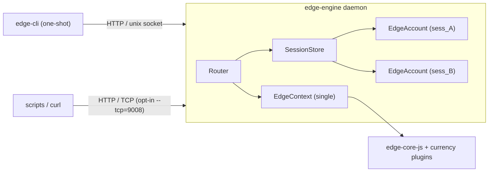

# Edge CLI

A command-line interface for the Edge platform. Useful for account management,
wallet operations, debugging, and scripting against edge-core-js.

The CLI is a **thin one-shot client**. A long-lived **engine daemon** owns the
`EdgeContext`, keeps logged-in accounts alive across invocations, and exposes a
JSON REST API over a Unix domain socket (TCP is optional).

For the full surface — every command, its REST call, and the `edge-core-js`
call behind it — see the generated reference at
[docs/api/dist/index.html](./api/dist/index.html), built from `docs/api/`.

## Overview

| Piece | Role |
|-------|------|
| `edge-engine` | Long-lived daemon. Owns one `EdgeContext` and N `EdgeAccount`s keyed by `sessionId`. Serves HTTP. |
| `edge-cli` | One-shot client. Parses argv, auto-spawns the engine if needed, talks over the Unix socket, prints results. |

By default the client uses only the Unix socket at
`~/.edge-cli/run/<profile>/engine.sock`. Enable loopback TCP with
`--tcp=9008` on the engine (useful for `curl` / scripts). That port is
authenticated with a token from the run file — see
[Sessions](#sessions).

The CLI keeps state under two roots:

| Path | Holds |
|------|-------|
| `~/.config/edge-cli/` | `edge-cli.conf`, and the account data directory `--directory` defaults to. The data directory is created `0700`: it holds the login stashes |
| `~/.edge-cli/run/<profile>/` | `engine.sock`, `engine.json`, `session.json` — per profile; directory `0700`, files `0600` |
| `~/.edge-cli/logs/` | `engine-<profile>.log` |
| `~/.edge-cli/keys.json` | API keys, after `./keys.json` |

Account repos therefore live under `~/.config/edge-cli`, not `~/.edge-cli`.
Pass `--directory` to put them somewhere else; it is part of the profile hash,
so a different directory is a different engine.

## Running

**Development (from source):**

```bash
npm run cli -- help                              # One-shot via client (auto-spawns engine)
npm run cli -- login-with-password --username=u --password=p  # sessionId is persisted
npm run cli -- balance-map --wallet-id=<id>           # Reuses the engine + session

npm run engine                      # Start the engine alone
npm run engine -- -t                # Engine against tester servers
npm run engine -- --tcp=9008        # Also listen on 127.0.0.1:9008
```

**Built artifact:**

```bash
npm run build:cli                   # → lib/edgeCli.js + lib/edgeEngine.js
node lib/edgeCli.js help
node lib/edgeEngine.js -t --tcp=9008
```

**Published (npm):** not yet. `edge-react-gui` is `private` with no `bin`
entry, so there is nothing for `npx` to fetch and no `edge-cli` on a `PATH`.
Until a package is published, run the built artifact directly as above. The
`edge-cli` name used throughout this document is the command the built
`lib/edgeCli.js` presents as; it is not an npm package name.

**Interactive prompt:** run `edge-cli` with no command and it reads commands
from stdin instead of exiting, with tab completion over the command list. The
engine, session and flags are the same as one-shot mode — `edge-cli -t` with no
command opens a prompt already pointed at the tester servers. `help` lists the
commands, and EOF (Ctrl-D) leaves.

### Engine / client flags

| Flag | Who | Description |
|------|-----|-------------|
| `-t, --test` | both | Use the six `-tester` servers — see below |
| `--fake` | both | Emulate the login, info and sync servers in-process — no network, no API key. Its own engine profile, so it never shares a socket with a real one |
| `-d, --directory` | both | Working directory for local Edge data |
| `-a, --app-id` | both | Application ID |
| `-k, --api-key` | both | Override API key from `keys.json` — also turns off the keys.json secret and the native HMAC signer. The client forwards it to the engine in the environment, not on the command line. An `apiKey` in the config file supplies the key *without* that override |
| `--locale <tag>` | both | Language tag (BCP 47 or POSIX). Also `EDGE_CLI_LOCALE` or `locale` in the config file |
| `--tcp=<port>` | both | Bind TCP on `127.0.0.1`, token-authenticated — off by default; bare `--tcp` and `--tcp=` are both errors, and `--tcp=0` picks an ephemeral port. On the client it is forwarded to the engine it spawns |
| `--idle-timeout=<seconds>` | engine | Self-shutdown once nothing holds the engine open — default `300`, `0` means never, and a blank value is an error |
| `--no-spawn` | client | Do not auto-start the engine; fail if none is running |
| `--timeout=<seconds>` | client | Per-request deadline (default `120`) — on expiry the client gives up while the engine runs the request to completion, so raise it for a whole-wallet `get-transactions`, `wait-for-all-wallets` or `resync-blockchain` |
| `--session <id>` | client | Override the persisted `sessionId` |
| `--solve-captcha` | client | On `CHALLENGE_REQUIRED`, auto-solve ALTCHA PoW and retry |
| `-c, --config <path>` | both | Configuration file. Forwarded to the engine the client spawns, so one file decides both halves |
| `--tcp-host=<host>` | engine | TCP bind host, loopback only (default `127.0.0.1`) — a non-loopback address is a usage error, because the port would expose `spend` and `get-raw-private-key` to the network |
| `-u, --username` | client | Legacy one-shot login helper |
| `-p, --password` | client | Legacy one-shot login helper |
| `-h, --help` | both | Show options |

API keys load from `./keys.json`, then `~/.edge-cli/keys.json`
(`edgeApiKey`, `edgeApiSecret`, `pluginApiKeys`).

When the native Edge API HMAC signer is available, the engine prefers it over
`keys.json` secrets for **both** `edge-core-js` and `GET /v1/getKeys` on the
info server. Plugin secrets (including Monero LWS `edgeApiKey`) come from that
fetch and overlay local `pluginApiKeys`. Set `EDGE_CLI_FORCE_KEYS_JSON=1`
(or pass `-k`) to force the JSON key/secret pair instead — useful for tester
embeds and debugging. `-t` signs getKeys against `info-tester.edge.app`.

Locale: `--locale`, then `locale` in `edge-cli.conf`, then `EDGE_CLI_LOCALE`,
then `LC_ALL` / `LC_MESSAGES` / `LANG`, then `Intl`, then `en-US`. The tag
selects the language tables the engine's responses are built from. It also
sets `decimalSeparator` and `groupingSeparator`, which `GET /engine/status`
reports — but nothing on either CLI entry's import graph formats a number
through them, so today they are reported for a caller's benefit rather than
applied to anything the CLI prints. An already-running engine keeps its
locale; the client warns on mismatch and continues.

## Tester servers

**Always use `-t` / `--test` for testing. Never hit production in tests.**

`-t` points the engine at these six hosts (the only `*-tester.edge.app`
names that resolve):

| Host | `EdgeContextOptions` field |
|------|----------------------------|
| `https://login-tester.edge.app` | `loginServer` |
| `https://info-tester.edge.app` | `infoServer` |
| `https://sync-tester-us1.edge.app` | `syncServer` (array) |
| `https://sync-tester-us2.edge.app` | `syncServer` |
| `https://sync-tester-us3.edge.app` | `syncServer` |
| `https://change-tester.edge.app` | `changeServer` |

```bash
npm run cli -- -t --solve-captcha create-account --username=alice --password='pass' --pin=1234
npm run cli -- -t login-with-password --username=alice --password='pass'
```

Confirm with `edge-cli engine-config` — every server URL should be a
`*-tester.edge.app` host. `testMode` being true is necessary but not
sufficient: it means "not production", and `--fake` reports true while pointed
at `fake://login`, so read the server list to tell the two apart.

## Architecture


```mermaid
flowchart LR
  cli["edge-cli (one-shot)"] -->|"HTTP / unix socket"| engine
  script["scripts / curl"] -->|"HTTP / TCP (opt-in --tcp=9008)"| engine
  subgraph engine [edge-engine daemon]
    router[Router] --> sessions[SessionStore]
    sessions --> account1["EdgeAccount (sess_A)"]
    sessions --> account2["EdgeAccount (sess_B)"]
    router --> context["EdgeContext (single)"]
  end
  context --> core[edge-core-js + currency plugins]
```

ASCII equivalent:

```
edge-cli  ──HTTP──►  engine.sock  ──►  edge-engine
                                         │
                                         ├─ EdgeContext (one)
                                         └─ accounts by sessionId
                                            (sess_… → EdgeAccount)
```

A *profile* is a hash of `{ appId, directory, testMode, loginServer }`.
Distinct profiles get distinct run directories, so a tester engine and a
production engine can coexist. `directory` is canonicalised first — resolved
to an absolute path and through any symlink — so one data directory is one
profile however the path is spelled, and a trailing slash or a relative `-d`
cannot give it a second engine.

## Discovery

Under `~/.edge-cli/run/<profile>/` (files mode `0600`):

| File | Purpose |
|------|---------|
| `engine.json` | Discovery / lock: pid, apiVersion, socketPath, tcpPort, appId, testMode, startedAt |
| `engine.sock` | Unix domain socket (always on) |
| `session.json` | Last `sessionId` written by the client. Removed when the engine stops, since a session cannot outlive it |
| `engine-startup.log` | The spawned engine's stdout and stderr, so a startup that dies before the socket exists (bad `keys.json`, a plugin that will not load) leaves a record rather than a spawn timeout. Kept when a stale lock is cleared, because the replacement engine is already writing to it |

A clean shutdown removes all four and the profile directory with them.

Example `engine.json`:

```json
{
  "pid": 40123,
  "apiVersion": "1.0.0",
  "socketPath": "/Users/you/.edge-cli/run/8f3a.../engine.sock",
  "tcpPort": null,
  "appId": "",
  "testMode": true,
  "startedAt": "2026-08-06T04:55:00.000Z"
}
```

Client flow: the profile is a pure hash of four argv-derived values, so the
client needs nothing on disk to know which socket to use. It sends the request
straight at that socket; only on ENOENT or ECONNREFUSED does it spawn the
engine (unless `--no-spawn`), and `ensureEngine` pings `/engine/status` first
in case one is already up, then polls readiness for up to 30 s and retries the
request once.

```bash
# Manual status check over the socket
curl --unix-socket ~/.edge-cli/run/<profile>/engine.sock \
  http://localhost/engine/status
```

## Sessions

Successful login returns an opaque `sessionId` (`sess_` + base58 of 16 random
bytes). Account-scoped REST paths look like:

```
/account/{sessionId}/wallet/balance-map?walletId=<id>
```

A `sessionId` **is** the credential: every account-scoped route checks it and
nothing else, so holding one means `get-pin`, `get-raw-private-key`,
`get-login-key` and `spend`. Core authenticates the login itself via password
/ PIN / key / recovery; `sessionId` scopes everything after that.

The Unix socket therefore needs no transport auth of its own — it is `0600`
inside a `0700` directory, so the operating system is the check. **The
loopback TCP listener does**, because any process on the host can reach
`127.0.0.1` whatever user it runs as, and so can a web page the user happens
to be looking at. With `--tcp` the engine:

- mints a bearer token at startup and writes it to the `0600` run file as
  `tcpToken`, and requires it in an `X-Edge-Token` header;
- refuses any request carrying an `Origin` header, and any request whose
  `Host` is not the address it bound — which is what stops a page reaching it
  by rebinding a name onto the port;
- refuses to bind anything but a loopback address.

```bash
edge-cli engine-status                    # starts an engine
TOKEN=$(jq -r .tcpToken ~/.edge-cli/run/<profile>/engine.json)
curl -sH "X-Edge-Token: $TOKEN" http://127.0.0.1:9008/engine/status
```

A missing or wrong token is `401 UNAUTHORIZED`; a bad `Origin` or `Host` is
`403 FORBIDDEN`. `engine-sessions` truncates every `sessionId` it reports, so
the listing is a diagnostic rather than a way to collect credentials.

The client persists the latest id in `session.json` so commands chain without
re-typing. Override with `--session <id>` or `EDGE_CLI_SESSION`.

**Auto-logout** mirrors the GUI: the engine reads `autoLogoutTimeInSeconds`
from the account’s synced `Settings.json` (default `3600`, `0` = disabled) and
logs the account out after that much idle time since the last REST call that
touched the session. `edge-cli touch` is an explicit keepalive.

The setting is re-read as the engine sweeps, so changing it on another device
reaches a session the engine is already holding: within 15 seconds normally,
and within a minute for a session whose auto-logout is currently off, which is
re-read less often because the read is a decrypt and a parse with no cache.

**Engine idle shutdown:** after ~5 minutes with nothing holding it open, the
engine closes the context, unlinks the socket / run file, and exits. Four
things hold it: a logged-in session, a live subscription, a request being
served, and a pending edge login, whose handle belongs to no session and whose
TTL is the same 5 minutes. Configure with `--idle-timeout` (`0` = never). A live `subscribe` holds
it open — see [Subscribing to events](#subscribing-to-events).

```bash
edge-cli -t login-with-password --username=alice --password='pass'  # stores sessionId
edge-cli currency-wallets                 # uses persisted session
edge-cli engine-sessions
edge-cli touch
edge-cli logout
```

## CAPTCHA

`usernameAvailable`, `createAccount`, and `loginWithPassword` can raise a
login-server CAPTCHA. The engine does **not** solve it. It returns:

```json
{
  "error": {
    "code": "CHALLENGE_REQUIRED",
    "status": 403,
    "message": "Login requires a CAPTCHA challenge challengeId=YUXCPENDRSDHMMA7 challengeUri=https://login-tester.edge.app/captcha/YUXCPENDRSDHMMA7 Retry the same request with body/query challengeId after solving, or use CLI --solve-captcha.",
    "details": {
      "challengeId": "YUXCPENDRSDHMMA7",
      "challengeUri": "https://login-tester.edge.app/captcha/YUXCPENDRSDHMMA7"
    }
  }
}
```

Options:

1. **CLI helper** — `--solve-captcha` on any login command headlessly
   solves ALTCHA PoW at `challengeUri` and retries with `challengeId`.
2. **Manual** — open the URI in a browser, then re-run the command with
   `--challenge-id <id>` (or pass `challengeId` in the REST body).
3. **Prefetch** — `edge-cli fetch-challenge` → `POST /fetch-challenge`.

Automated tests use the same ALTCHA solver (see `src/cli/client/solveCaptcha.ts`).

## Edge login (QR / barcode)

`edge-cli request-edge-login` requests a pending Edge login and prints JSON the
approving device can use. By default it then **blocks**, polling every 2 seconds
for up to 5 minutes, and stores the session as soon as the login is approved.
Pass `--no-wait` to print the JSON and exit immediately, which is what a script
that drives its own polling wants:

```json
{
  "pendingId": "pending_7Qk3mVJ2xR4t",
  "lobbyId": "HbC9mVJ2xR4tN8pL",
  "uri": "edge://edge/HbC9mVJ2xR4tN8pL",
  "state": "pending"
}
```

Approve from another logged-in Edge device (Scan QR), or paste `uri` /
`lobbyId` via **Scan QR → Enter** (useful with Maestro on the iOS simulator).

After `--no-wait`, poll it yourself with `poll-edge-login <pendingId>` (or
`GET /pending-edge-login/{pendingId}`) until `state` is `done` — it then carries
the session — or `error`. `fetch-lobby <lobbyId>` reads the lobby without
waiting, and `cancel-request <pendingId>` abandons it.

## Command shape

Commands are not listed here. The full reference — every command paired with
the REST call it makes and the `edge-core-js` call behind it, with request and
response types and an example — is generated from the route declarations:

**[docs/api/dist/index.html](./api/dist/index.html)**

```bash
npm run docs:api          # rebuild it
npm run docs:api:gates    # check it still matches src/cli
```

Every command follows one shape:

```
edge-cli [global flags] <command> [--flag=value ...]
```

| Form | Example |
|------|---------|
| Preferred | `--wallet-id=7o7i6` |
| Also accepted | `--wallet-id 7o7i6` |
| Boolean | `--paused` means true; `--paused=false` turns it off. A required one must be written out: `--paused=true` |
| Repeatable | `--answer=rex --answer=oak` |
| Lists | comma-separated, no spaces: `--export-format=csv,qbo` |
| JSON | single-quoted: `--spend-info='{"tokenId":null}'` |

Arguments are named. A command takes a bare positional only where the value is
a base58 identifier the engine issued — an object handle, a pending login —
because only those are safe as a URL path segment. A wallet id is base64 and a
username is free text, so both are flags. `edge-cli help <command>` prints the
exact usage for any of them, and that text is generated from the same source
as the reference.

For the native asset, omit `--token-id` rather than passing the literal
`null`. An empty `--name=` is a usage error, as are unknown flags and extra
positionals.

### Subscribing to events

`edge-cli subscribe` holds a Server-Sent Events stream open and prints one JSON
object per line until you interrupt it. It runs concurrently with ordinary
one-shot commands, so a subscriber in one terminal watches what another
terminal does:

```bash
# terminal 1
edge-cli subscribe --type=session.created --type=session.expired

# terminal 2
edge-cli -t login-with-password --username=alice --password='pass'
edge-cli logout
```

A live subscription keeps the **engine** alive past its idle timeout — the
stream would otherwise die under the subscriber. It does **not** keep an
**account** logged in: the auto-logout timer still fires on schedule.

Scope comes from the query string. `subscribe` opens an **unscoped** stream,
which carries context-level events and survives for as long as the engine
does — so a subscriber that logged in, was auto-logged-out and logged in again
keeps the same stream, and `subscription.closed` arrives only when the engine
stops. A stream opened with `?sessionId=` is account-scoped and that session's
logout closes it, with `?walletId=` narrowing it further; `?type=` repeated
filters it in the engine, so an unwanted event never crosses the socket.

`subscribe` exits `0` on Ctrl-C and `7` when the engine ends the stream, or
for any close reason it does not recognise. A Ctrl-C during a cold start has
to wait for the engine to finish spawning before the stream can be closed
cleanly; a second Ctrl-C in that window exits `130` immediately instead.

### Exit codes

| Code | Meaning |
|------|---------|
| `0` | Success |
| `1` | Generic failure |
| `2` | Usage / bad argv |
| `3` | Auth / session |
| `4` | Not found |
| `5` | Validation / funds |
| `6` | Network |
| `7` | Engine unavailable |

Codes `3` to `6` are assigned from an explicit list of error codes, published
per code in the generated reference. An error code with no entry in that list
— and any non-`ApiClientError` failure — exits `1`, so `1` means "failed, with
no more specific mapping" rather than "unknown error".

## Source layout

```
src/cli/
  engine/
    index.ts           # Daemon entry, argv, signals
    makeCoreContext.ts # Plugin registration + makeEdgeContext
    server.ts          # HTTP handler; unix (+ optional TCP) listeners
    router.ts          # Method + path dispatch
    route.ts           # route() — the declaration every doc and command is built from
    doc.ts             # doc() — prose attached to a cleaner
    schemas.ts         # Query coercions and shared response shapes
    objectHandles.ts   # Handles for core values that cannot cross JSON
    sessions.ts        # SessionStore + auto-logout ticker
    idleShutdown.ts    # Idle self-shutdown
    discovery.ts       # Profile hash, run-file, socket paths
    errors.ts          # EngineError + core → HTTP mapping
    errorGroups.ts     # Error codes that recur across routes
    apiVersion.ts      # The protocol version, for every surface that shows it
    transportAuth.ts   # Token, Host and Origin checks for the TCP listener
    tcpPort.ts         # --tcp parsing, shared by both entries
    cliHome.ts         # ~/.edge-cli and the paths under it
    readJsonConfig.ts  # One read-parse-clean for the config files
    sweepTicker.ts     # The periodic sweep both stores run
    json.ts            # Body parse / Uint8Array·Map codec
    internal.ts        # `$internalStuff` access for the admin routes
    resolve.ts         # walletId prefix, tokenId parsing
    events.ts          # SSE hub
    logger.ts          # Engine log file
    cliConfig.ts       # edge-cli.conf + default directory
    keysConfig.ts      # keys.json search path
    appConfig.ts       # appId / app config
    fetchPluginKeys.ts # Remote plugin keys over the signed infoRollup
    nodeApiSigner.ts   # Node HMAC signer for the Edge API
    testerServers.ts   # The six -tester hosts
    routes/            # status, login, account, wallets, …
  client/
    apiClient.ts       # HTTP over socketPath or TCP
    spawnEngine.ts     # Auto-spawn + readiness poll
    sessionFile.ts     # Persisted sessionId
    solveCaptcha.ts    # Headless ALTCHA solver for --solve-captcha
    output.ts          # JSON / NDJSON output + exit codes
    exitCodes.ts       # Error code → exit code, shared with the reference
  commands/            # Argv → apiClient → output (no core imports)
  command.ts           # command() registry
  commandArgs.ts       # Per-command flag parsing
  parseArgs.ts         # Client/engine argv before the command name
  flagTable.ts         # Every global flag, once; both help texts render it
  bootNodeLocale.ts    # Locale detection, before anything reads a string
  bootEngineLocale.ts  # Applies it; engine only, so the client ships no tables
  generatedSchemas.ts  # Cleaners for the files scripts/build* generate
  index.ts             # One-shot and interactive front-end
```

Shared, outside `src/cli/`: `src/util/predicates.ts` holds the small
predicates both halves use, because `src/util/exportTxInfo.ts` needs one and
that module is reached from the app — the React Native bundle must not import
out of the daemon's directory.

Every module in `src/cli/engine/` is listed above; `scripts/cliNodeSafeSmoke.js`
is what keeps the list honest about what loads under plain Node.

## Tests

| Script | What it runs |
|--------|--------------|
| `npm run test:cli:offline` | `testCliFake` + `testCliSubscribe` against the sources, through `sucrase/register`. No network, no Edge API key. |
| `npm run test:cli:offline:built` | The same suites against `lib/edgeCli.js`, the bundle `build:cli` produces — which is how the CLI is run until a package is published. Part of `verify`. |
| `npm run test:cli:node-safe` | Loads every CLI module under plain Node, so a `react-native` import at module scope fails here. |
| `npm run test:cli:network` | One-shot, CAPTCHA and Edge-login suites. Needs the network and an Edge API key. |
| `npm run docs:api:gates` | The five documentation gates. |

Three different transforms produce a working CLI — `sucrase` for the suites,
`@react-native/babel-preset` for jest, `@babel/preset-env` for the bundle — so
a defect can exist in only one of them. `EDGE_CLI_BIN=<path>` points either
offline suite at any built CLI.

## REST API

Full method/path/body/error documentation is generated:
**[docs/api/dist/index.html](./api/dist/index.html)**, with an OpenAPI 3.1
document beside it at `docs/api/dist/openapi.json`. The source of truth is
`docs/api/`; see [docs/api/README.md](./api/README.md).

## Publishing to npm

The CLI ships as its own scoped package, built from this repository but not
containing it: rollup inlines every module the CLI reaches from `src/`, so the
published package is the two bundles, the native addon, this document as its
README, and `LICENSE`. The app's `package.json` stays `private: true` and is
never the thing published — `scripts/publishCli.ts` assembles a separate
manifest in a temporary directory.

| File | Role |
| --- | --- |
| `src/cli/npmMeta.ts` | The decisions: package name, bin name, licence, the per-platform native packages. |
| `src/cli/generated/npmPackage.json` | The manifest, generated. `npm run cli:manifest` writes it; `cli:manifest:check` is the gate. |
| `scripts/buildCliManifest.ts` | Derives the dependency list from the module graph. |
| `scripts/publishCli.ts` | Builds, stages and publishes. |

The version is not a decision: the CLI ships in lockstep with the app, so the
manifest takes it from the app's own `package.json`. There is no second number
to bump, and a published CLI says which app release it corresponds to. The
cost is that each version can be published once, since npm will not replace an
existing one — so a CLI-only fix goes out on the next app version bump rather
than on its own.

The dependency list is derived rather than written down. `rollup.config.cli.mjs`
externalises every key of the app's `dependencies`, so the bundles leave all of
them as bare `require`s while needing about a dozen; anything the app does not
declare is inlined instead. The generator walks the module graph from both
entry points, keeps the bare specifiers the app declares as dependencies,
skips builtins and type-only imports, and treats the rest as bundled. The
result is checked against the built bundles' own `require` calls.

A build server needs `edgeKey.json` and nothing else:

```sh
npm run publish:cli -- --dry-run      # build, stage, pack, publish nothing
npm run publish:cli -- --out /tmp/pkg # stage for inspection, then stop
npm run publish:cli                   # publish
```

With `edgeKey.json` present the script runs `build:cli:all`, which generates
the XOR-split secret shards, compiles the Node HMAC addon and copies it beside
the bundles. Without the key the addon cannot be built, so publishing requires
`--allow-unsigned` and the staged README says the build cannot sign. A publish
from a dirty tree is refused, because the registry copy could not then be
re-derived from any commit.

The addon is compiled for the build machine's platform and Node ABI.
`loadNodeApiSignerNative` answers `null` when it cannot load one, so a CLI on
another platform still runs with unsigned info-server requests.
`CliPackageMeta.nativePackages` is where per-platform packages are declared
once they are published; it is empty until then.
