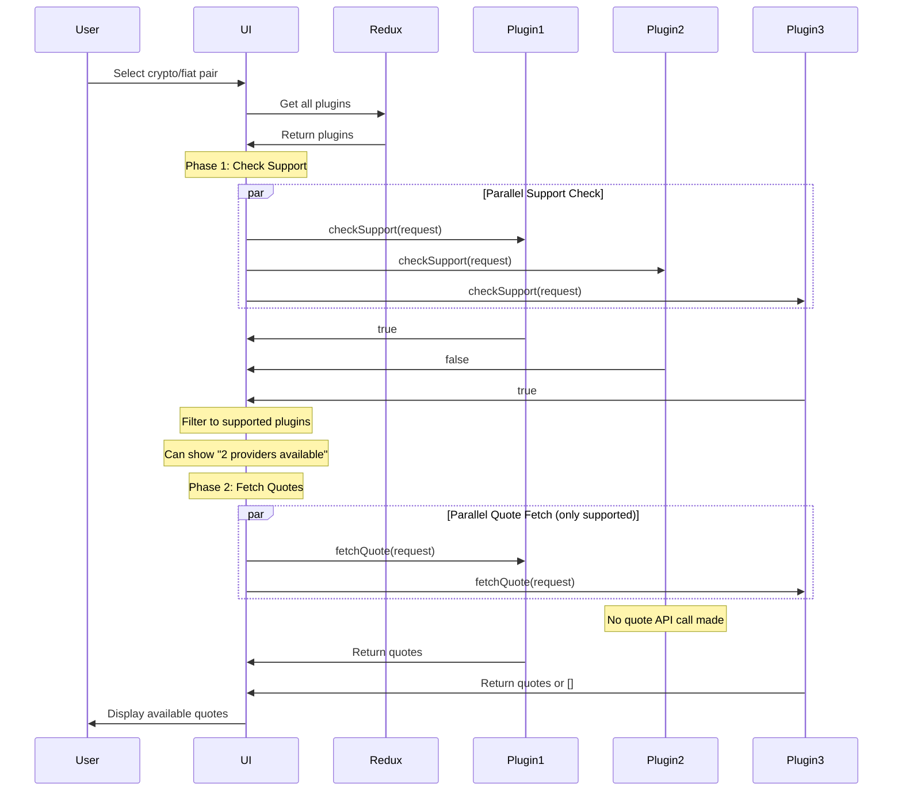

# Ramp Plugin Architecture

This document describes the hybrid two-method ramp plugin architecture for Edge React GUI, which combines fast support checking with streamlined quote fetching.

## Overview

The ramp plugin system provides a unified interface for integrating fiat on/off ramp providers (buy/sell cryptocurrency). The architecture uses a two-method approach that optimizes both user experience and API efficiency.

## Architecture Flow

### Previous Architecture (Complex)
1. User selects crypto/fiat pair
2. UI calls `useSupportedPlugins` hook
3. Hook calls `getSupportedAssets` on each plugin (with payment type complexity)
4. UI filters to only supported plugins
5. UI calls `fetchQuote` on supported plugins only
6. Display quotes to user

### Current Architecture (Two-Method Hybrid)
1. User selects crypto/fiat pair
2. UI calls `checkSupport` on all plugins in parallel
3. UI filters to only supported plugins
4. UI calls `fetchQuote` only on supported plugins
5. Display quotes to user

This hybrid approach provides immediate feedback about provider availability while minimizing unnecessary API calls.

## Plugin Interface

```typescript
export interface RampPlugin {
  readonly pluginId: string
  readonly rampInfo: RampInfo

  readonly checkSupport: (
    request: RampSupportRequest
  ) => Promise<boolean>

  readonly fetchQuote: (
    request: RampQuoteRequest,
    opts?: unknown
  ) => Promise<RampQuoteResult[]>
}
```

### Method Documentation

#### checkSupport
- **Purpose**: Quickly determine if a plugin supports a crypto/fiat pair
- **Returns**: `true` if supported, `false` otherwise
- **Note**: Should be fast and avoid expensive API calls when possible
- **Parameters**: Simple request with fiatCurrencyCode, tokenId, pluginId, regionCode, and direction

#### fetchQuote
- **Purpose**: Fetch actual quotes for supported pairs
- **Returns**: Array of quotes, or empty array `[]` if no quotes available
- **Note**: Only called after `checkSupport` returns `true`
- **Throws**: Only for actual API failures, not for "no quotes available"

## Implementation Guide

### Creating a Ramp Plugin

```typescript
export const myRampPlugin: RampPluginFactory = (config: RampPluginConfig) => {
  const { account, navigation, onLogEvent, disklet } = config
  
  const plugin: RampPlugin = {
    pluginId: 'myplugin',
    rampInfo: {
      partnerIcon: 'https://example.com/icon.png',
      pluginDisplayName: 'My Plugin'
    },
    
    checkSupport: async (request: RampSupportRequest): Promise<boolean> => {
      const {
        direction,
        regionCode,
        fiatCurrencyCode,
        tokenId,
        pluginId: currencyPluginId
      } = request
      
      // Quick checks without API calls
      if (!isRegionSupported(regionCode)) {
        return false
      }
      
      if (!isAssetSupported(currencyPluginId, tokenId)) {
        return false
      }
      
      if (!isFiatSupported(fiatCurrencyCode)) {
        return false
      }
      
      // All checks passed
      return true
    },
    
    fetchQuote: async (request: RampQuoteRequest): Promise<RampQuoteResult[]> => {
      const {
        direction,
        regionCode,
        fiatCurrencyCode,
        displayCurrencyCode,
        tokenId,
        pluginId: currencyPluginId
      } = request
      
      // Note: Support checking already done by checkSupport
      // This method focuses only on fetching quotes
      
      try {
        const quotes = await fetchFromProvider(request)
        return quotes.map(quote => convertToRampQuoteResult(quote))
      } catch (error) {
        // Return empty array for "no quotes" scenarios
        if (isNoQuotesError(error)) {
          return []
        }
        // Only throw for actual API failures
        console.error(`Failed to fetch quotes: ${error}`)
        throw error
      }
    }
  }
  
  return plugin
}
```

## UI Integration

### TradeCreateScene

```typescript
export const TradeCreateScene = () => {
  // Get all plugins directly from Redux
  const rampPlugins = useSelector(state => state.rampPlugins.plugins)
  const isPluginsLoading = useSelector(state => state.rampPlugins.isLoading)
  
  // Create support request (simpler than quote request)
  const rampSupportRequest: RampSupportRequest = {
    direction,
    regionCode,
    fiatCurrencyCode,
    tokenId,
    pluginId: currencyPluginId
  }
  
  // Check support on all plugins in parallel
  const { supportedPlugins, isCheckingSupport } = useSupportedPlugins({
    rampSupportRequest,
    plugins: rampPlugins
  })
  
  // Show immediate feedback if no providers available
  if (!isCheckingSupport && supportedPlugins.length === 0) {
    return <NoProvidersAvailable />
  }
  
  // Create quote request for supported plugins only
  const rampQuoteRequest: RampQuoteRequest = {
    // ... full request parameters including amounts
  }
  
  // Fetch quotes only from supported plugins
  const { quotes, isLoading, errors } = useRampQuotes({
    rampQuoteRequest,
    plugins: supportedPlugins
  })
  
  // Render UI
  return (
    // ... UI components
  )
}
```

### useSupportedPlugins Hook

The hook handles:
- Parallel support checking from all plugins
- Fast filtering to supported plugins only
- Caching support results for performance
- No unnecessary API calls for unsupported pairs

### useRampQuotes Hook

The hook handles:
- Parallel quote fetching from supported plugins only
- Filtering out empty results (no quotes available)
- Error handling and retry logic
- Quote expiration and refresh
- Result caching and deduplication

## Benefits of Two-Method Architecture

### Better User Experience
1. **Immediate Feedback**: Users see "no providers available" instantly without waiting for quote API calls
2. **Progressive Loading**: Show supported providers first, then load quotes
3. **Clear Communication**: Distinguish between "not supported" vs "loading quotes" vs "no quotes available"

### Reduced API Calls
1. **No Wasted Requests**: Never call quote APIs for unsupported pairs
2. **Lower Latency**: Support checks can use cached/local data without API calls
3. **Cost Savings**: Fewer API calls to third-party providers
4. **Better Rate Limiting**: Conserve API quota for actual quote requests

### Cleaner Separation of Concerns
1. **Simple Support Check**: `checkSupport` has one job - return true/false
2. **Focused Quote Fetching**: `fetchQuote` only deals with getting quotes
3. **No Payment Type Complexity**: Support checking doesn't need payment type arrays
4. **Easier Implementation**: Each method has clear, focused responsibility

### Performance Optimization
1. **Parallel Support Checks**: All plugins checked simultaneously
2. **Early Filtering**: Only fetch quotes from supported plugins
3. **Cacheable Support**: Support results can be cached longer than quotes
4. **Predictable Behavior**: Support rarely changes, quotes change frequently

### Developer Experience
1. **Easier Testing**: Test support logic separately from quote logic
2. **Better Error Handling**: Different error strategies for each method
3. **Simpler Types**: No complex `RampAssetMap` or payment type arrays
4. **Clear Intent**: Method names clearly indicate their purpose

## Migration from Legacy Architecture

See [Ramp Plugin Migration Guide](./ramp-plugin-migration-guide.md) for detailed migration instructions.

## Best Practices

### For checkSupport Method
1. **Fast Response**: Use local/cached data whenever possible, avoid API calls
2. **Simple Logic**: Return boolean only, no complex data structures
3. **Cache Results**: Support data changes infrequently, cache aggressively
4. **No Side Effects**: Pure function that only checks, doesn't modify state

### For fetchQuote Method
1. **Return Empty Array**: Return `[]` for "no quotes available" scenarios
2. **Only Throw on Errors**: Throw exceptions only for actual API failures
3. **Assume Support**: Don't recheck support - UI already filtered
4. **Include All Options**: Return all available payment methods in quotes

### General Guidelines
1. **Parallel Processing**: Both methods designed for parallel execution
2. **Error Logging**: Log errors for debugging but handle gracefully
3. **Type Safety**: Use TypeScript types for all requests/responses
4. **Performance First**: Optimize for speed, especially in `checkSupport`

## Example Quote Flow



### Key Advantages Illustrated

1. **Immediate Feedback**: After support check, UI can show "2 providers available"
2. **Efficient API Usage**: Plugin2 never makes a quote API call
3. **Better UX**: Users aren't left wondering if any providers support their selection
4. **Clear Phases**: Support checking is separate from quote fetching

## Plugin State Management

Plugins are initialized once when the app starts and stored in Redux:

```typescript
interface RampPluginState {
  readonly isLoading: boolean
  readonly plugins: Record<string, RampPlugin>
}
```

The `RampPluginManager` component handles:
- Loading plugin factories
- Initializing plugins with configuration
- Updating Redux state when ready

## Why This Hybrid Approach?

The two-method architecture combines the best aspects of both previous approaches:

### From the Complex Architecture (getSupportedAssets)
- ✅ **Immediate feedback** about provider availability
- ✅ **No wasted API calls** to unsupported providers
- ❌ ~~Complex payment type arrays~~
- ❌ ~~Confusing asset map structures~~

### From the Simplified Architecture (fetchQuote only)
- ✅ **Simple implementation** for plugin developers
- ✅ **Single source of truth** for quote data
- ❌ ~~No way to show "no providers" immediately~~
- ❌ ~~Unnecessary API calls to all providers~~

### The Best of Both Worlds
- **Simple boolean support check** instead of complex asset maps
- **Efficient API usage** by filtering before fetching quotes
- **Better user experience** with progressive loading states
- **Clean separation** between availability and pricing
- **Flexible caching strategies** for each method

## Migration from Legacy Architecture

See [Ramp Plugin Migration Guide](./ramp-plugin-migration-guide.md) for detailed migration instructions.

## Future Considerations

1. **Plugin Discovery**: Dynamic plugin loading based on user region
2. **Quote Caching**: Shared quote cache across plugins
3. **WebSocket Support**: Real-time quote updates
4. **Plugin Versioning**: Support for multiple plugin versions
5. **Analytics**: Unified analytics across all plugins
6. **Support Caching**: Intelligent caching of support results with TTL