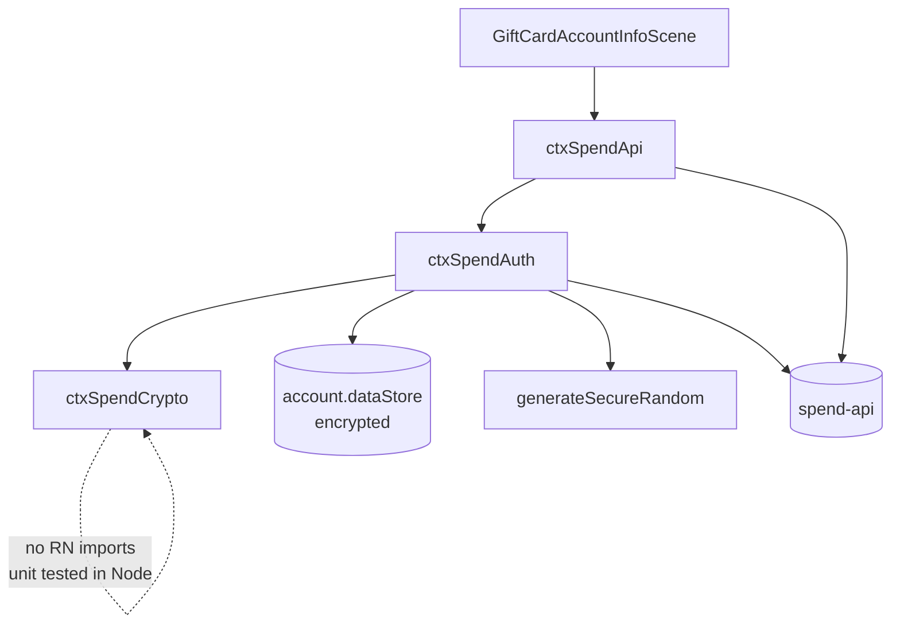
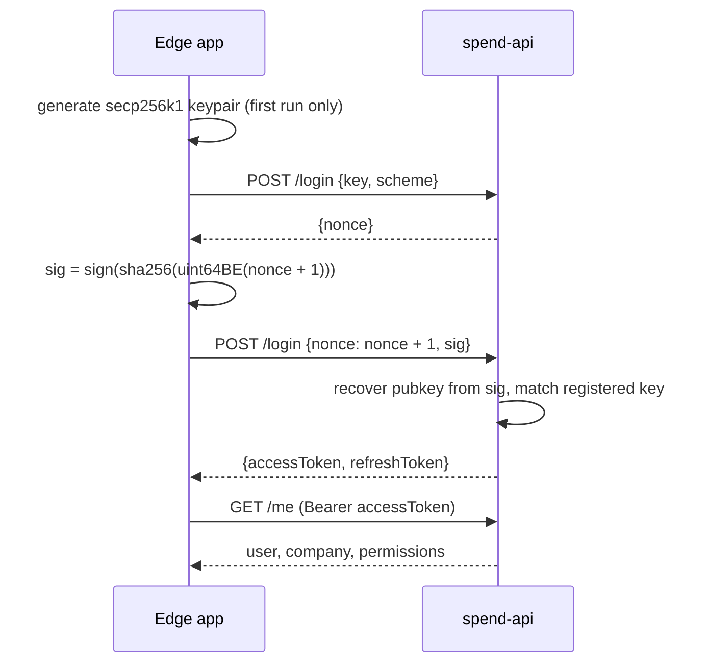

# CTX spend-api pubkey auth: an anonymous keypair identity for EdgeSpend

| | |
|---|---|
| Status | Implemented (prototype) |
| Author | Jon Tzeng |
| Reviewer | - |
| Last updated | 2026-09-04 |
| Repos | [edge-react-gui](https://github.com/EdgeApp/edge-react-gui) |
| Implementation | [EdgeApp/edge-react-gui#6147](https://github.com/EdgeApp/edge-react-gui/pull/6147) |
| Supersedes | - |
| Related | [CTX-com/spend-api-pubkey-auth-demo](https://github.com/CTX-com/spend-api-pubkey-auth-demo) |

CTX published a reference script for an anonymous [secp256k1](#secp256k1) register/login protocol against their spend-api. This document describes the client built from it in `edge-react-gui`, verified against `https://staging.spend.ctx.com` with the registered client id `edge`.

## Contents

1. [Problem](#1-problem)
2. [Prior art: the Phaze identity model](#2-prior-art-the-phaze-identity-model)
3. [Goals and non-goals](#3-goals-and-non-goals)
4. [Design overview](#4-design-overview)
5. [Detailed design: edge-react-gui](#5-detailed-design-edge-react-gui)
6. [Testing](#6-testing)
7. [Phase history](#7-phase-history)
8. [Decisions](#8-decisions)
9. [Glossary](#9-glossary)
10. [References](#10-references)
11. [Post-implementation retrospective](#11-post-implementation-retrospective)

## 1. Problem

EdgeSpend buys gift cards. Today that runs through one provider, Phaze, whose users are identified by a synthetic email address and a `userApiKey` the server issues at registration. [CTX](#ctx) offers a competing gift card API whose authentication works nothing like that: there is no email, no password, and no server-issued user secret. The client generates a [secp256k1](#secp256k1) keypair, registers the public key, and proves ownership by signing a server-issued [nonce](#nonce).

CTX shipped that flow as a single-file reference script. The script is explicit that it is documentation rather than a client library, and it discards its keypair on exit. Turning it into something the app can use means answering the questions the script deliberately leaves open: where the key lives, how it survives a relaunch, and what happens when a token expires.

The narrower problem this prototype answers is whether the protocol works from the app at all, and what a real client has to add on top of the reference script.

## 2. Prior art: the Phaze identity model

The existing gift card plugin already solves "give this Edge account a stable identity with a third-party provider", so the [CTX](#ctx) client follows its shape rather than inventing one.

Phaze registers a user under a generated address, `<uuid>@edge.app`, and stores the returned `userApiKey` in `account.dataStore` under the `phaze-prod` namespace, one item per identity keyed `identity-<uuid>`. The per-identity key matters: two devices on the same Edge account can register concurrently without either clobbering the other's record.

Two properties of that model do not carry over. Phaze's durable secret is issued by the server, so a lost local copy can be recovered by re-registering the same email. CTX's is generated by the client and never leaves it, so losing it loses the user outright. And Phaze deliberately supports identity rotation, exposed in the app as a way to burn an identity whose credentials were shown on screen. Rotation has no analogue here yet, because nothing in this prototype displays anything an attacker could redeem.

What does carry over is the storage layout, the light-account gate, and the "one item per identity" write discipline. All three are reused.

## 3. Goals and non-goals

Goals:

- Implement the register/login protocol so the wire format matches what the server verifies.
- Persist the keypair so the same anonymous [CTX](#ctx) user is recovered across launches and across devices synced to the same Edge account.
- Handle the access/refresh token lifecycle without the caller thinking about it.
- Read authenticated data from the app, proving the protocol end to end rather than in a script.
- Order a gift card and pay for it from an Edge wallet, so the purchase path is proven against a real on-chain payment rather than described.
- Keep the protocol crypto testable without a simulator or a network.

Non-goals:

- Replacing Phaze. The CTX client is added alongside it; the shipping purchase flow is untouched.
- Redeeming a card. The client orders and pays; reading back a barcode or code is not wired up.
- A CTX merchant-browsing UI. The prototype orders one fixed card from a developer surface rather than duplicating the Phaze market scenes for a second provider.
- A provider abstraction over both APIs. Phaze and CTX have incompatible identity models, and this prototype is the first implementation of the second one, so the shape of the right interface is not yet knowable. Guessing it now would be a rewrite later.
- Identity rotation, per the reasoning in [section 2](#2-prior-art-the-phaze-identity-model).

## 4. Design overview

The whole deliverable lands in one repo.

| Repo | Deliverable | Scope |
|---|---|---|
| edge-react-gui | The [CTX](#ctx) client and its in-app readout | [Section 5](#5-detailed-design-edge-react-gui) |

Four modules, split along one line: what needs React Native and what does not.



`ctxSpendCrypto` holds the protocol: [nonce](#nonce) hashing, signature encoding, [public key recovery](#public-key-recovery), and [JWT](#jwt) expiry parsing. It imports nothing from React Native, so jest exercises it directly. `ctxSpendAuth` owns the parts that cannot run in Node: entropy from the platform [CSPRNG](#csprng) and the encrypted dataStore. `ctxSpendApi` is the HTTP surface. The scene is the prototype's readout.

The login handshake:



The client signs `nonce + 1` rather than the nonce it was handed. Both legs are the same endpoint, told apart by which fields the body carries.

## 5. Detailed design: edge-react-gui

### 5.1 Protocol crypto

The digest is `sha256` of the [nonce](#nonce) encoded as a big-endian uint64. The signature is 65 bytes: a header byte, then R and S. The header is `27 + recoveryId + 4`, the format [btcec](#btcec)'s `RecoverCompact` reads, where the `+4` marks a compressed public key.

[`src/plugins/gift-cards/ctxSpendCrypto.ts`](https://github.com/EdgeApp/edge-react-gui/blob/ae4641733cc567735f88c655e5f736ff3e141c64/src/plugins/gift-cards/ctxSpendCrypto.ts)
```ts
export const signLoginNonce = (
  privateKey: Uint8Array,
  nonce: number
): string => {
  const signature = secp256k1.sign(makeLoginNonceHash(nonce), privateKey)
  const recoverable = new Uint8Array(65)
  recoverable[0] =
    RECOVERABLE_HEADER_BASE + signature.recovery + RECOVERABLE_HEADER_COMPRESSED
  recoverable.set(signature.toBytes('compact'), 1)
  return bytesToHex(recoverable)
}
```

The uint64 encoding avoids `BigInt`. The app's entry point installs a `big-integer` shim when the runtime has no native `BigInt`, and `DataView.setBigUint64` rejects that shim, so the reference script's `Buffer.writeBigUInt64BE` is not portable here. A byte loop over a `number` is exact for every value below 2^53, which the nonce counter will not reach, and the range is asserted rather than assumed:

[`src/plugins/gift-cards/ctxSpendCrypto.ts`](https://github.com/EdgeApp/edge-react-gui/blob/ae4641733cc567735f88c655e5f736ff3e141c64/src/plugins/gift-cards/ctxSpendCrypto.ts)
```ts
export const uint64BE = (value: number): Uint8Array => {
  if (!Number.isSafeInteger(value) || value < 0) {
    throw new Error(`CTX login nonce out of range: ${value}`)
  }
  const bytes = new Uint8Array(8)
  let remaining = value
  for (let index = 7; index >= 0; index--) {
    bytes[index] = remaining % 256
    remaining = Math.floor(remaining / 256)
  }
  return bytes
}
```

`recoverLoginPublicKeyHex` performs the same recovery the server does. Nothing in the request path calls it; it exists so the wire format can be checked in a unit test instead of by watching for an HTTP 200.

[JWT](#jwt) expiry is read by decoding the payload with [`base64url`](#base64url) from `rfc4648` and reading `exp`. The signature is not verified, since the client only needs to know when to refresh. Anything unparseable returns `undefined`, which the session treats as already expired.

### 5.2 Identity and persistence

The keypair is the [CTX](#ctx) account. It is generated on first use and written to `account.dataStore` under the `ctx-spend` namespace, keyed `identity-<uuid>`, matching the Phaze layout described in [section 2](#2-prior-art-the-phaze-identity-model). Tokens are derived state and are never written.

Entropy comes from `generateSecureRandom`, the source `makeUuid` already uses. A random 32-byte string outside the curve order is vanishingly unlikely, but the draw is validated and retried rather than trusted:

[`src/plugins/gift-cards/ctxSpendAuth.ts`](https://github.com/EdgeApp/edge-react-gui/blob/ae4641733cc567735f88c655e5f736ff3e141c64/src/plugins/gift-cards/ctxSpendAuth.ts)
```ts
const generatePrivateKey = async (): Promise<Uint8Array> => {
  for (let attempt = 0; attempt < 8; attempt++) {
    const candidate = await generateSecureRandom(CTX_SPEND_PRIVATE_KEY_LENGTH)
    if (isValidPrivateKey(candidate)) return candidate
  }
  throw new Error('Unable to generate a valid CTX spend private key')
}
```

Light accounts get no CTX identity. They have no encrypted store, and a key that cannot be persisted is a user lost at next launch. `ensureIdentity` returns `light-account` for them, which the scene renders as an explanation rather than an error.

`ensureIdentity` collapses concurrent callers onto a single load, the same way [section 5.3](#53-token-lifecycle) does for the handshake. The scene can call it from two places at once (the connect action and the purchase action), and on a first run two racing callers would each generate and persist a keypair and then overwrite the in-memory one, stranding whichever CTX user lost. With no server-side recovery, that loss is permanent, so the guard is at the session rather than in the caller.

A stored record whose private key is unusable is skipped rather than surfaced, and a new identity is created in its place. Unusable covers both an out-of-range scalar and malformed hex, since the cleaner only requires a string and `hexToBytes` throws on odd-length or non-hex input. The alternative is an account permanently unable to reach CTX because of one bad write.

Everything else that can go wrong throws, and that distinction changes behaviour rather than style. See [decision 8.6](#86-read-and-write-failures-throw-rather-than-reading-as-no-identity).

### 5.3 Token lifecycle

`getAccessToken` is the only entry point, and it hides three cases behind one call: the cached token is still good, the refresh token can mint a new pair, or the keypair has to run a full login. Access tokens last about 8 hours and refresh tokens about 90 days, both read off the live staging JWTs.

Refresh is attempted first when any token pair is held, and a failure falls through to a full login rather than propagating. The keypair can always mint a new pair, so a dead refresh token is a recoverable state, not an error.

Concurrent callers collapse onto a single handshake:

[`src/plugins/gift-cards/ctxSpendAuth.ts`](https://github.com/EdgeApp/edge-react-gui/blob/ae4641733cc567735f88c655e5f736ff3e141c64/src/plugins/gift-cards/ctxSpendAuth.ts)
```ts
      pendingAuth ??= authenticate().finally(() => {
        pendingAuth = undefined
      })
      return await pendingAuth
```

Without that, two parallel first-time calls would each run the two-leg login, and the second `POST /login` would consume a second nonce and overwrite the first caller's tokens.

The client refreshes a minute before the token's own expiry so a request never races the boundary. Separately, `ctxSpendApi` retries once through a re-authentication on a `401`, covering a token the server retires early.

### 5.4 Configuration

`PLUGIN_API_KEYS.ctxSpend` carries `clientId` and `baseUrl`. There is no API key. The `X-Client-Id` header identifies the application and has to be registered server-side, and the keypair identifies the user within it, so an unregistered client id fails at the first `POST /login`.

### 5.5 Ordering and paying

A card and its payment are one object. `POST /gift-cards` with a merchant, a fiat amount, and a `cryptoCurrency` returns the card already carrying a single-use `paymentCryptoAddress`, the crypto amount quoted at `rate`, and the chain and network to pay on. Nothing is reserved by paying; the card simply moves from `unpaid` once the payment confirms.

The client's job between those two points is to pick the wallet. CTX names the chain and network separately (`ETH` plus `testnet`) while Edge models each network as its own currency plugin, so the pair is mapped to a plugin id and the account's wallet for it is looked up:

[`src/plugins/gift-cards/ctxSpendPurchase.ts`](https://github.com/EdgeApp/edge-react-gui/blob/ae4641733cc567735f88c655e5f736ff3e141c64/src/plugins/gift-cards/ctxSpendPurchase.ts)
```ts
const CTX_CHAIN_TO_PLUGIN_ID: Record<string, Record<string, string>> = {
  BCH: { mainnet: 'bitcoincash' },
  BTC: { mainnet: 'bitcoin' },
  DASH: { mainnet: 'dash' },
  ETH: { mainnet: 'ethereum', testnet: 'sepolia' },
  LTC: { mainnet: 'litecoin' },
  XLM: { mainnet: 'stellar' },
  XMR: { mainnet: 'monero' },
  ZANO: { mainnet: 'zano' },
  ZEC: { mainnet: 'zcash' }
}
```

Every chain code in that table was read back from a real `POST /gift-cards` response, one order per `cryptoCurrency`, rather than transcribed from a currency list. The testnet column stays almost empty on purpose: staging quotes all nine on testnet, and [sepolia](#sepolia) is the only testnet plugin Edge ships ([decision 8.7](#87-pay-the-testnet-quote-from-sepolia-the-only-testnet-wallet-edge-has)).

The same discovery pass turned up a payment the table alone would mishandle. A token quote splits the pair: `paymentCryptoChain` stays `ETH` while `paymentCryptoCurrency` becomes `ETH.USDC`, and the payment URI is an ERC-20 transfer. Both the wallet lookup and the native-amount conversion key off the chain alone, so a `0.010000` USDC quote reaching them would resolve the ethereum wallet and multiply by its eighteen-decimal NATIVE multiplier, sending 0.01 ETH for a one-cent card. `isCtxNativePayment` rejects any quote whose currency differs from its chain, so a token quote fails loudly instead.

The quoted amount is decimal, and the spend needs native units, so the conversion goes through `biggystring`. A twelve-decimal quote times an eighteen-decimal multiplier is well outside what a double holds exactly, and rounding the wrong way underpays a single-use address:

[`src/plugins/gift-cards/ctxSpendPurchase.ts`](https://github.com/EdgeApp/edge-react-gui/blob/ae4641733cc567735f88c655e5f736ff3e141c64/src/plugins/gift-cards/ctxSpendPurchase.ts)
```ts
export const getCtxPaymentNativeAmount = (
  giftCard: CtxSpendGiftCard,
  wallet: EdgeCurrencyWallet
): string => {
  const { paymentCryptoAmount } = giftCard
  if (paymentCryptoAmount == null) {
    throw new Error('CTX gift card has no payment amount')
  }
  const multiplier = wallet.currencyInfo.denominations[0]?.multiplier ?? '1'
  // The quote is exact and the address is single-use, so pay it verbatim.
  // `ceil` only guards a quote carrying more decimals than the chain has:
  // rounding down there would underpay and leave the card unfulfilled.
  return ceil(mul(paymentCryptoAmount, multiplier), 0)
}
```

Payment itself reuses the app's ordinary send scene with the address, amount, and wallet tiles locked, which is how the Phaze flow already pays for its orders. After the send returns, the card is polled with `GET /gift-cards/{id}`.

The card carries two independent status tracks, and conflating them would misreport the outcome:

| Track | Progression | Who moves it |
|---|---|---|
| `paymentStatus` | `unpaid` to `paid`, a couple of minutes after the send | CTX, on chain confirmation |
| `fulfilmentStatus` | `pending` to `ordered`, then on to an issued code | CTX and the merchant |

The rolled-up `displayStatus` is the track [CTX](#ctx)'s own state machine describes, and it is the one the client's predicates read:

| Status | Meaning |
|---|---|
| `unpaid` | ordered, payment address not yet funded |
| `paid` | payment credited, merchant has not issued yet |
| `fulfilled` | terminal success |
| `rejected` | failed, and may still move on to `refunded` |
| `refunded` | terminal |

Two consequences the client encodes. `rejected` is a failure but NOT terminal, so it does not stop the poll; only `fulfilled` and `refunded` do. And the two halves run at different orders of magnitude, so the poll runs at 5s until `paid` and backs off to 30s afterwards: fulfilment is the merchant's and can outlast the session, and CTX rate-limits hard enough that a 5s poll waiting out a merchant is pure waste.

### 5.7 Redemption

Redemption does not work through a path the client builds. A `fulfilled` card carries `redeemUrl` and `barcodeUrl`, and each embeds its own [JWT](#jwt), distinct from the session token; CTX mails the same links to the cardholder. The client follows those links.

This is what a hand-built path gets instead:

```
GET /me                          200
GET /gift-cards/{id}/barcode     401 {"error":"token invalid"}
GET /me                          200
GET /gift-cards/{id}             200
```

The same session token succeeds on either side of the 401, which rules out expiry and rate limiting and pins the rejection to those routes. `GET /gift-cards/{id}/code` answers 404 rather than 401, so the 401-versus-404 split is itself the evidence that `barcode` and `redeem` exist behind different auth. Confirmed by CTX after the fact, which is why the cleaner carries the two URL fields and the client constructs nothing.

### 5.6 In-app surface

`GiftCardAccountInfoScene` is the existing developer-facing readout for this plugin, reachable from developer settings. It gains a section that establishes the identity, logs in, and displays the public key, user id, user name, company, permission count, and merchant catalog size. The work runs under `useQuery` and only on an explicit button press, so opening the scene costs no network.

## 6. Testing

1. `uint64BE` encodes big-endian across byte boundaries: 0, 1, 255, 256, 2^32, and `Number.MAX_SAFE_INTEGER`. Each expectation was cross-checked against `Buffer.writeBigUInt64BE`.
2. `uint64BE` rejects negatives, fractions, and values above the safe-integer range.
3. `makeLoginNonceHash(2)` equals `cd04a475…dce77f70`, computed independently with `node:crypto`.
4. `signLoginNonce` produces 65 bytes with a header byte in 31 to 34.
5. Signing is deterministic for a fixed key and [nonce](#nonce), and differs across nonces.
6. `recoverLoginPublicKeyHex` recovers the signing public key for nonces 1, 2, 42, and 65536. This is the test that proves the wire format: it performs the same recovery the server performs.
7. Recovery against the wrong nonce does not return the signing key.
8. Malformed signatures (wrong length, out-of-range header byte) throw.
9. `getJwtExpiryMs` reads `exp` from an unpadded [base64url](#base64url) payload and returns `undefined` for malformed tokens.
10. `isValidPrivateKey` accepts a valid scalar and rejects an all-zero key and a short buffer.

11. `getCtxPaymentPluginId` maps a testnet ETH quote to [`sepolia`](#sepolia) and a mainnet one to `ethereum`, and returns undefined for every chain Edge has no wallet type for.
12. `getCtxPaymentNativeAmount` converts the live quote `0.000005200000000000` to `5200000000000` wei, matching the `value` in [CTX](#ctx)'s own payment URI, and rounds up rather than down on a quote finer than the chain's smallest unit.
13. `isCtxGiftCardPaid` recognises `paid`, rejects `unpaid` and `pending`, and is not moved by an in-progress `fulfilmentStatus`.
14. Three concurrent `ensureIdentity` calls on a fresh account yield one keypair and one stored record, not three.
15. A second session over the same store recovers the same public key rather than creating another identity.
16. A [light account](#light-account) gets `light-account` and writes nothing.

17. `getCtxPaymentPluginId` resolves every mainnet chain [CTX](#ctx) quotes to its Edge plugin: BCH, BTC, DASH, ETH, LTC, XLM, XMR, ZANO and ZEC. The expectations are the chain codes read back from live orders, one per currency.
18. `isCtxNativePayment` accepts a plain chain quote, rejects an `ETH.USDC` token quote, and rejects a quote missing either half.
19. `isCtxGiftCardFulfilled` is true for `fulfilled` alone; `isCtxGiftCardFailed` is true for `rejected` and `refunded`; `isCtxGiftCardTerminal` excludes `rejected`, because a refund can still follow it.
20. The display-status predicates fall back to `status` when a payload carries no `displayStatus`.

Cases 1 to 20 run in jest, without a simulator or network. Live verification against staging is recorded in [section 11](#11-post-implementation-retrospective).

## 7. Phase history

### Phase 1: prototype

| Sketched | Shipped |
|---|---|
| Port the reference script's crypto | Ported, with two substitutions forced by the runtime: no `BigInt`, no `node:crypto` |
| Persist the keypair | `account.dataStore`, per-identity keys, Phaze layout |
| Token lifecycle | Cached access token, proactive refresh, login fallback, single-flight handshake, one `401` retry |
| Prove it in the app | Readout on `GiftCardAccountInfoScene` |

Deferred, with reasons: purchase and redemption (the read surface is what a prototype needs to establish), a shared provider interface over Phaze and [CTX](#ctx) ([section 3](#3-goals-and-non-goals)), and identity rotation ([section 2](#2-prior-art-the-phaze-identity-model)).

### Phase 2: purchase

| Sketched | Shipped |
|---|---|
| Order a card | `POST /gift-cards`, with the field names taken from the server's own validation errors |
| Pay for it | Chain-and-network to plugin-id mapping, `biggystring` native conversion, then the app's ordinary send scene |
| Confirm it | `GET /gift-cards/{id}` polled until fulfilment |

Phase 1 listed purchase as a non-goal and shipped a placeholder `asCtxSpendGiftCard` cleaner guessed from the permission names. That guess was wrong in every field except `id` and `status`, and this phase replaced it with the real order shape. The lesson generalises: the permission list named `giftcard:*` and `paymentmethod:*`, but the paths and payloads behind them could only be learned by asking the server.

One thing this phase could not settle: `fulfilmentStatus` reached `ordered` and stayed there for the rest of the run, so the terminal value is still unknown. An earlier revision of this phase shipped an `isCtxGiftCardFulfilled` helper asserting `fulfilled` or `complete`; neither string was ever observed, nothing called it, and it was removed rather than left as a guess wearing the shape of a fact.

Still deferred: redemption, a merchant-browsing UI, and the provider abstraction from [decision 8.3](#83-add-ctx-alongside-phaze-rather-than-behind-a-shared-provider-interface).

### Phase 3: what CTX answered

Phases 1 and 2 both ended on questions only [CTX](#ctx) could answer, and this phase spends their answers. Nothing here was designed; it was asked for, received, and encoded.

| Question carried out of phase 2 | Answer | What it changed |
|---|---|---|
| Terminal `fulfilmentStatus` values | The rolled-up display status runs `unpaid`, `paid`, `fulfilled`, `rejected`, `refunded` | The predicate deleted in phase 2 is back, against real values ([section 5.5](#55-ordering-and-paying)) |
| Why the redemption routes 401 | They take a JWT that CTX puts in `redeemUrl`/`barcodeUrl` on a fulfilled card, not the session token | The cleaner carries both URLs; the client builds no redemption path ([section 5.7](#57-redemption)) |
| Paths behind the `paymentmethod` and `merchantlink` grants | `paymentmethod:*` is for fiat rails; `merchantlink:list` backs the ordinary `/merchants` call and is not meant to be queried directly | Nothing. The 404s were correct, and the open question in [section 11](#11-post-implementation-retrospective) closes |
| Production access | The client exists but does not permit pubkey auth yet | Nothing yet. The mainnet half of the chain table is still unexercised |

The chain table grew from one entry to nine in the same pass, and the discovery that produced it found the token-payment overpay described in [section 5.5](#55-ordering-and-paying).

Still deferred, and now for one reason rather than several: everything left needs a production endpoint that accepts our keypair. That is redemption end to end, any mainnet payment, and the merchant-browsing UI.

## 8. Decisions

### 8.1 Persist the keypair in the encrypted dataStore, not the device keychain

The reference script generates a keypair per run and drops it. A real client has to keep it, and where it keeps it decides whether the [CTX](#ctx) user follows the Edge account or the device.

`account.dataStore` is encrypted and syncs with the Edge account, so the same CTX user is recovered on every device the account logs into. That matches how Phaze identities already behave, so the two providers have the same mental model.

Rejected: the device keychain. It survives reinstall but does not sync, so logging in on a second device would silently create a second anonymous CTX user with separate gift cards, and the first device's cards would be unreachable from the second. Rejected: unencrypted local storage, since the key is a bearer credential for the CTX account. Reopen if CTX adds server-side key recovery, which would make device-local storage cheap to get wrong in a recoverable way.

### 8.2 Hand-roll the uint64 encoding instead of using `Buffer` or `BigInt`

`index.ts` installs `global.BigInt = require('big-integer')` when the runtime lacks a native `BigInt`, and `DataView.setBigUint64` throws on that shim. The reference script's `Buffer.alloc(8).writeBigUInt64BE(BigInt(nonce))` therefore cannot be copied verbatim with confidence.

A byte loop over a `number` is exact below 2^53 and depends on nothing. The [nonce](#nonce) is a per-key counter that started at 1 on staging, so the range is not a practical constraint, and the function throws rather than silently truncating if it ever were.

Rejected: `Buffer`, which is polyfilled in the app but drags the same `BigInt` question along. Rejected: a `BigInt`-based implementation, for the shim above. Reopen if the app drops the shim and [Hermes](#hermes) guarantees native `BigInt`.

### 8.3 Add CTX alongside Phaze rather than behind a shared provider interface

The task asks for a prototype. Both providers sell gift cards, but their identity models have nothing in common: Phaze has a server-issued key tied to an email, CTX has a client-generated keypair with no recovery. Their catalog shapes differ too, with Phaze keyed by numeric `productId` and CTX by uuid `id`.

An interface drawn now would be drawn from one real implementation and one guess. Adding CTX as its own module keeps the shipping Phaze flow untouched and leaves the abstraction to be drawn once both sides are known. Reopen when CTX purchase is in scope, which is the point where duplicated flow logic starts to cost more than the abstraction.

### 8.4 Keep the protocol crypto free of React Native imports

`src/util/rnUtils.ts` states the constraint directly: modules with native imports cannot be used in unit tests that run in Node. Putting the wire format in a module with no React Native imports means the part with a strict external contract is the part covered by tests, and `recoverLoginPublicKeyHex` lets those tests check the encoding the way the server checks it.

Rejected: one module with the native pieces inlined, which would have pushed verification of the signature format onto live requests only.

### 8.5 Use the deprecated `Signature.recoverPublicKey` rather than the standalone

`@noble/curves` 1.9.7 deprecates `sig.recoverPublicKey(msg)` in favour of `curve.recoverPublicKey(sig.toBytes('recovered'), msg)`. The standalone exists at runtime and was confirmed to return the correct key, but the package types [`secp256k1`](#secp256k1) as `CurveFnWithCreate`, which does not declare it. Reaching it needs a cast that the repo's `no-any` rule forbids.

The deprecated instance method is typed, so the call sites keep their types and one lint suppression carries the reason. The other four deprecations in the same file (`sha256` import path, `toBytes('compact')`, `fromBytes`, `isValidSecretKey`) had typed modern replacements and were all migrated. Reopen on the upgrade to `@noble/curves` 2.x.

### 8.6 Read and write failures throw rather than reading as "no identity"

`ensureIdentity` returns a status for the one case that is a permanent property of the account (`light-account`) and throws for everything else. An earlier revision returned a bare boolean and swallowed dataStore errors, which produced two defects that a reviewer caught before merge.

A transient read failure became indistinguishable from a first run. The caller answers "no identity" by minting a keypair, so one failed `listItemIds` would have silently replaced the user's CTX identity, and CTX has no server-side recovery to get it back. A store that has never been written returns an empty list rather than throwing, so first run is still correctly the empty case without any catch.

The same boolean also conflated a [light account](#light-account) with a failed write, so an account whose keypair could not be saved was told it was a light account while the real error went unreported.

Rejected: a richer result type covering every failure. The failures worth distinguishing here are exactly one, and a thrown error already reaches the scene through the query's error path.

### 8.7 Pay the testnet quote from sepolia, the only testnet wallet Edge has

Staging quotes every asset on testnet: Monero on stagenet, Zcash and Bitcoin and Litecoin and Bitcoin Cash and Dash on their testnets, Zano and Stellar likewise, and Ether on [Sepolia](#sepolia) (chain id 11155111). Edge ships mainnet plugins for those chains and one testnet plugin, sepolia, so ETH is the only quote the app can actually pay.

That is a property of the staging environment, not of the design. The mapping table is keyed by network precisely so a mainnet CTX deployment resolves ETH to `ethereum` with no other change, and so an unpayable quote fails with a message naming the chain and network rather than silently picking the wrong wallet.

Rejected: adding testnet currency plugins to Edge so the other assets could be exercised. That is a large change to the app's currency set for the sake of one integration test, and it would ship testnet wallets to users.

## 9. Glossary

### secp256k1

The elliptic curve Bitcoin and Ethereum use for signatures. Here it is the curve the CTX identity keypair lives on, and the curve whose public key recovery lets the server learn who signed a nonce without being told. See [SEC 2](https://www.secg.org/sec2-v2.pdf).

### Public key recovery

A property of ECDSA on secp256k1: given a signature, the signed digest, and a small recovery id, the signer's public key can be computed. CTX relies on it so the second `/login` request carries only a signature, not a key. See [SEC 1, section 4.1.6](https://www.secg.org/sec1-v2.pdf).

### CTX

The company behind the spend-api this client talks to, and the vendor of the gift card catalog it reads. Their reference implementation of the auth protocol is [CTX-com/spend-api-pubkey-auth-demo](https://github.com/CTX-com/spend-api-pubkey-auth-demo).

### Nonce

A number used once. Here it is a per-key counter the server issues on the first `/login` leg, and the client signs `nonce + 1` to prove it holds the private key for the registered public key. See [RFC 4949](https://datatracker.ietf.org/doc/html/rfc4949#page-206).

### JWT

JSON Web Token. The access and refresh tokens the spend-api issues. The client decodes the payload to read the `exp` claim and never verifies the signature, which is the server's job. See [RFC 7519](https://datatracker.ietf.org/doc/html/rfc7519).

### base64url

The URL-safe base64 alphabet, unpadded in JWTs. See [RFC 4648, section 5](https://datatracker.ietf.org/doc/html/rfc4648#section-5).

### CSPRNG

Cryptographically secure pseudorandom number generator. The private key is drawn from the platform's, via `generateSecureRandom`. See [NIST SP 800-90A](https://csrc.nist.gov/pubs/sp/800/90/a/r1/final).

### Sepolia

Ethereum's current long-lived test network, chain id 11155111. Its Ether has no market value, which is what makes it usable for an integration test. Edge ships it as its own currency plugin (`sepolia`), separate from `ethereum`. See [the Ethereum documentation](https://ethereum.org/en/developers/docs/networks/#sepolia).

### Hermes

The JavaScript engine React Native runs on iOS and Android. Its `BigInt` support is the reason for [decision 8.2](#82-hand-roll-the-uint64-encoding-instead-of-using-buffer-or-bigint). See [the Hermes documentation](https://github.com/facebook/hermes).

### Light account

An Edge account with no username, created without credentials. It has no encrypted `dataStore`, so it cannot hold a CTX signing key. The gate this design reuses is the `account.username == null` check in [`phazeGiftCardProvider.ts`](https://github.com/EdgeApp/edge-react-gui/blob/develop/src/plugins/gift-cards/phazeGiftCardProvider.ts).

### btcec

The Go secp256k1 library whose `RecoverCompact` defines the 65-byte signature layout the spend-api expects. See [btcec](https://github.com/btcsuite/btcd/tree/master/btcec).

## 10. References

- [CTX-com/spend-api-pubkey-auth-demo](https://github.com/CTX-com/spend-api-pubkey-auth-demo), the reference implementation of the protocol.
- [@noble/curves](https://github.com/paulmillr/noble-curves), the [secp256k1](#secp256k1) implementation, already a dependency of this repo.

## 11. Post-implementation retrospective

### Estimate vs. actuals

| Item | Estimate | Actual |
|---|---|---|
| Endpoints implemented | 5 (`/login` x2, `/refresh-token`, `/me`, `/merchants`) | 6, adding `/gift-cards` |
| New npm dependencies | 0 | 0 |
| Unit test cases | ~6 | 13 |
| New source files | 4 | 4 |

### Where this document was wrong or silent

1. The reference script's crypto was expected to port unchanged. Two of its primitives did not: `Buffer.writeBigUInt64BE` and `node:crypto`'s `sha256`. Both were replaced, and [decision 8.2](#82-hand-roll-the-uint64-encoding-instead-of-using-buffer-or-bigint) records why the first one had to be.
2. The endpoint list was drawn from the permissions `GET /me` returns, which name `paymentmethod:*` and `merchantlink:list`. Probing staging showed `/payment-methods`, `/merchant-links`, and `/countries` all return 404, so a granted permission does not imply a discoverable path. CTX has since closed this: `paymentmethod:*` governs fiat rails, and `merchantlink:list` is what authorises the ordinary `/merchants` call rather than a `/merchant-links` resource of its own. There was never a path to find, so the inference in this item was the error, not the API.
3. Nothing in the design anticipated rate limiting. Staging returns `{"error":"rate limit reached"}` under a burst of sequential requests, and a probe needed roughly 2.5 seconds of spacing to stay clear. The cause is not volume: CTX aggressively drops the request budget for paths that do not match a route, as an anti-crawler defence. The probing that produced item 2 was therefore the very thing that tripped the limit. The client issues two requests per readout against real routes, so it does not hit this.
4. The design assumed a production deployment would be a configuration change. `PLUGIN_API_KEYS.ctxSpend` does carry `baseUrl`, so the client needs no edit, but the server side is not symmetric: `https://spend.ctx.com` with `CLIENT_ID=edge` answers the first `POST /login` leg with `400 {"error":"authentication method not allowed for this client"}` while the identical request against staging returns 200. Pubkey is an opt-in per client, and enabling a client is not the same as enabling the method on it. Every mainnet row of the chain table stays unexercised until that flips.

### What held

The Phaze identity layout transferred without modification: same `dataStore` namespacing, same per-identity keys, same light-account gate. Splitting the protocol crypto away from the React Native imports ([decision 8.4](#84-keep-the-protocol-crypto-free-of-react-native-imports)) paid off immediately, since the wire format was verified in jest before the app was ever built.

### Verification highlights

- The reference script, run against `https://staging.spend.ctx.com` with `CLIENT_ID=edge`, completes the full lifecycle: register, [nonce](#nonce), sign, tokens, `/me`, refresh, re-login. It authenticated as company "Edge" with 12 gift-card-scoped permissions.
- The replacement primitives were diffed against the reference script's before being written into the app: `uint64BE` and `sha256` match `Buffer.writeBigUInt64BE` plus `node:crypto` byte for byte across 7 values, including `Number.MAX_SAFE_INTEGER`.
- A live `POST /login` signed with those replacement primitives returned HTTP 200 with a token pair, and the local recovery round-trip returned the signing public key.
- `GET /merchants` returns 118 merchants against staging. Token lifetimes read off the live JWTs are about 8 hours for access and 90 days for refresh.
- 13 jest cases pass ([section 6](#6-testing)); `tsc --noEmit` is clean; the repo's full 536-case suite passes.
- Driven in the app on an iOS 18.6 simulator against staging. The app generated its own keypair, registered it, and read `/me` and `/merchants`: public key `032129df…bd97c8d`, user `99eb4fe5-b3ff-4355-8ad3-b84f06d1cb5d`, company Edge, 12 permissions, 118 merchants. The server named the anonymous user `Anon 032129df` after the public key's own prefix, which is independent confirmation that the key the app generated is the key the server registered.
- Persistence was verified by a full app stop and relaunch, after which the same user id and the same public key came back, so the keypair was reloaded from the encrypted `dataStore` rather than regenerated.
