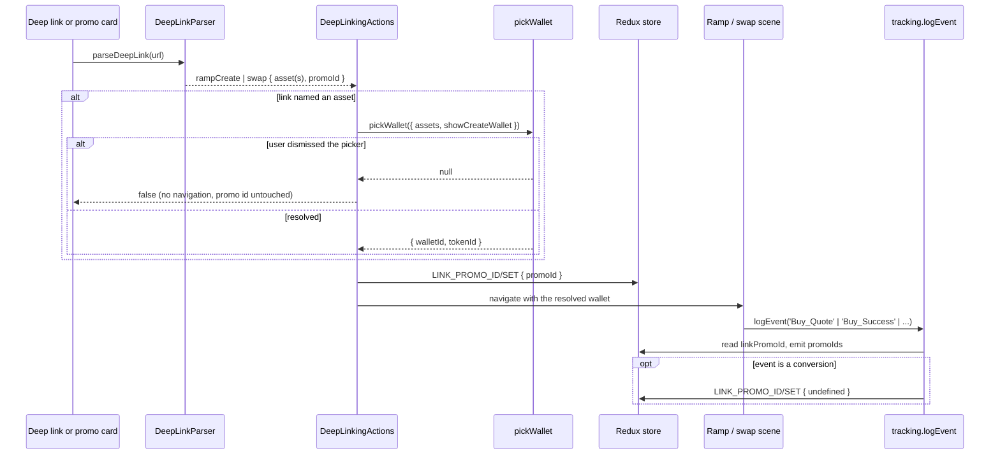
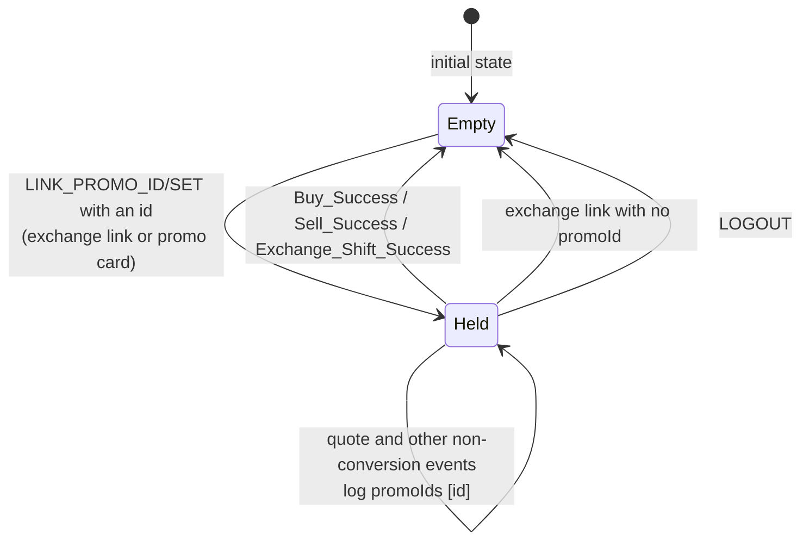

# Exchange deep links: pre-selected assets and link-scoped promo attribution

| | |
|---|---|
| Status | Implemented |
| Author | Jon Tzeng |
| Reviewer | - |
| Last updated | 2026-09-08 |
| Repos | [edge-react-gui](https://github.com/EdgeApp/edge-react-gui) |
| Implementation | [EdgeApp/edge-react-gui#6199](https://github.com/EdgeApp/edge-react-gui/pull/6199) |
| Supersedes | - |
| Related | [Asana: Deeplink - New format](https://app.asana.com/0/1215088146871429/1210180856778864) |

<!-- tdd-code-fingerprint: 537152b2b6e63a206c9fee52791270a7fdccfbfa -->

File and symbol references point at the `jon/deeplink-new-format` branch of edge-react-gui, pinned per code block. Direction came from the task description (growth's campaign-tracking request) and the operator's ruling on it.

## Contents

1. [Problem](#1-problem)
2. [Prior art](#2-prior-art)
3. [Goals and non-goals](#3-goals-and-non-goals)
4. [Design overview](#4-design-overview)
   - [4.1 Link grammar and parsing](#41-link-grammar-and-parsing)
   - [4.2 Wallet resolution and navigation](#42-wallet-resolution-and-navigation)
   - [4.3 The link-scoped promo id](#43-the-link-scoped-promo-id)
   - [4.4 Promo cards as link sources](#44-promo-cards-as-link-sources)
   - [4.5 Outcomes](#45-outcomes)
5. [Testing](#5-testing)
6. [Phase history](#6-phase-history)
7. [Decisions](#7-decisions)
8. [Glossary](#8-glossary)
9. [References](#9-references)
10. [Post-implementation retrospective](#10-post-implementation-retrospective)

## 1. Problem

Growth runs campaigns that push users toward a specific buy, sell or swap, and wants to measure how much of the resulting volume each campaign produced.

A campaign link could open a flow but not choose an asset. `edge://buy`, `edge://sell` and `edge://swap` navigate to the scene and stop, so a "swap into bitcoin" campaign landed the user on an empty picker and asked them to redo the selection the ad had already made.

Attribution could not follow one entry into a flow either. Conversion events read `params.promoIds` from [`accountReferral`](#accountreferral)'s `activePromotions`, which is durable account state written by `activatePromotion`. An in-app promo card had a [`promoId`](#promoid), but `getDisplayInfoCards` dropped it before the card reached the render path, so a card could not attribute its own conversion; and an external link had no way to name a promo id at all short of the `?af=` affiliate form, which permanently writes the account referral state.

## 2. Prior art

`edge://buy[/<providerId>[/<paymentType>]]` already pins a [ramp](#ramp) provider and payment type for one navigation. The pin lives in navigation params, nothing is written to the account, and a pin that matches no quote degrades to the normal ordering. That link-scoped shape is the model this design follows for both the asset and the promo id.

The `?af=<installerId>` query on the `https://deep.edge.app` form parses as an `affiliate` wrapper, calls `activatePromotion`, and writes the installer id into account referral state. That is durable attribution for the lifetime of the account, and the wrong instrument for "credit this one visit to the scene".

`edge://swap` navigated to `swapCreate` with no params and a code comment reserving query parameters for later. This design is that later.

Extending the three existing hosts was rejected; see [decision 7.1](#71-a-new-exchange-host-rather-than-extending-the-existing-ones).

## 3. Goals and non-goals

Goals:

- Parse `https://deep.edge.app/exchange/<buy|sell|swap>?buyAsset=&sellAsset=&promoId=` and its `edge://exchange/...` equivalent.
- Pre-select the named asset's wallet, offering wallet creation when the account holds none.
- Attribute the next conversion to the link's promo id, overriding the account's own promotions for that one entry, then retire it.
- Let promo cards in the home carousel and the notification center launch these links in-app, carrying the card's own promo id.

Non-goals:

- Currency-code asset specs (`USDC`, `ETH`). The format takes a [pluginId](#pluginid) and a [tokenId](#tokenid). See [follow-up 10.2](#102-where-this-document-was-wrong-or-silent).
- Persisting a link promo id into [accountReferral](#accountreferral). The id is deliberately session-only and per-entry.
- Pinning a [ramp](#ramp) provider or payment type from an `exchange` link. `edge://buy/<providerId>/<paymentType>` still owns that.
- Pre-selecting more than the two sides a swap has.

## 4. Design overview

A link travels through four stages: the parser turns a URL into a typed link, the handler resolves each named asset to a wallet, navigation carries the wallet into the scene, and a redux slice carries the promo id to whichever [conversion event](#conversion-event) fires next.



### 4.1 Link grammar and parsing

The `exchange` host takes the direction as its single path segment and everything else as query parameters:

```
edge://exchange/buy?buyAsset=<spec>[&promoId=<id>]
edge://exchange/sell?sellAsset=<spec>[&promoId=<id>]
edge://exchange/swap[?buyAsset=<spec>][&sellAsset=<spec>][&promoId=<id>]
```

An asset `<spec>` is `<pluginId>[_<tokenId>]`: `bitcoin`, `arbitrum`, `ethereum_0xA0b86991c6218b36c1d19D4a2e9Eb0cE3606eB48`. Both URL forms share one parser, so the `https://deep.edge.app` links growth authors and the `edge://` scheme the app registers behave identically.

`buy` and `sell` produce the existing `rampCreate` link type with two new optional fields; `swap` produces the existing `swap` type with three. Each direction reads only the asset on its own side, because the other side of a [ramp](#ramp) is the user's fiat and has no wallet to select.

[`src/types/DeepLinkTypes.ts`](https://github.com/EdgeApp/edge-react-gui/blob/7f55f8a98d2f3193e0cc92c8d4a28608938a0c4a/src/types/DeepLinkTypes.ts)
```typescript
export interface RampCreateLink {
  type: 'rampCreate'
  direction: FiatDirection
  providerId?: string
  paymentType?: FiatPaymentType
  asset?: EdgeAsset
  promoId?: string
}

export interface SwapLink {
  type: 'swap'
  buyAsset?: EdgeAsset
  sellAsset?: EdgeAsset
  promoId?: string
}
```

Asset resolution splits on the first underscore, and normalizes only the token-id form that needs it:

[`src/util/DeepLinkParser.ts`](https://github.com/EdgeApp/edge-react-gui/blob/7f55f8a98d2f3193e0cc92c8d4a28608938a0c4a/src/util/DeepLinkParser.ts)
```typescript
function parseOptionalAsset(spec: string | null): EdgeAsset | undefined {
  if (spec == null || spec === '') return undefined

  const separatorIndex = spec.indexOf('_')
  if (separatorIndex < 0) return { pluginId: spec, tokenId: null }

  const pluginId = spec.slice(0, separatorIndex)
  const rawTokenId = spec.slice(separatorIndex + 1)
  if (pluginId === '' || rawTokenId === '') {
    console.warn(`Ignoring malformed deep link asset: ${spec}`)
    return undefined
  }
  return { pluginId, tokenId: normalizeTokenId(rawTokenId) }
}

function normalizeTokenId(tokenId: string): string {
  return /^0x[0-9a-fA-F]+$/.test(tokenId)
    ? tokenId.slice(2).toLowerCase()
    : tokenId
}
```

An unknown direction is rejected by `asFiatDirection`, which throws and leaves the URL unhandled: there is no flow to open, so degrading would land the user somewhere they did not ask for. A malformed asset spec degrades instead, dropping the pre-selection while still opening the flow. Both calls are covered by [decision 7.4](#74-malformed-assets-degrade-unknown-directions-do-not).

### 4.2 Wallet resolution and navigation

`getDeepLinkReadiness` decides how much account state a link needs before it can run. An `exchange` link that names an asset opens the wallet picker, so it waits for `'wallets'`; one that names none only navigates, so `'account'` is enough. Getting this wrong would fire the picker against a half-loaded wallet list right after login.

One helper covers every asset a link can name, on both link types:

[`src/actions/DeepLinkingActions.tsx`](https://github.com/EdgeApp/edge-react-gui/blob/7f55f8a98d2f3193e0cc92c8d4a28608938a0c4a/src/actions/DeepLinkingActions.tsx)
```typescript
async function pickLinkedWallet(
  account: EdgeAccount,
  navigation: Parameters<typeof pickWallet>[0]['navigation'],
  asset: EdgeAsset | undefined
): Promise<WalletListWalletResult | undefined | null> {
  if (asset == null) return undefined

  const result = await pickWallet({
    account,
    assets: [asset],
    navigation,
    showCreateWallet: true
  })
  return result?.type === 'wallet' ? result : null
}
```

The three-valued return is what lets one call site distinguish "the link named nothing" from "the user backed out". `pickWallet` auto-picks when exactly one of the account's wallets matches the asset and shows the modal otherwise, including the zero-match case, where `showCreateWallet` turns the modal into the create-wallet path. This matches how the `rewards` link already resolves assets.

A `null` propagates out of `handleLink` as `false`, which is why `handleLink` and `launchDeepLink` now return a boolean rather than `void`. Nothing navigates and no promo id is stored, so a dismissed picker leaves no trace. The one caller that acts on `false` is the notification center, in [section 4.4](#44-promo-cards-as-link-sources).

For `rampCreate`, the resolved wallet rides into the scene as the `forcedWalletResult` navigation param that `RampCreateScene` already reads, where it takes precedence over the user's last selection:

[`src/components/scenes/RampCreateScene.tsx`](https://github.com/EdgeApp/edge-react-gui/blob/7f55f8a98d2f3193e0cc92c8d4a28608938a0c4a/src/components/scenes/RampCreateScene.tsx)
```typescript
const selectedCrypto = forcedWalletResult ?? rampLastCryptoSelection
```

Because it wins over the last selection, leaving it set would override the user's own wallet choice for the rest of the session. The scene's existing tab-blur listener already cleared the provider and payment-type pins; `forcedWalletResult` joins them, and the listener's early-return guard grows a third condition so a user who never tapped a deep link still pays no params update on tab switches.

For `swap`, both sides are resolved before either is used, and the navigation params are omitted entirely when the link named no asset. Passing `undefined` wallet ids would blank a selection the user had already made on the swap scene, which a bare `edge://swap` used to preserve.

### 4.3 The link-scoped promo id

The id lives in its own root reducer slice rather than in [accountReferral](#accountreferral):

[`src/reducers/RootReducer.ts`](https://github.com/EdgeApp/edge-react-gui/blob/7f55f8a98d2f3193e0cc92c8d4a28608938a0c4a/src/reducers/RootReducer.ts)
```typescript
linkPromoId: (state: string | null = null, action: Action): string | null => {
  switch (action.type) {
    case 'LINK_PROMO_ID/SET':
      return action.data.promoId ?? null
    case 'LOGOUT':
      return null
    default:
      return state
  }
}
```

`LINK_PROMO_ID/SET` carries `string | undefined` and the reducer coalesces to `null`, so one action both sets and clears. Every `exchange` navigation dispatches it, which means a link with no promo id actively clears whatever a previous link left behind. `LOGOUT` clears it too, so an id cannot cross an account switch.



Reading it inside `logEvent` is what makes one write cover every conversion path. Seven ramp providers plus `SwapConfirmationScene` call `onLogEvent` directly, and all of them funnel through `logEvent`, so the override and the retirement each need exactly one edit:

[`src/util/tracking.ts`](https://github.com/EdgeApp/edge-react-gui/blob/7f55f8a98d2f3193e0cc92c8d4a28608938a0c4a/src/util/tracking.ts)
```typescript
const { linkPromoId } = state
params.promoIds =
  linkPromoId == null ? accountReferral.activePromotions : [linkPromoId]
```

Retirement happens after the event is dispatched to the backends, gated on the event being one of the three that mean the campaign has been credited:

[`src/util/tracking.ts`](https://github.com/EdgeApp/edge-react-gui/blob/7f55f8a98d2f3193e0cc92c8d4a28608938a0c4a/src/util/tracking.ts)
```typescript
const CONVERSION_EVENTS: TrackingEventName[] = [
  'Buy_Success',
  'Sell_Success',
  'Exchange_Shift_Success'
]
```

Non-conversion events (`Buy_Quote` and the rest) read the id without consuming it, so an abandoned quote does not spend the attribution.

### 4.4 Promo cards as link sources

A card's [`promoId`](#promoid) reaches the launch path through `DisplayInfoCard`. `filterInfoCards` already read the field to gate a card to affiliated accounts, but `getDisplayInfoCards` did not copy it onto the display object, so the render path could not see it. Adding it there makes it available to both card surfaces, and `addPromoCardToNotifications` carries it into the stored `NotifInfo` so the notification-center copy of a card attributes the same campaign as the carousel copy. The cleaner gained `promoId: asMaybe(asString)`, which keeps older stored notifications parsing.

`linkReferralWithCurrencies` takes the card's promo id as a third argument and stamps it onto the parsed link before launch:

[`src/actions/WalletListActions.tsx`](https://github.com/EdgeApp/edge-react-gui/blob/7f55f8a98d2f3193e0cc92c8d4a28608938a0c4a/src/actions/WalletListActions.tsx)
```typescript
function withCardPromoId(
  link: DeepLink,
  promoId: string | undefined
): DeepLink {
  if (promoId == null || promoId === '') return link

  switch (link.type) {
    case 'rampCreate':
    case 'swap':
      return link.promoId == null ? { ...link, promoId } : link
    case 'affiliate':
      return { ...link, link: withCardPromoId(link.link, promoId) }
    case 'marketing':
      return link.link == null
        ? link
        : { ...link, link: withCardPromoId(link.link, promoId) }
    default:
      return link
  }
}
```

The `link.promoId == null` guard is the precedence rule from [decision 7.3](#73-a-url-promo-id-beats-the-cards-own): a promo id already in the URL survives. The `affiliate` and `marketing` cases exist because a card whose call-to-action carries `?af=` or a campaign wrapper parses as a wrapper around the link that actually opens the flow, and the stamp has to reach through it.

The notification center previously sent every card call-to-action straight to `openBrowserUri`, which meant an `edge://exchange/...` card in that surface opened a browser. It now routes through `linkReferralWithCurrencies` like the carousel does; a non-Edge URL still ends up at `Linking.openURL` through that function's own `type === 'other'` fallback. The scene also completes the notification only when the launch returned `true`, so backing out of the wallet picker no longer retires the promo unread.

### 4.5 Outcomes

Reachable entry configurations and what each produces. Rows follow from [4.1](#41-link-grammar-and-parsing) through [4.4](#44-promo-cards-as-link-sources); where this table and those sections disagree, the sections are correct.

| Entry | Wallet picker | Lands on | `linkPromoId` after | `promoIds` on the next conversion |
|---|---|---|---|---|
| `exchange/buy?buyAsset=bitcoin`, several bitcoin wallets | modal | buy flow, wallet forced | `null` | account promotions |
| `exchange/buy?buyAsset=bitcoin`, exactly one bitcoin wallet | auto-picked, no modal | buy flow, wallet forced | `null` | account promotions |
| `exchange/buy?buyAsset=bitcoin`, no bitcoin wallet | modal in create-wallet mode | buy flow after creation | `null` | account promotions |
| `exchange/buy?buyAsset=bitcoin&promoId=bob` | as above | buy flow, wallet forced | `"bob"` | `["bob"]` |
| `exchange/buy` (no asset) | none | buy flow, no wallet forced | `null` | account promotions |
| `exchange/buy?sellAsset=ethereum` | none | buy flow, no wallet forced | `null` | account promotions |
| `exchange/swap?buyAsset=X&sellAsset=Y` | one per side | swap scene, both sides set | `null` | account promotions |
| `exchange/swap?sellAsset=Y` | sell side only | swap scene, buy side cleared | `null` | account promotions |
| `exchange/swap` (no assets) | none | swap scene, selection preserved | `null` | account promotions |
| Card call-to-action `exchange/buy?buyAsset=X`, card `promoId=card1` | as above | buy flow, wallet forced | `"card1"` | `["card1"]` |
| Card call-to-action `exchange/buy?...&promoId=url1`, card `promoId=card1` | as above | buy flow, wallet forced | `"url1"` | `["url1"]` |
| Card call-to-action to a non-Edge URL | none | external browser | unchanged | unchanged |
| Any of the above, picker dismissed | modal, dismissed | nothing, caller unchanged | unchanged | unchanged |
| `exchange/swap?sellAsset=ethereum_` (malformed) | none | swap scene, no pre-selection | `null` | account promotions |
| `exchange/lend?buyAsset=bitcoin` (unknown direction) | none | link unhandled | unchanged | unchanged |
| Legacy `edge://swap`, `edge://buy/<provider>/<type>` | none | unchanged behavior | unchanged | unchanged |

## 5. Testing

Automated coverage is 128 cases in `src/__tests__/DeepLink.test.ts` (17 of them new for `exchange`) plus 4 in `src/__tests__/reducers/RootReducer.test.ts`.

1. Both URL forms parse to the same link. `https://deep.edge.app/exchange/buy?buyAsset=bitcoin` and `edge://exchange/buy?buyAsset=bitcoin` each produce `rampCreate` with `asset: { pluginId: 'bitcoin', tokenId: null }`.
2. Mainnet assets on token chains. `exchange/sell?sellAsset=ethereum` and `?sellAsset=arbitrum` give [`tokenId](#tokenid): null` on their own plugin id.
3. Swap carries two sides. `exchange/swap?buyAsset=bitcoin&sellAsset=ethereum_0xA0b8...` fills both.
4. Checksummed token ids normalize. `0xA0b86991c6218b36c1d19D4a2e9Eb0cE3606eB48` becomes `a0b86991c6218b36c1d19d4a2e9eb0ce3606eb48`, the form `enabledTokenIds` holds.
5. Non-hex token ids pass through. A Solana mint keeps its base58 case.
6. Direction reads its own side only. `exchange/buy?sellAsset=ethereum` yields no asset.
7. Empty parameters are absent, not empty. `exchange/buy?buyAsset=&promoId=` yields `undefined` for both.
8. Malformed specs degrade. `sellAsset=_0xA0b8...` and `sellAsset=ethereum_` drop the asset and still return a `swap` link.
9. Unknown directions reject. `exchange/lend?buyAsset=bitcoin` throws rather than opening a flow.
10. The affiliate wrapper survives. `https://deep.edge.app/exchange/buy?buyAsset=bitcoin&af=bob` parses as `affiliate` wrapping the `rampCreate`, so `?af=` attribution and asset pre-selection compose.
11. `linkPromoId` starts `null`, holds a set id, clears on `{ promoId: undefined }`, and clears on `LOGOUT`.

Device verification on the iOS simulator, recorded in the run reports on the task:

12. `edge://exchange/buy?buyAsset=bitcoin` opened the wallet picker filtered to bitcoin.
13. `edge://exchange/buy?buyAsset=ethereum_0xA0b86991c6218b36c1d19D4a2e9Eb0cE3606eB48` opened the buy flow with the USD Coin token resolved, the wallet auto-selected, and a live quote rendered. Before case 4's normalization the same link opened an empty picker.
14. `edge://exchange/swap?sellAsset=litecoin&buyAsset=dash&promoId=bob` landed on the swap scene with both sides populated.
15. The promo-id override was read at runtime by instrumenting `logEvent`: with no link, `linkPromoId: null` and `promoIds: []`; after the [`promoId](#promoid)=bob` link, three `Buy_Quote` events logged `promoIds: ["bob"]`.

Not covered by a device drive: retirement on a [conversion event](#conversion-event) needs a completed funded purchase, so cases 11 and the `CONVERSION_EVENTS` read stand in for it; and the tab-blur release of `forcedWalletResult` has no distinct visual state when the forced wallet and the last-selection wallet are the same.

## 6. Phase history

### Phase 1: plan only

Planning produced `plan-deeplink-new-format.md` and stopped without code. Two non-operator comments postdated the operator's last word, and the task sat in `Prioritization Needed`, so implementation would have preempted a prioritization decision.

The plan scoped item 3 of the task (promo cards launching deep links) as "probably already works". That was wrong; see [10.2](#102-where-this-document-was-wrong-or-silent).

### Phase 2: implementation

| Sketched | Shipped |
|---|---|
| A new `DeepLinkAsset` type for the link's asset | The existing [`EdgeAsset`](#edgeasset), which is the same `{ pluginId, tokenId }` pair |
| Promo cards need no work | `getDisplayInfoCards` had to carry [`promoId`](#promoid), and `NotifInfo` had to store it |
| `getDeepLinkReadiness` returns `'account'` for `rampCreate` and `swap` | `'wallets'` when the link names an asset, since the handler now opens a picker |
| Promo id stashed at the start of the handler | Stashed after wallet resolution, so a dismissed picker leaves no id |
| Token ids used as written | `0x`-prefixed hex normalized to the core's form |
| `handleLink` returns `void` | Returns a boolean, so the notification center can keep an untapped promo alive |

Three defects were caught before the PR opened: the redux slice's initial state was `undefined` rather than `string | null`, which `combineReducers` rejects and which turned 57 test suites red; the readiness value above; and the promo-id ordering above. Token-id normalization came out of the first review round.

### Phase 3: changelog and design document

The two CHANGELOG entries were reshaped to the one-line, one-clause convention, folded into the commit that introduced them, with the mechanism left in that commit's body. This document was added.

## 7. Decisions

### 7.1 A new `exchange` host rather than extending the existing ones

Chosen: a new host, leaving `edge://buy`, `edge://sell` and `edge://swap` untouched.

Rejected: adding `?buyAsset=` and `?promoId=` to the three existing hosts. Those carry shipped semantics that campaigns and partners already depend on: `edge://buy/<providerId>/<paymentType>` pins a [ramp](#ramp) provider, and the `https://deep.edge.app` form of all three honors `?af=`. Growing their query grammar risks changing what an existing published link does.

Reopen if: the `exchange` host and the legacy hosts diverge enough that partners hit the wrong one, at which point the legacy hosts should redirect rather than grow.

### 7.2 The promo id lives in a redux slice, not in accountReferral and not in navigation params

Chosen: a root-level `linkPromoId` slice, read inside `logEvent`.

Rejected: writing it into [accountReferral](#accountreferral). That state is durable and account-wide, and the task scopes the id to "that one entry into the buy/sell/swap scene". A durable write would attribute every later conversion to the campaign.

Rejected: threading it through navigation params into the ramp plugins. Seven ramp providers plus `SwapConfirmationScene` call `onLogEvent` directly, so this needs seven-plus call-site changes to do what one read in `logEvent` does, and each new provider would have to remember to carry it.

Rejected: a module-level variable in `tracking.ts`. It would be invisible to the reducer tests and would survive a logout.

Reopen if: two flows can be entered concurrently, at which point a single slice cannot tell them apart and the id has to ride the navigation.

### 7.3 A URL promo id beats the card's own

Chosen: `withCardPromoId` stamps the card's id only when the link carries none.

Rejected: the card always wins. The task's description says a URL promo id is "used for deeplinks coming from outside the app since there's no other way to specify a [promoId](#promoid) unlike in an inapp card", so an explicit value in the URL is a deliberate override by whoever authored the link. A card whose call-to-action was authored with its own `?promoId=` is naming a different campaign on purpose.

Reopen if: cards start carrying URLs authored elsewhere, where a stale `?promoId=` would silently outrank the card that actually displayed.

### 7.4 Malformed assets degrade, unknown directions do not

Chosen: `parseOptionalAsset` drops an empty or half-empty spec and the link still opens the flow; `asFiatDirection` throws on an unknown direction and the URL goes unhandled.

Rejected: rejecting the whole link on a bad asset. These links are authored by hand by partners and marketing, and the existing `parseOptionalPaymentType` already degrades the same way for a stale payment type. Landing the user on the right flow with nothing pre-selected beats a link that does nothing.

Rejected: defaulting an unknown direction to `buy`. There is no flow that `exchange/lend` names, and guessing would drop the user somewhere they did not ask for.

Reopen if: telemetry shows partners shipping malformed specs at a rate where silent degradation hides the problem, which would argue for a visible warning rather than a `console.warn`.

### 7.5 Token-id normalization is limited to 0x-prefixed hex

Chosen: strip `0x` and lowercase, only when the token id matches `/^0x[0-9a-fA-F]+$/`.

Rejected: lowercasing every token id. Solana mints and Cardano policy ids are case-sensitive base58, so a blanket lowercase corrupts them into ids that match no wallet.

Rejected: no normalization. Contract addresses are published in [checksummed](#checksummed-address) form, which is what a campaign author pastes, while the core stores them lowercased and unprefixed. Without this, the most common form of the most common link opens an empty picker, which is exactly what the first review round found.

Reopen if: a chain outside the [EVM](#evm) family adopts a `0x`-prefixed hex token id whose case is significant.

### 7.6 A swap link with one asset clears the other side

Chosen: navigate with both `fromWalletId` and `toWalletId`, leaving the unnamed side `undefined`.

Rejected: merging into whatever the user had selected on the swap scene. React-navigation's nested `navigate` offers no merge here, and a link reading `?sellAsset=litecoin` reads as "open a litecoin swap", so keeping a stale destination is the more surprising outcome. A bare `edge://exchange/swap` with no assets passes no params at all and does preserve the selection.

Reopen if: a campaign wants one-sided links that top up a swap already in progress.

### 7.7 EdgeAsset rather than a new link-specific asset type

Chosen: reuse [`EdgeAsset`](#edgeasset) from `src/types/types.ts`.

Rejected: the `DeepLinkAsset` the first implementation minted. It was `{ pluginId, tokenId }`, which is `EdgeAsset` under another name, and `pickWallet` takes `EdgeAsset[]` anyway, so the new type only added a conversion at the call site.

Reopen if: link assets need a field wallets do not have, such as a preferred provider per asset.

### 7.8 handleLink returns a boolean

Chosen: `handleLink` and `launchDeepLink` return `Promise<boolean>`, false meaning the user backed out of a prompt the link raised.

Rejected: keeping `void` and having the notification center complete the notification unconditionally. Dismissing the wallet picker would then retire an unread promo, and the user has no way to get the card back.

Rejected: throwing on dismissal. Dismissal is a normal outcome, and every existing caller would need a catch that swallows it.

Reopen if: callers need to distinguish more outcomes than "followed" and "backed out", which would argue for a result object.

## 8. Glossary

### accountReferral

The durable per-account referral state held by the core (`account.accountReferral`), carrying `installerId`, `creationDate` and `activePromotions`. Conversion events read `activePromotions` for `promoIds` when no link-scoped id is set. Written by `activatePromotion`, which is what an `?af=` link calls. See [`src/actions/AccountReferralActions.tsx`](https://github.com/EdgeApp/edge-react-gui/blob/develop/src/actions/AccountReferralActions.tsx).

### Checksummed address

An Ethereum address whose hex digits are mixed-case, where the case pattern encodes a checksum over the address. Campaign authors paste this published form into a link, and [4.1](#41-link-grammar-and-parsing) converts it to the lowercase unprefixed form the core stores. Defined by [EIP-55](https://eips.ethereum.org/EIPS/eip-55).

### Conversion event

One of the three tracking events that mean a user finished a purchase, a sale or a swap: `Buy_Success`, `Sell_Success`, `Exchange_Shift_Success`. Reaching one credits the campaign and retires the link promo id. See [`src/util/tracking.ts`](https://github.com/EdgeApp/edge-react-gui/blob/develop/src/util/tracking.ts).

### EdgeAsset

The app's `{ pluginId, tokenId }` pair naming one asset on one chain, independent of which wallet holds it. It is what `pickWallet` matches against and what an `exchange` link's asset spec parses into. See [`src/types/types.ts`](https://github.com/EdgeApp/edge-react-gui/blob/develop/src/types/types.ts).

### EVM

Ethereum Virtual Machine, the execution environment Ethereum and the chains compatible with it share. Their token ids are contract addresses, which is why [7.5](#75-token-id-normalization-is-limited-to-0x-prefixed-hex) normalizes only that family's `0x`-prefixed form. See [the Ethereum documentation](https://ethereum.org/en/developers/docs/evm/).

### pluginId

The stable identifier of a currency plugin, and so of a chain: `bitcoin`, `ethereum`, `arbitrum`, `solana`. It is the first half of an asset spec, and it is not the currency code, so a chain and its mainnet asset share one id. See [edge-core-js `EdgeCurrencyInfo`](https://github.com/EdgeApp/edge-core-js/blob/master/src/types/types.ts).

### promoId

The identifier of a marketing campaign or in-app card, reported to the analytics backends as `params.promoIds` on every tracked event. A campaign measures its lift by counting conversions carrying its id. Used here in the link-scoped sense described in [4.3](#43-the-link-scoped-promo-id). Carried on an in-app card by [`src/util/infoUtils.ts`](https://github.com/EdgeApp/edge-react-gui/blob/develop/src/util/infoUtils.ts).

### Ramp

A fiat on-ramp or off-ramp: the buy and sell flows that move between fiat and crypto through a third-party provider. `FiatDirection` is `'buy' | 'sell'`, and the `rampCreate` link type opens either. See [`src/plugins/gui/fiatPluginTypes.ts`](https://github.com/EdgeApp/edge-react-gui/blob/develop/src/plugins/gui/fiatPluginTypes.ts).

### Thunk

A redux action creator that returns a function of `(dispatch, getState)` instead of a plain action, which is how async work reaches the store. `launchDeepLink` and `linkReferralWithCurrencies` are thunks, which is why they can both read state and dispatch `LINK_PROMO_ID/SET`. See [the redux thunk documentation](https://redux.js.org/usage/writing-logic-thunks).

### tokenId

The identifier of a token within a chain, or `null` for the chain's mainnet asset. On [EVM](#evm) chains it is the contract address lowercased with `0x` dropped, which is the normalization [7.5](#75-token-id-normalization-is-limited-to-0x-prefixed-hex) performs. A wallet's `enabledTokenIds` holds these. See [edge-core-js `EdgeTokenId`](https://github.com/EdgeApp/edge-core-js/blob/master/src/types/types.ts).

## 9. References

- [EdgeApp/edge-react-gui#6199](https://github.com/EdgeApp/edge-react-gui/pull/6199), the implementation.
- [Asana: Deeplink - New format](https://app.asana.com/0/1215088146871429/1210180856778864), the task, its description and the operator's ruling.
- [EIP-55](https://eips.ethereum.org/EIPS/eip-55), the address checksum this design normalizes away.
- [Redux thunks](https://redux.js.org/usage/writing-logic-thunks).

## 10. Post-implementation retrospective

### 10.1 Estimate vs. actuals

| | Planned | Actual |
|---|---|---|
| Repos | 1 | 1 |
| Task items | 3 | 3, all shipped |
| Files changed | not estimated | 17 |
| Lines | not estimated | 581 added, 47 removed |
| New link types | 0, extend 2 existing | 0, `rampCreate` and `swap` grew fields |
| New types | 1 (`DeepLinkAsset`) | 0, [`EdgeAsset`](#edgeasset) reused |
| Test cases added | not estimated | 17 link cases, 4 reducer cases |
| Segments to deliver | 1 | 3: plan, implementation, documentation |

### 10.2 Where this document was wrong or silent

1. The plan scoped task item 3 as already working. `getDisplayInfoCards` dropped the card's [`promoId`](#promoid), and the notification center sent every call-to-action to a browser, so neither card surface could attribute a conversion. [Section 4.4](#44-promo-cards-as-link-sources) is the corrected design, and it is roughly a third of the diff.
2. The asset spec grammar is silent on currency codes. A campaign author needs a [pluginId](#pluginid) and a contract address rather than "USDC", and a wrong id is a silent no-match that opens an empty picker. Either accept a currency-code form resolved against `allTokens`, or publish an internal reference of the ids campaigns will use. This is a product call, not a defect.
3. Nothing anticipated token-id normalization. The first design took the link's token id as written, which fails on exactly the form a campaign author would paste. [Decision 7.5](#75-token-id-normalization-is-limited-to-0x-prefixed-hex) covers the fix.
4. Retirement of the promo id is verified only by unit tests. A funded buy or swap on the simulator would exercise the `CONVERSION_EVENTS` path end to end; a regression there would attribute a later organic conversion to a stale campaign.

### 10.3 What held

The link-scoped model borrowed from `edge://buy`'s provider pins held throughout: navigation params for the wallet, a cleared-on-blur lifetime, nothing written to the account. The decision to read the promo id in `logEvent` rather than thread it through the [ramp](#ramp) plugins held too, and it is what kept the tracking change to two edits in one file across eight conversion call sites.

### 10.4 Verification highlights

- `verify-repo.sh --base origin/develop` passed, covering CHANGELOG, install, prepare, eslint over the changed files, and the full jest suite.
- 128 `DeepLink.test.ts` cases pass, including all 17 `exchange` cases.
- The USD Coin token link resolved to a live quote on the simulator (500 USD to 481.428143 USD Coin), which is the frame proving [decision 7.5](#75-token-id-normalization-is-limited-to-0x-prefixed-hex): the same link opened an empty picker before normalization.
- The promo-id override was read at runtime, not inferred: `promoIds: []` with no link, `promoIds: ["bob"]` on three `Buy_Quote` events after a `promoId=bob` link.
