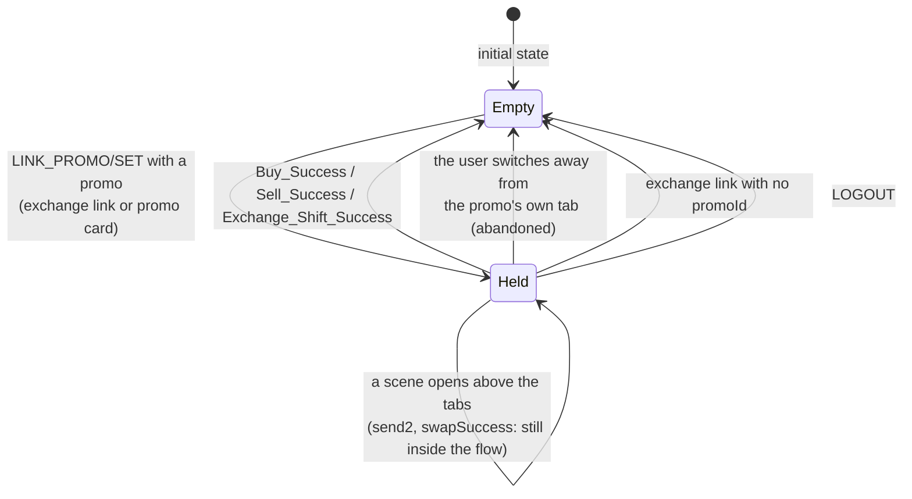

# Exchange deep links: pre-selected assets and link-scoped promo attribution

| | |
|---|---|
| Status | Implemented |
| Author | Jon Tzeng |
| Reviewer | - |
| Last updated | 2026-09-08 |
| Repos | [edge-react-gui](https://github.com/EdgeApp/edge-react-gui) |
| Implementation | [EdgeApp/edge-react-gui#6199](https://github.com/EdgeApp/edge-react-gui/pull/6199) |
| Supersedes | - |
| Related | [Asana: Deeplink - New format](https://app.asana.com/0/1215088146871429/1210180856778864) |

<!-- tdd-code-fingerprint: 9a4241e8d5ab84a29023a378a6d049640c41858f -->

Code blocks cite their file on the `jon/deeplink-new-format` branch rather than a commit sha: the doc is folded into the branch's first commit, so every push re-slots it ahead of the code it quotes and orphans any sha pinned before that push. The branch ref resolves for the life of the review, and these links move to `develop` when the branch merges. Direction came from the task description (growth's campaign-tracking request) and the operator's ruling on it.

## Contents

1. [Problem](#1-problem)
2. [Prior art](#2-prior-art)
3. [Goals and non-goals](#3-goals-and-non-goals)
4. [Design overview](#4-design-overview)
   - [4.1 Link grammar and parsing](#41-link-grammar-and-parsing)
   - [4.2 Wallet resolution and navigation](#42-wallet-resolution-and-navigation)
   - [4.3 The link-scoped promo id](#43-the-link-scoped-promo-id)
   - [4.4 Promo cards as link sources](#44-promo-cards-as-link-sources)
   - [4.5 Outcomes](#45-outcomes)
5. [Testing](#5-testing)
6. [Phase history](#6-phase-history)
7. [Decisions](#7-decisions)
8. [Glossary](#8-glossary)
9. [References](#9-references)
10. [Post-implementation retrospective](#10-post-implementation-retrospective)

## 1. Problem

Growth runs campaigns that push users toward a specific buy, sell or swap, and wants to measure how much of the resulting volume each campaign produced.

A campaign link could open a flow but not choose an asset. `edge://buy`, `edge://sell` and `edge://swap` navigate to the scene and stop, so a "swap into bitcoin" campaign landed the user on an empty picker and asked them to redo the selection the ad had already made.

Attribution could not follow one entry into a flow either. Conversion events read `params.promoIds` from [`accountReferral`](#accountreferral)'s `activePromotions`, which is durable account state written by `activatePromotion`. An in-app promo card had a [`promoId`](#promoid), but `getDisplayInfoCards` dropped it before the card reached the render path, so a card could not attribute its own conversion; and an external link had no way to name a promo id at all short of the `?af=` affiliate form, which permanently writes the account referral state.

## 2. Prior art

`edge://buy[/<providerId>[/<paymentType>]]` already pins a [ramp](#ramp) provider and payment type for one navigation. The pin lives in navigation params, nothing is written to the account, and a pin that matches no quote degrades to the normal ordering. That link-scoped shape is the model this design follows for both the asset and the promo id.

The `?af=<installerId>` query on the `https://deep.edge.app` form parses as an `affiliate` wrapper, calls `activatePromotion`, and writes the installer id into account referral state. That is durable attribution for the lifetime of the account, and the wrong instrument for "credit this one visit to the scene".

`edge://swap` navigated to `swapCreate` with no params and a code comment reserving query parameters for later. This design is that later.

Extending the three existing hosts was rejected; see [decision 7.1](#71-a-new-exchange-host-rather-than-extending-the-existing-ones).

## 3. Goals and non-goals

Goals:

- Parse `https://deep.edge.app/exchange/<buy|sell|swap>?buyAsset=&sellAsset=&promoId=` and its `edge://exchange/...` equivalent.
- Pre-select the named asset's wallet, offering wallet creation when the account holds none.
- Attribute the next conversion to the link's promo id, overriding the account's own promotions for that one entry, then retire it.
- Let promo cards in the home carousel and the notification center launch these links in-app, carrying the card's own promo id.

Non-goals:

- Currency-code asset specs (`USDC`, `ETH`). The format takes a [pluginId](#pluginid) and a [tokenId](#tokenid). See [follow-up 10.2](#102-where-this-document-was-wrong-or-silent).
- Persisting a link promo id into [accountReferral](#accountreferral). The id is deliberately session-only and per-entry.
- Pinning a [ramp](#ramp) provider or payment type from an `exchange` link. `edge://buy/<providerId>/<paymentType>` still owns that.
- Pre-selecting more than the two sides a swap has.

## 4. Design overview

A link travels through four stages: the parser turns a URL into a typed link, the handler resolves each named asset to a wallet, navigation carries the wallet into the scene, and a redux slice carries the promo id to whichever [conversion event](#conversion-event) fires next.


### 4.1 Link grammar and parsing

The `exchange` host takes the direction as its single path segment and everything else as query parameters:

```
edge://exchange/buy?buyAsset=<spec>[&promoId=<id>]
edge://exchange/sell?sellAsset=<spec>[&promoId=<id>]
edge://exchange/swap[?buyAsset=<spec>][&sellAsset=<spec>][&promoId=<id>]
```

An asset `<spec>` is `<pluginId>[_<tokenId>]`: `bitcoin`, `arbitrum`, `ethereum_0xA0b86991c6218b36c1d19D4a2e9Eb0cE3606eB48`. Both URL forms share one parser, so the `https://deep.edge.app` links growth authors and the `edge://` scheme the app registers behave identically.

`buy` and `sell` produce the existing `rampCreate` link type with two new optional fields; `swap` produces the existing `swap` type with three. Each direction reads only the asset on its own side, because the other side of a [ramp](#ramp) is the user's fiat and has no wallet to select.

[`src/types/DeepLinkTypes.ts`](https://github.com/EdgeApp/edge-react-gui/blob/79464bb427b337cadb1a2c1108e57668c5f79312/src/types/DeepLinkTypes.ts)
```typescript
export interface RampCreateLink {
  type: 'rampCreate'
  direction: FiatDirection
  providerId?: string
  paymentType?: FiatPaymentType
  asset?: EdgeAsset
  promoId?: string
}

export interface SwapLink {
  type: 'swap'
  buyAsset?: EdgeAsset
  sellAsset?: EdgeAsset
  promoId?: string
}
```

Asset resolution splits on the first underscore, and normalizes only the token-id form that needs it:

[`src/util/DeepLinkParser.ts`](https://github.com/EdgeApp/edge-react-gui/blob/79464bb427b337cadb1a2c1108e57668c5f79312/src/util/DeepLinkParser.ts)
```typescript
function parseOptionalAsset(spec: string | null): EdgeAsset | undefined {
  if (spec == null || spec === '') return undefined

  const separatorIndex = spec.indexOf('_')
  if (separatorIndex < 0) return { pluginId: spec, tokenId: null }

  const pluginId = spec.slice(0, separatorIndex)
  const rawTokenId = spec.slice(separatorIndex + 1)
  if (pluginId === '' || rawTokenId === '') {
    console.warn(`Ignoring malformed deep link asset: ${spec}`)
    return undefined
  }
  return { pluginId, tokenId: normalizeTokenId(rawTokenId) }
}

function normalizeTokenId(tokenId: string): string {
  return /^0x[0-9a-fA-F]+$/.test(tokenId)
    ? tokenId.slice(2).toLowerCase()
    : tokenId
}
```

An unknown direction is rejected by `asFiatDirection`, which throws and leaves the URL unhandled: there is no flow to open, so degrading would land the user somewhere they did not ask for. A malformed asset spec degrades instead, dropping the pre-selection while still opening the flow. Both calls are covered by [decision 7.4](#74-malformed-assets-degrade-unknown-directions-do-not).

### 4.2 Wallet resolution and navigation

`getDeepLinkReadiness` decides how much account state a link needs before it can run. An `exchange` link that names an asset opens the wallet picker, so it waits for `'wallets'`; one that names none only navigates, so `'account'` is enough. Getting this wrong would fire the picker against a half-loaded wallet list right after login, where it offers to create a wallet the account already has. `DeepLinkingManager` holds a link until its readiness is met, but a promo card tap calls `launchDeepLink` directly, so `launchDeepLink` itself waits through `waitForWallets` for every active wallet to load or fail before following a `'wallets'` link. For the manager's own calls that wait returns at once. Links that arrive during a wait share it, only the latest of them is followed (the others return `false`, like the manager's single pending slot), and a logout ends the wait with `false`. Once an `exchange` link is being followed its picker may already be on screen, so another `exchange` link that arrives then is dropped instead of stacking a second picker and overwriting the first link's promo and navigation. The guard reads the link type through `unwrapDeepLink`, so an `exchange` link an `affiliate` or `marketing` wrapper carries takes the drop as well: the wrapper hands its inner link to the same `handleLink`, and its own type would otherwise hide the exchange link from the check. An `exchange` link that names no asset raises no picker, so it never waits for wallets, but it does write the promo and the ramp params the open picker is about to set, so it takes the drop too. When no picker is up yet it navigates at once, and it counts as the latest link, so an `exchange` link still waiting for wallets returns `false` when the wait ends instead of opening its picker over the newer link. Only `exchange` links take the drop: `walletConnect` and `paymentRedirect` also read `'wallets'`, they raise no picker of their own, and `DeepLinkingManager` clears its pending slot before it launches and ignores the result, so dropping one loses it outright. That guard is keyed to the account, so a picker a logout leaves unsettled cannot block the next account's links. A wallet that never settles holds that one wait until logout, which is also how long it holds the manager's own queue.

One helper covers every asset a link can name, on both link types:

[`src/actions/DeepLinkingActions.tsx`](https://github.com/EdgeApp/edge-react-gui/blob/79464bb427b337cadb1a2c1108e57668c5f79312/src/actions/DeepLinkingActions.tsx)
```typescript
async function pickLinkedWallet(
  account: EdgeAccount,
  navigation: Parameters<typeof pickWallet>[0]['navigation'],
  asset: EdgeAsset | undefined,
  headerTitle?: string
): Promise<WalletListWalletResult | undefined | null> {
  if (asset == null) return undefined

  const currencyConfig = account.currencyConfig[asset.pluginId]
  if (currencyConfig == null) return undefined
  if (
    asset.tokenId != null &&
    currencyConfig.allTokens[asset.tokenId] == null
  ) {
    return undefined
  }

  const result = await pickWallet({
    account,
    assets: [asset],
    headerTitle,
    navigation,
    showCreateWallet: true
  })
  return result?.type === 'wallet' ? result : null
}
```

The three-valued return is what lets one call site distinguish "there is nothing to pre-select" from "the user backed out". `pickWallet` auto-picks when exactly one of the account's wallets matches the asset and shows the modal otherwise, including the zero-match case, where `showCreateWallet` turns the modal into the create-wallet path. This matches how the `rewards` link already resolves assets.

The two guards ahead of it keep an asset this build cannot resolve at all from reaching the picker: a typo'd plugin id, a contract missing from `allTokens`, or a chain this build does not ship. `pickWallet` would raise a modal with nothing in it, and dismissing that modal aborts the navigation, so a partner link would dead-end rather than degrade the way [decision 7.4](#74-malformed-assets-degrade-unknown-directions-do-not) intends. Returning `undefined` instead opens the flow with no pre-selection.

A `null` propagates out of `handleLink` as `false`, which is why `handleLink` and `launchDeepLink` return a boolean rather than `void`. Nothing navigates and no promo is stored, so a dismissed picker leaves no trace. Every branch that raises a picker reports a dismissal this way, not only the `exchange` ones: `azteco`, `paymentRedirect`, `rewards` and the `other` URI path all abort too, since the notification center now routes every recognized call-to-action through this function and retires the promo card whenever it returns true. The one caller that acts on `false` is that notification center, in [section 4.4](#44-promo-cards-as-link-sources).

For `rampCreate`, the resolved wallet rides into the scene as the `forcedWalletResult` navigation param that `RampCreateScene` already reads, where it takes precedence over the user's last selection:

[`src/components/scenes/RampCreateScene.tsx`](https://github.com/EdgeApp/edge-react-gui/blob/79464bb427b337cadb1a2c1108e57668c5f79312/src/components/scenes/RampCreateScene.tsx)
```typescript
const selectedCrypto = forcedWalletResult ?? rampLastCryptoSelection
```

Because it wins over the last selection, leaving it set would override the user's own wallet choice for the rest of the session, so two things end it. The scene's tab-blur listener already cleared the provider and payment-type pins and `forcedWalletResult` joins them, with the listener's early-return guard grown a third condition so a user who never tapped a deep link still pays no params update on tab switches. That listener is the shared `useTabBlur` hook from [4.3](#43-the-link-scoped-promo-id), so it waits for a real tab switch rather than any blur: a sell pushes its `send2` deposit above the tabs, and dropping the forced wallet there would put the sell asset back to the last selection behind the user. And `handleCryptDropdown` clears the param when the user picks a wallet, because otherwise the forced wallet keeps winning and the pick appears to do nothing; that handler's early return now compares against the wallet on screen rather than the persisted last selection, which the forced wallet outranks for the whole visit. A sell amount is entered in the selected asset, so the scene clears it, and any pending max, whenever that asset changes. The reset keys off the selection itself rather than the dropdown, since a link that sets a forced wallet on a scene already mounted, and the tab switch that drops it again, both change the asset without a pick.

For `swap`, both sides are resolved before either is used, sell side first, and each picker carries `select_src_wallet` or `select_recv_wallet` as its title: a link naming both assets raises two modals back to back, and an unlabelled pair is indistinguishable. Both sides ride in the navigation params every time, so a link that named no asset clears whatever the scene had selected, which is what a bare `edge://swap` already did before this change. A nested `navigate` rebuilds the child's action from its params alone, with no merge, and `swapCreate` declares no `initialParams` for `StackRouter` to fall back on, so there is no form of this navigate that preserves a selection.

### 4.3 The link-scoped promo id

The attribution lives in its own root reducer slice rather than in [accountReferral](#accountreferral), and carries the tab whose entry it credits:

[`src/reducers/RootReducer.ts`](https://github.com/EdgeApp/edge-react-gui/blob/79464bb427b337cadb1a2c1108e57668c5f79312/src/reducers/RootReducer.ts)
```typescript
linkPromo: (
  state: LinkPromo | null = null,
  action: Action
): LinkPromo | null => {
  switch (action.type) {
    case 'LINK_PROMO/SET':
      return action.data.linkPromo
    case 'LOGOUT':
      return null
    default:
      return state
  }
}
```

`LINK_PROMO/SET` carries the whole `LinkPromo` or `null`, so one action both sets and clears. Every `exchange` navigation dispatches it, which means a link with no promo id actively clears whatever a previous link left behind. `LOGOUT` clears it too, so an attribution cannot cross an account switch.

The `tab` field is what gives the attribution a lifetime. A promo credits one entry into a flow, so the entry has to end whether or not it converts: `useLinkPromoRelease` subscribes to the tab's blur event on both [ramp](#ramp) scenes and the swap scene, and switching away from the tab releases the promo. Without that, a user who backs out of the quote keeps the promo for the rest of the login session, and the next conversion they reach by any route is billed to the campaign.

[`src/actions/DeepLinkingActions.tsx`](https://github.com/EdgeApp/edge-react-gui/blob/79464bb427b337cadb1a2c1108e57668c5f79312/src/actions/DeepLinkingActions.tsx)
```typescript
export function releaseLinkPromo(tab: LinkPromoTab): ThunkAction<void> {
  return (dispatch, getState) => {
    if (getState().linkPromo?.tab !== tab) return
    dispatch({ type: 'LINK_PROMO/SET', data: { linkPromo: null } })
  }
}
```

Comparing `tab` against the live slice is what makes the release safe. A link dispatches before it navigates, so the tab it navigates away from blurs with the new promo already in the slice; an unconditional release there would throw away the attribution that link just set. The listener sits on the tab rather than the scene, so stepping forward to a provider's webview or a bank form, both registered inside these stacks, keeps the attribution.

A tab blurs for a second reason, though, and the event alone cannot tell the two apart: react-navigation re-emits a navigator's blur to its focused child, so every `AppStack` scene that opens above the tabs blurs the tab as well. A sell's deposit step is one of those. The ramp providers push `send2` to collect the crypto, and `Sell_Success` is logged only once that send completes, so a listener that trusted the raw event would release the promo on the way into the deposit and never attribute a link-driven sell. `useTabBlur` reads the tab navigator's own state inside the listener and filters that case out:

[`src/hooks/useTabBlur.ts`](https://github.com/EdgeApp/edge-react-gui/blob/79464bb427b337cadb1a2c1108e57668c5f79312/src/hooks/useTabBlur.ts)
```typescript
return tabNavigation.addListener('blur', () => {
  const { index, routes } = tabNavigation.getState()
  if (routes[index].name === tab) return

  handleLeave()
})
```

A real tab switch moves the tab navigator off `tab` before the blur is delivered, so the guard sees the new tab and releases. A scene opening above the tabs leaves the tab navigator exactly where it was, so the guard sees `tab` and does nothing. `RampCreateScene` drops its link-scoped params through the same hook, since those params have the same two lifetimes.



Reading the slice inside `logEvent` is what makes one write cover every conversion path. Seven ramp providers plus `SwapConfirmationScene` call `onLogEvent` directly, and all of them funnel through `logEvent`, so the override and the retirement each need exactly one edit:

[`src/util/tracking.ts`](https://github.com/EdgeApp/edge-react-gui/blob/79464bb427b337cadb1a2c1108e57668c5f79312/src/util/tracking.ts)
```typescript
return (dispatch, getState) => {
  const { linkPromo } = getState()

  getExperimentConfig()
    .then(async (experimentConfig: ExperimentConfig) => {
      // ... params built across several awaits ...
      params.promoIds =
        linkPromo == null
          ? accountReferral.activePromotions
          : [linkPromo.promoId]
```

The promo is read synchronously when the event is dispatched, not when its params are finally assembled. The params are built across several awaits, and leaving the flow's tab releases the promo, so a later read would drop the credit from a conversion the user completed and then navigated away from. The swap flow hit this on every conversion: `swapSuccess` is registered in the root stack, outside the swap tab, so pushing it blurred the tab in the same moment the success event was dispatched, and the dispatch-time read is what kept the credit. The above-the-tabs filter now skips that release outright, and the dispatch-time read still covers the user who switches tabs while the params are being built. `SwapConfirmationScene` also logs `Exchange_Shift_Success` before `updateSwapCount`, which can wait on a review prompt, and it drops that count update rather than awaiting it, so a rejection from the account storage read behind it cannot reach the shift-failure handler and log a completed swap as failed.

Retirement happens after the event is dispatched to the backends, gated on the event being one of the three that mean the campaign has been credited:

[`src/util/tracking.ts`](https://github.com/EdgeApp/edge-react-gui/blob/79464bb427b337cadb1a2c1108e57668c5f79312/src/util/tracking.ts)
```typescript
const CONVERSION_EVENTS: TrackingEventName[] = [
  'Buy_Success',
  'Sell_Success',
  'Exchange_Shift_Success'
]
```

That retirement re-reads the slice instead of trusting the value captured at dispatch, and clears it only when the live slice is the same `LinkPromo` object the event captured. The event was built across several awaits, and a link that arrived meanwhile owns the attribution by the time the retirement runs; every link stores a fresh object, so identity also separates a newer link for the same campaign from the entry that converted, which a [`promoId`](#promoid) comparison could not. Non-conversion events (`Buy_Quote` and the rest) read the promo without consuming it, so an abandoned quote does not spend the attribution before the blur releases it.

### 4.4 Promo cards as link sources

A card's [`promoId`](#promoid) reaches the launch path through `DisplayInfoCard`. `filterInfoCards` already read the field to gate a card to affiliated accounts, but `getDisplayInfoCards` did not copy it onto the display object, so the render path could not see it. Adding it there makes it available to both card surfaces, and `addPromoCardToNotifications` carries it into the stored `NotifInfo` so the notification-center copy of a card attributes the same campaign as the carousel copy. The cleaner gained `promoId: asMaybe(asString)`, which keeps older stored notifications parsing.

`linkReferralWithCurrencies` takes the card's promo id as a third argument and stamps it onto the parsed link before launch:

[`src/actions/WalletListActions.tsx`](https://github.com/EdgeApp/edge-react-gui/blob/79464bb427b337cadb1a2c1108e57668c5f79312/src/actions/WalletListActions.tsx)
```typescript
function withCardPromoId(
  link: DeepLink,
  promoId: string | undefined
): DeepLink {
  if (promoId == null || promoId === '') return link

  switch (link.type) {
    case 'rampCreate':
    case 'swap':
      return link.promoId == null ? { ...link, promoId } : link
    case 'affiliate':
      return { ...link, link: withCardPromoId(link.link, promoId) }
    case 'marketing':
      return link.link == null
        ? link
        : { ...link, link: withCardPromoId(link.link, promoId) }
    default:
      return link
  }
}
```

The `link.promoId == null` guard is the precedence rule from [decision 7.3](#73-a-url-promo-id-beats-the-cards-own): a promo id already in the URL survives. The `affiliate` and `marketing` cases exist because a card whose call-to-action carries `?af=` or a campaign wrapper parses as a wrapper around the link that actually opens the flow, and the stamp has to reach through it.

`checkAndAddExpiredPromos` writes the same `promoId` onto the notification it stores for an expired card, so a promo tapped after it lapses attributes to the card it came from just as the carousel copy does.

The notification center previously sent every card call-to-action straight to `openBrowserUri`, which meant an `edge://exchange/...` card in that surface opened a browser. It now routes through `linkReferralWithCurrencies` like the carousel does; a non-Edge URL still ends up at `Linking.openURL` through that function's own `type === 'other'` fallback. The scene also completes the notification only when the launch returned `true`, so backing out of the wallet picker no longer retires the promo unread.

### 4.5 Outcomes

Reachable entry configurations and what each produces. Rows follow from [4.1](#41-link-grammar-and-parsing) through [4.4](#44-promo-cards-as-link-sources); where this table and those sections disagree, the sections are correct.

| Entry | Wallet picker | Lands on | `linkPromo` after | `promoIds` on the next conversion |
|---|---|---|---|---|
| `exchange/buy?buyAsset=bitcoin`, several bitcoin wallets | modal | buy flow, wallet forced | `null` | account promotions |
| `exchange/buy?buyAsset=bitcoin`, exactly one bitcoin wallet | auto-picked, no modal | buy flow, wallet forced | `null` | account promotions |
| `exchange/buy?buyAsset=bitcoin`, no bitcoin wallet | modal in create-wallet mode | buy flow after creation | `null` | account promotions |
| `exchange/buy?buyAsset=bitcoin&promoId=bob` | as above | buy flow, wallet forced | `{ bob, buyTab }` | `["bob"]` |
| ...then the user leaves the buy tab without converting | n/a | wherever they went | `null` | account promotions |
| ...then the user converts | n/a | success scene | `null` | `["bob"]` on that conversion |
| `exchange/buy` (no asset) | none | buy flow, no wallet forced | `null` | account promotions |
| `exchange/buy?sellAsset=ethereum` | none | buy flow, no wallet forced | `null` | account promotions |
| `exchange/swap?buyAsset=X&sellAsset=Y` | one per side, sell first, each titled | swap scene, both sides set | `null` | account promotions |
| `exchange/swap?sellAsset=Y` | sell side only | swap scene, buy side cleared | `null` | account promotions |
| `exchange/swap` (no assets) | none | swap scene, selection cleared | `null` | account promotions |
| `exchange/buy?buyAsset=<unknown plugin or token>` | none | buy flow, no pre-selection | `null` | account promotions |
| Card call-to-action `exchange/buy?buyAsset=X`, card `promoId=card1` | as above | buy flow, wallet forced | `{ card1, buyTab }` | `["card1"]` |
| Card call-to-action `exchange/buy?...&promoId=url1`, card `promoId=card1` | as above | buy flow, wallet forced | `{ url1, buyTab }` | `["url1"]` |
| Card call-to-action to a non-Edge URL | none | external browser | unchanged | unchanged |
| Any link that raises a picker, dismissed | modal, dismissed | nothing, caller unchanged | unchanged | unchanged |
| `exchange/swap?sellAsset=ethereum_` (malformed) | none | swap scene, no pre-selection | `null` | account promotions |
| `exchange/lend?buyAsset=bitcoin` (unknown direction) | none | link unhandled | unchanged | unchanged |
| Legacy `edge://swap`, `edge://buy/<provider>/<type>` | none | unchanged behavior | unchanged | unchanged |
| A buy-tab promo held, then an `exchange/swap` link arrives | swap's pickers | swap scene | `{ new, swapTab }` | the swap link's promo |

## 5. Testing

Automated coverage is 128 cases in `src/__tests__/DeepLink.test.ts` (17 of them new for `exchange`), 5 `linkPromo` cases in `src/__tests__/reducers/RootReducer.test.ts`, 19 in `src/__tests__/actions/LinkPromoActions.test.ts`, 7 in `src/__tests__/util/trackingLinkPromo.test.ts`, and 5 in `src/__tests__/hooks/useTabBlur.test.tsx`.

1. Both URL forms parse to the same link. `https://deep.edge.app/exchange/buy?buyAsset=bitcoin` and `edge://exchange/buy?buyAsset=bitcoin` each produce `rampCreate` with `asset: { pluginId: 'bitcoin', tokenId: null }`.
2. Mainnet assets on token chains. `exchange/sell?sellAsset=ethereum` and `?sellAsset=arbitrum` give [`tokenId`](#tokenid)`: null` on their own plugin id.
3. Swap carries two sides. `exchange/swap?buyAsset=bitcoin&sellAsset=ethereum_0xA0b8...` fills both.
4. Checksummed token ids normalize. `0xA0b86991c6218b36c1d19D4a2e9Eb0cE3606eB48` becomes `a0b86991c6218b36c1d19d4a2e9eb0ce3606eb48`, the form `enabledTokenIds` holds.
5. Non-hex token ids pass through. A Solana mint keeps its base58 case.
6. Direction reads its own side only. `exchange/buy?sellAsset=ethereum` yields no asset.
7. Empty parameters are absent, not empty. `exchange/buy?buyAsset=&promoId=` yields `undefined` for both.
8. Malformed specs degrade. `sellAsset=_0xA0b8...` and `sellAsset=ethereum_` drop the asset and still return a `swap` link.
9. Unknown directions reject. `exchange/lend?buyAsset=bitcoin` throws rather than opening a flow.
10. The affiliate wrapper survives. `https://deep.edge.app/exchange/buy?buyAsset=bitcoin&af=bob` parses as `affiliate` wrapping the `rampCreate`, so `?af=` attribution and asset pre-selection compose.
11. `linkPromo` starts `null`, holds the promo a link supplied, clears on `{ linkPromo: null }`, is replaced wholesale by a newer link's promo and tab, and clears on `LOGOUT`.
12. `withCardPromoId` stamps a card's id onto a [ramp](#ramp) or swap link that carries none, leaves a URL promo id alone, reaches through the `affiliate` and `marketing` wrappers, leaves a wrapper with no inner link alone, ignores link types with nothing to attribute, and is a no-op for an empty or missing card id.
13. `useTabBlur` runs its callback when the tab navigator has moved off the tab, ignores a blur that leaves it on the tab (the `send2` case), calls the latest callback without resubscribing, unsubscribes on unmount, and tolerates a scene with no parent navigator. `releaseLinkPromo` clears the promo when its own tab is left, leaves a promo a newer link has claimed for another tab, and does nothing when none is held. `waitForWallets` resolves at once when every wallet has loaded, otherwise waits for the last one (counting a wallet that failed to load as done), resolves `false` and unsubscribes on logout, and shares one set of watchers across concurrent waits; `launchDeepLink` follows only the latest of several links that arrive during a wait, lets an `exchange` link that names no asset supersede one still waiting, drops an `exchange` link that arrives while an earlier one is showing its picker, drops one a `marketing` wrapper carries and one that names no asset for the same reason, follows a `walletConnect` or `paymentRedirect` link that arrives then, and does not let an unsettled picker from one account block the next.
14. `logEvent` reports the link promo instead of the account promotions, falls back to the account promotions with none held, keeps the promo through a `Buy_Quote`, retires it on `Buy_Success`, still credits a conversion whose tab was left before its params were built, and leaves a newer promo that landed while `checkNotifications` was awaited, including one for the same campaign and tab. Those last cases fail if the promo is read late, if the retirement clears unconditionally, or if it compares [`promoId`](#promoid) instead of identity.

Device verification on the iOS simulator, recorded in the run reports on the task:

15. `edge://exchange/buy?buyAsset=bitcoin` opened the wallet picker filtered to bitcoin.
16. `edge://exchange/buy?buyAsset=ethereum_0xA0b86991c6218b36c1d19D4a2e9Eb0cE3606eB48` opened the buy flow with the USD Coin token resolved, the wallet auto-selected, and a live quote rendered. Before case 4's normalization the same link opened an empty picker.
17. `edge://exchange/swap?sellAsset=litecoin&buyAsset=dash&promoId=bob` landed on the swap scene with both sides populated.
18. The promo-id override was read at runtime by instrumenting `logEvent`: with no link, `linkPromo: null` and `promoIds: []`; after the [`promoId`](#promoid)`=bob` link, three `Buy_Quote` events logged `promoIds: ["bob"]`.
19. `edge://exchange/swap?sellAsset=bitcoin&buyAsset=ethereum` raised "Select Source Wallet" listing only bitcoin wallets, then "Select Receiving Wallet" listing only ethereum wallets, and landed on the swap scene with both sides set.
20. With the swap tab focused, `edge://exchange/buy?buyAsset=bitcoin&promoId=bob` made the swap tab blur while `{ bob, buyTab }` was already held; the release left it, and every following `Buy_Quote` logged `promoIds: ["bob"]`.
21. On the buy scene that link forced to My Bitcoin, picking My Ether 4 from the crypto dropdown switched the scene to it and quoted ethereum.
22. Leaving the buy tab without converting released `{ bob, buyTab }`; every `Buy_Quote` after returning logged `linkPromo: null` and `promoIds: []`.
23. From the Assets tab, `edge://exchange/buy?buyAsset=notachain` opened the buy scene with no picker and no forced wallet.

Cases 20 and 22 were read by posting from `logEvent` and the release to a local capture server; that instrumentation was temporary and is not on the branch.
24. After the dispatch-time read, `edge://exchange/swap?sellAsset=bitcoin&buyAsset=ethereum&promoId=bob` resolved both sides, leaving the swap tab released `{ bob, swapTab }`, and the next `Buy_Quote` logged `promoIds: []`.
25. A funded swap through `edge://exchange/swap?sellAsset=ethereum&buyAsset=bitcoin&promoId=bob` executed to the success scene: 0.0049995 ETH (11.99 dollars) to 0.00014972 BTC through Rango. `Exchange_Shift_Quote`, `Exchange_Shift_Start` and `Exchange_Shift_Success` each logged `promoIds: ["bob"]`, and pushing the success scene then released the promo, which the dispatch-time read had already made harmless. Under [7.10](#710-only-a-tab-switch-ends-the-entry-not-any-blur) that push no longer releases anything.

Not covered by a device drive: a funded buy or sell, which needs a provider account with KYC, so the ramp conversion path rests on case 14 and on its success scenes living inside the buy and sell stacks; and the tab-blur release of `forcedWalletResult`, which has no distinct visual state when the forced wallet and the last-selection wallet are the same.

## 6. Phase history

### Phase 1: plan only

Planning produced `plan-deeplink-new-format.md` and stopped without code. Two non-operator comments postdated the operator's last word, and the task sat in `Prioritization Needed`, so implementation would have preempted a prioritization decision.

The plan scoped item 3 of the task (promo cards launching deep links) as "probably already works". That was wrong; see [10.2](#102-where-this-document-was-wrong-or-silent).

### Phase 2: implementation

| Sketched | Shipped |
|---|---|
| A new `DeepLinkAsset` type for the link's asset | The existing [`EdgeAsset`](#edgeasset), which is the same `{ pluginId, tokenId }` pair |
| Promo cards need no work | `getDisplayInfoCards` had to carry [`promoId`](#promoid), and `NotifInfo` had to store it |
| `getDeepLinkReadiness` returns `'account'` for `rampCreate` and `swap` | `'wallets'` when the link names an asset, since the handler now opens a picker |
| Promo id stashed at the start of the handler | Stashed after wallet resolution, so a dismissed picker leaves no id |
| Token ids used as written | `0x`-prefixed hex normalized to the core's form |
| `handleLink` returns `void` | Returns a boolean, so the notification center can keep an untapped promo alive |

Three defects were caught before the PR opened: the redux slice's initial state was `undefined` rather than `string | null`, which `combineReducers` rejects and which turned 57 test suites red; the readiness value above; and the promo-id ordering above. Token-id normalization came out of the first review round.

### Phase 3: changelog and design document

The two CHANGELOG entries were reshaped to the one-line, one-clause convention, folded into the commit that introduced them, with the mechanism left in that commit's body. This document was added.

### Phase 4: human review

| Sketched | Shipped |
|---|---|
| `linkPromoId`, a bare `string \| null` | `linkPromo`, a `{ promoId, tab }` pair, so the promo has an owner that can release it |
| The promo ends only at a conversion | It ends at a conversion, or when its own tab blurs, via `useLinkPromoRelease` |
| Retirement clears the slice unconditionally | It re-reads the slice and clears only the entry it captured, compared by identity |
| `logEvent` reads the promo after building its params | It reads the promo when the event is dispatched, and the swap success event logs before the swap-count update |
| Promo card taps follow a link as soon as they are tapped | `launchDeepLink` waits for every wallet before a link that opens a picker, sharing the wait, following only the latest link, and dropping an `exchange` link that arrives while a picker is open |
| Only the `exchange` branches abort on a dismissed picker | `azteco`, `paymentRedirect`, `rewards` and `other` abort too |
| One untitled picker per swap side, receive first | Sell first, each titled with the side it asks for |
| An unresolvable asset reaches `pickWallet` | It degrades to no pre-selection before the picker opens |
| The forced wallet ends only on tab blur | An explicit pick in the dropdown clears it too |
| `promoId` carried onto dismissed promo notifications | Carried onto expired ones as well |
| `withCardPromoId`, the release path and `logEvent`'s promo handling untested | 18 cases in `LinkPromoActions.test.ts`, 7 in `trackingLinkPromo.test.ts` |

The review found that nothing released the promo for a flow the user abandoned, which made every drop-off inflate the campaign's volume. That is the defect the `tab` field exists to fix. Adding that release exposed a second race, caught in the next review round: `logEvent` read the promo only after its awaits, so leaving the tab right after converting could release the promo before the conversion read it; and the retirement compared `promoId`, which could not tell a newer link for the same campaign from the entry that converted. The scene-render fake also threw from `getParent`, so any scene subscribing to its tab failed to render in tests.

### Phase 5: second review round

| Found | Shipped |
|---|---|
| The release fired on any tab blur, so a sell lost its promo the moment the provider pushed `send2` | `useTabBlur` filters blurs that leave the tab navigator in place; `RampCreateScene` drops its link params through the same hook |
| Every `'wallets'` link was dropped while a picker was open, losing `walletConnect` and `paymentRedirect` links that were handled before | The drop is scoped to `exchange` links, read through `unwrapDeepLink` so a wrapped or asset-less one still takes it |
| The swap navigate carried a "preserve the selection" branch that preserved nothing, and three places in this document described it as working | The branch is gone and the document says what the code does |

The first two are the same mistake in two places: a guard written for the case in front of it, applied to a category wider than the case. The third is the cost of a design document that outlives its first draft, and the reason [10.2](#102-where-this-document-was-wrong-or-silent) exists.

## 7. Decisions

### 7.1 A new `exchange` host rather than extending the existing ones

Chosen: a new host, leaving `edge://buy`, `edge://sell` and `edge://swap` untouched.

Rejected: adding `?buyAsset=` and `?promoId=` to the three existing hosts. Those carry shipped semantics that campaigns and partners already depend on: `edge://buy/<providerId>/<paymentType>` pins a [ramp](#ramp) provider, and the `https://deep.edge.app` form of all three honors `?af=`. Growing their query grammar risks changing what an existing published link does.

Reopen if: the `exchange` host and the legacy hosts diverge enough that partners hit the wrong one, at which point the legacy hosts should redirect rather than grow.

### 7.2 The promo lives in a redux slice stamped with its tab

Chosen: a root-level `linkPromo` slice holding `{ promoId, tab }`, read inside `logEvent` and released by the tab it names.

Rejected: writing it into [accountReferral](#accountreferral). That state is durable and account-wide, and the task scopes the attribution to "that one entry into the buy/sell/swap scene". A durable write would attribute every later conversion to the campaign.

Rejected: threading it through navigation params into the [ramp](#ramp) plugins. Seven ramp providers plus `SwapConfirmationScene` call `onLogEvent` directly, so this needs seven-plus call-site changes to do what one read in `logEvent` does, and each new provider would have to remember to carry it.

Rejected: a module-level variable in `tracking.ts`. It would be invisible to the reducer tests and would survive a logout.

Rejected: a bare `string | null` with no tab, which is what the first implementation shipped. Without an owner the only thing that could end the attribution was a conversion, so an abandoned flow kept crediting the campaign for the rest of the login session; and a blur listener added on top of it could not tell "this entry was abandoned" from "a newer link already claimed the promo for another tab", because a link dispatches before it navigates.

Reopen if: two flows can be entered concurrently, at which point one slice cannot tell them apart and the attribution has to ride the navigation.

### 7.3 A URL promo id beats the card's own

Chosen: `withCardPromoId` stamps the card's id only when the link carries none.

Rejected: the card always wins. The task's description says a URL promo id is "used for deeplinks coming from outside the app since there's no other way to specify a [promoId](#promoid) unlike in an inapp card", so an explicit value in the URL is a deliberate override by whoever authored the link. A card whose call-to-action was authored with its own `?promoId=` is naming a different campaign on purpose.

Reopen if: cards start carrying URLs authored elsewhere, where a stale `?promoId=` would silently outrank the card that actually displayed.

### 7.4 Malformed assets degrade, unknown directions do not

Chosen: `parseOptionalAsset` drops an empty or half-empty spec and the link still opens the flow; `asFiatDirection` throws on an unknown direction and the URL goes unhandled.

Rejected: rejecting the whole link on a bad asset. These links are authored by hand by partners and marketing, and the existing `parseOptionalPaymentType` already degrades the same way for a stale payment type. Landing the user on the right flow with nothing pre-selected beats a link that does nothing.

Rejected: defaulting an unknown direction to `buy`. There is no flow that `exchange/lend` names, and guessing would drop the user somewhere they did not ask for.

Reopen if: telemetry shows partners shipping malformed specs at a rate where silent degradation hides the problem, which would argue for a visible warning rather than a `console.warn`.

### 7.5 Token-id normalization is limited to 0x-prefixed hex

Chosen: strip `0x` and lowercase, only when the token id matches `/^0x[0-9a-fA-F]+$/`.

Rejected: lowercasing every token id. Solana mints and Cardano policy ids are case-sensitive base58, so a blanket lowercase corrupts them into ids that match no wallet.

Rejected: no normalization. Contract addresses are published in [checksummed](#checksummed-address) form, which is what a campaign author pastes, while the core stores them lowercased and unprefixed. Without this, the most common form of the most common link opens an empty picker, which is exactly what the first review round found.

Reopen if: a chain outside the [EVM](#evm) family adopts a `0x`-prefixed hex token id whose case is significant.

### 7.6 A swap link with one asset clears the other side

Chosen: navigate with both `fromWalletId` and `toWalletId`, leaving the unnamed side `undefined`.

Rejected: merging into whatever the user had selected on the swap scene. React-navigation's nested `navigate` offers no merge here, and a link reading `?sellAsset=litecoin` reads as "open a litecoin swap", so keeping a stale destination is the more surprising outcome. A bare `edge://exchange/swap` with no assets passes both sides as `undefined`, which clears the selection the same way, and is what that link already did before this change.

Reopen if: a campaign wants one-sided links that top up a swap already in progress.

### 7.7 EdgeAsset rather than a new link-specific asset type

Chosen: reuse [`EdgeAsset`](#edgeasset) from `src/types/types.ts`.

Rejected: the `DeepLinkAsset` the first implementation minted. It was `{ pluginId, tokenId }`, which is `EdgeAsset` under another name, and `pickWallet` takes `EdgeAsset[]` anyway, so the new type only added a conversion at the call site.

Reopen if: link assets need a field wallets do not have, such as a preferred provider per asset.

### 7.8 handleLink returns a boolean

Chosen: `handleLink` and `launchDeepLink` return `Promise<boolean>`, false meaning the user backed out of a prompt the link raised.

Rejected: keeping `void` and having the notification center complete the notification unconditionally. Dismissing the wallet picker would then retire an unread promo, and the user has no way to get the card back.

Rejected: throwing on dismissal. Dismissal is a normal outcome, and every existing caller would need a catch that swallows it.

Reopen if: callers need to distinguish more outcomes than "followed" and "backed out", which would argue for a result object.

### 7.9 A ramp link that names no asset replaces an earlier forced wallet

Chosen: `rampCreate` navigates with `{ providerId, paymentType, forcedWalletResult }` every time, so a link that names no asset leaves `forcedWalletResult` unset and the scene falls back to the user's last selection.

Rejected: keeping a forced wallet that an earlier entry (Coin Ranking, a previous exchange link) left on the scene. That navigate replaces the route's params, which is how `edge://buy` and `edge://sell` already behaved before this design, so keeping the old wallet would need merge semantics, and merging would also keep the earlier link's provider and payment-type pins. The swap path clears a bare link's selection for the same reason ([7.6](#76-a-swap-link-with-one-asset-clears-the-other-side)); the ramp scene's own selection lives in `rampLastCryptoSelection`, which a bare link does not touch.

Reopen if: a campaign needs a bare buy or sell link to open on top of a pre-selection another entry made.

### 7.10 Only a tab switch ends the entry, not any blur

Chosen: the release listener reads the tab navigator's state and returns when the tab is still the focused one.

Rejected: subscribing to the scene's own blur instead of the tab's. That is the version [4.3](#43-the-link-scoped-promo-id) rules out for the opposite reason: the flows step forward into scenes registered inside their own stack, and a scene-level listener would release the promo on the first of those.

Rejected: listening on `state` or `tabPress` rather than filtering `blur`. Both move the decision to a different event without answering the question the guard asks, and `tabPress` misses a programmatic tab change.

Rejected: leaving the release on a raw blur and marking the sell flow as an accepted gap. The gap is the whole sell side: `send2` is the only way a sell delivers the crypto, so every link-driven sell would lose its attribution before the [conversion event](#conversion-event), which is the same defect the `tab` field was added to fix.

Reopen if: a flow gains a step that leaves the tab navigator and still belongs to the entry, such as a success scene the tabs cannot host.

### 7.11 Only exchange links are dropped while a picker is open

Chosen: the in-progress guard in `launchDeepLink` applies to `rampCreate` and `swap` links only. It reads the type through `unwrapDeepLink`, so it sees the one an `affiliate` or `marketing` wrapper carries, and it runs on both paths out of the readiness branch, so an `exchange` link that names no asset takes it too. That asset-less link also counts as the latest link when it navigates, so an `exchange` link still waiting for wallets drops rather than opening its picker afterwards. Narrowing the drop by link type only works if the type it reads is the one that reaches `handleLink`, and neither a wrapper's own type nor an asset-less link's lighter readiness changes what that link writes.

Rejected: dropping every `'wallets'` link. `walletConnect` and `paymentRedirect` share that readiness, raise no picker of their own, and arrive from another app while the user is mid-flow, which is exactly when the guard is armed. `DeepLinkingManager` clears its pending slot before it launches and ignores the return value, so a dropped link is gone, and both types were handled before this guard existed.

Rejected: queueing the newer link until the picker settles. The user tapped the newer link, so making them finish an abandoned picker first inverts the intent, and a picker that never settles holds the queue until logout.

Reopen if: a third link type starts raising its own wallet picker, which would want the same drop.

## 8. Glossary

### accountReferral

The durable per-account referral state held by the core (`account.accountReferral`), carrying `installerId`, `creationDate` and `activePromotions`. Conversion events read `activePromotions` for `promoIds` when no link-scoped id is set. Written by `activatePromotion`, which is what an `?af=` link calls. See [`src/actions/AccountReferralActions.tsx`](https://github.com/EdgeApp/edge-react-gui/blob/develop/src/actions/AccountReferralActions.tsx).

### Checksummed address

An Ethereum address whose hex digits are mixed-case, where the case pattern encodes a checksum over the address. Campaign authors paste this published form into a link, and [4.1](#41-link-grammar-and-parsing) converts it to the lowercase unprefixed form the core stores. Defined by [EIP-55](https://eips.ethereum.org/EIPS/eip-55).

### Conversion event

One of the three tracking events that mean a user finished a purchase, a sale or a swap: `Buy_Success`, `Sell_Success`, `Exchange_Shift_Success`. Reaching one credits the campaign and retires the link promo id. See [`src/util/tracking.ts`](https://github.com/EdgeApp/edge-react-gui/blob/develop/src/util/tracking.ts).

### EdgeAsset

The app's `{ pluginId, tokenId }` pair naming one asset on one chain, independent of which wallet holds it. It is what `pickWallet` matches against and what an `exchange` link's asset spec parses into. See [`src/types/types.ts`](https://github.com/EdgeApp/edge-react-gui/blob/develop/src/types/types.ts).

### EVM

Ethereum Virtual Machine, the execution environment Ethereum and the chains compatible with it share. Their token ids are contract addresses, which is why [7.5](#75-token-id-normalization-is-limited-to-0x-prefixed-hex) normalizes only that family's `0x`-prefixed form. See [the Ethereum documentation](https://ethereum.org/en/developers/docs/evm/).

### pluginId

The stable identifier of a currency plugin, and so of a chain: `bitcoin`, `ethereum`, `arbitrum`, `solana`. It is the first half of an asset spec, and it is not the currency code, so a chain and its mainnet asset share one id. See [edge-core-js `EdgeCurrencyInfo`](https://github.com/EdgeApp/edge-core-js/blob/master/src/types/types.ts).

### promoId

The identifier of a marketing campaign or in-app card, reported to the analytics backends as `params.promoIds` on every tracked event. A campaign measures its lift by counting conversions carrying its id. Used here in the link-scoped sense described in [4.3](#43-the-link-scoped-promo-id). Carried on an in-app card by [`src/util/infoUtils.ts`](https://github.com/EdgeApp/edge-react-gui/blob/develop/src/util/infoUtils.ts).

### Ramp

A fiat on-ramp or off-ramp: the buy and sell flows that move between fiat and crypto through a third-party provider. `FiatDirection` is `'buy' | 'sell'`, and the `rampCreate` link type opens either. See [`src/plugins/gui/fiatPluginTypes.ts`](https://github.com/EdgeApp/edge-react-gui/blob/develop/src/plugins/gui/fiatPluginTypes.ts).

### Thunk

A redux action creator that returns a function of `(dispatch, getState)` instead of a plain action, which is how async work reaches the store. `launchDeepLink` and `linkReferralWithCurrencies` are thunks, which is why they can both read state and dispatch `LINK_PROMO_ID/SET`. See [the redux thunk documentation](https://redux.js.org/usage/writing-logic-thunks).

### tokenId

The identifier of a token within a chain, or `null` for the chain's mainnet asset. On [EVM](#evm) chains it is the contract address lowercased with `0x` dropped, which is the normalization [7.5](#75-token-id-normalization-is-limited-to-0x-prefixed-hex) performs. A wallet's `enabledTokenIds` holds these. See [edge-core-js `EdgeTokenId`](https://github.com/EdgeApp/edge-core-js/blob/master/src/types/types.ts).

## 9. References

- [EdgeApp/edge-react-gui#6199](https://github.com/EdgeApp/edge-react-gui/pull/6199), the implementation.
- [Asana: Deeplink - New format](https://app.asana.com/0/1215088146871429/1210180856778864), the task, its description and the operator's ruling.
- [EIP-55](https://eips.ethereum.org/EIPS/eip-55), the address checksum this design normalizes away.
- [Redux thunks](https://redux.js.org/usage/writing-logic-thunks).

## 10. Post-implementation retrospective

### 10.1 Estimate vs. actuals

| | Planned | Actual |
|---|---|---|
| Repos | 1 | 1 |
| Task items | 3 | 3, all shipped |
| Files changed | not estimated | 17 |
| Lines | not estimated | 581 added, 47 removed |
| New link types | 0, extend 2 existing | 0, `rampCreate` and `swap` grew fields |
| New types | 1 (`DeepLinkAsset`) | 0, [`EdgeAsset`](#edgeasset) reused |
| Test cases added | not estimated | 17 link cases, 5 reducer cases, 18 promo-helper cases, 7 `logEvent` cases |
| Segments to deliver | 1 | 4: plan, implementation, documentation, review |

### 10.2 Where this document was wrong or silent

1. The plan scoped task item 3 as already working. `getDisplayInfoCards` dropped the card's [`promoId`](#promoid), and the notification center sent every call-to-action to a browser, so neither card surface could attribute a conversion. [Section 4.4](#44-promo-cards-as-link-sources) is the corrected design, and it is roughly a third of the diff.
2. The asset spec grammar is silent on currency codes. A campaign author needs a [pluginId](#pluginid) and a contract address rather than "USDC", so a wrong id names nothing. That no longer opens an empty picker, since [4.2](#42-wallet-resolution-and-navigation) degrades an unresolvable asset, but the link still silently loses its pre-selection. Either accept a currency-code form resolved against `allTokens`, or publish an internal reference of the ids campaigns will use. This is a product call, not a defect.
3. Nothing anticipated token-id normalization. The first design took the link's token id as written, which fails on exactly the form a campaign author would paste. [Decision 7.5](#75-token-id-normalization-is-limited-to-0x-prefixed-hex) covers the fix.
4. The design assumed every flow's success scene stays on the flow's tab. `swapSuccess` does not: it is in the root stack, so reaching it releases the promo immediately, which would have dropped the swap's own attribution under a late read. Case 25 is the funded swap that confirmed it; [section 4.3](#43-the-link-scoped-promo-id) reads the promo at dispatch for that reason. The same assumption broke the other way for sells, which the second review round caught: their deposit step also sits above the tabs and their success event fires only after it, so a blur there is not the end of the flow at all. [Decision 7.10](#710-only-a-tab-switch-ends-the-entry-not-any-blur) is the general fix. A funded buy or sell was still not driven.
5. The design gave the promo no lifetime beyond a conversion, which the first implementation shipped and the review caught. Every abandoned flow kept crediting the campaign until the next conversion by any route, so the campaign's measured volume was inflated by exactly the drop-offs it was meant to exclude. [Section 4.3](#43-the-link-scoped-promo-id) is the corrected design; [decision 7.2](#72-the-promo-lives-in-a-redux-slice-stamped-with-its-tab) records why the tab stamp is what makes a release safe.
6. Aborting a link on a dismissed picker was applied only to the `exchange` branches, while the notification center was changed to route EVERY recognized call-to-action through the same function. A `rewards`, `azteco` or `paymentRedirect` promo card therefore retired itself when its picker was cancelled. [Section 4.2](#42-wallet-resolution-and-navigation) now covers every branch.

### 10.3 What held

The link-scoped model borrowed from `edge://buy`'s provider pins held for the wallet: navigation params, a cleared-on-blur lifetime, nothing written to the account. What the first implementation failed to do was apply the same model to the promo, which is what item 5 of [10.2](#102-where-this-document-was-wrong-or-silent) records; the promo now borrows the pins' blur lifetime too. The decision to read the promo in `logEvent` rather than thread it through the [ramp](#ramp) plugins held throughout, and it is what kept the tracking change to two edits in one file across eight conversion call sites.

### 10.4 Verification highlights

- `verify-repo.sh --base origin/develop` passed, covering CHANGELOG, install, prepare, eslint over the changed files, and the full jest suite.
- 128 `DeepLink.test.ts` cases pass, including all 17 `exchange` cases.
- The USD Coin token link resolved to a live quote on the simulator (500 USD to 481.428143 USD Coin), which is the frame proving [decision 7.5](#75-token-id-normalization-is-limited-to-0x-prefixed-hex): the same link opened an empty picker before normalization.
- The promo-id override was read at runtime, not inferred: `promoIds: []` with no link, `promoIds: ["bob"]` on three `Buy_Quote` events after a `promoId=bob` link.
- A funded 11.99 dollar ETH to BTC swap opened from a `promoId=bob` link reached the success scene with `Exchange_Shift_Success` logging `promoIds: ["bob"]`, the conversion case the dispatch-time read exists for.
- The release was read at runtime the same way: leaving the buy tab cleared the promo and the next `Buy_Quote` reverted to `promoIds: []`, while a link that navigated away from the swap tab kept its newly set promo through that tab's blur.
