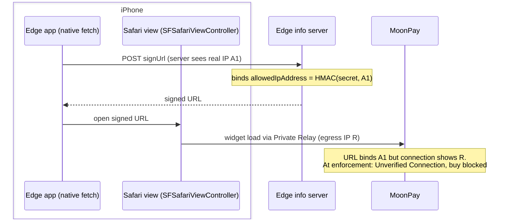
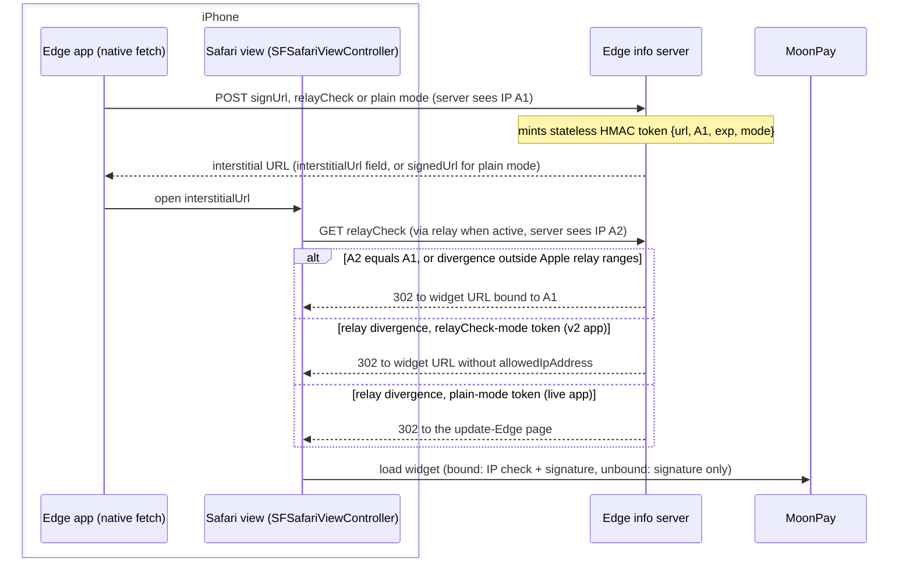

# MoonPay Private Relay interstitial: server-observed IP divergence decides bind vs no-bind

| | |
|---|---|
| Status | In review |
| Author | jon-claude (orchestrated run) |
| Reviewer | - |
| Last updated | 2026-08-13 |
| Repos | [edge-info-server](https://github.com/EdgeApp/edge-info-server), [edge-react-gui](https://github.com/EdgeApp/edge-react-gui) |
| Implementation | [edge-info-server#160](https://github.com/EdgeApp/edge-info-server/pull/160), [edge-react-gui#6151](https://github.com/EdgeApp/edge-react-gui/pull/6151) |
| Supersedes | - |
| Related | [edge-info-server#159](https://github.com/EdgeApp/edge-info-server/pull/159), [edge-devops#77](https://github.com/EdgeApp/edge-devops/pull/77), [rollout plan (gist)](https://gist.github.com/j0ntz/3417fa95f68b731351b44760e4124c68) |

This document describes the implementation on the `jon/moonpay-relay-interstitial` branches of both repos, built for Asana task 1217471281005732. Code citations are pinned to those branches.

## Contents

1. [Problem](#1-problem)
2. [Prior art](#2-prior-art)
3. [Goals and non-goals](#3-goals-and-non-goals)
4. [Design overview](#4-design-overview)
5. [Detailed design: edge-info-server](#5-detailed-design-edge-info-server)
6. [Detailed design: edge-react-gui](#6-detailed-design-edge-react-gui)
7. [Outcomes matrix](#7-outcomes-matrix)
8. [Testing](#8-testing)
9. [Phase history](#9-phase-history)
10. [Decisions](#10-decisions)
11. [Glossary](#11-glossary)
12. [References](#12-references)

## 1. Problem

iOS buy opens the MoonPay widget in an [SFSafariViewController](#sfsafariviewcontroller) (`openExternalWebView` calls `SafariView.show` on iOS). The `signUrl` request rides the app's native fetch, so the info server binds the customer's real address (A1) into [`allowedIpAddress`](#allowedipaddress). For iCloud+ users with Private Relay on, the Safari view's traffic egresses from an Apple relay address (R) instead. MoonPay observes R, compares it with the hash of A1, and records a mismatch.

Today mismatches only log on MoonPay's side. Once MoonPay enforces IP matching, their documented behavior is that the widget fails to load with an "Unverified Connection" error and the customer cannot continue. Every iOS buyer with Private Relay on is locked out.



## 2. Prior art

Constraints established by the prior IP-binding work ([edge-info-server#159](https://github.com/EdgeApp/edge-info-server/pull/159)) and by the platforms, which rule out the simpler fixes:

- iOS buy cannot move to the internal WebView: [Apple Pay JS](#apple-pay-js) requires a Safari context. Sell uses `guiPluginWebView` (app networking stack, relay never applies) and Android buy uses [Custom Tabs](#custom-tabs) (device networking, same egress as the app's fetch); both stay on the fully bound flow.
- There is no correct value to bind for a relayed session. Relay egress addresses are per-site, shared among users, and unpredictable (Apple's network guide), so observing our own egress does not reveal the egress MoonPay will see.
- [SFSafariViewController](#sfsafariviewcontroller) allows no JS injection and no network observation. Relay is detectable only by making the Safari view itself hit a server we control.
- An unconditionally reachable unbound signer is a phishing oracle: anyone could mint a signed URL carrying an attacker-chosen `walletAddress`, which is exactly what the binding exists to stop.

MoonPay's own IP-matching documentation prescribes the shape used here: detect Private Relay by comparing the app-traffic address with the Safari-view address, and when they differ omit [`allowedIpAddress`](#allowedipaddress) from the signed URL while still validating the signature.

## 3. Goals and non-goals

Goals:

- Relay users complete iOS buys under MoonPay enforcement, with no IP ever handled by the app.
- Non-relay iOS buys keep byte-identical binding to today's flow.
- Unbound URLs are issued only on server-observed divergence, loudly logged.
- The unbound branch is reproducible on a simulator in dev builds.

Non-goals:

- Attestation-gated unbound signing is v3's scope ([its Asana task](https://app.asana.com/1/9976422036640/project/1213843652804305/task/1217473657573003)), not this change.
- Sell and Android flows are untouched.

## 4. Design overview

| Repo | Deliverable | Scope |
|---|---|---|
| edge-info-server | [edge-info-server#160](https://github.com/EdgeApp/edge-info-server/pull/160) | `relayCheck` mode on `POST /v1/moonpay/signUrl`, new `GET /v1/moonpay/relayCheck` redirect, token seal/unseal, unbound signing |
| edge-react-gui | [edge-react-gui#6151](https://github.com/EdgeApp/edge-react-gui/pull/6151) | iOS buy path opens the interstitial URL with fallback to the bound flow; dev-only divergence flag; this document |

Every buy signUrl request, from every app version, runs through the interstitial. The server records its first IP observation (A1, the app's native fetch) inside a sealed token, and gets its second observation (A2) when the Safari view itself opens the interstitial. The comparison happens server-side and the Safari view is 302-redirected to one of three targets: the widget URL signed with the binding (addresses agree, or the divergence is not Apple's relay), the widget URL signed without it (range-verified relay divergence on a relayCheck-mode token), or the update-Edge page (range-verified relay divergence on a plain-mode token, meaning an app too old to receive an unbound URL). Sell requests keep the direct bound response and never pay the hop.

App cohorts, as named throughout this document: the live app is what ships today and sends plain-mode requests; v2 is the app carrying this task's changes (relayCheck mode); v3 is the attestation-era app ([its Asana task](https://app.asana.com/1/9976422036640/project/1213843652804305/task/1217473657573003)).



The app's POST and the Safari view's GET can land on different droplets behind the load balancers, and the droplets' CouchDBs are standalone with no shared session store. The token therefore carries its own state (widget URL, A1, expiry), sealed with a secret both droplets already share (see [section 5](#5-detailed-design-edge-info-server)).

## 5. Detailed design: edge-info-server

All decision logic lives in `src/util/moonpayRelayCheck.ts` as pure functions; the route handlers in `src/routes/v1/moonpaySignRoutes.ts` stay thin. The gui side of the seam is [section 6](#6-detailed-design-edge-react-gui); the cross-repo flow is the [overview diagram](#4-design-overview).

### Token seal

[`src/util/moonpayRelayCheck.ts`](https://github.com/EdgeApp/edge-info-server/blob/jon/moonpay-relay-interstitial/src/util/moonpayRelayCheck.ts)
```ts
export const mintRelayCheckToken = (
  secret: string,
  widgetUrl: string,
  ipAddress: string,
  now: number,
  mode: RelayCheckMode
): string
```

The token is `base64url(payload).base64url(mac)` where the payload is JSON `{ url, ip, exp, mode }` and the MAC is [HMAC](#hmac)-SHA256 with the per-provider MoonPay signing secret over a domain-separated message (`moonpay-relay-check:` prefix, so the MAC can never collide with the two other HMAC shapes the same secret produces: [`allowedIpAddress`](#allowedipaddress) hashes and widget-URL signatures). Expiry is 60 seconds from mint. The per-provider secret is provisioned identically on every droplet through the synced `moonpaySign` CouchDB document, which is what lets a token minted on one droplet redeem on another ([decision 1](#101-token-mac-keyed-by-the-per-provider-moonpay-secret)).

### Token unseal

Unsealing re-selects the secret from the `apiKey` inside the payload URL. Reading the payload before verification is safe: a tampered `apiKey` selects a different secret and the MAC comparison (constant-time) then fails. The MoonPay host allow-list is re-checked defense-in-depth. Verdicts are three-valued:

- `invalid`: forged, malformed, non-MoonPay URL, or unprovisioned `apiKey`. Untrustable; the route answers 400.
- `stale`: authentic but expired. Safe to fall back to the bound URL, never to issue unbound.
- `ok`: authentic and fresh.

Redemption is idempotent within the expiry window: the token seals the widget URL and both signing shapes are deterministic HMACs, so the same token redeems to the same decision any number of times, on any droplet ([decision 2](#102-degraded-redemptions-fall-back-to-the-bound-url)).

### Redirect decision

[`src/util/moonpayRelayCheck.ts`](https://github.com/EdgeApp/edge-info-server/blob/jon/moonpay-relay-interstitial/src/util/moonpayRelayCheck.ts)
```ts
export const decideRelayCheckRedirect = (
  providers: { [name: string]: SignProvider },
  token: string,
  headers: Record<string, string | string[] | undefined>,
  now: number,
  isRelayEgress: (ipAddress: string, now?: number) => boolean = isAppleRelayEgress
): RelayCheckDecision
```

A2 resolves through the same `getClientIpAddress` and `canonicalizeIpAddress` path the binding flow uses (trusted-proxy [X-Forwarded-For](#x-forwarded-for) counting, RFC 5952 canonical form), so one address spelled two ways can never fake a divergence. The unbound branch is taken only when the verdict is `ok`, A2 resolved, and canonical A2 differs from canonical A1. Every degraded case (expired, unresolvable A2) falls back to the bound URL: bound-and-mismatched is exactly today's behavior, while unbound issuance on anything but a fresh server-observed divergence would reopen the phishing hole ([decision 2](#102-degraded-redemptions-fall-back-to-the-bound-url)).

The unbound signing itself:

[`src/util/moonpaySign.ts`](https://github.com/EdgeApp/edge-info-server/blob/jon/moonpay-relay-interstitial/src/util/moonpaySign.ts)
```ts
export const signMoonpayUrlUnbound = (secret: string, url: URL): string
```

It strips any stale signing params and signs the query string without setting `allowedIpAddress`. It is exported for the relay-check path only; no route exposes it unconditionally.

### Relay-range gate

The unbound and nudge branches both require A2 to fall inside Apple's published Private Relay egress ranges ([egress-ip-ranges.csv](https://mask-api.icloud.com/egress-ip-ranges.csv)), held in `src/util/appleRelayRanges.ts`: refreshed daily per worker, failing toward the bound URL when the cache is missing or more than a week stale. Divergence the ranges do not explain is not relay (a proxy, a mid-session network change) and gets the bound URL, which is today's behavior for that population. This is the substantive answer to MoonPay's "partner assumes responsibility for verifying the customer's IP" clause: binding is waived only when Apple's relay is positively identified as the cause, the customer's real IP was observed first-hand at sign time, and every waiver is logged with both addresses.

### The live-app nudge

Plain-mode buy requests (live apps, and the v2 fallback path) cannot detect relay at all, so they also receive the interstitial URL, inside the `signedUrl` response field the live app already parses (its cleaner reads only that field). Non-diverging sessions redirect to the bound widget and notice nothing. Range-verified relay divergence redirects to the update-Edge page instead of a widget that would fail with MoonPay's unexplained "Unverified Connection" error: updating genuinely fixes those users, since the v2 flow's unbound branch handles their relay session. A `disableV1Interstitial` flag in the same `moonpaySign` Couch document reverts plain-mode requests to the direct bound response without a deploy; the live app has no client-side fallback, so a bad interstitial deploy must be recoverable by a config flip ([decision 4](#104-nudge-live-app-divergence-to-the-update-page-behind-a-kill-switch)).

The mode bit travels inside the MACed token payload, so a plain token cannot be upgraded into one that redeems an unbound URL.

### The update-Edge page

`GET /v1/updateEdge?reason=relay` (`src/routes/v1/updateEdgeRoutes.ts`): Edge-branded static HTML, no scripts, no auto-forwarding, no purchase resumption. Headline, per-reason explanation copy (the `reason` parameter selects it, with a generic default so later rollout phases reuse the page), a store button resolved from the User-Agent, both store links as fallbacks, and a support link.

### Sell skip

Sell widget URLs (`sell.` / `sell-sandbox.moonpay.com`, `isMoonpaySellUrl`) keep the direct bound response in every mode: sell runs in the app's internal WebView on the app's own network stack, so its traffic can never diverge from the signUrl call's address.

### Routes

`POST /v1/moonpay/signUrl` accepts an optional `relayCheck: true` body field. Every existing gate runs unchanged in all modes: browser-origin refusal, MoonPay host allow-list, per-apiKey secret selection, client-IP resolution with fail-closed 400, canonicalization, and the suspect-address diagnosis. Relay-check mode responds `{ interstitialUrl, clientIpAddress }`; plain buy mode responds `{ signedUrl: <interstitial URL>, clientIpAddress }` (or the direct bound URL under the kill switch or for sell). Interstitial URLs are built from the request's own Host header so the redemption GET goes back through the same public name and load balancer.

`GET /v1/moonpay/relayCheck?token=...` runs the decision above and 302s. It deliberately has no origin check: it is a top-level browser navigation, and everything it can do is constrained by the sealed token. A browser reaching it can only redeem a token the app already requested, for the widget URL the app already requested. Every unbound issuance and every nudge redirect logs loudly with both addresses; these lines measure real relay share among iOS buys, the shrinking live-app relay tail, and the abuse-detection surface.

## 6. Detailed design: edge-react-gui

The iOS buy path in `src/plugins/ramps/moonpay/moonpayRampPlugin.ts` asks for the interstitial and falls back to the bound flow on any failure. Sell and Android are untouched; the server side of the seam is [section 5](#5-detailed-design-edge-info-server).

[`src/plugins/gui/providers/moonpaySign.ts`](https://github.com/EdgeApp/edge-react-gui/blob/jon/moonpay-relay-interstitial/src/plugins/gui/providers/moonpaySign.ts)
```ts
export const fetchMoonpayInterstitialUrl = async (
  url: string
): Promise<string>
```

The plugin's approve step:

[`src/plugins/ramps/moonpay/moonpayRampPlugin.ts`](https://github.com/EdgeApp/edge-react-gui/blob/jon/moonpay-relay-interstitial/src/plugins/ramps/moonpay/moonpayRampPlugin.ts)
```ts
let webViewUrl: string
if (Platform.OS === 'ios') {
  webViewUrl = await fetchMoonpayInterstitialUrl(
    urlObj.href
  ).catch(async (error: unknown) => {
    console.log(
      'Moonpay relay check unavailable, using bound URL: ' +
        String(error)
    )
    return await signMoonpayUrl(urlObj.href)
  })
} else {
  webViewUrl = await signMoonpayUrl(urlObj.href)
}
```

The Safari view opens `webViewUrl` exactly as it opened the signed URL before; the 302 delivers the user to the same widget, and the existing deeplink return path (`redirectURL` to `deep.edge.app`) is unchanged. A server that does not yet support relay-check mode, a network failure, or a malformed response all land in the catch and produce today's bound flow, so the app change cannot regress buys even against un-upgraded servers.

One consequence of the fallback: when the relay-check POST fails and the plain retry succeeds against an upgraded server, a relaying v2 user is indistinguishable from the live app and lands on the update page. That session was already degraded (the primary path failed), and the page's advice is merely unnecessary rather than wrong.

The dev flag: `ENV.MOONPAY_RELAY_CHECK_SIGN_PROXY` (declared in `src/envConfig.ts`, empty by default) reroutes this one POST through an alternate egress, so the server observes divergent A1/A2 on a simulator and the unbound branch is reproducible. The flag is read behind `__DEV__`, so release builds cannot reach it ([decision 3](#103-divergence-testing-flag-lives-client-side)).

## 7. Outcomes matrix

Rows are the reachable user populations crossed with MoonPay's enforcement state; columns are which checks MoonPay runs on the widget load and whether the purchase completes. Rows follow from [section 5](#5-detailed-design-edge-info-server) and [section 6](#6-detailed-design-edge-react-gui); prose wins on disagreement.

| Population | Enforcement | URL issued | MoonPay checks | Purchase completes |
|---|---|---|---|---|
| v2 iOS buy, relay on (in ranges) | off | unbound | signature only | yes |
| v2 iOS buy, relay on (in ranges) | on | unbound | signature only | yes |
| v2 iOS buy, relay off | either | bound to A1 | signature + IP match (passes) | yes |
| v2 iOS buy, divergence outside relay ranges | on | bound to A1 | signature + IP mismatch | no (not relay; the same population fails today) |
| v2 iOS buy, relay-check POST failed, relay off | either | bound to A1 (interstitial via plain fallback) | signature + IP match (passes) | yes |
| v2 iOS buy, relay-check POST failed, relay on | either | update page (plain-mode nudge) | none (no widget reached) | no; the page advises an update the app already has (degraded session, [section 6](#6-detailed-design-edge-react-gui)) |
| live iOS buy, relay off | either | bound to A1 (via interstitial in signedUrl) | signature + IP match (passes) | yes |
| live iOS buy, relay on (in ranges) | either | update page (nudge) | none (no widget reached) | no; the user updates and re-enters as v2 |
| live iOS buy, kill switch on, relay on | on | bound to A1 (direct) | signature + IP mismatch | no (Unverified Connection, pre-nudge status quo) |
| live/v2 sell (guiPluginWebView, app network stack) | either | bound to A1 (direct, sell skip) | signature + IP match (passes) | yes |
| live/v2 Android buy ([Custom Tabs](#custom-tabs), device network) | either | bound to A1 (via interstitial, no divergence) | signature + IP match (passes) | yes |

## 8. Testing

Server unit tests (`src/__tests__/moonpayRelayCheck.test.ts`, mocha/chai, run in CI):

1. Token round-trip: mint then unseal returns the widget URL, A1, and secret.
2. Tampered payload, tampered MAC, malformed tokens, unprovisioned `apiKey`, and a correctly-MACed non-MoonPay URL are all `invalid`.
3. An expired token is `stale` with state intact; redeeming the same fresh token repeatedly yields the same decision.
4. `signMoonpayUrlUnbound` emits no [`allowedIpAddress`](#allowedipaddress), emits a signature, and strips stale signing params.
5. Redirect decision: matching addresses 302 to the bound URL whose `allowedIpAddress` equals `hashIpAddress(secret, A1)`; divergent addresses 302 to the unbound URL.
6. IPv6 canonicalization parity: one address spelled `2001:DB8:0:0:0:0:0:1` and `2001:db8::1` binds rather than diverging.
7. Expired and unresolvable-A2 redemptions fall back to the bound URL even under divergence; an untrustable token answers 400.
8. Interstitial URL construction honors Host and x-forwarded-proto, uses http only for localhost, and refuses a hostless request; the update-page URL builds from the same host logic.
9. The mode bit round-trips, is covered by the MAC (a plain token cannot be flipped to relayCheck), and routes in-range divergence to the unbound URL in relayCheck mode and the update page in plain mode.
10. Divergence outside the relay ranges binds in both modes; the range cache matches v4 and v6, drops malformed rows, and fails toward bound once stale.

End-to-end (real HTTP through the real router with injected providers and ranges): a plain buy POST returns the interstitial URL in `signedUrl`; an in-range divergent GET 302s to the update page, which renders; a non-diverging GET 302s to the bound widget; a relayCheck POST plus divergent GET yields the unbound URL; out-of-range divergence binds; a sell POST gets the direct bound response; the `disableV1Interstitial` flag reverts plain mode to direct bound.

End-to-end divergence needs no relay: POST the sign request from egress X, GET the interstitial from egress Y, assert the 302 target omits `allowedIpAddress`. Locally the two egresses are two crafted [`X-Forwarded-For`](#x-forwarded-for) chains.

Simulator, bound branch: the existing maestro buy regression must still pass; a working interstitial is invisible there because the redirect target is today's URL. Simulator, unbound branch: driven via the dev flag from [section 6](#6-detailed-design-edge-react-gui).

The physical-device pass (iCloud+ account, Private Relay toggled on in Settings) is not automatable: simulators cannot enable Private Relay and the Mac's own relay does not wrap simulator traffic. It is the open manual item, and MoonPay enforcement for our key stays off until that pass completes.

## 9. Phase history

### Phase 1 (2026-08-13): initial implementation

Shipped as sketched in the task, with these divergences:

| Sketched | Shipped |
|---|---|
| "Single use" token | Per-process replay refusal plus 60s expiry; cross-droplet single use has no home without shared state (superseded in phase 4: tracking deleted) |
| Interstitial failure handling unspecified server-side | Three-valued verdict: untrustable 400s, authentic-but-degraded falls back to the bound URL |
| "Proxy or env-pointed server" dev flag | A single env var rerouting only the relay-check POST, dead in release builds |

### Phase 2 (2026-08-13): live-app nudge, relay-range gate, sell skip, kill switch

Server-only additions per the operator's [rollout plan](https://gist.github.com/j0ntz/3417fa95f68b731351b44760e4124c68); no app changes.

| Planned | Shipped |
|---|---|
| Live-app plain-mode requests answered with the interstitial in `signedUrl`; diverging sessions land on the update page | As planned; the nudge additionally requires the divergence to be range-verified relay, so unexplained divergence binds instead of nudging users an update cannot help |
| Relay-range gate on the unbound branch | Applied to both the unbound and nudge branches (`appleRelayRanges.ts`, daily refresh, one-week staleness limit) |
| Update page, parameterizable for later phases | `GET /v1/updateEdge?reason=...` with per-reason copy and a generic default |
| Kill switch in the Couch config | `disableV1Interstitial` in the `moonpaySign` doc, moonpay-specific cleaner split from the shared signing-doc shape |
| Token mode bit | `mode: 'relayCheck' \| 'plain'` inside the MACed payload |

### Phase 3 (2026-08-13): drop the nudge allowlist

Server-only simplification; no app changes.

| Was | Now |
|---|---|
| Nudge additionally gated on the URL's apiKey appearing in a `nudgeApiKeys` list in the `moonpaySign` doc (empty default, so the nudge shipped off until provisioned) | Every plain-mode session with range-verified relay divergence is nudged; `disableV1Interstitial` is the only knob, and the nudge is live the moment the server deploys |

The allowlist guarded a population that cannot occur: whitelabel apps fork from post-v3 code, so no whitelabel build sends plain-mode requests or reaches the update page.

### Phase 4 (2026-08-13): idempotent redemption, cohort naming

Server-only simplification plus a doc-wide terminology pass; no app changes.

| Was | Now |
|---|---|
| Per-process single-use tracking: a second redemption of a fresh token degraded to the bound URL | Redemption is idempotent within the 60-second expiry: same token, same decision, any number of times, on any droplet |
| Decision "single use is per-process, not cross-droplet" | Deleted. The tracking defended nothing (farming unbound URLs for different wallet addresses requires different sign requests, which redemption tracking never limited) and hurt the one innocent replay: a relay user's reloaded Safari sheet degraded to a bound URL that fails at enforcement |
| "v1" cohort naming | "live" for the shipping plain-mode app; v2 and v3 defined in [section 4](#4-design-overview) |

## 10. Decisions

### 10.1 Token MAC keyed by the per-provider MoonPay secret

Chosen: seal tokens with the same per-apiKey secret from the synced `moonpaySign` CouchDB document that signs widget URLs, under a `moonpay-relay-check:` domain-separation prefix.

Evidence: the droplets share no session store, but the `moonpaySign` document is already provisioned identically on both (it is how either droplet can sign at all), so it is the one secret both sides of a cross-droplet redemption already hold. The prefix keeps the three [HMAC](#hmac) uses of that secret (IP hash, URL signature, token MAC) in disjoint message spaces.

Rejected: a new dedicated sealing secret in `serverConfig` (requires coordinated provisioning on every droplet before deploy, and a missed droplet fails closed on every cross-droplet redemption); random per-process keys (break the cross-droplet case outright).

Reopen when: MoonPay secret rotation becomes routine, since rotating it invalidates in-flight tokens for its 60-second window.

### 10.2 Degraded redemptions fall back to the bound URL

Chosen: expired tokens and unresolvable A2 both 302 to the URL bound to A1; only an untrustable token gets a 400.

Evidence: the bound URL is byte-identical to today's flow, so the worst outcome of a degraded redemption equals the status quo. The innocent degradations are mechanical (the app suspended mid-handoff by iOS, a network stall pushing the GET past the 60-second expiry); no user-paced step exists between signing and redemption. A hard failure would turn those into a dead buy.

Rejected: 400 on expiry (worse than the status quo for real users); unbound on expiry (the freshness bound is what ties the decision to a just-observed A1, and honoring stale observations would decouple unbound issuance from a live divergence).

Reopen when: enforcement telemetry shows degraded-redemption mismatches at meaningful volume, which would argue for re-minting instead of falling back.

### 10.3 Divergence testing flag lives client-side

Chosen: `MOONPAY_RELAY_CHECK_SIGN_PROXY` in the app's env config, read behind `__DEV__`, rerouting only the relay-check POST.

Evidence: divergence is a property of where the two requests egress, so rerouting the app's POST through any alternate egress reproduces it against an unmodified server, including production. The server stays free of test-only branches.

Rejected: a server-side "force divergence" parameter (reachable in production, so it is an unbound-signing oracle behind a query flag, the exact thing [section 2](#2-prior-art) forbids); pointing `INFO_SERVER` at a local server (moves both observations to the same egress, so no divergence).

Reopen when: never for the server-side variant; the flag itself can move if env plumbing changes.

### 10.4 Nudge live-app divergence to the update page, behind a kill switch

Chosen: diverging plain-mode sessions 302 to the update-Edge page, gated on range-verified relay, revertible via `disableV1Interstitial` in the Couch doc.

Evidence: serving diverging live-app sessions the unbound URL instead would be equal in security (a reseller can send the relayCheck flag as easily as not), so the nudge is deliberate shepherding per the rollout plan: it shrinks the live-app tail before the attestation phase, when un-attestable builds lose MoonPay entirely, and it exercises the update-page plumbing that phase reuses. The kill switch exists because the live app has no client-side fallback: a bad interstitial deploy must be recoverable by a config flip, not a redeploy.

Rejected: silent unbound for the live app (fixes relay users without an update but leaves the live-app tail alive into the attestation flip); nudging on ANY divergence (users whose divergence is not relay gain nothing from updating, so they keep the bound URL).

Reopen when: support volume from nudged users outweighs the shepherding value.

## 11. Glossary

### iCloud Private Relay

Apple's two-hop proxy for Safari traffic, available to iCloud+ subscribers. In this design it is why the Safari view's egress address (A2) can differ from the app's native-fetch address (A1): relay egress addresses are per-site, shared, and unpredictable. [Apple's network guide](https://developer.apple.com/support/prepare-your-network-for-icloud-private-relay)

### SFSafariViewController

The iOS system browser view an app can present in-process. It shares Safari's cookies and network stack (including Private Relay), allows no JS injection and no network observation, and is required for Apple Pay JS. It is where iOS buy opens the MoonPay widget. [Apple documentation](https://developer.apple.com/documentation/safariservices/sfsafariviewcontroller)

### allowedIpAddress

MoonPay widget-URL parameter carrying base64(HMAC-SHA256(secret, customer IP)). MoonPay compares it against the address it observes when the widget loads; omitting it makes MoonPay validate the signature only. [MoonPay IP matching doc](https://dev.moonpay.com/widget/on-ramp/customization/ip-matching)

### HMAC

Hash-based message authentication code (RFC 2104): a keyed hash proving both integrity and knowledge of the key. Used three ways here, domain-separated: the IP hash, the widget-URL signature, and the interstitial token MAC. [RFC 2104](https://datatracker.ietf.org/doc/html/rfc2104)

### X-Forwarded-For

The header chain of client addresses appended by proxies. The server resolves the customer address from the entry written by our own infrastructure (counted from the right), never the caller-controlled left-most entry; see `getClientIpAddress` in `src/util/moonpaySign.ts` (edge-info-server). [MDN](https://developer.mozilla.org/en-US/docs/Web/HTTP/Headers/X-Forwarded-For)

### Custom Tabs

Android's equivalent of the in-app system browser. It uses the device's network stack, which is the same egress the app's fetch uses, so Android buys never diverge and stay fully bound. [Android documentation](https://developer.chrome.com/docs/android/custom-tabs)

### Apple Pay JS

MoonPay's Apple Pay integration runs in the widget via Apple Pay on the Web, which Apple only supports in Safari contexts. This is the constraint pinning iOS buy to SFSafariViewController. [Apple Pay JS documentation](https://developer.apple.com/documentation/applepayontheweb)

## 12. References

- [MoonPay IP matching](https://dev.moonpay.com/widget/on-ramp/customization/ip-matching) (mismatch UX, relay omission guidance)
- [MoonPay signed URLs](https://dev.moonpay.com/docs/on-ramp-enhance-security-using-signed-urls)
- [Apple Private Relay network guide](https://developer.apple.com/support/prepare-your-network-for-icloud-private-relay)
- [edge-info-server#159](https://github.com/EdgeApp/edge-info-server/pull/159) (IP binding rollout, IPv6 canonicalization)
- [edge-devops#77](https://github.com/EdgeApp/edge-devops/pull/77) (Caddy proxy config)
- Prior task: [proxy root cause and IP binding rollout](https://app.asana.com/0/1215088146871429/1216403654258324)
