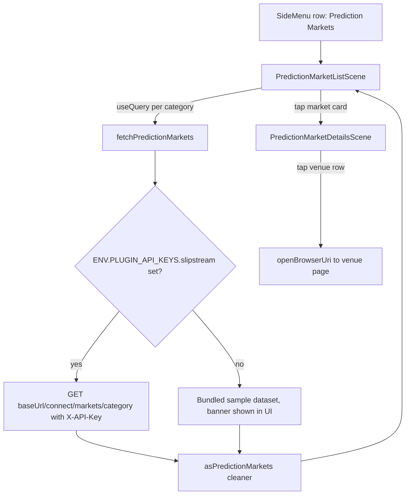

# Prediction markets prototype: browse cross-venue markets from the side menu

| | |
|---|---|
| Status | Implemented (read-only prototype) |
| Author | Jon Tzeng (agent run) |
| Reviewer | - |
| Last updated | 2026-08-14 |
| Repos | [edge-react-gui](https://github.com/EdgeApp/edge-react-gui) |
| Implementation | [edge-react-gui#6158](https://github.com/EdgeApp/edge-react-gui/pull/6158) |
| Supersedes | - |
| Related | [slipstream-example](https://github.com/tylerthebuildor/slipstream-example) |

File references point at the `jon/prediction-markets-prototype` branch. Direction came from Asana task 1217498026846463: add a prediction markets side menu entry with a new set of scenes, design at the implementer's discretion, preferring UI component reuse.

## Contents

1. [Problem](#1-problem)
2. [Prior art](#2-prior-art)
3. [Goals and non-goals](#3-goals-and-non-goals)
4. [Design overview](#4-design-overview)
5. [Detailed design: edge-react-gui](#5-detailed-design-edge-react-gui)
6. [Testing](#6-testing)
7. [Phase history](#7-phase-history)
8. [Decisions](#8-decisions)
9. [Glossary](#9-glossary)
10. [References](#10-references)
11. [Post-implementation retrospective](#11-post-implementation-retrospective)

## 1. Problem

Edge has no surface for prediction markets. The [Slipstream Connect](#slipstream-connect) API aggregates the same real-world event across Polymarket, Hyperliquid, and Kalshi into one [cluster](#cluster) with per-[venue](#venue) prices and a merged order book, and its non-custodial trade flow (the client signs, the API never sees a key) fits Edge's custody model. Before committing to a trading integration, the app needs a prototype that proves out navigation, scene design, and the data shapes.

## 2. Prior art

Two in-app features already solve the "browse an external REST dataset" problem and set the conventions this prototype reuses:

- CoinRanking (`src/components/scenes/CoinRankingScene.tsx`): list plus details scenes over the rates server, cleaner-typed responses in `src/types/coinrankTypes.ts`.
- Gift cards (`src/plugins/gift-cards/`, `src/components/scenes/GiftCardMarketScene.tsx`): a plugin directory holding the API client and [cleaners](#cleaners), TanStack Query for fetching, category chips over an `Animated.FlatList`, an optional API key under `ENV.PLUGIN_API_KEYS` gating provider behavior.

Neither talks to a prediction markets [venue](#venue), and neither pattern needed changes; the prototype is an application of both.

## 3. Goals and non-goals

Goals:

- A Prediction Markets side menu row visible to every logged-in user.
- A list scene: category tabs (sports, crypto, macro, politics), one card per market [cluster](#cluster) comparing each [venue](#venue)'s best ask, best-priced venue highlighted.
- A details scene: per-venue bid/ask, merged order book top levels, per-venue metadata (24h volume, resolution date, link out to the venue page).
- A typed client for `GET /connect/markets/{category}` with cleaner-validated responses.
- Fully browsable without an API key, via a clearly labeled bundled sample dataset.

Non-goals (each deferred, see [decision 1](#d1-read-only-scope-no-trade-flow)):

- Trading (quote, order build, signing, submit), balances, positions, and venue setup.
- A server-side key proxy. The prototype reads the key from `env.json` on the client; production hardening is deferred with the trade flow.
- New icon assets. The row reuses an existing FontAwesome5 glyph.

## 4. Design overview

One repo, three layers: a data module under `src/plugins/prediction-markets/`, two scenes, and wiring (router types, `Main.tsx` registration, side menu row, localized strings).



## 5. Detailed design: edge-react-gui

### Data module

`src/plugins/prediction-markets/` follows the gift-card plugin layout:

- `slipstreamTypes.ts`: [cleaners](#cleaners) mirroring the Connect API's market [cluster](#cluster) shape (`asPredictionMarket`, `asMarketBook`, `asMarketLeg`, `asVenuePrice`), the category list, and `formatCentsPrice`, which renders the API's `0`-`1` decimal-string prices as whole cents using biggystring math.
- `slipstreamApi.ts`: the fetch client, whose exported surface is:

[`src/plugins/prediction-markets/slipstreamApi.ts`](https://github.com/EdgeApp/edge-react-gui/blob/eeab4cc1085368d86b5f894ba47a8a84705fa277/src/plugins/prediction-markets/slipstreamApi.ts)
```ts
export const fetchPredictionMarkets = async (
  category: PredictionMarketCategory
): Promise<PredictionMarketsResult> => {
```

  `PredictionMarketsResult` is `{ markets: PredictionMarket[], isSampleData: boolean }`. With no key configured it returns the sample dataset and `isSampleData: true`; with a key it fetches `GET {baseUrl}/connect/markets/{category}` with the `X-API-Key` header and throws on a non-OK status so the scene's error state renders. Responses parse through `asJSON(asPredictionMarkets)`.
- `slipstreamSampleData.ts`: two markets per category shaped like live responses. The literals run through `asPredictionMarkets` at module load, so the sample path exercises the same cleaners as the live path.

The optional key lives at `ENV.PLUGIN_API_KEYS.slipstream` (`apiKey`, optional `baseUrl` defaulting to `https://api.papi.market`), following the phaze entry in `src/envConfig.ts`.

### Scenes

`PredictionMarketListScene` (route `predictionMarkets`): `SceneWrapper` and `SceneContainer` with the scene title, a horizontal category chip row (the GiftCardMarketScene pattern), and an `Animated.FlatList` of `EdgeCard` rows. Each card shows the league tag, title, and one bordered cell per [venue](#venue) with its best ask; the cell matching the merged book's best ask (falling back to the lowest venue ask) is highlighted. Data comes from `useQuery` keyed on the category. Sample mode renders an `AlertCardUi4` banner above the list; fetch errors render the same card with an error string; an empty category renders a centered empty message.

`PredictionMarketDetailsScene` (route `predictionMarketDetails`, params `{ market: PredictionMarket }`): the market travels in the route params, so the scene does no fetching. Three sections: venue prices (one row per venue with bid and ask, best ask tagged via the shared `getBestAskPrice` helper the list scene also uses), order book (top three bid and ask levels side by side, each level showing price, size, and source venue), and market details (one `EdgeRow` per [leg](#leg) with 24h volume and resolution date). A leg row is tappable only when its URL passes `isSafeVenueUrl`: https on an allowlisted venue host (polymarket.com, hyperliquid.xyz, kalshi.com, with subdomains), no userinfo. Live responses are untrusted, so a scheme check alone would still let a hostile payload point at the app's own claimed App Link hosts; numeric fields likewise clean through `asBiggystring` so a malformed decimal string fails the fetch instead of throwing in render.

### Wiring

- `src/types/routerTypes.tsx`: `predictionMarkets: undefined` and `predictionMarketDetails: PredictionMarketDetailsParams` in `EdgeAppStackParamList`, params imported from the details scene per repo convention.
- `src/components/Main.tsx`: both scenes wrapped in `ifLoggedIn` and registered on the app stack next to the CoinRanking screens.
- `src/components/themed/SideMenu.tsx`: a row after Markets navigating to `predictionMarkets`, icon `iconNameFontAwesome: 'poll'` (see [decision 4](#d4-icon-reuse-fontawesome5-poll)).
- `src/locales/en_US.ts`: a PredictionMarkets region; all scene text is localized.

## 6. Testing

1. `PredictionMarketListScene.test.tsx`: snapshot render under `FakeProviders` (which supplies the `QueryClientProvider`).
2. `PredictionMarketDetailsScene.test.tsx`: snapshot render with the first sports sample market as params, covering the [venue](#venue) price, order book, and [leg](#leg) sections.
3. Sim drive (run evidence in the task's run report): side menu shows the row; list scene renders sample data with the banner; category tabs switch datasets; tapping a card opens details with prices, book, and legs.
4. Type and cleaner conformance: the sample dataset passes `asPredictionMarkets` at module load, so a shape drift fails every jest suite importing it.

## 7. Phase history

### Phase 1: read-only prototype (2026-08-14)

Sketch and shipped implementation match: data module, two scenes, side menu row, sample fallback. Nothing diverged mid-build except the sample dataset's typing, which moved from hand-written `PredictionMarket[]` literals to cleaner-validated literals when tsc rejected the optional-field shapes. Deferred: the trade flow and everything key-gated (see [goals and non-goals](#3-goals-and-non-goals)).

Review hardening, same day (from six Cursor Bugbot and Security Reviewer findings on [edge-react-gui#6158](https://github.com/EdgeApp/edge-react-gui/pull/6158), all accepted):

| Shipped as | Replacing |
|---|---|
| Shared `getBestAskPrice` used by both scenes | Details scene read only `book.best_ask`, so its highlight could disagree with the list |
| `isSafeVenueUrl` allowlist (https, [venue](#venue) hosts, userinfo rejected) | Untrusted [leg](#leg) URLs went to `openBrowserUri` with no scheme or host check |
| `asBiggystring` on price, size, and volume fields | `asString` let malformed decimals throw inside render-time biggystring math |
| Order-book asks in `theme.negativeDeltaText` (red) | `theme.negativeText` is blue-gray, so asks read as muted body text |
| Error card only when no data exists | A failed background refetch replaced a loaded list with the error card |

## 8. Decisions

### D1: read-only scope, no trade flow

Chosen: browse-only (markets list and details). The trade flow needs a `trade`-scope API key, funded [venue](#venue) wallets, and [EIP-712](#eip-712) signing wired through the wallet layer; none of those exist in this environment (live API probes returned 404/502 without a key, and `env.json` has no Slipstream entry). Rejected: full trade flow (unbuildable and unverifiable here); quote-only trading UI (a quote the user cannot execute is a dead-end control, worse than omitting it). Reopen when a key with `trade` scope and a signing design for `signing_request.kind` exist.

### D2: sample-data fallback instead of key-gating the feature

Chosen: the row always shows; with no key the scenes run on bundled sample data behind a visible banner. Rejected: hiding the row without a key like the phaze gift-card row (the task commissions a browsable prototype, and a hidden row demos nothing on any build without secrets); treating no-key as an error state (same problem, an error screen is not a prototype). The banner keeps the provenance honest. Reopen at productization, when the row should probably gate on a real key.

### D3: client-side key from env.json

Chosen: `ENV.PLUGIN_API_KEYS.slipstream`, fetched directly from the app. The reference integration holds the key server-side behind a proxy, and that remains the right production shape. Rejected for the prototype: standing up a proxy or info-server relay for a read-only demo that usually runs keyless. This mirrors how other `PLUGIN_API_KEYS` entries already work in the app. Reopen with D1.

### D4: icon, reuse FontAwesome5 'poll'

Chosen: `iconNameFontAwesome: 'poll'` on the side menu row, matching the gift-card row's use of the FontAwesome5 escape hatch. Rejected: a new [Fontello](#fontello) glyph (requires regenerating `src/assets/vector/config.json` and the font binary, churn a prototype does not justify); reusing the Fontello `chart` glyph (already the Markets row icon, and duplicate icons in adjacent rows read as a bug).

### D5: data module under src/plugins/prediction-markets/

Chosen: the gift-card plugin layout (`<feature>Api.ts`, `<feature>Types.ts` equivalents). Rejected: the older CoinRanking layout (types in `src/types/`, fetch helpers in `src/util/network.ts`), which scatters one feature across three directories; new features in the repo have moved to the plugin-directory shape.

## 9. Glossary

### Slipstream Connect

The aggregation API at `api.papi.market`. It matches the same real-world event across prediction market venues, returns per-venue prices and a merged book, and builds venue order payloads for the client to sign locally. Source: [slipstream-example README](https://github.com/tylerthebuildor/slipstream-example).

### Cluster

One real-world event matched across venues: a title, one leg per venue, per-venue prices, and a merged book. A cluster's `id` is the venue:market_id pairs joined over the sorted legs. Source: [slipstream-example README, markets endpoint](https://github.com/tylerthebuildor/slipstream-example#get-connectmarketscategory).

### Leg

A cluster's listing on one specific venue: the venue's market id, YES outcome id, page URL, 24h volume, and resolution date. Defined by `asMarketLeg` in [slipstreamTypes.ts](https://github.com/EdgeApp/edge-react-gui/blob/jon/prediction-markets-prototype/src/plugins/prediction-markets/slipstreamTypes.ts).

### YES frame

The API's price normalization: every leg is quoted as the probability of the YES outcome, priced `0`-`1`, so asks are always the cost to buy and bids the proceeds to sell regardless of a venue's native convention. Source: [slipstream-example README](https://github.com/tylerthebuildor/slipstream-example#get-connectmarketscategory).

### Venue

An underlying prediction market exchange reachable through Slipstream Connect: [Polymarket](https://polymarket.com), [Hyperliquid](https://hyperliquid.xyz), or [Kalshi](https://kalshi.com). Kalshi is discovery-only in the API.

### Cleaners

Edge's runtime validation library ([cleaners](https://www.npmjs.com/package/cleaners)): composable functions that assert a JSON shape and produce the matching TypeScript type. All Connect responses and the sample dataset pass through them.

### Fontello

The app's generated icon font (`src/assets/vector/`), built with the [Fontello](https://fontello.com) font generator, and the default icon source for side menu rows. Adding a glyph means regenerating the font, which is why this row uses the FontAwesome5 fallback instead.

### EIP-712

Ethereum's typed structured data signing standard ([EIP-712](https://eips.ethereum.org/EIPS/eip-712)). Slipstream Connect returns order payloads in this format for the client wallet to sign locally; nothing in this prototype signs, which is part of why trading is out of scope.

## 10. References

- [slipstream-example](https://github.com/tylerthebuildor/slipstream-example): API documentation and reference integration.
- Asana task 1217498026846463 (Prediction Markets - Prototype).
- In-repo precedents: `src/components/scenes/GiftCardMarketScene.tsx`, `src/components/scenes/CoinRankingScene.tsx`, `src/plugins/gift-cards/`.

## 11. Post-implementation retrospective

### Estimate vs. actuals

| Item | Planned | Actual |
|---|---|---|
| Scenes | list + details | list + details, as planned |
| Data source | live fetch with sample fallback | same; live path unexercised (no API key exists in any environment yet) |
| Review rounds | none budgeted | 3 rounds, 6 automated findings, all accepted and fixed same day |

### Where this document was wrong or silent

1. [Detailed design](#5-detailed-design-edge-react-gui) originally opened leg URLs on any `openBrowserUri`-accepted value; review showed untrusted-URL handling needed the allowlist now described there.
2. [Testing](#6-testing) was silent on refetch-failure behavior; the shipped list scene keeps last-good data on a failed background refetch.

### What held

The reuse bets: GiftCardMarketScene's chip-row and query patterns, `SceneContainer`/`EdgeCard`/`EdgeRow`, the phaze-style env key, and the cleaner-validated sample dataset (it caught every data-shape tightening for free as the [cleaners](#cleaners) hardened).

### Verification highlights

- Maestro drive on the iOS sim, first attempt pass: side menu -> list (sample banner) -> category switch -> details; four proof frames plus one after-fix frame attached to [edge-react-gui#6158](https://github.com/EdgeApp/edge-react-gui/pull/6158).
- Full verify-repo pass (eslint, tsc, jest incl. the two new snapshot tests) on every commit via the pre-commit hook.
