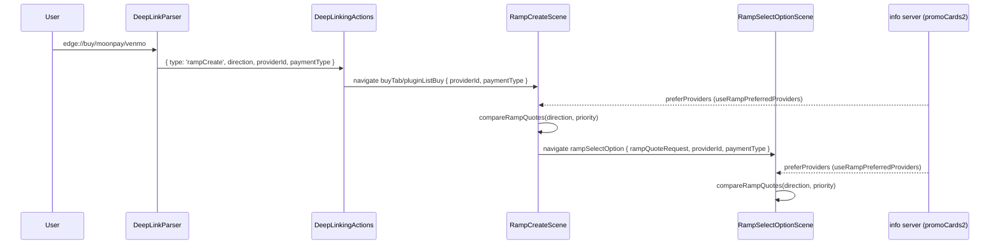

# Ramps deep link entry and affiliate provider priority: link-scoped and affiliate-scoped provider ordering for the buy/sell flow

| | |
|---|---|
| Status | Implemented |
| Author | Jon Tzeng |
| Reviewer | - |
| Last updated | 2026-08-11 |
| Repos | [edge-react-gui](https://github.com/EdgeApp/edge-react-gui) |
| Implementation | see [PR link in the task](https://app.asana.com/0/1215088146871429/1217224633446931) |
| Supersedes | - |
| Related | [Asana task](https://app.asana.com/0/1215088146871429/1217224633446931), [MoonPay Cash App payment type task](https://app.asana.com/1/9976422036640/task/1217193939491704) |

Code references point at `edge-react-gui` branch `jon/ramps-deeplink-provider-priority`. Direction came from the Asana task above, which came from the MoonPay Cash App co-marketing request.

## Contents

1. [Problem](#1-problem)
2. [Prior art](#2-prior-art)
3. [Goals and non-goals](#3-goals-and-non-goals)
4. [Design overview](#4-design-overview)
5. [Detailed design: edge-react-gui](#5-detailed-design-edge-react-gui)
6. [Info server configuration](#6-info-server-configuration)
7. [Partner link instructions](#7-partner-link-instructions)
8. [Testing](#8-testing)
9. [Phase history](#9-phase-history)
10. [Decisions](#10-decisions)
11. [Glossary](#11-glossary)
12. [References](#12-references)

## 1. Problem

The production buy/sell flow in the app is the ramps flow: `RampCreateScene` collects the asset, amount and region, and `RampSelectOptionScene` lists the resulting quotes grouped by [payment type](#payment-type). Two things it cannot do:

- No [deep link](#deep-link) reaches it. `edge://plugin/...` and `edge://fiatprovider/...` route into the legacy amountquote flow, which is kept for whitelabel builds. A partner email or a promo card call-to-action button has no URL that lands a user in the ramps flow.
- No provider priority. Quotes are ordered by rate alone, so a co-marketing deal that promises a partner top placement has no mechanism behind it.

MoonPay asked for both as part of a Cash App co-marketing push with an Aug 18 launch date: an email link that drops the recipient into Buy with MoonPay Cash App selected, and priority placement for accounts that arrive through MoonPay's [affiliate id](#affiliate-id-installerid).

## 2. Prior art

The legacy amountquote flow already has provider priority: `createPriorityArray` in `src/plugins/gui/amountQuotePlugin.ts` builds priority groups from a `providerPriorityMap` and floats `pluginPromotions[].preferProviders` into the first group. `GuiPluginListScene` feeds it the promotions by reading `getDisplayInfoCards` and filtering on `pluginIds` plus `pluginType`.

That code is not reusable here. It ranks `FiatProviderQuote` objects, is entangled with the amountquote plugin's accept/reject logic (a comment above `createPriorityArray` records that the priority array also decides whether to accept a quote), and its promotion lookup depends on `pluginIds` naming a GUI plugin such as `amountquote`. The ramps flow has no GUI plugin layer: a [ramp plugin](#ramp-plugin) is the provider. So the ramps flow needs its own ordering, reading the same [info server](#info-server) field.

`edge://ramp/<direction>/<providerId>` already exists but is unrelated: it is the provider return link, dispatched to `rampDeeplinkManager` so a provider's web session can hand control back to a scene that is already open. Reusing it for entry would collide with those listeners.

## 3. Goals and non-goals

Goals:

- A link format that opens the ramps buy or sell flow, optionally naming a provider and a [payment type](#payment-type): `edge://buy[/<providerId>[/<paymentType>]]` and the `sell` equivalent, plus the `https://deep.edge.app/...` form so the same URL works in an email and in a promo card call-to-action button.
- Provider and payment type from the link float to the top of the quote results for that navigation only.
- Provider priority for affiliated accounts, driven by [info server](#info-server) config that can change without an app update.
- A pin or preference that matches nothing degrades to normal ordering with no error.

Non-goals:

- No info server code changes. `pluginPromotions` is already in the `promoCards2` schema; this is a read.
- No writes to account referral state on the pin path. `?af=` attribution keeps its existing behavior, independent of pinning.
- No fix for the two known `promoCards2` quirks: dismissing a visible card does not disable its behavior payload, and `promoId` matching requires both `installerId` and `activePromotions` to agree when both are present. A separate cleanup task covers splitting the behavior payload out of `promoCards2`.
- No change to which quotes are fetched or shown. Ordering only.

## 4. Design overview

| Repo | Deliverable | Scope |
|---|---|---|
| edge-react-gui | Parser, handler, param threading, quote ordering, docs | [Section 5](#5-detailed-design-edge-react-gui) |

The link carries the pin through navigation params; the [info server](#info-server) carries the affiliate preference through a hook. Both converge on one comparator that the create scene and the select option scene share.



## 5. Detailed design: edge-react-gui

### 5.1 Link type and parsing

`DeepLinkTypes.ts` gains one variant. The name is `rampCreate`, not `ramp`, because `RampLink` is the provider return link described in [section 2](#2-prior-art).

[`src/types/DeepLinkTypes.ts`](https://github.com/EdgeApp/edge-react-gui/blob/2744bfe096154597123e960a03b01c6b1adcc454/src/types/DeepLinkTypes.ts)
```typescript
export interface RampCreateLink {
  type: 'rampCreate'
  direction: FiatDirection
  providerId?: string
  paymentType?: FiatPaymentType
}
```

`parseEdgeProtocol` handles the `buy` and `sell` hosts:

[`src/util/DeepLinkParser.ts`](https://github.com/EdgeApp/edge-react-gui/blob/2744bfe096154597123e960a03b01c6b1adcc454/src/util/DeepLinkParser.ts)
```typescript
case 'buy':
case 'sell': {
  const [providerId, paymentType] = pathParts
  return {
    type: 'rampCreate',
    direction: url.host === 'buy' ? 'buy' : 'sell',
    providerId:
      providerId == null || providerId === '' ? undefined : providerId,
    paymentType: parseOptionalPaymentType(paymentType)
  }
}
```

`parseOptionalPaymentType` runs `asFiatPaymentType` inside a try/catch and returns `undefined` on anything unrecognized, logging a warning. These links are authored by partners and marketing, so a stale [payment type](#payment-type) must still open the flow rather than raise "Unknown [deep link](#deep-link) format" ([decision 10.3](#103-tolerate-an-unknown-payment-type-instead-of-rejecting-the-link)).

Two behaviors come free from the existing parser. The prefix table already rewrites `https://deep.edge.app/` to `edge://`, so the https form needs no new code. And `splitAffiliateLink` already strips `?af=<installerId>` before parsing, wrapping the result in an `AffiliateLink`; `handleLink` then activates the promotion and recurses into the inner link. So `https://deep.edge.app/buy/moonpay/cashapp?af=moonpay` both attributes the install and pins MoonPay, with the two mechanisms independent.

### 5.2 Handling

`DeepLinkingActions.tsx` navigates to the tab and passes the pin as scene params:

[`src/actions/DeepLinkingActions.tsx`](https://github.com/EdgeApp/edge-react-gui/blob/2744bfe096154597123e960a03b01c6b1adcc454/src/actions/DeepLinkingActions.tsx)
```typescript
case 'rampCreate': {
  const { direction, providerId, paymentType } = link
  if (direction === 'buy') {
    navigation.navigate('buyTab', {
      screen: 'pluginListBuy',
      params: { providerId, paymentType }
    })
  } else {
    navigation.navigate('sellTab', {
      screen: 'pluginListSell',
      params: { providerId, paymentType }
    })
  }
  break
}
```

`pluginListBuy` and `pluginListSell` are the ramps create scene routes; the legacy scenes live at `pluginListBuyOld` / `pluginListSellOld` and are untouched. Cold start and warm start take the same path, because `DeepLinkingManager` queues a link received before the account is ready and replays it through `launchDeepLink` afterward.

### 5.3 Param threading

`RampCreateParams` (the param type of both create routes) gains the two optional fields, and `RampSelectOptionParams` gains the same pair so the pin survives the hop to the option list:

[`src/components/scenes/RampCreateScene.tsx`](https://github.com/EdgeApp/edge-react-gui/blob/2744bfe096154597123e960a03b01c6b1adcc454/src/components/scenes/RampCreateScene.tsx)
```typescript
export interface RampCreateParams {
  forcedWalletResult?: WalletListWalletResult
  regionCode?: string
  providerId?: string
  paymentType?: FiatPaymentType
}
```

Both `navigation.navigate('rampSelectOption', ...)` call sites in the create scene (the Next button and the max-amount auto-navigation) forward the pin.

The pin then has to expire, because React Navigation keeps route params on the Buy tab's route for the life of the app session: left in place, they would pin every later visit to the tab, not just the flow the link opened. Both scenes clear them when the user leaves the tab, which is the boundary of that flow: stepping forward to the option list and back stays inside it. The option list needs its own listener because it holds a separate copy of the params, so clearing only from the create scene leaves a still-pinned list for a user who exits the tab from the option list and returns.

[`src/components/scenes/RampCreateScene.tsx`](https://github.com/EdgeApp/edge-react-gui/blob/2744bfe096154597123e960a03b01c6b1adcc454/src/components/scenes/RampCreateScene.tsx)
```typescript
const pinsRef = React.useRef({ pinnedProviderId, pinnedPaymentType })
pinsRef.current = { pinnedProviderId, pinnedPaymentType }

React.useEffect(() => {
  const tabNavigation = navigation.getParent()
  if (tabNavigation == null) return
  return tabNavigation.addListener('blur', () => {
    const { pinnedProviderId, pinnedPaymentType } = pinsRef.current
    if (pinnedProviderId == null && pinnedPaymentType == null) return
    navigation.setParams({ providerId: undefined, paymentType: undefined })
  })
}, [navigation])
```

The subscription depends on `navigation` alone, never on the params. A listener that re-subscribed whenever the params changed would tear down and clear on the very deep link that just set them, which is what a screen-level focus-effect cleanup does when a warm link arrives on an already-focused tab.

That constraint is also why the "is there even a pin" guard reads through a ref rather than an inline `pinnedProviderId == null` test: the inline form would drag the params back into the dep array and reintroduce exactly that bug. Without the guard the listener is unconditional, so every user who never tapped a deep link pays a `setParams` writing `undefined` over `undefined`, plus a re-render of both ramp scenes, every time they leave the Buy or Sell tab. Tab switching is the app's most-travelled path, and this feature fires in a small fraction of sessions.

`RampSelectOptionScene` runs the same listener on its own route. The option list holds a second copy of the pin, and a tab stack stays mounted, so clearing only the create scene's params would leave a user who exits the tab from the option list looking at a pinned list on their next visit.

### 5.4 Ordering

One comparator drives every ordering decision, in `src/plugins/ramps/utils/rampQuotePriority.ts`:

[`src/plugins/ramps/utils/rampQuotePriority.ts`](https://github.com/EdgeApp/edge-react-gui/blob/2744bfe096154597123e960a03b01c6b1adcc454/src/plugins/ramps/utils/rampQuotePriority.ts)
```typescript
export interface RampQuotePriority {
  /** Ramp plugin ids to float to the top, highest priority first. */
  preferPluginIds?: string[]
  /** Payment type to float to the top. */
  preferPaymentType?: FiatPaymentType
}

export const compareRampQuotes =
  (
    direction: 'buy' | 'sell',
    priority: RampQuotePriority = NO_PRIORITY
  ): ((a: RampQuote, b: RampQuote) => number) =>
  (a, b) => {
```

The comparison order is: preferred payment type, then position in `preferPluginIds`, then quotes that have amounts ahead of quotes that do not, then best rate for the direction (lowest fiat per crypto when buying, highest when selling). Payment type outranks provider so that `edge://buy/moonpay/venmo` puts the Venmo group first and MoonPay first inside it ([decision 10.4](#104-rank-the-payment-type-pin-above-the-provider-pin)).

The preferences sit above the has-amounts tier on purpose ([decision 10.7](#107-rank-the-preferences-above-has-amounts)). `createExternalRampPlugin` always emits `cryptoAmount: '0'` and `fiatAmount: '0'` alongside a `specialQuoteRateMessage`, because an external provider quotes on its own site rather than in the app. A pin or preference naming one of those providers (`edge://buy/libertyx`, or an affiliate card preferring it) therefore surfaces a card whose face reads "Tap to view quote amount and rate" instead of a total, at the top of the list. That is the intended outcome: both inputs are deliberate promotions, and a promotion that quietly sinks below every priced quote has not happened from the user's or the partner's point of view. Without a priority in play, priced quotes still outrank placeholders.

Two call sites consume it:

- `useRampQuotes` replaces its inline rate sort with `compareRampQuotes(direction, priority)`, so every consumer of `quotes` (including the create scene's `bestQuote`) sees the prioritized order.
- `RampSelectOptionScene` groups quotes by payment type into a `Map`. Group order follows `allQuotes` insertion order, which is already prioritized; the in-group sort uses the same comparator, so both levels agree.

`getUnmatchedRampQuotePriority` reports which preferences matched no quote. The select option scene logs that once the quotes settle, behind `ENV.DEBUG_VERBOSE_LOGGING`, and shows the unpinned results:

```
RampSelectOptionScene: no quotes matched payment type 'cashapp'; showing unpinned results
```

Nothing is filtered at any point. A pin is a reordering, so a provider that returns no quotes or a payment type the [info server](#info-server) currently blocks simply has nothing to float ([decision 10.2](#102-pin-rather-than-filter)).

Anything that makes a claim about the rate must not follow the priority, and two things do: the select option scene's "Best Rate" badge, and the create scene's "Exchange Rate" line (which also feeds the light-account purchase limit). Both read `allQuotes[0]`, which under a pin is the pinned quote rather than the cheapest one, so both now go through a helper that sorts a copy with the rate-only comparator:

[`src/plugins/ramps/utils/rampQuotePriority.ts`](https://github.com/EdgeApp/edge-react-gui/blob/2744bfe096154597123e960a03b01c6b1adcc454/src/plugins/ramps/utils/rampQuotePriority.ts)
```typescript
export const getBestRateRampQuote = (
  quotes: RampQuote[],
  direction: 'buy' | 'sell'
): RampQuote | undefined => {
  if (quotes.length === 0) return undefined
  return [...quotes].sort(compareRampQuotes(direction))[0]
}
```

So a pinned link changes which option the user lands on first, never what the app tells them the market rate is. Where the badge itself lands under a pin is a separate question, which [section 5.6](#56-what-the-option-list-shows-and-where-the-best-rate-badge-lands) works through.

### 5.5 Affiliate preference

`useRampPreferredProviders(direction)` returns the [ramp plugin](#ramp-plugin) ids the account's affiliation prefers, highest priority first:

[`src/hooks/useRampPreferredProviders.ts`](https://github.com/EdgeApp/edge-react-gui/blob/2744bfe096154597123e960a03b01c6b1adcc454/src/hooks/useRampPreferredProviders.ts)
```typescript
// `infoServerData.rollup` is a module-level object the info server fills in
// asynchronously and replaces on each refresh, so the card array is part of
// the memo key. Without it, a scene that mounts before the first fetch lands
// would hold an empty preference list for the rest of its life.
const promoCards = infoServerData.rollup?.promoCards2

return React.useMemo(() => {
  const { activePromotions, installerId } = accountReferral

  const cards = filterInfoCards({
    buildNumber: getBuildNumber(),
    cards: promoCards ?? [],
    countryCode,
    currentDate: new Date(),
    installerId,
    osType: Platform.OS,
    osVersion: getOsVersion(),
    promoIds: activePromotions,
    version: getVersion()
  })
```

It reads `filterInfoCards`, not `getDisplayInfoCards`. The display path drops any card whose `localeMessages` is empty; the ungated path keeps it. That difference is the whole mechanism behind silent priority config: a card with `localeMessages: {}` and no `ctaButton` passes the cleaner, never renders in the promo carousel, and still carries its `pluginPromotions` ([decision 10.5](#105-read-filterinfocards-rather-than-getdisplayinfocards)).

`filterInfoCards` already enforces the affiliate match (`promoId` against `installerId` and `activePromotions`) and the `startIsoDate` / `endIsoDate` window, so an unaffiliated account gets an empty list and an expired card stops applying with no app update. The current date is captured when the hook memoizes, so an expiry that passes mid-session takes effect on the next scene mount.

Matching uses `pluginType === direction` only. `pluginIds` names legacy GUI plugin ids such as `amountquote` and has no meaning in the ramps flow ([decision 10.6](#106-ignore-pluginids-when-matching-promotions-for-ramps)).

Both scenes merge the link pin ahead of the affiliate list, so a link that names a provider wins over the account's standing preference:

[`src/components/scenes/RampSelectOptionScene.tsx`](https://github.com/EdgeApp/edge-react-gui/blob/2744bfe096154597123e960a03b01c6b1adcc454/src/components/scenes/RampSelectOptionScene.tsx)
```typescript
preferPluginIds:
  pinnedProviderId == null
    ? preferredProviderIds
    : [
        pinnedProviderId,
        ...preferredProviderIds.filter(id => id !== pinnedProviderId)
      ]
```

Nothing on this path calls `saveAccountReferral`. The pin lives in navigation params and the affiliate preference is a read of state that `activatePromotion` already owns.

### 5.6 What the option list shows, and where the "Best Rate" badge lands

The select option scene is not a flat list of quotes. It renders one card per [payment type](#payment-type), and each card displays exactly one provider's quote, with the "Powered By" chip opening a picker to switch provider inside that payment type. So a pin drives two independent orderings:

- **Card order**, which payment types appear first, follows the insertion order of `allQuotes`.
- **In-card provider**, which quote each card displays, is the first quote in that payment type's group.

Which card is displayed inside a group is component state, starting at the group's first quote:

[`src/components/scenes/RampSelectOptionScene.tsx`](https://github.com/EdgeApp/edge-react-gui/blob/2744bfe096154597123e960a03b01c6b1adcc454/src/components/scenes/RampSelectOptionScene.tsx)
```typescript
// State for the which provider quote for this payment type to be displayed
const [providerQuoteIndex, setProviderQuoteIndex] = React.useState(0)
const providerQuote = providerQuotes[providerQuoteIndex] as
  | RampQuote
  | undefined
```

The badge is a property of the quote a card is currently showing, compared against the single best quote across every quote fetched:

[`src/components/scenes/RampSelectOptionScene.tsx`](https://github.com/EdgeApp/edge-react-gui/blob/2744bfe096154597123e960a03b01c6b1adcc454/src/components/scenes/RampSelectOptionScene.tsx)
```typescript
const isBestOption =
  hasSelectedAmounts &&
  bestQuoteOverall != null &&
  rampQuoteHasAmounts(bestQuoteOverall) &&
  providerQuote.pluginId === bestQuoteOverall.pluginId &&
  providerQuote.paymentType === bestQuoteOverall.paymentType &&
  providerQuote.fiatAmount === bestQuoteOverall.fiatAmount
```

Unpinned, at $500 to ETH:

```
[Apple Pay         · Banxa   0.25168700 ]  <- Best Rate
[Credit and Debit  · Banxa   0.25168700 ]
[ACH Bank Transfer · Paybis  0.25031212 ]
```

Banxa holds the best quote and leads its own group, so the badge sits on a card whose face shows the winning figure. Now the same list with an affiliate `preferProviders: ['paybis']` in force:

```
[ACH Bank Transfer · Paybis  0.2503748  ]
[Apple Pay         · Paybis  0.2490496  ]  <- Banxa's better quote sits behind "Powered By"
[Credit and Debit  · Paybis  0.2490496  ]
[Paypal            · Moonpay 0.235389   ]
[Venmo             · Moonpay 0.235389   ]
```

No badge anywhere, and the absence is a decision, not a gap ([decision 10.8](#108-the-badge-is-display-honest-and-absent-under-a-promotion)). The badge is a claim about the number printed on the card face. A pinned or affiliate-preferred session exists to surface the promoted provider, and badging a competing provider's rate beside it would work against that promotion. Banxa's quote is still in `allQuotes`, `getBestRateRampQuote` still finds it, and the user still reaches it through any card's "Powered By" picker; it is simply unmarked while a promotion is in force.

[Section 5.7](#57-outcomes-by-configuration) tabulates every reachable configuration; the short form is that the badge disappears exactly from the groups where the promotion displaced the displayed best quote, and nowhere else.

For the user this means a first-time buyer on an unpinned list gets a green starburst naming the cheapest option, while the same buyer arriving through a partner link gets no starburst and no hint that a cheaper option is one picker away. The list is not claiming anything false; it stops answering "which is cheapest". Because `isBestOption` reads the card's current selection rather than its initial one, the badge does reappear if the user opens the picker and selects the best-rate provider, so the information is recoverable but not discoverable.

The product decision resolving this is [decision 10.8](#108-the-badge-is-display-honest-and-absent-under-a-promotion): the badge stays display-honest, and its absence under a promotion is intended. The group-scoped alternative was implemented during PR review and reverted.

### 5.7 Outcomes by configuration

The ordering and the badge are each simple rules, but their product across the inputs (link pin, affiliate preference, provider type, user action) is not obvious; the second review round mispredicted two of these rows. The table enumerates every reachable configuration so an outcome can be looked up instead of re-derived. Each row follows from [section 5.4](#54-ordering) (ordering), [section 5.6](#56-what-the-option-list-shows-and-where-the-best-rate-badge-lands) (badge), and decisions [10.7](#107-rank-the-preferences-above-has-amounts) and [10.8](#108-the-badge-is-display-honest-and-absent-under-a-promotion); if a row and the prose ever disagree, the prose wins and the row is stale.

| # | Configuration | List effect | "Best Rate" badge | Card face |
|---|---|---|---|---|
| 1 | No pin, no affiliate preference | Best-rate order, groups and in-group | On the card displaying the best quote | Real totals |
| 2 | `edge://buy` (direction only) | Same as 1; the link only opens the flow | Present | Real totals |
| 3 | `edge://buy/moonpay` (priced provider) | MoonPay first inside every group it quotes in; its groups float up | Absent from any group where the promotion displaced the displayed best quote; unaffected elsewhere, and stays if MoonPay itself holds the best quote | Real totals |
| 4 | `edge://buy/moonpay/venmo` (provider + payment type) | Venmo group first, MoonPay first within it ([decision 10.4](#104-rank-the-payment-type-pin-above-the-provider-pin)) | Same rule as 3 | Real totals |
| 5 | `edge://buy/libertyx` (external provider) | Its cash group floats to the top with the LibertyX placeholder first; reachable only with a bitcoin wallet in a US region | Survives: LibertyX quotes in no other group, so the best quote's card is not displaced | Promoted card shows its `specialQuoteRateMessage` ("Select to view quote"); the number exists only on the provider's site |
| 6 | `edge://buy/moonpay/cashapp` while the [info server](#info-server) disables Cash App | No cashapp group exists; MoonPay still leads the groups that do | Same rule as 3 | Real totals |
| 7 | Pin matches nothing (unknown or absent provider, or a provider with no quotes) | Identical to 1; a debug-only log names the unmatched pin | Present | Real totals |
| 8 | Affiliate `preferProviders: ["paybis"]` (priced) | Paybis first in every group, silently, with no card rendered | Same rule as 3 | Real totals |
| 9 | Affiliate `preferProviders: ["libertyx"]` (external) | Same as 5, from server config with no link | Same rule as 5 | Placeholder on the promoted card |
| 10 | Link pin and affiliate preference together | The link provider is prepended and outranks the affiliate list | Display-honest, rules 3/5 | Mixed |
| 11 | User hand-picks an amount-less provider from a badged card's picker | No reorder; that card now displays the placeholder | Leaves that card while the placeholder is selected (`hasSelectedAmounts`); returns on switching back | Placeholder while selected |
| 12 | Amount-less quote that no preference names | Sinks below the priced quotes in its group | Not applicable | Behind "Powered By" |
| 13 | Any pin, then the user leaves the buy/sell tab | Pin cleared on tab blur ([section 5.3](#53-param-threading)) | Row 1 again on return | Real totals |

## 6. Info server configuration

Both blocks below are cards inside the `promoCards2` array of the [info server](#info-server) rollup document in the `info_data` CouchDB database. `promoCards2` is a healing array, so a card that fails the cleaner is dropped silently and the rest still load. `background` is required on every card, including the silent one.

[Ramp plugin](#ramp-plugin) ids usable in `preferProviders`: `banxa`, `bitsofgold`, `infinite`, `libertyx`, `moonpay`, `paybis`, `revolut`, `simplex`.

### 6.1 Visible card with a deep link call-to-action

A normal promo card. The call-to-action URL is the new link format, so tapping it dispatches the [deep link](#deep-link) in-app through `linkReferralWithCurrencies`. The `pluginPromotions` payload also gives MoonPay priority in the buy option list for accounts that match `promoId`.

```json
{
  "promoId": "moonpay",
  "countryCodes": ["US"],
  "startIsoDate": "2026-08-18T00:00:00.000Z",
  "endIsoDate": "2026-09-30T00:00:00.000Z",
  "dismissable": true,
  "localeMessages": {
    "en_US": "Buy crypto with Cash App Pay through MoonPay."
  },
  "ctaButton": {
    "localeLabels": { "en_US": "Buy now" },
    "localeUrls": { "en_US": "https://deep.edge.app/buy/moonpay/cashapp" }
  },
  "background": {
    "darkMode": {
      "backgroundGradientColors": ["#0F1D33", "#1B3A5C"],
      "backgroundGradientStart": { "x": 0, "y": 0 },
      "backgroundGradientEnd": { "x": 1, "y": 1 },
      "imageUri": "https://content.edge.app/promo/moonpay-cashapp-dark.png"
    },
    "lightMode": {
      "backgroundGradientColors": ["#FFFFFF", "#E8F0FA"],
      "backgroundGradientStart": { "x": 0, "y": 0 },
      "backgroundGradientEnd": { "x": 1, "y": 1 },
      "imageUri": "https://content.edge.app/promo/moonpay-cashapp-light.png"
    }
  },
  "pluginPromotions": [
    {
      "pluginType": "buy",
      "preferProviders": ["moonpay"]
    }
  ]
}
```

The in-app call-to-action URL carries no `?af=`: the account was attributed at install time, and re-activating the promotion from a card the user already has is a write with no purpose.

### 6.2 Silent priority card

No `localeMessages` entries and no `ctaButton`, so `getDisplayInfoCards` drops it and the carousel never renders it. `filterInfoCards` keeps it, so `useRampPreferredProviders` reads its `pluginPromotions`. This is the block to use when a co-marketing deal needs ordering without a visible ad.

```json
{
  "promoId": "moonpay",
  "countryCodes": ["US"],
  "startIsoDate": "2026-08-18T00:00:00.000Z",
  "endIsoDate": "2026-09-30T00:00:00.000Z",
  "localeMessages": {},
  "background": {
    "darkMode": {
      "backgroundGradientColors": ["#000000", "#000000"],
      "backgroundGradientStart": { "x": 0, "y": 0 },
      "backgroundGradientEnd": { "x": 1, "y": 1 },
      "imageUri": ""
    },
    "lightMode": {
      "backgroundGradientColors": ["#FFFFFF", "#FFFFFF"],
      "backgroundGradientStart": { "x": 0, "y": 0 },
      "backgroundGradientEnd": { "x": 1, "y": 1 },
      "imageUri": ""
    }
  },
  "pluginPromotions": [
    {
      "pluginType": "buy",
      "preferProviders": ["moonpay"]
    },
    {
      "pluginType": "sell",
      "preferProviders": ["moonpay"]
    }
  ]
}
```

Notes for whoever edits the document:

- `promoId` is what gates the card to affiliated accounts. Omit it and the priority applies to everyone.
- A card whose `promoId` is set matches when the account's `installerId` equals it, or when it appears in the account's `activePromotions`. When both are present, both must agree; that conjunction is one of the known quirks listed in [section 3](#3-goals-and-non-goals).
- Removing the card, or letting `endIsoDate` pass, reverts ordering on the next scene mount. No app update is involved.
- A user dismissing the visible card in 6.1 hides the card but leaves its `pluginPromotions` in force. To stop the priority, edit the document.

## 7. Partner link instructions

Draft text for marketing and for the partner. Both forms are the same link; only the `af` query differs.

External links (partner email, partner site, anything outside the app):

```
https://deep.edge.app/buy/moonpay/cashapp?af=moonpay
```

`af=moonpay` attributes the install or the session to MoonPay exactly as it does today, and the rest of the URL pins MoonPay Cash App in the buy flow. The two are independent: dropping `af` still pins, and dropping the path still attributes.

In-app promo card call-to-action (the `ctaButton.localeUrls` value in [section 6.1](#61-visible-card-with-a-deep-link-call-to-action)):

```
https://deep.edge.app/buy/moonpay/cashapp
```

Other forms that work: `edge://buy/moonpay/cashapp` (same link, custom scheme), `/buy/moonpay` (provider only, no [payment type](#payment-type) pin), `/sell/moonpay` (sell direction), `/buy` (flow only).

Note to marketing on timing: Cash App is currently disabled by the [info server](#info-server) `rampQuoteFilter`, and the MoonPay [ramp plugin](#ramp-plugin)'s Cash App payment type routes to Venmo until the fix in the [linked task](https://app.asana.com/1/9976422036640/task/1217193939491704) ships. Until then, `/buy/moonpay/cashapp` opens the buy flow and shows the normal unpinned options. That is a graceful landing, not an error, so the URL is safe to embed ahead of the Aug 18 launch. If marketing wants the link to visibly do something before launch, use `/buy/moonpay/venmo` instead.

## 8. Testing

1. `edge://buy`, `edge://buy/`, `edge://buy/moonpay`, `edge://buy/moonpay/venmo`, `edge://buy/moonpay/cashapp`, `edge://sell`, `edge://sell/banxa/ach` parse into the expected `rampCreate` link. `src/__tests__/DeepLink.test.ts`.
2. `https://deep.edge.app/buy/moonpay/venmo` and `https://deep.edge.app/sell/moonpay` parse identically to their `edge://` forms. Same file.
3. `edge://buy/moonpay/carrierpigeon` parses with `providerId: 'moonpay'` and `paymentType: undefined`. Same file.
4. `https://deep.edge.app/buy/moonpay/cashapp?af=moonpay` parses into an `affiliate` link wrapping the `rampCreate` link. Same file.
5. `compareRampQuotes` with no priority sorts by rate, inverted for sell. `src/__tests__/plugins/ramps/utils/rampQuotePriority.test.ts`.
6. A preferred provider floats above a better rate; the preferred [payment type](#payment-type) outranks the preferred provider; the order of `preferPluginIds` is honored. Same file.
7. A priority that matches nothing leaves the ordering identical to the no-priority case. Same file.
8. Quotes without amounts sort below quotes that have them when no priority is in play. Same file.
9. `getUnmatchedRampQuotePriority` reports each unmatched preference and nothing when all matched. Same file.
10. On-device: `edge://buy/moonpay/venmo` opens the Buy flow from a cold start, and the option list leads with the MoonPay Venmo card even though Apple Pay quotes a better rate.
11. On-device: the "Best Rate" badge stays on the genuinely cheapest option (Paybis [ACH](#ach-automated-clearing-house) bank transfer) while MoonPay Venmo is pinned first.
12. On-device: `edge://buy/moonpay/cashapp` opens the Buy flow and lists MoonPay's other payment types with no error, because the [info server](#info-server) blocks Cash App.
13. On-device: a `promoCards2` card with `localeMessages: {}` and `preferProviders: ['paybis']` puts Paybis first in every payment-type group without rendering a promo card.
14. On-device: the same card behind a `promoId` the account does not carry changes nothing, so the ordering falls back to best rate.
15. `getBestRateRampQuote` returns the cheapest quote for a buy and the highest-paying one for a sell whatever the list order, returns `undefined` for an empty list, and does not mutate its argument. `src/__tests__/plugins/ramps/utils/rampQuotePriority.test.ts`.
16. On-device: with MoonPay Venmo pinned, the create scene's exchange rate is the best-rate figure (1 ETH = 1,985.60 USD), not the pinned provider's (1 ETH = 2,117.07 USD).
17. On-device: backing out of the option list and requesting quotes again keeps the pin, because the user never left the tab.
18. On-device: switching to another tab and returning drops the pin, so a later visit to Buy gives the plain best-rate ordering.
19. Runtime check that following a pinned link with no `af` adds no `saveAccountReferral` call beyond the single one every login makes, and that `CreationReason.json` is byte-identical afterward. Measured with a temporary uncommitted marker written from inside `saveAccountReferral`, against a no-link baseline launch.
20. Both `promoCards2` blocks in [section 6](#6-info-server-configuration) pass [info server](#info-server) `asInfoCard` and survive the `promoCards2` healing array with nothing dropped, checked against the same `edge-info-server` build the app bundles. A card with `background` removed is dropped by the healing array, so the pass is not vacuous.
21. On-device: a card whose `promoId` the account carries through `activePromotions` puts Paybis first in every payment-type group. The code is added in Settings → Promotion Settings; `activatePromotion` keeps the local `activePromotions` entry even though the referral server answers 404, so no server-side promotion is needed.
22. On-device: the same card with `endIsoDate` in the future still applies, and with `endIsoDate` in the past does not. Expiry acts twice: ordering reverts, and `loadAccountReferral` re-derives `activePromotions` from the cards at the next login, so the expired `promoId` also disappears from Promotion Settings and stays gone.
23. On-device: `https://deep.edge.app/buy/moonpay/cashapp?af=moonpay` activates the promotion (`activePromotions` gains `moonpay`) and still opens the pinned buy flow. Cash App is absent from the option list with no error, per item 12.
24. On-device warm state: a visible card whose `ctaButton` URL is `https://deep.edge.app/buy/moonpay/venmo`, tapped on Home, opens the buy flow with MoonPay Venmo pinned. An external `simctl openurl` of the same link into the foregrounded app lands the same way.
25. On-device: `edge://sell/moonpay` on a funded account reaches the sell option list with MoonPay pinned on every payment type.

26. A preferred provider or preferred payment type floats above the priced quotes even when its quotes have no amounts, and an unpreferred amount-less quote still sinks while a priority is set. `src/__tests__/plugins/ramps/utils/rampQuotePriority.test.ts`.
27. On-device: `edge://buy/libertyx` surfaces the LibertyX placeholder card ("Tap to view quote amount and rate") pinned at the top of the option list.

Item 11 holds because the payment-type pin does not change which provider each card displays. A *provider* pin or an active affiliate preference does, and then the badge disappears from the list by design, per [decision 10.8](#108-the-badge-is-display-honest-and-absent-under-a-promotion) and [section 5.6](#56-what-the-option-list-shows-and-where-the-best-rate-badge-lands).

## 9. Phase history

### Phase 1: initial implementation

| Sketched | Shipped |
|---|---|
| "thread providerId and paymentType through RampCreateParams into quote fetching and option ordering" | Threaded through `RampCreateParams` and `RampSelectOptionParams`; quote fetching is untouched, since the pin only reorders results the plugins already returned |
| "pin to top; decide pin vs filter during implementation" | Pin, per [decision 10.2](#102-pin-rather-than-filter) |
| Ordering change in `RampSelectOptionScene` | One comparator in `rampQuotePriority.ts`, shared by `useRampQuotes` and the scene, because the scene's group order derives from the hook's order |
| (not anticipated) | Every rate claim had to be decoupled from `allQuotes[0]`. The sim drive caught the first half (the pinned MoonPay Venmo card wore the "Best Rate" badge while Paybis quoted better) and the PR review caught the second (the create scene's exchange rate and light-account limit read the same index) |
| "Pinning lives in navigation params only" | Params alone are not link-scoped: React Navigation keeps them on the tab route, so the create scene also has to clear them when the user leaves the tab ([section 5.3](#53-param-threading)) |

Deferred: the two `promoCards2` quirks in [section 3](#3-goals-and-non-goals) stay unfixed here; a separate cleanup task covers splitting the behavior payload out of `promoCards2`. The Cash App [payment type](#payment-type) routing to Venmo inside `moonpayRampPlugin` is its own task.

### Phase 2: review of the ordering edges

Human review found three ordering and cost defects that neither the unit tests nor the sim drives reached, because all three need a state the manual drives never produced: an external provider in the preference list, a pin in force at the moment the badge is evaluated, and a user who never tapped a link at all.

| Found | Resolved |
|---|---|
| The badge tested the *displayed* quote, so any provider pin moved the best quote out of index 0 in every group at once and the badge vanished from the whole list | Badged the payment-type card that *holds* the best quote instead. Reverted in phase 3 by [decision 10.8](#108-the-badge-is-display-honest-and-absent-under-a-promotion) |
| The preference ranks short-circuited above the has-amounts tier, so a preferred external provider's `'0'` placeholder outranked every priced quote and floated its group to the top reading "Tap to view quote amount and rate" | Flipped has-amounts above the ranks. Reverted in phase 3 by [decision 10.7](#107-rank-the-preferences-above-has-amounts), which blesses the placeholder-on-top outcome as promotion working |
| `getUnmatchedRampQuotePriority` scanned every quote on every 30s refresh in production, before the `ENV.DEBUG_VERBOSE_LOGGING` check that discards the result | Gate first, scan second |
| The tab-blur listener dispatched `setParams` on every blur for every user, pinned or not, on the app's most-travelled path | Guard through a ref, which keeps the `[navigation]`-only subscription that [section 5.3](#53-param-threading) depends on |

The common thread is that phase 1 verified the pinned path thoroughly and the unpinned majority path barely at all: three of the four are only visible when there is no pin, or no amount, to look at.

### Phase 3: product decision on the two ordering rules

The reviewer's second round reframed both phase-2 ordering fixes as design questions (a `hasSelectedAmounts` guard for the group-scoped badge, and whether the has-amounts tier should outrank an explicit link pin, which had made `edge://buy/libertyx` produce no visible pin). Product answered both at once with a single principle: pins and affiliate preferences are intentional promotions and win outright.

| Question | Product answer |
|---|---|
| Badge scope: displayed quote, or the group holding the best quote? | Display-honest ([decision 10.8](#108-the-badge-is-display-honest-and-absent-under-a-promotion)). The badge only ever sits beside the number it describes; its absence under a promotion is intended. The phase-2 group-scoped rule is reverted |
| Do preferences outrank the has-amounts tier? | Yes, for links and affiliate configs alike ([decision 10.7](#107-rank-the-preferences-above-has-amounts)). `edge://buy/libertyx` surfaces the LibertyX placeholder card on top. The reviewer's hard-pin/soft-preference split was declined as unneeded complexity. The phase-2 flip is reverted; the comparator is back to its phase-1 order with the rationale now written down |

Net code delta of phases 2+3 relative to phase 1: the logging gate, the ref-guarded blur listeners, and three regression tests locking the placeholder ordering contract. The comparator and the badge rule are byte-wise back to phase 1; what changed is that both are now decisions with recorded rejections instead of defaults.

## 10. Decisions

### 10.1 A new `rampCreate` link type rather than extending `ramp`

Chosen: a separate `RampCreateLink` on the `buy` and `sell` hosts.

`edge://ramp/<direction>/<providerId>` is dispatched to `rampDeeplinkManager`, which matches the link against listeners a provider session registered and errors when none match. An entry link has no listener by definition, so folding entry into that host would either fire a provider callback or produce "No buy/sell interface currently open". The hosts also read better in partner-facing URLs: `deep.edge.app/buy/moonpay` is self-describing.

Rejected: reusing `edge://plugin/<pluginId>/<direction>/...`, which is the legacy amountquote flow's format and would need a discriminator to tell the two flows apart.

Reopen if the legacy flow is deleted and its hosts become free.

### 10.2 Pin rather than filter

Chosen: preferences reorder, never remove.

The task left the choice open. Filtering makes every failure mode user-visible: a provider with no quotes for the requested asset, a [payment type](#payment-type) the [info server](#info-server) blocks, a region the provider does not serve, all produce an empty option list from a link the user just tapped. Pinning makes those cases indistinguishable from a normal visit. The Cash App acceptance criterion requires exactly that behavior before launch.

Rejected: filter to the pinned provider, with a fallback to unfiltered when the filtered set is empty. Same end state in the failure case, more code, and an ordering that silently changes meaning depending on whether the provider answered.

Reopen if a partner requires an exclusive experience where seeing competitors is itself the problem.

### 10.3 Tolerate an unknown payment type instead of rejecting the link

Chosen: `parseOptionalPaymentType` drops an unrecognized value and warns.

The neighboring `fiatPlugin` case uses `asOptional(asFiatPaymentType)`, which throws on an unrecognized value and surfaces as "Unknown [deep link](#deep-link) format". These URLs go into partner emails that outlive app releases, so a payment type that is renamed or misspelled would dead-end every recipient. Dropping the segment costs the pin and keeps the flow.

Rejected: strict parsing for consistency with `fiatPlugin`. That case is reached from in-app plugin config rather than partner-authored URLs, so the tradeoff differs.

Reopen if silently ignoring a segment starts hiding real config errors; a warning is already logged.

### 10.4 Rank the payment type pin above the provider pin

Chosen: payment type is the primary sort key, provider index the secondary.

`RampSelectOptionScene` renders one card per payment type, so the payment type decides which group the user sees first, and the provider decides which quote is preselected within it. `edge://buy/moonpay/venmo` should land on the Venmo card with MoonPay chosen. Ranking provider first would put MoonPay's best-rate group on top instead, which may not be Venmo.

Rejected: provider first. It matches the URL's left-to-right order but not the scene's visual hierarchy.

Reopen if the option list stops grouping by payment type.

### 10.5 Read `filterInfoCards` rather than `getDisplayInfoCards`

Chosen: the ungated path.

`getDisplayInfoCards` exists to build the promo carousel and drops any card with empty `localeMessages`. Reading it would force every priority config to also be an ad. The ungated path lets a card with `localeMessages: {}` configure ordering and render nothing, which is what a co-marketing ordering deal without creative needs.

Rejected: a new `promoCards2` field for ramp priority. That is an info server schema change, which the task rules out, and it would duplicate a field that already means this.

Reopen when the behavior payload is split out of `promoCards2` by the cleanup task, at which point this hook reads the new source.

### 10.6 Ignore `pluginIds` when matching promotions for ramps

Chosen: match on `pluginType === direction` alone.

`pluginIds` holds GUI plugin ids (`amountquote`, `moonpay` as a legacy plugin row), a concept the ramps flow does not have. Requiring a match would mean either inventing a sentinel value for ramps or asking config authors to list a legacy id for a flow that has none.

Rejected: treating `pluginIds` as [ramp plugin](#ramp-plugin) ids. It would collide with the legacy flow, which reads the same field with the other meaning from `GuiPluginListScene`, so one document could not serve both.

Reopen if a ramp-specific scoping need appears beyond `pluginType`; `preferProviders` already names the providers.

### 10.7 Rank the preferences above has-amounts

Chosen: apply the payment-type and provider preferences first, then sort quotes that have amounts ahead of quotes that do not, then by rate.

A pin and an affiliate preference are both intentional promotions: the first is explicit user intent carried by a link, the second a deliberate placement deal. `libertyx` and `bitsofgold` are the two `createExternalRampPlugin` providers and only ever emit amount-less placeholders (`cryptoAmount: '0'`, `fiatAmount: '0'`, a `specialQuoteRateMessage`), so ranking has-amounts first would make `edge://buy/libertyx` produce no visible pin at all: the provider returned quotes, so `getUnmatchedRampQuotePriority` stays silent, yet the link lands on an apparently unpinned list. A promotion that silently sinks has not happened from the user's or the partner's point of view. The accepted cost is that a preferred external provider surfaces a card reading "Tap to view quote amount and rate" above priced quotes; that face is the honest surface for a provider whose number only exists on its own site.

This was decided twice. The initial implementation ranked the preferences first; PR review flagged the placeholder-above-priced-quotes cost and the tier was flipped mid-review; product then chose the promotion side for both inputs and the flip was reverted. The reviewer's alternative of splitting a hard link pin (above has-amounts) from a soft affiliate preference (below it) was considered and declined as complexity the product intent does not need: both inputs are promotions and both should win outright.

Rejected: the hard/soft split above, unless a real case emerges where a server config surfacing a placeholder is unwanted.

Rejected: excluding external providers from `preferProviders` at config time. It moves a code-level invariant into a config document that marketing edits, and it silently breaks the day an existing provider switches to an external flow.

Rejected: filling the placeholder with an estimated rate so it sorts normally. The whole reason the plugin returns `'0'` is that it does not know the rate until the user is on the provider's own site; inventing one to satisfy a sort is a rate claim the app cannot stand behind ([section 5.4](#54-ordering) keeps every rate claim on `getBestRateRampQuote`).

Reopen if external plugins ever return a real indicative quote, at which point the placeholder cost disappears on its own.

### 10.8 The badge is display-honest, and absent under a promotion

Chosen: `isBestOption` compares the quote a card is currently *displaying* against `getBestRateRampQuote`'s winner, so the "Best Rate" badge renders only beside the number it describes. Under a provider pin or an active affiliate preference the displayed provider changes in every group and the badge disappears from the list; that absence is intended.

The pins and preferences exist for two things: full UX control from a deep link, and intentional promotion of a specific provider. A "Best Rate" starburst pointing at a competitor, one picker-tap away from the promoted card, would work against both. The unpinned majority case is unchanged: the badge names the cheapest option on a card face that shows its figure.

Rejected: scoping the badge to the payment-type group *holding* the best quote so it survives a pin. Implemented during PR review, then reverted by this decision. It keeps a marker on screen, but the marker sits beside a number that is not the best number, and the rule accumulates edge cases (a hand-picked amount-less provider in the badged group wears the badge over "Tap to view quote amount and rate" unless separately guarded).

Rejected: re-labeling the badge under a pin (for example "Preferred" on the pinned card). Viable, but new copy and new visual state for a marginal gain; can be revisited if support traffic shows users hunting for the best rate in pinned sessions.

Reopen if promotion sessions need a rate marker after all; the group-scoped implementation is preserved in this PR's review history.

## 11. Glossary

### ACH (Automated Clearing House)

The US bank-to-bank transfer network. In the ramp option list it is one of the [payment types](#payment-type) a provider can quote, distinguished by its settlement window: days rather than the minutes a card or wallet payment takes, which is why it usually carries the cheapest rate. See [Nacha's operating rules overview](https://www.nacha.org/rules).

### Affiliate id (`installerId`)

The referral identifier an account is stamped with at creation, from a `?af=` link or an install referrer. Stored in `accountReferral.installerId` and matched against a promo card's `promoId` to decide whether the card applies to this account. Defined in [`src/types/ReferralTypes.ts`](https://github.com/EdgeApp/edge-react-gui/blob/develop/src/types/ReferralTypes.ts).

### Deep link

A URL that opens the app at a specific screen or action rather than the home screen. Edge supports the `edge://` scheme and equivalent `https://deep.edge.app/` URLs; the parser normalizes the https form to the scheme form before dispatch. See [Apple's universal links documentation](https://developer.apple.com/documentation/xcode/allowing-apps-and-websites-to-link-to-your-content).

### Info server

The Edge service that ships remote configuration to installed apps as a rollup document, including `promoCards2` and `rampQuoteFilter`. Config changes take effect without an app release. Schema in the [`edge-info-server`](https://github.com/EdgeApp/edge-info-server) package.

### Payment type

The funding method a quote uses (`credit`, `venmo`, `cashapp`, `ach`, `applepay`, and others), defined by `asFiatPaymentType` in [`src/plugins/gui/fiatPluginTypes.ts`](https://github.com/EdgeApp/edge-react-gui/blob/develop/src/plugins/gui/fiatPluginTypes.ts). `RampSelectOptionScene` renders one card per payment type.

### `promoCards2`

The info server array of promotional cards. Beyond carousel creative, each card can carry a `pluginPromotions` behavior payload that configures provider preference. A card with empty `localeMessages` never renders but still carries its payload, which is what this design uses for silent priority config. Schema in [`asInfoCard`](https://github.com/EdgeApp/edge-info-server/blob/master/src/types.ts).

### Ramp plugin

A buy/sell provider integration in the ramps flow (`banxa`, `moonpay`, `paybis`, and the rest of [`src/plugins/ramps/allRampPlugins.ts`](https://github.com/EdgeApp/edge-react-gui/blob/develop/src/plugins/ramps/allRampPlugins.ts)). Each returns quotes for a request; the plugin id is what `preferProviders` and a link's `providerId` name.

### `rampQuoteFilter`

An info server rule set evaluated by `validateRampConstraintParams` that enables or disables a provider, payment type, region combination remotely. It is why Cash App quotes do not appear before the Aug 18 launch. Evaluated in [`src/plugins/ramps/rampConstraints.ts`](https://github.com/EdgeApp/edge-react-gui/blob/develop/src/plugins/ramps/rampConstraints.ts).

## 12. References

- [Asana task 1217224633446931](https://app.asana.com/0/1215088146871429/1217224633446931)
- [MoonPay Cash App payment type task](https://app.asana.com/1/9976422036640/task/1217193939491704)
- [MoonPay Cash App co-marketing thread](https://edgesecure.slack.com/archives/CH2511P8U/p1785884344325189)
- [`edge-info-server`](https://github.com/EdgeApp/edge-info-server)
