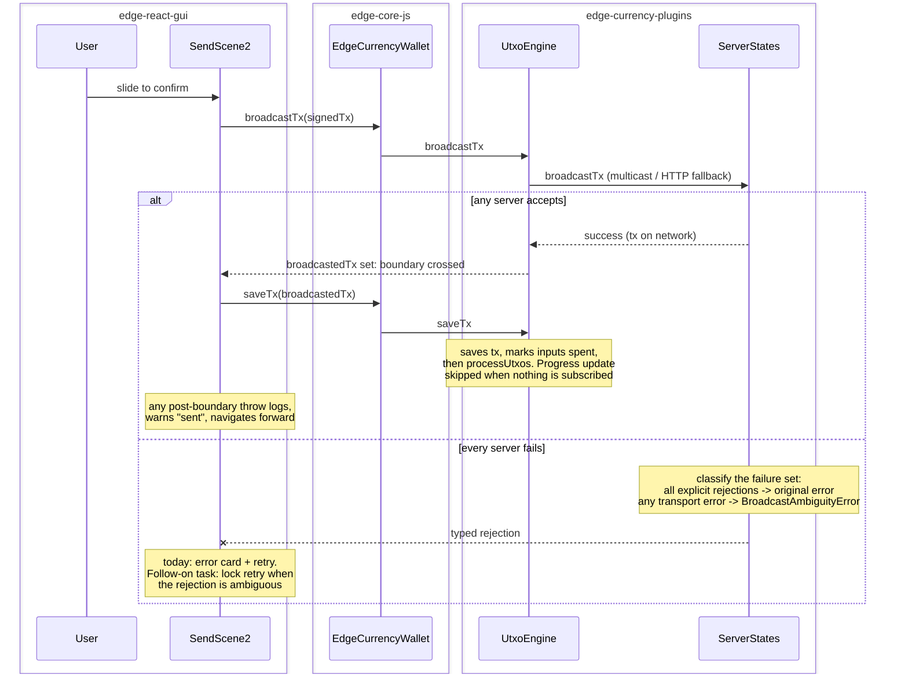

# Send failure after successful broadcast: one intended send must never become several real payments

| | |
|---|---|
| Status | Implemented |
| Author | Jon Tzeng (agent run) |
| Reviewer | peachbits |
| Last updated | 2026-08-14 |
| Repos | [edge-react-gui](https://github.com/EdgeApp/edge-react-gui), [edge-currency-plugins](https://github.com/EdgeApp/edge-currency-plugins) |
| Implementation | [edge-react-gui#6138](https://github.com/EdgeApp/edge-react-gui/pull/6138), [edge-currency-plugins#455](https://github.com/EdgeApp/edge-currency-plugins/pull/455) |
| Supersedes | - |
| Related | [Fix task](https://app.asana.com/1/9976422036640/project/1213843652804305/task/1217135300337949), [bug report](https://app.asana.com/1/9976422036640/project/1207384676342554/task/1217105293179192) |

File references point at the PR branches above (`jon/send-post-broadcast-failure` in both repos). Direction came from the fix task's description plus two review rounds: the task's pre-made choices are validated against alternatives in [Decisions](#9-decisions), and the choice review overturned is recorded there with the reasoning that overturned it.

## Contents

1. [Problem](#1-problem)
2. [Prior art](#2-prior-art-why-a-gui-only-fix-is-not-the-answer)
3. [Goals and non-goals](#3-goals-and-non-goals)
4. [Design overview](#4-design-overview)
5. [Detailed design: edge-currency-plugins](#5-detailed-design-edge-currency-plugins)
6. [Detailed design: edge-react-gui](#6-detailed-design-edge-react-gui)
7. [Testing](#7-testing)
8. [Phase history](#8-phase-history)
9. [Decisions](#9-decisions)
10. [References](#10-references)
11. [Post-implementation retrospective](#11-post-implementation-retrospective)

## 1. Problem

A user intended one Bitcoin send and five real payments left the wallet (bug report task, on-chain confirmed: 2c563f25 in block 960743, then 3d40c7ce, 0ecd2d00, 2d452603, 546528bf in 960745). The log-verified mechanism:

1. With all blockbook sockets down, `broadcastTx` fell back to HTTP NOWNode broadcast and SUCCEEDED every time (each broadcast shows `onNewTransactions` within about 400ms).
2. `UtxoEngine.saveTx` saved the transaction and marked its inputs spent, THEN called `processUtxos`, whose `updateProgressRatio` threw `No addresses to process` because zero addresses were subscribed.
3. SendScene2 treats anything thrown inside the submit try block as a failed send: an error card blaming the network, and a `finally` that re-arms the slider.
4. Because step 2 already marked the inputs spent, the scene re-quoted on the REMAINING UTXOs within seconds, so each retry slide was a fresh real payment. Three distinct payments happened inside 44 seconds; no confirmations were needed.

The engine fails a data write that already succeeded ([section 5](#5-detailed-design-edge-currency-plugins)), and the GUI presents any post-broadcast throw as a retryable send failure ([section 6](#6-detailed-design-edge-react-gui)); the two defects compound each other.

## 2. Prior art (why a GUI-only fix is not the answer)

The bug report's requirement reads "if transaction send fails in UI, funds should NEVER be sent". The first investigation pass established that the GUI alone cannot meet that: by the time anything throws past the broadcast call, the funds have moved, and a lost broadcast response is indistinguishable from a rejection at the client. The stealth-send branch the incident build shipped from was ruled out (byte-identical sign/broadcast/saveTx block vs develop); the causal code is published edge-currency-plugins 3.10.0. So the fix spans both repos: stop the engine from manufacturing post-broadcast failures, make broadcast failures carry an honest classification, and make the GUI classify the failures that remain by their boundary.

## 3. Goals and non-goals

Goals (the task's acceptance criteria, as amended by review):

- With sockets down and a successful HTTP-fallback broadcast, the app shows the send as sent, the slider does not re-arm, and no second payment is possible from retrying.
- `saveTx` on an engine that is not running resolves; unit-tested.
- A broadcast rejected explicitly by every server still reports failure and still allows retry; a broadcast whose failure set contains any transport error is distinguishable as ambiguous, because the transaction may have reached the network.

Non-goals:

- The GUI consumption of the ambiguity classification (locking the slider on ambiguous failures with may-have-worked and double-spend copy). That direction was agreed in review and is tracked as its own task; this work lands the engine groundwork it branches on.
- Client-side verification of whether an ambiguous broadcast reached the network. Removed after review; see [decision 3](#decision-3-classify-broadcast-failures-instead-of-querying-the-network).
- Houdini/stealth work (ruled out as a cause), rebroadcast queues, offline send queuing, external finality tracking.

## 4. Design overview

| Repo | Deliverable | Scope |
|---|---|---|
| edge-currency-plugins | [PR #455](https://github.com/EdgeApp/edge-currency-plugins/pull/455) | `saveTx` resolves while the engine is not running; exhausted broadcasts classified as explicit rejection vs ambiguous transport failure ([section 5](#5-detailed-design-edge-currency-plugins)) |
| edge-react-gui | [PR #6138](https://github.com/EdgeApp/edge-react-gui/pull/6138) | SendScene2 splits the submit flow at the broadcast boundary ([section 6](#6-detailed-design-edge-react-gui)) |

Neither PR depends on the other to build or pass CI; together they close the loop. The GUI fix alone stops the repeat-payment invitation for post-broadcast throws even against the released engine; the engine fix alone removes the incident's failure source and gives future GUI work a truthful failure taxonomy.



## 5. Detailed design: edge-currency-plugins

[PR #455](https://github.com/EdgeApp/edge-currency-plugins/pull/455) ships the engine-side changes.

**saveTx resolves while the engine is not running.** `updateProgressRatio` (`src/common/utxobased/engine/UtxoEngineProcessor.ts`) computes progress as `processedCount / (subscribed addresses x 2)`. The subscribe cache is empty when the engine was never started or was stopped and its task cache cleared; `startEngine`'s `initializeAddressSubscriptions` and `setLookAhead` are what fill it, network-free. `saveTx` still drives UTXO processing in those states, so the zero-denominator case returns without emitting and without counting the call as progress, as landed:

```ts
// With no subscribed addresses there is no denominator to compute a
// progress ratio from. The cache is empty when the engine is not running
// (never started, or stopped and its task cache cleared) while saveTx
// still drives UTXO processing. Skip the progress update, without
// counting the call as progress, rather than fail the caller's data
// write.
if (expectedProcessCount === 0) return

// Increment the processed count
processedCount = processedCount + 1
```

The increment sits below the guard because a denominator-less call that counted as progress would inflate the ratio of a later call (the first `saveTx`'s `setLookAhead` repopulates the cache, so a later call has a denominator) and could emit a fully-synced ratio and advance the seen-tx checkpoint on an engine that never synced. The fix-site choice is [decision 1](#decision-1-fix-savetx-at-the-progress-ratio-throw-not-by-catching-in-savetx).

**Exhausted broadcasts are classified, not investigated.** `ServerStates.broadcastTx` resolves on the first server success and rejects only when ALL servers fail, but a server can relay the transaction and still return an error or time out, so an all-failed broadcast does not prove the transaction is absent from the network. Every failure is collected and the terminal rejection is classified by `src/common/utxobased/engine/broadcastError.ts`, pure error-shape inspection with zero added network calls:

```ts
export const isExplicitBroadcastRejection = (error: unknown): boolean =>
  String(error instanceof Error ? error.message : error).includes(
    'Blockbook Error: '
  )

export const classifyBroadcastFailure = (
  errors: unknown[]
): 'rejected' | 'ambiguous' =>
  errors.length > 0 && errors.every(isExplicitBroadcastRejection)
    ? 'rejected'
    : 'ambiguous'
```

Three outcomes: a set containing any already-known rejection ("transaction already in block chain", "txn-already-in-mempool", "txn-already-known") RESOLVES the broadcast as a success, since a server confirming it already has the transaction proves it reached the network (this attempt or an earlier one with the same signed bytes, the incident's rapid-retry pattern). An all-rejected set rejects with the original error, which preserves every existing consumer (the dust mapping in `UtxoEngine.broadcastTx` included) and keeps definitively failed sends retryable. A set containing any transport failure rejects with `BroadcastAmbiguityError` (name-stable across the core bridge, causes attached), the hook the follow-on GUI task branches on. Electrum stub refusals, which provably never sent anything, are excluded from the determination. The choice of classification over the network query an earlier revision shipped is [decision 3](#decision-3-classify-broadcast-failures-instead-of-querying-the-network).

**A post-broadcast txid mismatch tracks the network's txid.** `UtxoEngine.broadcastTx` used to throw `broadcast response txid does not match original` AFTER a successful broadcast, a failure-after-success by construction. As landed, `engineProcessor.broadcastTx` returns the txid the network answered with (previously it discarded the response and returned the submitted txid, which made the comparison dead code), and on mismatch the engine logs a warning and returns `{ ...transaction, txid: id }` so the wallet tracks what the network accepted. Non-segwit formats make a genuine txid change possible. See [decision 4](#decision-4-log-the-txid-mismatch-and-track-the-networks-txid).

## 6. Detailed design: edge-react-gui

[PR #6138](https://github.com/EdgeApp/edge-react-gui/pull/6138) splits `SendScene2.handleSliderComplete` at the broadcast boundary.

- `let broadcastedTx: EdgeTransaction | undefined` is hoisted above the try block. It is assigned by exactly one statement (the `broadcastTx`/`alternateBroadcast` call), so `broadcastedTx != null` is precisely "the network has the transaction".
- The catch's first check, as landed:

```ts
if (broadcastedTx != null) {
  // The transaction is already on the network: funds have moved no
  // matter what threw. Presenting this as a send failure invites a
  // retry, and every retry after a successful broadcast is a fresh
  // real payment because the wallet re-quotes on the remaining UTXOs.
  logActivity(
    `Error after successful broadcastTx (txid ${
      broadcastedTx.txid
    }): ${String(err)}`
  )
  showWarning(lstrings.transaction_success_bookkeeping_error_message, {
    trackError: false
  })
  navigateForwardAsSent(broadcastedTx)
  return broadcastedTx
}
```

- `navigateForwardAsSent` is the success path's navigation (onDone callback or `transactionDetails` replace), extracted so both the success path and the post-broadcast error path run the identical forward navigation.
- The `finally` only re-arms the slider when `broadcastedTx == null`. Pre-broadcast failures (fee check, signing, an explicitly rejected broadcast) keep the existing error card and retry behavior.
- `handleSliderComplete` returns the broadcast transaction (or undefined) so the FIO no-bundled retry, which recursively awaits it, assigns the nested result to the outer invocation's `broadcastedTx`; without that, the outer `finally` would re-arm the slider after a nested attempt broadcast (caught in review). The SafeSlider prop keeps its void contract through a `handleSlideConfirm` wrapper.
- New string `transaction_success_bookkeeping_error_message`: "Your transaction was sent, but some final bookkeeping did not complete. It may take a moment to appear in your transaction list." Presentation choice is [decision 2](#decision-2-post-broadcast-errors-present-as-sent-warn-and-navigate-forward); surface choice is [decision 5](#decision-5-warning-drop-down-not-a-modal-or-toast).

The scene does not yet consume `BroadcastAmbiguityError`; an ambiguous rejection lands in the pre-broadcast failure path today. The follow-on task locks the slider and replaces the copy for that class.

## 7. Testing

1. **Unit (saveTx):** `test/common/utxobased/engine/saveTx.spec.ts` builds a never-started engine over the bitcoinTestnet fixture dataset (empty subscribe cache) and drives two chained `saveTx` calls (the second spends the first's output, so it runs with the denominator the first call's `setLookAhead` created). Asserts both transactions list, no fully-synced progress emission, and no seen-tx checkpoint advance. Red before the original fix with the incident's exact stack. The emission assertions are invariant guards: under this fixture the lookahead set is large, so two calls stay far from ratio 1 under either increment order; the increment-below-guard fix stands on inspection.
2. **Unit (classification):** `test/common/utxobased/engine/broadcastError.spec.ts` pins the taxonomy: already-known rejections are network confirmation (three message shapes, plus dust and transport negatives); all-explicit-rejection sets are `rejected`; any timeout, HTTP-status error, empty set, or undefined entry is `ambiguous`; Electrum stub refusals are excluded from the determination (stub plus rejection stays `rejected`, stub plus timeout stays `ambiguous`); `BroadcastAmbiguityError` keeps a bridge-stable name and carries its causes. Suite total: 1226 passing.
3. **In-app after-fix (iOS sim, Bitcoin testnet, real broadcast):** with an uncommitted throw injected immediately after `broadcastTx` returns, a real 1000-sat self-send showed the warning drop-down with the new copy, navigated forward to Transaction Details (real txid 0084c2c6), and never re-armed the slider.
4. **In-app before-fix (matched repro):** same hack on develop's SendScene2, same wallet, same running app: "Unexpected Error ... check your network connection" card plus a re-armed slider after a real broadcast, the incident presentation exactly.
5. **Genuine-failure regression:** pre-broadcast throws keep the retry path by construction (the split keys on `broadcastedTx != null`, which a failed broadcast never sets); engine-side, an all-rejected broadcast still rejects with the original error (case 2 pins it).

Hacks were required to reach the in-app states (per the task's review comment): the trigger needs a wallet whose sockets are down at the moment of an otherwise-successful broadcast, which a healthy sim cannot hold naturally. The injected-throw frames are marked HACKED in the PR evidence and the hack never touched a commit. The ambiguous-rejection path (all servers failing with transport errors while one relayed) has unit coverage only; it is not drivable on the sim without a network-partition harness.

## 8. Phase history

### Phase 1 (2026-08-04): full scope shipped

Sketch (task description) -> shipped: all four scope items landed as specified. Elaborations beyond the sketch: the txid-mismatch throw turned out to be dead code today; the (since removed) network-query checker covered both the blockbook and HTTP-fallback reject paths rather than one shared path; automated review caught that the FIO no-bundled retry's recursion could defeat the slider guard, fixed by propagating the nested broadcast result ([section 6](#6-detailed-design-edge-react-gui)).

### Phase 2 (2026-08-14): review round replaces the query with classification

| Item | Phase 1 shipped | Phase 2 shipped |
|---|---|---|
| Ambiguous broadcast handling | Immediate network query for the txid before rejecting | Query removed; failure-set classification with `BroadcastAmbiguityError` ([decision 3](#decision-3-classify-broadcast-failures-instead-of-querying-the-network)) |
| Progress counter | Incremented before the zero-denominator guard | Incremented after it; spec asserts no fabricated sync emissions |
| Empty-cache premise | Described as "disconnected engine" | Corrected to not-running engine (never started, or stopped with cache cleared), per review |
| txid mismatch | Log warning, return submitted txid | Log warning, return the network's txid; processor plumbs the response txid so the branch is live |
| Non-relay failures | (not modeled) | Electrum stub refusals excluded from the ambiguity determination |
| Already-known rejections | (lumped into rejected) | Resolve as success: the server's answer proves the transaction is on the network |

Drivers: the human review (CHANGES_REQUESTED: serial untimed network calls on the send path, the wrong-state comment, the counter bug, the stale-txid return), the review discussion that judged an immediate query unsound on timing grounds, and two automated review rounds (leftover progress counters surviving stop, the discarded response txid, Electrum stubs poisoning classification). All review threads addressed and resolved.

## 9. Decisions

The task description pre-made the chosen options for [decision 1](#decision-1-fix-savetx-at-the-progress-ratio-throw-not-by-catching-in-savetx) and [decision 2](#decision-2-post-broadcast-errors-present-as-sent-warn-and-navigate-forward); per the operator's review comment they are validated here against the alternatives, not just recorded. [Decision 3](#decision-3-classify-broadcast-failures-instead-of-querying-the-network) was pre-made, shipped, and then overturned by review; the current choice and the overturned one are both recorded.

### Decision 1: fix saveTx at the progress-ratio throw, not by catching in saveTx

The task offered two options: "either processUtxos tolerates an empty addressSubscribeCache or saveTx does not propagate that error."

- **Chosen: `updateProgressRatio` returns instead of throwing when the subscribe cache is empty, without counting the call as progress.** Evidence: the throw guards a progress computation, not a data write; with an empty cache there is literally no denominator. Every write `saveTx` cares about (transaction saved, UTXOs updated, balances emitted) happens before or independently of the ratio update. The no-count refinement came from review: a phantom count plus `setLookAhead`'s cache repopulation could otherwise fabricate a fully-synced emission and advance the seen-tx checkpoint on an engine that never synced.
- **Rejected: catch-and-log around `processUtxos` in `saveTx`.** It would also swallow REAL data-layer failures (a broken disklet write would report success), and because `processUtxos` loops scriptPubkeys, the throw aborts the loop partway: later addresses' UTXO sets would stay stale even though saveTx "succeeded". Fixing the root site processes every UTXO.
- **Rejected: skip the progress call inside `processDataLayerUtxos` when the cache is empty.** Behaviorally identical but scattered: the same guard would be owed at every other `updateProgressRatio` call site, and the invariant "no denominator means no ratio" belongs in the function that computes the ratio.
- Reopen if: progress accounting gains a saveTx-driven denominator, in which case the early return would hide a genuine accounting bug. The deeper flaw review surfaced (saveTx-driven processing counting toward sync progress at all, even with a denominator) is untouched here and belongs to any future progress-accounting rework.

### Decision 2: post-broadcast errors present as sent, warn, and navigate forward

The task decided: "post-broadcast errors log, inform ... and navigate forward as a success. The slider must not re-arm once a broadcast has succeeded."

- **Chosen: exactly that.** Evidence for "forward as success" over alternatives: the incident's cost lived entirely in the re-offer of the slider against a re-quoted (post-spend) UTXO set; removing the scene removes the invitation. The transaction really is sent, and the transaction list/details scene is the truthful destination (the engine had already processed every incident broadcast within 400ms).
- **Rejected: stay on the send scene with the slider disabled.** Strands the user on a dead scene with an error card that contradicts reality, and every path out of it reaches a fresh quote anyway. (The follow-on task's lock applies to AMBIGUOUS pre-boundary failures, where "sent" cannot honestly be claimed; past the boundary the send is certain and forward navigation is the honest presentation.)
- **Rejected: silent success (ignore the error entirely).** The error is real signal; logging alone buries the degraded state from the user and support.
- **Rejected: auto-retry the failed bookkeeping (re-call saveTx).** Papers over an engine bug with a race; the engine processes its own broadcast via `onNewTransactions` regardless.
- Reopen if: a post-broadcast error class emerges where the transaction is NOT on the network despite `broadcastTx` resolving; none is known.

### Decision 3: classify broadcast failures instead of querying the network

The task's pre-made choice was "on a broadcast error, query the txid; treat already-known as success", and phase 1 shipped it. Review overturned it; the query is removed.

- **Chosen: collect every server's failure and classify the set.** Already-known rejections resolve as success (the server's own answer proves the transaction is on the network; review caught that lumping these into "rejected" would re-invite the duplicate-payment retry). All remaining explicit Blockbook rejections: the servers received and refused the transaction, the same bytes will be refused again, retry is safe and necessary (fee or amount changes), so the original error propagates unchanged. Any transport failure in the set: one of those servers may have relayed the transaction before failing to answer, so the rejection is `BroadcastAmbiguityError` and the follow-on GUI task locks retry on it. Zero added network calls; the send path rejects as fast as it did before this PR.
- **Rejected (shipped in phase 1, then removed): query the network for the txid before rejecting.** Unsound on timing: the query fires the instant the last broadcast rejects, under the same network conditions that made the broadcast ambiguous, so in the exact race being defended against the relayed transaction has had no time to be indexed and the negative result proves nothing, while positives mostly fire when the network is healthy and broadcasts were not going to fail ambiguously. It also added serial, untimed network calls to the send path (review: up to ~60s of socket timeouts plus unbounded fetches before the user learns anything) and attached the NOWNodes api-key on a new, more frequent path.
- **Rejected: query with a propagation delay and retries.** Any delay constant is arbitrary, the wait blocks the send flow, and the engine's ordinary sync already is the reliable observer: `onNewTransactions` surfaces the transaction in the list whenever any server sees it, no timer needed.
- **Rejected: treat every broadcast error as possibly-sent.** Destroys the retry path for definitively rejected sends, which the classification preserves.
- Reopen if: a Blockbook version starts answering sendtx rejections in a shape the `Blockbook Error: ` marker misses, which would silently reclassify explicit rejections as ambiguous (friction, not fund risk: ambiguous is the safe direction).

### Decision 4: log the txid mismatch and track the network's txid

- **Chosen: `UtxoEngine.broadcastTx` logs a warning on response/txid mismatch and returns `{ ...transaction, txid: id }`, with the processor plumbing the server's response txid through.** The throw fired only AFTER the network accepted the transaction, a failure-after-success by construction. Returning the submitted txid (phase 1's version) would leave the wallet watching a transaction that never confirms, with the UTXOs stuck spent; tracking the network's txid keeps the wallet consistent with the chain. Review caught that the processor discarded the response txid, which kept the comparison dead; it now returns `serverStates.broadcastTx()`'s result, making the branch live.
- **Rejected: delete the comparison entirely.** The mismatch, if it ever fires, is real diagnostic signal.
- **Rejected: keep throwing.** Reports a send failure for a transaction the network accepted, the exact defect class this work removes.
- Reopen if: a unit harness reaches `UtxoEngine.broadcastTx` with a mocked server response; the live branch deserves a direct test it does not have.

### Decision 5: warning drop-down, not a modal or toast

The task left the copy and surface unspecified; this run picked both.

- **Chosen: `showWarning` (the yellow AlertDropdown) with a new localized string, `trackError: false`.** `showWarning`'s own contract is "some user-requested operation succeeds but with a warning", which is this case verbatim; it is visible over the forward navigation, self-dismisses, and needs no interaction.
- **Rejected: blocking modal.** Demands an acknowledgment tap for a state the user cannot act on, and doubles up with the success-scene navigation.
- **Rejected: toast.** Too transient for "your money moved but bookkeeping hiccuped".
- Reopen if: product wants the "sent" acknowledgment consolidated with the standard success modal copy.

## 10. References

- [Fix task 1217135300337949](https://app.asana.com/1/9976422036640/project/1213843652804305/task/1217135300337949) (scope, acceptance, decision provenance, review-discussion followup)
- [Bug report 1217105293179192](https://app.asana.com/1/9976422036640/project/1207384676342554/task/1217105293179192) (repro, log-corroborated timeline, on-chain verification)
- [Client log 2026-08-02T15:34:09.701Z_743530](https://logs1.edge.app/#/2026-08-02T15:34:09.701Z_743530_info)
- [edge-currency-plugins#455](https://github.com/EdgeApp/edge-currency-plugins/pull/455), [edge-react-gui#6138](https://github.com/EdgeApp/edge-react-gui/pull/6138)

## 11. Post-implementation retrospective

**Estimate vs. actuals**

| | Estimate | Actual |
|---|---|---|
| LOE (task field) | M (2-4h) | ~2.5h first segment; ~1.5h review round |
| Repos touched | 2 (GUI, Currp) | 2, as scoped |
| Scope items | 4 | 4 shipped; ambiguity handling reworked once after review |

**Where this document was wrong or silent**

1. [Section 5](#5-detailed-design-edge-currency-plugins) originally described the empty subscribe cache as "a disconnected engine"; review corrected the real states (never started, or stopped with the cache cleared), since a started engine's cache is populated network-free.
2. [Decision 3](#decision-3-classify-broadcast-failures-instead-of-querying-the-network) originally chose the network query and listed never-re-arm as a rejected alternative; review overturned the query on timing and latency grounds, and the review discussion adopted lock-on-ambiguous as the follow-on GUI direction.
3. Phase 1's version was silent on the progress-counter side effect of the zero-denominator return (the phantom increment); review found it and [section 5](#5-detailed-design-edge-currency-plugins) now carries the reasoning.

**What held**

- The task description's incident mechanism held exactly; every step reproduced as written (the before-fix sim drive is a frame-for-frame match of the incident presentation).
- The two-repo split held: neither PR needed the other to build, test, or verify, through both phases.
- The broadcast boundary (`broadcastedTx != null`) held as the GUI's single source of truth through the review round; no review finding touched it except the FIO recursion propagation, which reinforced it.

**Verification highlights**

- Regression test red-then-green with the incident's exact stack ([testing case 1](#7-testing)).
- Matched before/after testnet drives from the same running app, real broadcasts both times, PR-attached (evidence comment on [PR #6138](https://github.com/EdgeApp/edge-react-gui/pull/6138)).
- Classification taxonomy pinned by unit spec ([testing case 2](#7-testing)); suite at 1224 passing after the review round.
