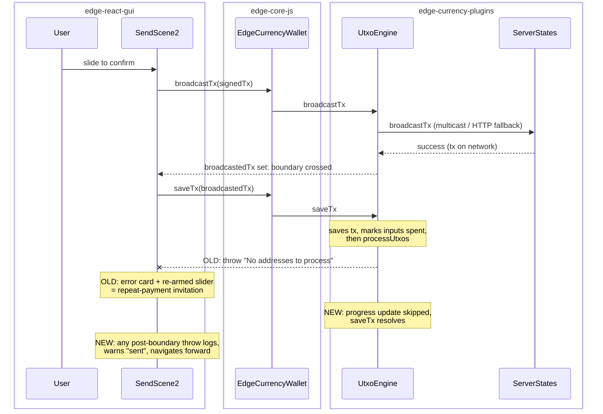

# Send failure after successful broadcast: one intended send must never become several real payments

| | |
|---|---|
| Status | Implemented |
| Author | Jon Tzeng (agent run) |
| Reviewer | - |
| Last updated | 2026-08-04 |
| Repos | [edge-react-gui](https://github.com/EdgeApp/edge-react-gui), [edge-currency-plugins](https://github.com/EdgeApp/edge-currency-plugins) |
| Implementation | [edge-react-gui#6138](https://github.com/EdgeApp/edge-react-gui/pull/6138), [edge-currency-plugins#455](https://github.com/EdgeApp/edge-currency-plugins/pull/455) |
| Supersedes | - |
| Related | [Fix task](https://app.asana.com/1/9976422036640/project/1213843652804305/task/1217135300337949), [bug report](https://app.asana.com/1/9976422036640/project/1207384676342554/task/1217105293179192) |

File references point at the PR branches above (`jon/send-post-broadcast-failure` in both repos). Direction came from the fix task's description, which pre-made the load-bearing choices from a log-corroborated incident analysis; this document validates those choices against their alternatives per the task's review comment.

## Contents

1. [Problem](#1-problem)
2. [Prior art](#2-prior-art-why-a-gui-only-fix-is-not-the-answer)
3. [Goals and non-goals](#3-goals-and-non-goals)
4. [Design overview](#4-design-overview)
5. [Detailed design: edge-currency-plugins](#5-detailed-design-edge-currency-plugins)
6. [Detailed design: edge-react-gui](#6-detailed-design-edge-react-gui)
7. [Testing](#7-testing)
8. [Phase history](#8-phase-history)
9. [Decisions](#9-decisions)
10. [References](#10-references)
11. [Post-implementation retrospective](#11-post-implementation-retrospective)

## 1. Problem

A user intended one Bitcoin send and five real payments left the wallet (bug report task, on-chain confirmed: 2c563f25 in block 960743, then 3d40c7ce, 0ecd2d00, 2d452603, 546528bf in 960745). The log-verified mechanism:

1. With all blockbook sockets down, `broadcastTx` fell back to HTTP NOWNode broadcast and SUCCEEDED every time (each broadcast shows `onNewTransactions` within about 400ms).
2. `UtxoEngine.saveTx` saved the transaction and marked its inputs spent, THEN called `processUtxos`, whose `updateProgressRatio` threw `No addresses to process` because zero addresses were subscribed, which is exactly the disconnected state.
3. SendScene2 treats anything thrown inside the submit try block as a failed send: an error card blaming the network, and a `finally` that re-arms the slider.
4. Because step 2 already marked the inputs spent, the scene re-quoted on the REMAINING UTXOs within seconds, so each retry slide was a fresh real payment. Three distinct payments happened inside 44 seconds; no confirmations were needed.

The engine fails a data write that already succeeded ([section 5](#5-detailed-design-edge-currency-plugins)), and the GUI presents any post-broadcast throw as a retryable send failure ([section 6](#6-detailed-design-edge-react-gui)); the two defects compound each other.

## 2. Prior art (why a GUI-only fix is not the answer)

The bug report's requirement reads "if transaction send fails in UI, funds should NEVER be sent". The first investigation pass established that the GUI alone cannot meet that: by the time anything throws past the broadcast call, the funds have moved, and a lost broadcast response is indistinguishable from a rejection at the client. The stealth-send branch the incident build shipped from was ruled out (byte-identical sign/broadcast/saveTx block vs develop); the causal code is published edge-currency-plugins 3.10.0. So the fix spans both repos: stop the engine from manufacturing post-broadcast failures, and make the GUI classify the failures that remain by their boundary.

## 3. Goals and non-goals

Goals (the task's acceptance criteria):

- With sockets down and a successful HTTP-fallback broadcast, the app shows the send as sent, the slider does not re-arm, and no second payment is possible from retrying.
- `saveTx` on a disconnected engine resolves; unit-tested.
- A genuinely failed broadcast (all servers refused, transaction unknown to the network) still reports failure and still allows retry.

Non-goals:

- Houdini/stealth work (ruled out as a cause).
- Rebroadcast queues or offline send queuing.
- External finality tracking; the bar is correct in-app presentation of what the network already accepted.

## 4. Design overview

| Repo | Deliverable | Scope |
|---|---|---|
| edge-currency-plugins | [PR #455](https://github.com/EdgeApp/edge-currency-plugins/pull/455) | `saveTx` resolves while disconnected; broadcast errors verified against the network before rejecting ([section 5](#5-detailed-design-edge-currency-plugins)) |
| edge-react-gui | [PR #6138](https://github.com/EdgeApp/edge-react-gui/pull/6138) | SendScene2 splits the submit flow at the broadcast boundary ([section 6](#6-detailed-design-edge-react-gui)) |

Neither PR depends on the other to build or pass CI; together they close the loop. The GUI fix alone stops the repeat-payment invitation even against the released engine; the engine fix alone removes the incident's failure source even for unfixed GUIs.



## 5. Detailed design: edge-currency-plugins

[PR #455](https://github.com/EdgeApp/edge-currency-plugins/pull/455) ships the engine-side changes:

**saveTx resolves while disconnected.** `updateProgressRatio` (`src/common/utxobased/engine/UtxoEngineProcessor.ts`) computes progress as `processedCount / (subscribed addresses x 2)`. With zero subscribed addresses it used to throw `No addresses to process`; it now returns without emitting, as landed:

```ts
// With no subscribed addresses there is no denominator to compute a
// progress ratio from. This is a legitimate state when processing is
// driven by saveTx on a disconnected engine (no blockbook sockets, so
// nothing is subscribed), so skip the progress update rather than fail
// the caller's data write.
if (expectedProcessCount === 0) return
```

The choice of this fix site over its alternatives is [decision 1](#decision-1-fix-savetx-at-the-progress-ratio-throw-not-by-catching-in-savetx).

**Broadcast rejection requires the transaction to be absent from the network.** `ServerStates.broadcastTx` resolves on the first server success and rejects only when ALL servers fail, but a server can relay the transaction and still return an error or fail to answer. Both all-failed paths (blockbook multicast and NOWNode HTTP fallback) now route through a checker before rejecting: query connected blockbooks (`blockbook.fetchTransaction(txid)`), then the NOWNode REST API (`GET <uri>/api/v2/tx/<txid>`); a transaction known to the network resolves the broadcast as a success, an unknown one rejects with the original error. See [decision 3](#decision-3-resolve-broadcast-ambiguity-by-querying-the-txid).

**The post-broadcast txid-mismatch throw is now a logged warning.** `UtxoEngine.broadcastTx` threw `broadcast response txid does not match original` AFTER a successful broadcast. Today that code is dead (`engineProcessor.broadcastTx` returns `transaction.txid` unconditionally), but it is a failure-after-success trap if the server response is ever plumbed back. See [decision 4](#decision-4-log-the-txid-mismatch-instead-of-throwing).

## 6. Detailed design: edge-react-gui

[PR #6138](https://github.com/EdgeApp/edge-react-gui/pull/6138) splits `SendScene2.handleSliderComplete` at the broadcast boundary.

- `let broadcastedTx: EdgeTransaction | undefined` is hoisted above the try block. It is assigned by exactly one statement (the `broadcastTx`/`alternateBroadcast` call), so `broadcastedTx != null` is precisely "the network may have the transaction".
- The catch's first check, as landed:

```ts
if (broadcastedTx != null) {
  // The transaction is already on the network: funds have moved no
  // matter what threw. Presenting this as a send failure invites a
  // retry, and every retry after a successful broadcast is a fresh
  // real payment because the wallet re-quotes on the remaining UTXOs.
  logActivity(
    `Error after successful broadcastTx (txid ${
      broadcastedTx.txid
    }): ${String(err)}`
  )
  showWarning(lstrings.transaction_success_bookkeeping_error_message, {
    trackError: false
  })
  navigateForwardAsSent(broadcastedTx)
  return broadcastedTx
}
```

- `navigateForwardAsSent` is the success path's navigation (onDone callback or `transactionDetails` replace), extracted so both the success path and the post-broadcast error path run the identical forward navigation.
- The `finally` only re-arms the slider when `broadcastedTx == null`. Pre-broadcast failures (fee check, signing, a broadcast rejection that survived the [engine-side ambiguity check](#5-detailed-design-edge-currency-plugins)) keep the existing error card and retry behavior.
- `handleSliderComplete` returns the broadcast transaction (or undefined) so the FIO no-bundled retry, which recursively awaits it, assigns the nested result to the outer invocation's `broadcastedTx`; without that, the outer `finally` would re-arm the slider after a nested attempt broadcast (caught in review). The SafeSlider prop keeps its void contract through a `handleSlideConfirm` wrapper.
- New string `transaction_success_bookkeeping_error_message`: "Your transaction was sent, but some final bookkeeping did not complete. It may take a moment to appear in your transaction list." Presentation choice is [decision 2](#decision-2-post-broadcast-errors-present-as-sent-warn-and-navigate-forward); surface choice is [decision 5](#decision-5-warning-drop-down-not-a-modal-or-toast).

## 7. Testing

1. **Unit (engine):** `test/common/utxobased/engine/saveTx.spec.ts` builds a never-started engine over the bitcoinTestnet fixture dataset (zero subscribed addresses, the disconnected state) and calls `saveTx` with a transaction spending a fixture UTXO and paying a fixture-owned address. Red before the fix with the incident's exact stack (`updateProgressRatio` -> `processDataLayerUtxos` -> `processUtxos` -> `saveTx`); green after. Full suite: 1219 passing.
2. **In-app after-fix (iOS sim, Bitcoin testnet, real broadcast):** with an uncommitted throw injected immediately after `broadcastTx` returns, a real 1000-sat self-send showed the warning drop-down with the new copy, navigated forward to Transaction Details (real txid 0084c2c6), and never re-armed the slider.
3. **In-app before-fix (matched repro):** same hack on develop's SendScene2, same wallet, same running app: "Unexpected Error ... check your network connection" card plus a re-armed slider after a real broadcast, the incident presentation exactly.
4. **Genuine-failure regression:** pre-broadcast throws keep the retry path by construction (the split keys on `broadcastedTx != null`, which a failed broadcast never sets); engine-side, an unknown txid still rejects with the original error (checker returns false on both query paths). Covered by the existing suite plus case 1.

Hacks were required to reach the state (per the task's review comment): the trigger needs a wallet whose sockets are down at the moment of an otherwise-successful broadcast, which a healthy sim cannot hold naturally. The injected-throw frames are marked HACKED in the PR evidence and the hack never touched a commit.

## 8. Phase history

### Phase 1 (2026-08-04): full scope shipped

Sketch (task description) -> shipped: all four scope items landed as specified; no mechanism divergence. Elaborations beyond the sketch: the txid-mismatch throw turned out to be dead code today (documented in [decision 4](#decision-4-log-the-txid-mismatch-instead-of-throwing)); the network-query checker covers both the blockbook and HTTP-fallback reject paths rather than one shared path; and automated review caught that the FIO no-bundled retry's recursion could defeat the slider guard, fixed by propagating the nested broadcast result ([section 6](#6-detailed-design-edge-react-gui)).

## 9. Decisions

The task description pre-made the chosen options for [decision 1](#decision-1-fix-savetx-at-the-progress-ratio-throw-not-by-catching-in-savetx), [decision 2](#decision-2-post-broadcast-errors-present-as-sent-warn-and-navigate-forward), and [decision 3](#decision-3-resolve-broadcast-ambiguity-by-querying-the-txid); per the operator's review comment they are validated here against the alternatives, not just recorded.

### Decision 1: fix saveTx at the progress-ratio throw, not by catching in saveTx

The task offered two options: "either processUtxos tolerates an empty addressSubscribeCache or saveTx does not propagate that error."

- **Chosen: `updateProgressRatio` returns instead of throwing when the subscribe cache is empty.** Evidence: the throw guards a progress computation, not a data write; with an empty cache there is literally no denominator. Every write `saveTx` cares about (transaction saved, UTXOs updated, balances emitted) happens before or independently of the ratio update.
- **Rejected: catch-and-log around `processUtxos` in `saveTx`.** It would also swallow REAL data-layer failures (a broken disklet write would report success), and because `processUtxos` loops scriptPubkeys, the throw aborts the loop partway: later addresses' UTXO sets would stay stale even though saveTx "succeeded". Fixing the root site processes every UTXO.
- **Rejected: skip the progress call inside `processDataLayerUtxos` when the cache is empty.** Behaviorally identical to the chosen fix but scattered: the same guard would be owed at every other `updateProgressRatio` call site (there are two more), and the invariant "no denominator means no ratio" belongs in the function that computes the ratio.
- Reopen if: progress accounting gains a saveTx-driven denominator (e.g. counting unsubscribed address activity), in which case the early return would hide a genuine accounting bug.

### Decision 2: post-broadcast errors present as sent, warn, and navigate forward

The task decided: "post-broadcast errors log, inform ... and navigate forward as a success. The slider must not re-arm once a broadcast has succeeded."

- **Chosen: exactly that.** Evidence for "forward as success" over alternatives: the incident's cost lived entirely in the re-offer of the slider against a re-quoted (post-spend) UTXO set; removing the scene removes the invitation. The transaction really is sent, and the transaction list/details scene is the truthful destination (the engine had already processed every incident broadcast within 400ms).
- **Rejected: stay on the send scene with the slider disabled.** Strands the user on a dead scene with an error card that contradicts reality (the send happened), and every code path out of it (back, re-enter) reaches a fresh quote anyway; the disabled state would need its own UX and still not tell the user the send went through.
- **Rejected: silent success (ignore the error entirely).** The error is real signal (the incident's underlying engine defect was visible only through this path); logging alone buries it from the user, and support would see "the app said success" with no trace of the degraded state.
- **Rejected: auto-retry the failed bookkeeping (re-call saveTx).** Retrying a throwing engine call from the GUI papers over an engine bug with a race; the engine processes its own broadcast via `onNewTransactions` regardless, which is why the incident's transactions all appeared in the list.
- Reopen if: a post-broadcast error class emerges where the transaction is NOT on the network despite `broadcastTx` resolving; none is known.

### Decision 3: resolve broadcast ambiguity by querying the txid

The task decided: "On a broadcast error, query the txid; treat already-known as success."

- **Chosen: on the all-servers-failed path, ask the network for the transaction before rejecting.** Evidence: `ServerStates.broadcastTx` resolves on FIRST success and rejects only when all fail, so one server relaying then erroring produces a client-visible "failure" for a sent transaction; the incident's first investigation pass flagged this exact path. The query reuses the same transports the broadcast used (connected blockbooks, NOWNode REST), so whenever a broadcast could have partially succeeded there is a transport to check it on.
- **Rejected: status quo (reject on all-failed).** Leaves the GUI as the only defense; a wallet with the GUI fix still shows a confusing "failed" for a sent transaction.
- **Rejected: treat every broadcast error as possible success (never re-arm retry).** Destroys the retry path for genuinely failed sends, which the task's acceptance explicitly preserves ("a genuinely failed broadcast ... still reports failure and still allows retry").
- Reopen if: a provider's tx-query endpoint starts returning known-txid for transactions it never relayed (cache poisoning), which would convert real failures into false successes; the checker requires the queried txid to match exactly.

### Decision 4: log the txid mismatch instead of throwing

- **Chosen: `UtxoEngine.broadcastTx` logs a warning on response/txid mismatch and returns the transaction.** Evidence: the throw fires only AFTER `engineProcessor.broadcastTx` resolved, i.e. after the network accepted the transaction; throwing there is by construction a failure-after-success. Today the branch is dead code (`engineProcessor.broadcastTx` returns `transaction.txid` unconditionally), so the change is also a guard against the trap re-arming when someone plumbs the real server response back.
- **Rejected: delete the comparison entirely.** The mismatch, if it ever fires, is real diagnostic signal (a server answering with a different txid); the warning keeps the signal without the failure.
- **Rejected: verify the mismatched txid against the network before deciding.** Adds a network round trip to a path that cannot currently execute; the [decision 3](#decision-3-resolve-broadcast-ambiguity-by-querying-the-txid) checker already covers the reachable ambiguity.
- Reopen if: the processor is changed to return the server's response txid; then the mismatch branch becomes reachable and deserves its own test.

### Decision 5: warning drop-down, not a modal or toast

The task left the copy and surface unspecified; this run picked both.

- **Chosen: `showWarning` (the yellow AlertDropdown) with a new localized string, `trackError: false`.** `showWarning`'s own contract is "some user-requested operation succeeds but with a warning", which is this case verbatim; it is visible over the forward navigation, self-dismisses, and needs no interaction.
- **Rejected: blocking modal (ButtonsModal like the success alert).** Demands an acknowledgment tap for a state the user cannot act on, and doubles up with the success-scene navigation.
- **Rejected: toast.** Too transient for "your money moved but bookkeeping hiccuped"; the drop-down persists long enough to read and carries the warning affordance.
- Reopen if: product wants the "sent" acknowledgment consolidated with the standard success modal copy.

## 10. References

- [Fix task 1217135300337949](https://app.asana.com/1/9976422036640/project/1213843652804305/task/1217135300337949) (scope, acceptance, decision provenance)
- [Bug report 1217105293179192](https://app.asana.com/1/9976422036640/project/1207384676342554/task/1217105293179192) (repro, log-corroborated timeline, on-chain verification, both agent analyses)
- [Client log 2026-08-02T15:34:09.701Z_743530](https://logs1.edge.app/#/2026-08-02T15:34:09.701Z_743530_info)
- [edge-currency-plugins#455](https://github.com/EdgeApp/edge-currency-plugins/pull/455), [edge-react-gui#6138](https://github.com/EdgeApp/edge-react-gui/pull/6138)

## 11. Post-implementation retrospective

**Estimate vs. actuals**

| | Estimate | Actual |
|---|---|---|
| LOE (task field) | M (2-4h) | ~2.5h wall clock, single session, both PRs + tests + this doc |
| Repos touched | 2 (GUI, Currp) | 2, as scoped |
| Scope items | 4 | 4 shipped, none descoped |

**Where this document was wrong or silent**

1. Silent on the txid-mismatch branch being dead code until implementation read the processor; [section 5](#5-detailed-design-edge-currency-plugins) and [decision 4](#decision-4-log-the-txid-mismatch-instead-of-throwing) now carry it.
2. The task sketched the ambiguity checker as one path; implementation needed it on both reject paths (blockbook and HTTP fallback), reflected in [section 5](#5-detailed-design-edge-currency-plugins).

**What held**

- The task description's mechanism analysis held exactly; every step reproduced as written (the before-fix sim drive is a frame-for-frame match of the incident presentation).
- The two-repo split held: neither PR needed the other to build, test, or verify.

**Verification highlights**

- Regression test red-then-green with the incident's exact stack ([testing case 1](#7-testing)).
- Matched before/after testnet drives from the same running app, real broadcasts both times, PR-attached ([testing cases 2-3](#7-testing); evidence comment on [PR #6138](https://github.com/EdgeApp/edge-react-gui/pull/6138)).
