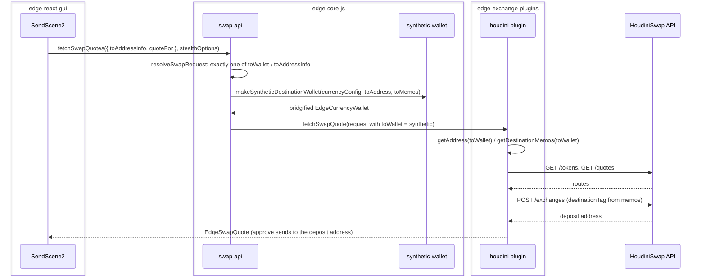

# Stealth Send and Stealth Swap: send to any address, on any chain, privately

| | |
|---|---|
| Status | Implemented (pending dependency publishes) |
| Author | Jon Tzeng |
| Reviewer | - |
| Last updated | 2026-08-27 |
| Repos | [edge-react-gui](https://github.com/EdgeApp/edge-react-gui), [edge-core-js](https://github.com/EdgeApp/edge-core-js), [edge-exchange-plugins](https://github.com/EdgeApp/edge-exchange-plugins) |
| Implementation | [edge-react-gui#6066](https://github.com/EdgeApp/edge-react-gui/pull/6066), [edge-core-js#730](https://github.com/EdgeApp/edge-core-js/pull/730), [edge-exchange-plugins#469](https://github.com/EdgeApp/edge-exchange-plugins/pull/469) |
| Supersedes | prototype PRs [#6054](https://github.com/EdgeApp/edge-react-gui/pull/6054), [#6031](https://github.com/EdgeApp/edge-react-gui/pull/6031) (kept open as reference) |
| Related | [Asana task](https://app.asana.com/0/1215088146871429/1216251688512498) |

This document describes what is built on branch `jon/stealth-send-swap` across the three repos above. Direction came from the Asana task and its UI proposal A, plus follow-up operator comments on the task. The code is the source of truth: every code block is quoted from the branch and captioned with a link pinned to the commit it was quoted from.

## Contents

1. [Problem](#1-problem)
2. [Prior art](#2-prior-art)
3. [Goals and non-goals](#3-goals-and-non-goals)
4. [Design overview](#4-design-overview)
5. [Detailed design: edge-core-js](#5-detailed-design-edge-core-js)
6. [Detailed design: edge-exchange-plugins](#6-detailed-design-edge-exchange-plugins)
7. [Detailed design: edge-react-gui](#7-detailed-design-edge-react-gui)
8. [The send scene UX, end to end](#8-the-send-scene-ux-end-to-end)
9. [Testing](#9-testing)
10. [Phase history](#10-phase-history)
11. [Decisions](#11-decisions)
12. [Glossary](#12-glossary)
13. [References](#13-references)
14. [Post-implementation retrospective](#14-post-implementation-retrospective)

## 1. Problem

Edge can send an asset to an address on its own chain, and it can swap between two wallets the user holds. It cannot do the thing users actually ask for: pay someone whose address is on a different chain, or send without the recipient being able to link the payment back to the sender's wallet.

Both limits show up in ordinary payment flows:

- **Cross-asset send.** A user holding ETH who owes someone 0.25 LTC has to swap ETH to LTC into their own wallet, then send. Two operations, two fees, and the swap leg needs a Litecoin wallet they may not want.
- **Privacy.** Every ordinary send writes a direct sender-to-recipient edge on chain. The recipient, and anyone reading the chain, can walk back to the sender's wallet and its balance history.

A swap provider that pays out to an arbitrary address solves both, because the provider address sits between sender and recipient. Edge's swap stack could not express that: `EdgeSwapRequest` required a `toWallet`, an `EdgeCurrencyWallet` the user owns.

## 2. Prior art

**Prototype PRs [#6054](https://github.com/EdgeApp/edge-react-gui/pull/6054) and [#6031](https://github.com/EdgeApp/edge-react-gui/pull/6031)** proved the flow but are not shippable. They add a parallel `HoudiniSendScene` reached by rerouting the wallet Send button from `TransactionListTop`, hardcode four destination chains with hand-written `memoNeeded` flags, recreate the price-delta UI that `SwapConfirmationScene` already has, and fake the destination wallet in GUI code. The fork means every other send entry point in the app keeps the old behavior.

**A GUI-built fake destination wallet** was tried first and does not work. The object has to cross the [yaob](#yaob) bridge into the core to reach the swap plugin, and a plain JavaScript object's function properties do not survive that wire format, so any plugin call on it fails. This is the finding that moved the synthetic wallet into the core, recorded in [Decision: build the synthetic destination wallet in the core](#build-the-synthetic-destination-wallet-in-the-core).

**Existing swap-provider address entry** (the "send to address" some providers expose) is not reusable either: it lives inside the swap scenes and assumes the user is trading between their own assets, so it does not give the send scene a destination.

## 3. Goals and non-goals

Goals:

- Send from any wallet to an address on any chain the provider serves, from the ordinary send scene.
- Offer a privacy-routed send (Stealth Send) and a privacy-routed swap (Stealth Swap) that pin the request to the privacy provider.
- Accept the recipient address through every entry path a user might reach for: paste, typed entry, and scanned QR.
- Leave every constrained send flow exactly as it is: payment protocol, [FIO](#fio) requests, deep links, and any caller that pre-locks tiles or takes over broadcast.

Non-goals:

- **Token destinations.** Only native chain assets are offered as a destination. `getHoudiniChain` returns `undefined` for a non-null `tokenId`, so the recipient picker lists chains only. Token sources are supported and tested.
- **Max spend in swap-send mode.** The plain-mode max flow is untouched; a swap-send max through the plugins' `getMaxSwappable` is deferred, see [Phase history](#10-phase-history).
- **Multiple recipients with swap-send.** Gated off in both directions, see [Multi-recipient gating](#multi-recipient-gating).
- **Telling two [EVM](#evm) chains apart from a bare address.** Physically impossible from the address alone; see [Decision: ask the user when the address format is ambiguous](#ask-the-user-when-the-address-format-is-ambiguous).

## 4. Design overview

| Repo | Deliverable | Scope |
|---|---|---|
| [edge-core-js#730](https://github.com/EdgeApp/edge-core-js/pull/730) | `toAddressInfo` on `EdgeSwapRequest`, core-built [synthetic destination wallet](#synthetic-destination-wallet) | [Section 5](#5-detailed-design-edge-core-js) |
| [edge-exchange-plugins#469](https://github.com/EdgeApp/edge-exchange-plugins/pull/469) | HoudiniSwap plugin, chain mapping, destination-[memo](#memo) threading | [Section 6](#6-detailed-design-edge-exchange-plugins) |
| [edge-react-gui#6066](https://github.com/EdgeApp/edge-react-gui/pull/6066) | Send scene becomes a send-to-address swap, Stealth toggles, cross-chain address entry | [Section 7](#7-detailed-design-edge-react-gui) |

The seam is one optional field. The GUI describes the destination as data (`toAddressInfo`); the core turns that description into an object shaped like a wallet; the plugin consumes it through the wallet surface it already knows. No plugin needs to learn about addresses-instead-of-wallets.



## 5. Detailed design: edge-core-js

### The request contract

`EdgeSwapRequest` gains one optional field, and `toWallet` becomes optional. Exactly one of the two must be present.

[`src/types/types.ts`](https://github.com/EdgeApp/edge-react-gui/blob/0d1074d79f46b50ab6a8c494a66dc476fc98074b/src/types/types.ts)
```ts
export interface EdgeSwapToAddressInfo {
  toPluginId: string
  toAddress: string

  /**
   * Destination memos (e.g. an XRP destination tag) for memo-required payout
   * chains. This descriptor field is only the GUI-to-core transport: swap
   * plugins never read it. The core copies it onto the synthetic destination
   * wallet, which exposes it through `getMemos` (see
   * `EdgeSyntheticDestinationWallet`), so plugins consume destination memos
   * through the wallet surface alone.
   */
  toMemos?: EdgeMemo[]
}

export interface EdgeSyntheticDestinationWallet extends EdgeCurrencyWallet {
  readonly getMemos: () => Promise<EdgeMemo[]>
}
```

The `getMemos` split matters: a descriptor field the plugin could read directly would give plugins two ways to find destination memos, one of which does not exist on real wallets. Routing memos through the wallet surface keeps one code path in the plugin.

### Resolving the request

`resolveSwapRequest` in `src/core/swap/swap-api.ts` enforces the exactly-one rule, validates the plugin and token exist, builds the synthetic wallet, and **drops the descriptor** from the resolved request:

[`src/core/swap/swap-api.ts`](https://github.com/EdgeApp/edge-core-js/blob/e2bef4ed8ca1e0c741f25aa008f2e120615de007/src/core/swap/swap-api.ts)
```ts
  // Drop the descriptor from the resolved request so it keeps exactly one
  // destination: a resolved request that rides back to the caller inside
  // `quote.request` must be re-submittable without tripping the
  // exactly-one-of rule above.
  return {
    ...request,
    toAddressInfo: undefined,
    toWallet: makeSyntheticDestinationWallet(currencyConfig, toAddress, toMemos)
  }
```

Dropping it is not tidiness. `quote.request` rides back to the GUI and can be resubmitted; leaving both fields set would make the resubmission throw.

### The synthetic wallet

`src/core/swap/synthetic-wallet.ts` builds an object backed by the real `EdgeCurrencyConfig` the core already holds, so `currencyInfo` and `allTokens` are authentic while the address accessors return the pasted address:

[`src/core/swap/synthetic-wallet.ts`](https://github.com/EdgeApp/edge-core-js/blob/e2bef4ed8ca1e0c741f25aa008f2e120615de007/src/core/swap/synthetic-wallet.ts)
```ts
export const SYNTHETIC_WALLET_ID_PREFIX = 'synthetic://'

export function makeSyntheticDestinationWallet(
  currencyConfig: EdgeCurrencyConfig,
  toAddress: string,
  toMemos: EdgeMemo[] = []
): EdgeCurrencyWallet {
```

The id prefix is a public contract: plugins branch on it to skip address-type lookups that make no sense for a single pasted address (see [Section 6](#6-detailed-design-edge-exchange-plugins)).

The wallet is bridgified so plugin calls work unchanged across the core's WebView boundary, and anything bridgified stays in [yaob](#yaob)'s object table until something closes it. One synthetic wallet is built per `fetchSwapQuotes` call and shared by every quote that call returns, and the caller reaches it through `quote.request.toWallet`, so it is released by reference count: closed when the last quote carrying it is closed, and immediately when no quote survives to carry it. Without that, every quote refresh on a swap-to-address screen would leave another wallet in the table for the life of the account. The same reasoning is why `resolveSwapRequest` reuses the account's long-lived `currencyConfig` instead of building one per request.

### Error reporting

`SwapCurrencyError` reads the destination pluginId from the descriptor when `request.toWallet` is absent, so a swap-to-address failure names the destination chain instead of throwing inside the error constructor.

[`src/types/error.ts`](https://github.com/EdgeApp/edge-core-js/blob/e2bef4ed8ca1e0c741f25aa008f2e120615de007/src/types/error.ts)
```ts
    const toPluginId =
      toWallet?.currencyConfig.currencyInfo.pluginId ??
      toAddressInfo?.toPluginId ??
      ''
```

## 6. Detailed design: edge-exchange-plugins

### Plugin identity and transport

[`src/swap/central/houdini.ts`](https://github.com/EdgeApp/edge-exchange-plugins/blob/b83888a640086966cf499293ac2d7a0943896c20/src/swap/central/houdini.ts)
```ts
export const swapInfo: EdgeSwapInfo = {
  pluginId,
  isDex: false,
  displayName: 'HoudiniSwap',
  supportEmail: 'support@houdiniswap.com'
}
```

Two transport facts decide whether any call works at all, and neither is obvious:

- Auth is `Authorization: <key>:<secret>` with no `Bearer` prefix. Every endpoint returns 402 without it.
- The partner API is server-to-server and answers browser-origin requests with 403. The core runs plugins inside a WebView, so `io.fetch` carries `Origin` / `Sec-Fetch-*` headers. Every call therefore passes `corsBypass: 'always'`, which routes through the native fetch host-side and matches the contract the API expects.

### Destination handling

The plugin reads the destination through the wallet surface, with two branches for the synthetic case:

[`src/swap/central/houdini.ts`](https://github.com/EdgeApp/edge-exchange-plugins/blob/b83888a640086966cf499293ac2d7a0943896c20/src/swap/central/houdini.ts)
```ts
async function getDestinationMemos(
  toWallet: EdgeCurrencyWallet
): Promise<EdgeMemo[]> {
  const { getMemos } = toWallet as EdgeCurrencyWallet &
    SyntheticDestinationMethods
  if (getMemos == null) return []
  return await getMemos()
}
```

and, in `fetchSwapQuoteInner`:

[`src/swap/central/houdini.ts`](https://github.com/EdgeApp/edge-exchange-plugins/blob/b83888a640086966cf499293ac2d7a0943896c20/src/swap/central/houdini.ts)
```ts
    // A synthetic (swap-to-address) destination holds exactly one pasted,
    // caller-validated address, so a typed-address lookup does not apply.
    const isSyntheticDestination = toWallet.id.startsWith(
      SYNTHETIC_WALLET_ID_PREFIX
    )
```

Memos become `destinationTag` on order creation, which is what [memo](#memo)-required chains (XRP, XLM, Cosmos Hub, Hedera, Thorchain) need to credit the payment.

### Chain mapping

`src/mappings/houdini.ts` maps every Edge `EdgeCurrencyPluginId` to a Houdini chain `shortName`, or `null` where Houdini has no compatible chain. [IBC](#ibc)-family chains (coreum, osmosis, axelar) are deliberately `null`: Houdini reports no `memoNeeded` flag and a permissive `^.*$` address validation for them, so their payout semantics are not trustworthy enough to offer.

The table answers what Houdini calls a chain, not whether Houdini serves it. Those are different questions with different lifetimes: the name is stable, while what is served changes whenever the provider adds or drops a native coin. Whether a chain has a tradable native is discovered at runtime by `resolveTokenId`, which declines with the same `SwapCurrencyError` `checkWhitelistedMainnetCodes` raises, so a mapped-but-unserved name costs one memoized lookup rather than a wrong answer. `celo`, `fantom` and `polkadot` are absent from `GET /tokens?mainnet=true` entirely and `ton` carries one token and no native, and all four decline through that path without the table having to say so. Houdini does serve DOT, under the chain name `AssetHub` rather than `polkadot`; that remapping is untested and deliberately not made here.

The memoization is what makes this affordable. `resolveTokenId` caches misses as well as hits, so an unserved chain is asked about once per ten-minute window instead of once per quote. The window matters in both directions: without it, a chain Houdini lists later in the session stays refused until the app restarts, which is the failure `.cursor/BUGBOT.md`'s `catalog-cache-expiry` rule exists to prevent for exactly this kind of provider catalog. A lookup the provider FAILED to answer is deliberately not cached at all: a rate limit or a server error says nothing about whether the chain is served, and caching it would turn one bad minute into a chain that stays dead for the rest of the window.

### Route selection

Quotes are filtered by route type, and the caller decides which types are acceptable:

[`src/swap/central/houdini.ts`](https://github.com/EdgeApp/edge-exchange-plugins/blob/b83888a640086966cf499293ac2d7a0943896c20/src/swap/central/houdini.ts)
```ts
    const privateOnly = request.privacy === 'required'
    const candidateQuotes = quotes
      .filter(
        (quote): quote is HoudiniQuote =>
          quote != null &&
          (quote.type === 'private' ||
            (!privateOnly && quote.type === 'standard'))
      )
```

A request carrying `privacy: 'required'` takes `private` (multi-exchange) routes only, which is what makes Stealth private. Without it, `standard` routes are acceptable too, ranked below private. The distinction decides what a user can send: Houdini serves no private route under 25 USD but serves standard routes down to 10, so a plain Swap & Send between those two figures is only possible on a standard route, while a Stealth Send at the same amount has nothing to route through. See [Minimum order sizes](#minimum-order-sizes).

A `standard` route still settles through Houdini, so the recipient never sees the sender's address, but it uses a single exchange leg that can relink the two sides. That is why a privacy request must decline rather than accept one: the caller has no way to inspect which route it got, so a silent downgrade would be undetectable.

Houdini prices exact-out on fixed-rate quotes alone, which its private routing does not serve, so a privacy request priced by the receive side finds nothing and declines. The send scene answers that by re-pricing from the send side and keeping its privacy, which is the [fixed-to fallback](#availability-fallbacks) it already had.

This filter is the reason a live availability change on the provider's side can disable forward swap-to-address sends without any code change here; see [Retrospective item 2](#where-this-document-was-wrong-or-silent).

### Rate limits

Houdini is an aggregator behind Cloudflare, and tight request loops get blocked in a way that poisons the answers: a 429 arriving where a quote was expected reads exactly like an unavailable pair, and caching that verdict would teach the UI something false. Every call therefore goes through one wrapper that retries a 429 behind the `retryAfter` the API reports, doubling on top of it so a burst does not re-collide the moment the window reopens, and gives up after three attempts with an error that says rate limit rather than unavailable. Since only a plain `Error` comes back, the send scene's `SwapCurrencyError` branch never fires, so no `routeCaps` entry is written and no toggle turns itself off on the strength of a throttled request.

Two bounds sit on that retry, and they pull in opposite directions. The doubling is capped, but the cap bounds OUR OWN growth only: the window the API asked for always survives it, because retrying inside a window the provider named just draws another 429 and spends the budget for nothing. Against that, a retry is only worth waiting for if what it resends is still alive when the wait ends. Houdini quote ids live about a minute and the exchange budget reports `retryAfter` near sixty seconds, so honoring the window and re-POSTing the same quote id hangs the user for a minute and then fails as an expired quote, blaming the wrong thing. The create-exchange call therefore passes the candidate quote's own expiry into the wrapper, and a wait that would land past it fails immediately as a rate limit. `validUntil` arrives as Unix seconds inside a string, which `new Date` reads as an invalid date, so the parse reads the number first.

The `max` path is the other place the exchange budget bites. `getMaxSwappable` runs the quote function once to size the spend and the real quote runs it again, so creating an order on the sizing pass spends one of the one-per-minute slots and guarantees the real create is throttled. The sizing pass builds its spend shape from the quote alone, standing in the user's own refund address for the deposit address it does not have.

Standing in the user's own address is what forces the other two properties of that probe. An [EVM](#evm) engine compares a spend target against its own public key, which IS the address, and rejects the match with `SpendToSelfError`; that error escapes `getMaxSwappable` and fails every max swap from an EVM wallet unless the probe's `spendInfo` sets `skipChecks: true`. And the probe deliberately quotes the full PRE-FEE balance to find the ceiling, so an above-limit balance has to clamp through `getMaxSpendable` rather than throw `SwapAboveLimitError` and abort a max swap that fits once the network fee comes off: the route maximum is enforced on the real quote only. Both are pre-PR checklist items in `docs/CREATING_AN_EXCHANGE_PLUGIN.md` and both are modelled in `src/swap/central/template.ts`.

### Amount safety

Three rules govern every amount that crosses the provider boundary, and all three come from the repo's own checklist rather than from anything Houdini-specific.

Provider amounts arrive as JSON floats, so they reach `biggystring` through `floatToDecimalString`, which expands scientific notation at both ends of the range. Comparison and sorting go through `biggystring` too, not through the floats: `String(smallFloat)` can produce notation that a string comparison misreads, and the rule covers ranking as much as arithmetic.

Rounding to whole atomic units has a DIRECTION, and it is not cosmetic. A minimum rounds UP, so the floor Edge enforces never lands below the provider's own and a deposit is not rejected on arrival. A maximum, the receive amount, and the deposit amount round DOWN, so none of them is ever larger than what the provider will honor.

The deposit amount is also a trust boundary. `order.inAmount` comes back from Houdini and becomes a signed spend, so a `from` quote refuses an order asking for more of the source asset than the user requested. Only a `from` quote can make that comparison: on a reverse (`to`) quote the user pinned the receive amount, so the send side is the provider's to price and there is nothing local to bound it against.

Their published tiers are 5 quote requests per minute on free and 500 on pro. Nothing in the app probes them; the wrapper is the only rate-limit machinery, per the no-probing rule in [Learn route availability from live failures](#learn-route-availability-from-live-failures-not-probes-or-tables).

### What the plugin reports as fixed

Only the exact-out path sends `fixed=true`, and that is the only path Houdini serves fixed rates on, so `isEstimate` is `!reverseQuote` rather than a constant. A forward quote reports itself as an estimate whether its route is private or standard, because its rate can still move. `makeSwapPluginQuote` reads `isEstimate` off the saved action, so the quote and the transaction details agree from one source.

### Same-asset is allowed here, and only here

Every other central swap plugin rejects a swap from an asset to itself through the shared `checkInvalidTokenIds`, which is right for a provider where it would be a no-op the user cannot have meant. Routing an asset to itself through a mixer is this provider's main flow, so the shared helper grew an `allowSameAsset` option that Houdini passes and nothing else sets. The blocked-token half of that helper still applies here; only the same-asset rejection is waived.

## 7. Detailed design: edge-react-gui

### Where the feature is allowed to appear

`SendScene2` gains the feature in place rather than in a parallel scene. The gate is a single predicate:

[`src/components/scenes/SendScene2.tsx`](https://github.com/EdgeApp/edge-react-gui/blob/0d1074d79f46b50ab6a8c494a66dc476fc98074b/src/components/scenes/SendScene2.tsx)
```ts
  const swapSendAllowed =
    lockTilesMap.address !== true &&
    lockTilesMap.amount !== true &&
    lockTilesMap.wallet !== true &&
    hiddenFeaturesMap.address !== true &&
    hiddenFeaturesMap.amount !== true &&
    fioPendingRequest == null &&
    onDone == null &&
    alternateBroadcast == null &&
    beforeTransaction == null &&
    initSpendInfo?.spendTargets[0]?.publicAddress == null
```

Every constrained caller fails at least one clause, so payment protocol, [FIO](#fio) requests, deep links, and any caller taking over broadcast keep today's behavior exactly. The last clause is also why deep links do not enter this flow: they pre-fill an address.

Activation is then:

[`src/components/scenes/SendScene2.tsx`](https://github.com/EdgeApp/edge-react-gui/blob/0d1074d79f46b50ab6a8c494a66dc476fc98074b/src/components/scenes/SendScene2.tsx)
```ts
  const destPluginId = recipientPluginId ?? pluginId
  const sameAsset = destPluginId === pluginId && tokenId == null
  const crossAssetPicked = recipientPluginId != null && !sameAsset
  const crossAsset = !sameAsset
  const swapSendActive = swapSendAllowed && (stealth || crossAssetPicked)
```

The two cross-asset booleans answer different questions and a token source is where they part. `crossAssetPicked` is what turns a plain send into a swap-send on its own, and it is also the test for whether switching Stealth off would help: without an adopted recipient asset, the toggle is the only thing making this a swap. `crossAsset` labels the flow, and a token send to its own chain pays out that chain's native asset, so it crosses assets even though nobody picked a recipient. Reading one where the other belongs titled such a send "Stealth Send".

`recipientPluginId` never names the source chain, because the picker never offers it: its first row already stands for the source chain, and a second row for the same chain quotes identically while flipping `crossAssetPicked`. Two rows that produce one order and recover from a missing route two different ways are not a choice a user can make deliberately.

### Quote request

When active, the scene requests a quote instead of building a spend. `makeSpend` is skipped entirely (`if (swapSendActive) { setEdgeTransaction(null); … return }`) because the transaction comes from the quote.

Stealth restricts the request to the privacy provider through a shared helper, `src/util/stealthSwap.ts`, used by both the send scene and the swap scene:

[`src/util/stealthSwap.ts`](https://github.com/EdgeApp/edge-react-gui/blob/0d1074d79f46b50ab6a8c494a66dc476fc98074b/src/util/stealthSwap.ts)
```ts
export function makeStealthSwapRequestOptions(
  account: EdgeAccount,
  opts: EdgeSwapRequestOptions = {},
  flags: StealthSwapFlags = {}
): EdgeSwapRequestOptions {
  const disabled: EdgePluginMap<true> = { ...opts.disabled }
  for (const swapPluginId of Object.keys(account.swapConfig)) {
    if (swapPluginId !== 'houdini') disabled[swapPluginId] = true
  }
  return {
    ...opts,
    disabled,
    forceEnabled:
      flags.ignoreProviderSetting === true
        ? { ...opts.forceEnabled, houdini: true }
        : opts.forceEnabled,
    preferPluginId: undefined,
    preferType: undefined
  }
}
```

Clearing `preferPluginId`/`preferType` matters: a user's saved provider preference would otherwise fight the restriction. `ignoreProviderSetting` is how the send path opts out of the account's exchange settings, per [Provider availability versus exchange settings](#provider-availability-versus-exchange-settings); the Exchange scene leaves it unset.

Every send-to-address quote goes through these options, stealth toggle on or off: send-to-any is a privacy feature and is Houdini-exclusive by operator direction. Making the restriction conditional on the toggle (`stealth ? ... : undefined`) breaks that guarantee, whatever a stale description elsewhere may say; the reasoning is in [Decision: send-to-any is Houdini-exclusive, toggle or no toggle](#send-to-any-is-houdini-exclusive-toggle-or-no-toggle).

### Linked amounts

"You send" and "Recipient gets" are linked through one piece of state, `guaranteedSide`. The edited side is guaranteed and the other tracks the live quote as an estimate. Each row says which it is in its own title rather than under the amount: `You send (Guaranteed)` with the state word in green, `Recipient gets (Estimated)` with it in warning orange, so the amount is the last thing on the row and the pair reads as one line each. The estimated side keeps the `~` prefix on its number. `EdgeRow` renders the word from a `titleState` node, which is how a row tints part of its header without rebuilding the shared header style. Editing "Recipient gets" issues `quoteFor: 'to'`, a reverse quote.

Both amounts are entered through the standard crypto/fiat flip input (`FlipInputModal2`), committed on close so quotes still fire per commit rather than per keystroke; a zero or untouched amount is a dismissal. Max is hidden because max spend is not offered in swap-send mode. The destination side has no wallet, so its modal borrows the user's own wallet on the destination chain for denominations and rates (with a plain text modal as the fallback when no such wallet exists); the borrowed wallet's balance row reads as that wallet's balance, which is cosmetic noise accepted for reusing the standard modal.

Both sides open on **fiat**. That is what the Exchange scene's two inputs and the plain send both do, so opening on crypto made this scene the only amount entry in the app that did not; it is also the denomination the decision is actually made in here, since the provider states its floors in USD and a cross-asset pair has no common crypto unit to compare its two sides in. The one entry still denominated in crypto is the no-destination-wallet fallback: a plain text modal has no rate to price against, and the account holding no wallet on the destination chain is exactly the case where no rate is guaranteed to be loaded. `FlipInputModalResult` does not report which side the user finished on, so nothing remembers a per-session preference; the Exchange scene does not either, and one fixed opening denomination beats two divergent memories.

### Cross-chain address entry

A destination on another chain cannot go through the source wallet's `parseUri`, so `AddressTile2` takes two hooks. The first validates a known-cross-chain address against the destination chain's own regex. The second, `onUnparsedAddress`, is the one that makes the feature discoverable:

[`src/components/tiles/AddressTile2.tsx`](https://github.com/EdgeApp/edge-react-gui/blob/0d1074d79f46b50ab6a8c494a66dc476fc98074b/src/components/tiles/AddressTile2.tsx)
```ts
  onUnparsedAddress?: (
    address: string,
    addressEntryMethod: AddressEntryMethod
  ) => Promise<boolean>
```

It fires when this wallet's chain cannot read the input, immediately before the invalid-address toast. Because it hangs off `changeAddress`, which every entry affordance funnels through, one hook covers Paste, Enter address, and Scan at once.

`SendScene2`'s handler detects the chain, adopts it as the recipient asset, and applies the address. Chain detection lives in `src/util/houdiniChains.ts`:

[`src/util/houdiniChains.ts`](https://github.com/EdgeApp/edge-react-gui/blob/0d1074d79f46b50ab6a8c494a66dc476fc98074b/src/util/houdiniChains.ts)
```ts
export function detectHoudiniChains(
  text: string,
  opts: {
    /** The sending wallet's chain. */
    sourcePluginId: string
    /** The sending wallet's token, or `null` for the chain's own coin. */
    sourceTokenId: string | null
    /** Whether the account has a currency plugin for this chain. */
    isSupported: (pluginId: string) => boolean
  }
): HoudiniChain[]
```

A URI scheme names its chain outright and wins. A bare address is matched against each served chain's regex; several chains share a format, so every match is returned and the caller disambiguates. The source chain is dropped from the candidates only when the source IS that chain's coin: from a TOKEN it is a real destination, since USDC on Ethereum paying out native ETH is a cross-asset route no plain send can make, and dropping it left a pasted `0x` address offering every other [EVM](#evm) network but not the one the recipient holds. The chain table entry is:

[`src/util/houdiniChains.ts`](https://github.com/EdgeApp/edge-react-gui/blob/0d1074d79f46b50ab6a8c494a66dc476fc98074b/src/util/houdiniChains.ts)
```ts
export interface HoudiniChain {
  pluginId: string
  houdiniShortName: string
  memoNeeded: boolean
  hasSelfPrivate: boolean
  addressValidation: RegExp
}
```

`HOUDINI_CHAINS` is a snapshot of Houdini's mainnet native tokens (v2 partner API, re-fetched 2026-07-30) intersected with Edge pluginIds. The table holds 34 chains, 5 of them [memo](#memo)-required (`cosmoshub`, `hedera`, `ripple`, `stellar`, `thorchainrune`). Two of the provider's published regexes are corrected in the table with the reason inline; see [Decision: correct the provider's address regexes rather than route around them](#correct-the-providers-address-regexes-rather-than-route-around-them). `hasSelfPrivate` is covered in [Same-asset private capability](#same-asset-private-capability).

Because `setRecipientPluginId` has not re-rendered when the address is applied, the detected chain is threaded through the result object rather than read back from state:

[`src/components/scenes/SendScene2.tsx`](https://github.com/EdgeApp/edge-react-gui/blob/0d1074d79f46b50ab6a8c494a66dc476fc98074b/src/components/scenes/SendScene2.tsx)
```ts
      // A destination detected from the address itself makes this a cross-asset
      // send. `setRecipientPluginId` has not re-rendered yet, so the routing
      // below reads the detected chain rather than the stale render-time state.
      const uriGuaranteesReceiveSide =
        detectedDestPluginId != null || (swapSendActive && !sameAsset)
```

### Payment URI amounts

A scanned QR carries a payment URI, not a bare address. `src/util/paymentUri.ts` splits one generically, with no chain-specific parser, because the destination chain has no wallet whose `parseUri` could do it:

[`src/util/paymentUri.ts`](https://github.com/EdgeApp/edge-react-gui/blob/0d1074d79f46b50ab6a8c494a66dc476fc98074b/src/util/paymentUri.ts)
```ts
export interface ParsedPaymentUri {
  addressCandidates: string[]
  displayAmount?: string
  scheme?: string
}
```

Candidates are returned in priority order (raw trimmed text, scheme-prefixed path, naked path) so [cashaddr](#cashaddr)-style addresses that keep their `prefix:` on chain still validate.

A URI amount is what the recipient should **receive**, so for a cross-asset destination it sets the receive side as guaranteed and lets the quote price the send side. Same-asset (stealth) sends keep it on the send side, because the provider offers no receive-priced route when source and destination assets match; guaranteeing the receive side there would make every same-asset payment URI unquotable.

### Availability fallbacks

Whether the provider offers a private route, or a receive-priced (fixed) route, is a live property of each pair. The scene learns it from real quote failures. A `SwapCurrencyError` while the receive side is guaranteed flips the guarantee to the send side, seeds the send amount from display exchange rates so the send stays actionable, and raises a warning card that clears on the next amount edit. One while stealth is on for a **same-asset** pair turns the toggle off (toast, persistent info line) and degrades the swap into the plain direct send the toggle had upgraded. A **cross-asset** pair with no route keeps the plain error card: the request is Houdini-only with or without the toggle, so flipping it changes nothing and there is no other provider to degrade into. Learned capabilities are cached per pair in session state (`routeCaps`), so a later attempt to re-arm the toggle or re-fix the receive amount answers with a pre-emptive toast instead of another doomed quote. The full branch structure is the flowchart in [Section 8](#8-the-send-scene-ux-end-to-end).

Two effects write the scene's single `error` state, the quote effect and the plain-send `makeSpend` effect, and each retracts only its own message when the other takes over. Entering swap-send mode clears a plain-send failure so an insufficient-funds message cannot sit over a valid quote; leaving it clears the swap's failure so a minimum-amount message cannot sit over the plain send the user switched to. Provenance is tracked rather than guessed, because clearing unconditionally in either direction wipes the other effect's answer.

The toggle is a dependency of the quote effect, so flipping it always invalidates the held quote and re-fetches. It has to be: the request now carries `privacy: 'required'` only when stealth is on, and the floor that applies changes with it, so the two states genuinely ask the provider different questions. An earlier revision left `stealth` out on the grounds that the request did not vary with it, which was true then and is not now; a cross-asset pair would have shown standard-route pricing under a Stealth label.

### Minimum order sizes

Houdini enforces its own minimum per route type, in USD. The figures live as named constants (`HOUDINI_MIN_USD` in `src/util/houdiniChains.ts`) with the provider's guidance quoted beside them, rather than as literals at the call sites:

| Route | Minimum | Used by |
|---|---|---|
| private | 25 USD | every Stealth flow, including same-asset |
| standard | 10 USD | plain Swap & Send |
| [dex](#dex) | 5 USD | assets carrying `hasDex` |

These were confirmed against the live v2 API before being written down, not taken on the provider's word. Cross-asset TRX to LTC answered `422 Amount is too low, minimum is 10 USD` at 8 USD, returned standard routes only from 12 through 24 USD, and added private routes from 25 up. Same-asset TRX to TRX answered `422 Amount is too low, minimum is 25 USD` below 25 and returned private routes only above it. Both match the stated floors.

The scene enforces them before any request goes out. Under the private floor the Stealth toggle refuses to arm and explains why; under the applicable floor the quote effect returns an under-minimum error instead of calling the API. Pre-empting matters for more than tidiness: a user thumbing through small amounts would otherwise spend the provider's rate limit on requests whose refusal is already known, and those 429s come back looking like unavailable routes.

Floors are not the whole story. Individual tokens carry higher server-side minimums that cannot be known upfront (Polygon private is effectively 60 USD against a 25 USD floor). Those arrive as quote errors carrying the real figure, and the error card shows the provider's own message, per [Phase 9](#phase-9-real-failures-in-the-error-ui). Clearing the floor is necessary, never sufficient.

### Destination assets are route-derived

Every surface that decides whether an asset can be a send-to-address destination reads the route metadata (`HOUDINI_CHAINS` through `getHoudiniChain`), never a hardcoded asset shape. That covers address detection, the recipient-asset picker, quote gating, and the "Myself" picker. Tokens are absent from all of them for one reason: `getHoudiniChain` returns undefined for a non-null `tokenId`. When the provider serves token destinations, relaxing that one function surfaces them everywhere at once.

### What the recipient receives

The "Recipient receives" row and the picker that edits it name one asset, computed once:

[`src/util/houdiniChains.ts`](https://github.com/EdgeApp/edge-react-gui/blob/0d1074d79f46b50ab6a8c494a66dc476fc98074b/src/util/houdiniChains.ts)
```ts
  return swapSendActive
    ? { pluginId: destPluginId, tokenId: null }
    : { pluginId: sourcePluginId, tokenId: sourceTokenId }
```

A swap-send pays out the destination chain's native asset, because the quote asks for `toTokenId: null` and token destinations are not offered; a plain send delivers the source asset verbatim, token included. Deciding that separately in the row and in the picker is what let them disagree: the picker offered a USDT wallet "Tether (USDT)" and the row underneath then read "Ethereum (ETH)".

The picker's rows are keyed on the asset rather than on its label. A display name is not an identity: several chains share a currency code (ETH on Ethereum, Base and Arbitrum), and the POL ERC-20 on Ethereum shares its display name AND its currency code with the Polygon chain, so a name-keyed list marked both rows selected and resolved either tap to the same destination, leaving Polygon unreachable from a POL wallet. `RadioListModal` rows therefore carry an optional `value`, defaulting to the name so existing callers are unchanged, which is also what the row's `testID` follows. The same opt-in shape adds the search box the 34-chain list wants, reusing the filtering `ListModal` already provides.

The "Myself" picker follows the same rule. It offers the source asset plus every chain the provider pays out to, filtered to assets the account actually has a `currencyConfig` for. Same-asset wallets pin to the top of the modal through an opt-in grouping prop on `WalletListModal` (`pinnedAssets`, `pinnedTitle`, `otherTitle`); callers that omit it keep the default recent/all ordering. The source wallet stays excluded, since sending an asset to itself is not a transfer. The control's own visibility follows the same rule: it appears when the account holds ANY wallet among those routable assets. The plain-send test it used to share, another wallet of the same type, is right for a plain send and wrong here, because it hides the picker from exactly the account it exists for: one wallet on the source chain and the rest elsewhere. A cross-asset pick runs through `adoptCrossChainDestination`, the same path address detection uses, so the recipient asset, the destination tag, and the held quote all reset identically.

Private-route availability does not filter this list. A pair whose private route is missing is still a legal destination; the Stealth toggle is what turns itself off, per [Availability fallbacks](#availability-fallbacks), evaluated per selection rather than cached per asset.

Every chain in the table resolves to a native token the provider actually serves, which is a stronger claim than it sounds. `celo`, `fantom`, `polkadot` and `ton` were listed for a while and are not served: the API returns no mainnet native for them, so the UI offered four destinations whose every quote threw. They are gone. Verifying that also turned up the empty-string defect described in [Retrospective item 6](#where-this-document-was-wrong-or-silent).

### Same-asset private capability

Sending an asset to itself privately is a per-asset capability, not a per-pair one, and Houdini publishes it directly: `hasSelfPrivate` on the token query. It is mirrored onto each `HoudiniChain` entry, so `getHoudiniChain(pluginId, tokenId)?.hasSelfPrivate` answers without a quote and without a request. Of the 34 chains in the table, one (`rsk`, RBTC) is false; the rest are true.

This is Houdini's dominant flow, around 60% of their traffic, which is why it gets a table lookup instead of a learned failure. Cross-asset private capability is the opposite case and stays quote-reactive: it fluctuates per pair, so it is learned from a real attempt and never cached beyond the session, per [Availability fallbacks](#availability-fallbacks).

### Provider availability versus exchange settings

The send-scene stealth and swap-send path **ignores** the global exchange-settings enable flag for HoudiniSwap. The Exchange scene keeps honoring it. That setting governs which providers the swap aggregator is allowed to use, so it is the user's answer about swapping, not about sending: a private send is a send feature that happens to be powered by Houdini, and switching off a swap provider should not silently remove it.

Mechanically the core skips any plugin whose `swapSettings[pluginId].enabled` is false, so the scene opts out of that check for one request through `EdgeSwapRequestOptions.forceEnabled`, set by `makeStealthSwapRequestOptions` only when the caller passes `ignoreProviderSetting`. An explicit `disabled` entry still wins, so the same helper's provider restriction cannot be defeated by it.

### Transaction identity

Three send shapes reach the transaction list, and each carries its own title:

| Flow | Title | Recipient |
|---|---|---|
| Cross-asset send, stealth off | Swap & Send | shown |
| Same-asset send, stealth on | Stealth Send | hidden |
| Cross-asset send, stealth on | Stealth Swap & Send | hidden |

The flow is named on the saved action, not inferred in the GUI: `EdgeTxActionSwap` carries an optional `swapType` (`swapSend`, `stealthSend`, `stealthSwapSend`), and `getTxActionDisplayInfo` maps it to the title through `SWAP_SEND_LABEL_MAP`. Only the send scene knows which shape ran, so it stamps the field with `saveTxAction` right after `approve()` resolves; a failure there costs the transaction its title and nothing else, so it is logged rather than surfaced over a completed send.

Hiding the recipient is a display rule, not a storage rule. `swapData` keeps `orderId` and `payoutAddress` intact so support can trace a stuck order. What changes is what renders: the broadcast path skips the `payeeName` write into `metadata.name` for a stealth send, and `SwapDetailsCard` takes `hidePayoutAddress` and substitutes a placeholder in its details text. The transaction list's own fallback needs no change, because a swap-send's spend target is the provider's deposit address, never the recipient's.

That last fact is worth naming on screen rather than leaving implied. The details scene's spend-target row is titled "Recipient Addresses", which on a send-shaped swap names the wrong party: the row holds the provider's deposit address, and the pasted recipient never reaches `spendTargets` at all. On a private send it reads as precisely the disclosure the flow exists to prevent, which is how it was reported. The row is therefore titled from the action: a `swapType` on the saved action means the title is "Exchange Deposit Address", and every other transaction keeps the original wording. The row stays, because the deposit address is the one address that makes a stuck order traceable from the app. Ordinary Exchange-scene swaps carry the same mislabel and are deliberately left alone here, since they are not this branch's flows.

The privacy rules bind on **every** row a flow produced, not just the one the send scene holds. A token send pays its fee in the chain's own coin, so `makeSwapPluginQuote` files a second action under `tokenId: null` built from the plugin's own copy of the saved action, which has no `swapType` in it. Every rule keyed on `swapType` then reads false on that row, and the fee row renders the payout address the token row hides. `stampSwapSendAction` stamps it too, under the same condition the plugin writes it (`hasParentFeeRow`: a token id and a parent network fee), so no parent-currency entry is invented for a mainnet send that has none. The row is the fee and not the send, so it keeps the network-fee title while still obeying the name-suppression rule: `getTxActionDisplayInfo` applies `SWAP_SEND_LABEL_MAP` only when the asset action is not a `*NetworkFee`, and `forceSavedName` stays bound to the private flavors regardless of row.

That stamp is best effort, like the one on the send itself, and a privacy rule may not rest on a write the flow declines to fail on. So the suppression fails **closed** independently of it: the details scene hides the payout address on any network-fee row, stamped or not. Nothing is lost by that, because the fee row is not the payment and the row it accompanies carries the identical order. A stamp that never lands therefore costs the fee row its title, never the recipient, and the rule also holds for the fee rows of transactions that predate the stamp.

The exchange order details themselves stay **visible** for a stealth transaction: order id, provider, and both sides' assets and amounts. Only the payout address is hidden. The support-traceability argument for keeping the data cuts no ice if the person reading the screen cannot see the order id, so the two rules are separate. Getting there required a fix: `SwapDetailsCard` resolved the payout denomination through the destination wallet and returned `null` without one, and a swap-send's `payoutWalletId` names a synthetic wallet that is not in `currencyWallets`. Every swap-send therefore rendered no card at all. The payout asset's currency config now comes off the saved action's `toAsset.pluginId`, which exists for exactly the case that has no wallet.

### Multi-recipient gating

Gated in both directions. Stealth on or a mismatched recipient hides "Add Another Address"; with multiple recipients present the stealth toggle is disabled, the card expands with an explanation, and the recipient-asset selector locks. Multi-recipient sends also gained a Total Amount row, which the task had left open.

### Stealth Swap

`SwapCreateScene` gets the same treatment at a smaller scale: a toggle whose state feeds `makeStealthSwapRequestOptions` into the quote request, with the restriction surviving re-quotes on `SwapConfirmationScene`. `PoweredByCard.onPress` became optional so the provider renders as fixed (no chevron, no "tap to change provider").

### Saying that a swap is running

A send routed through Houdini looks like a send and behaves like a swap: the wallet pays the provider's deposit address, and the recipient is paid later by a second transaction the provider broadcasts. The table below lists what tells the user so, and each row answers a different question.

| Surface | Where | Fires when | Persistence |
|---|---|---|---|
| Terms modal | `SwapConfirmationScene`, through `swapVerifyTerms` | the dedicated swap scene confirms a quote Houdini won | the provider's own `agreedToTerms` user setting |
| Swap-send modal | `SendScene2`, through `showSwapSendWarningModal` | the send scene first becomes a swap | `swapSendWarning.json` in the account disklet |
| Warning card | `SendScene2`, in the warning cluster | `swapSendActive`, for as long as it holds | none, it is scene state |

The terms modal is the pre-existing centralized-provider acknowledgement, keyed by pluginId in `SwapVerifyTermsModal`'s `pluginData` table. Houdini's entry gives it the same three links every other centralized provider gets. Declining calls `changeEnabled(false)` on the provider, and an explicit disabled entry outranks the send scene's `forceEnabled`, so declining the terms turns Stealth Send off too. That is the intended reading of a declined provider.

The swap-send modal is the send scene's own, because the send scene never reaches `SwapConfirmationScene` and so never runs `swapVerifyTerms`. It follows the send scam warning beside it: a disklet key, `runOnce` against a double-fire within one app run, and a `ConfirmContinueModal`. The provider names itself off `account.swapConfig[STEALTH_SWAP_PLUGIN_ID].swapInfo.displayName`, so the copy survives a provider change.

[`src/actions/SwapSendWarningActions.tsx`](https://github.com/EdgeApp/edge-react-gui/blob/0d1074d79f46b50ab6a8c494a66dc476fc98074b/src/actions/SwapSendWarningActions.tsx)
```ts
export const showSwapSendWarningModal = async (
  disklet: Disklet,
  providerName: string
): Promise<void> => {
```

The card is the recurring half. A modal shown once cannot warn the user on their fortieth stealth send, and the wait is a property of every one of them, so `renderSwapSendWarning` sits with the fixed-to fallback and Nym cards and reads off `swapSendActive` alone. Private routing gets its own copy, since the sentence a user needs is about a private swap when Stealth is on.

### Shared price impact

The prototype recreated the price-delta UI. It is instead extracted from the swap confirmation scene into `src/components/themed/PriceImpactText.tsx` and reused by both:

[`src/components/themed/PriceImpactText.tsx`](https://github.com/EdgeApp/edge-react-gui/blob/0d1074d79f46b50ab6a8c494a66dc476fc98074b/src/components/themed/PriceImpactText.tsx)
```ts
export const PRICE_IMPACT_WARNING_THRESHOLD = 0.05
export function calculateQuotePriceImpact(…)
export const PriceImpactText: React.FC<Props> = props => {
```

## 8. The send scene UX, end to end

Every branch a send-to-address user can hit, from address entry to an armed slider. Three rules organize it: every quote is Houdini-only (no other provider is ever consulted), the UI reflects what the provider actually offers (a capability the pair lacks turns its control off, with a toast saying why), and a degraded state is always recoverable where a degradation exists (the fixed-to fallback re-quotes the send side, the same-asset stealth fallback is the plain send, and pre-emptive refusals explain themselves on tap).

Nodes tagged `[API]` are the only ones that reach the network. Everything else is decided from local state or the chain table, which is the point: the provider rate-limits tight traffic, so a branch that can be settled without asking is settled without asking.

```mermaid
flowchart TD
  A[Address entered by\npaste, type, or scan] --> B{Source wallet\nparses it?}
  B -- yes --> C[Same-chain send,\nunchanged behavior]
  B -- no --> D{Matches a served\ndestination chain?\nHOUDINI_CHAINS, no request}
  D -- none --> E[Invalid address toast]
  D -- exactly one --> F[Chain adopted as\nRecipient receives]
  D -- several --> G[Network picker modal]
  G -- picks --> F
  G -- cancels --> H[Entry cancelled]
  F --> I{URI carries\nan amount?}
  I -- no --> J[User enters amount,\nsend side guaranteed]
  I -- yes --> K[Receive side guaranteed,\nfixed to]
  K --> L{Houdini offers a\nreceive-priced route?\n[API] GET /tokens, GET /quotes}
  L -- yes --> M[Houdini quote arms,\nreceive amount locked\n[API] POST /exchanges]
  L -- no --> N[Falls back to fixed from:\ntoast, warning card, send\namount seeded from rates]
  N --> O[Card clears when the\nuser edits an amount]
  O --> J
  J --> T{Clears the floor\nfor this route?\n25 USD private, 10 standard\nlocal, no request}
  T -- no --> T2[Under-minimum error card,\nno request sent]
  T2 -. user raises amount .-> J
  T -- yes --> P{Cross-asset\ndestination?}
  P -- yes --> P3{Stealth on?}
  P3 -- yes --> U[Houdini-only forward quote,\nprivacy required\n[API] GET /quotes]
  P3 -- no --> U2[Houdini-only forward quote,\nstandard routes allowed\n[API] GET /quotes]
  U -- route exists --> W[Quote arms:\nSlide to Confirm\n[API] POST /exchanges]
  U2 -- route exists --> W
  U -- no route --> Z[Error card:\nprovider's own message]
  U2 -- no route --> Z
  U -- rate limited --> RL[Backoff behind retryAfter,\nthen rate-limit error.\nNo routeCaps entry written]
  P -- no --> P2{Stealth on?}
  P2 -- no --> V[Plain single-asset send]
  P2 -- yes --> Q0{hasSelfPrivate\nfor this asset?\ntable lookup, no request}
  Q0 -- no --> S2[Toggle refuses to arm,\ntoast names the asset]
  Q0 -- yes --> Q{Private route\nfor this pair?\n[API] GET /quotes}
  Q -- yes --> R[Stealth quote arms:\nSlide to send stealthily\n[API] POST /exchanges]
  Q -- no --> S[Stealth turns itself off:\ntoast, info line under the\ntoggle, pair remembered]
  S --> V
  S -. later toggle taps .-> X[Refuses to arm,\npre-emptive toast]
  N -. later Recipient gets taps .-> Y[Editor refuses to open,\npre-emptive toast]
  J -. toggle flipped either way .-> RQ[Held quote invalidated,\nre-quote with the new\nprivacy and floor]
  RQ --> T
```

Which requests each action produces:

| User action | Requests |
|---|---|
| Address entered or chain picked | none (chain table) |
| Amount committed, under the floor | none (pre-empted) |
| Amount committed, clears the floor | `GET /tokens` per asset (memoized per chain), then `GET /quotes` |
| Stealth toggled either way | the same pair, re-requested with the new privacy and floor |
| Slider confirmed | `POST /exchanges`, then the normal send broadcast |
| Any of the above, rate limited | the same call retried behind `retryAfter`, up to three times |
| Order status after broadcast | none in-app; the details scene links out to Houdini's order page |

None of the branches above tell the user that the send is a swap, which is the one thing the scene's own layout hides: the amounts, the address and the slider all read like a send. The modal and the card in [Saying that a swap is running](#saying-that-a-swap-is-running) sit across this flow rather than inside it. The modal fires once per account, at whichever node first sets `swapSendActive` (adopting a cross-asset recipient at `F`, or arming Stealth at `P2`), and the card holds from that node until the flow leaves swap mode. Neither issues a request, and neither gates the slider.

One error slot is shared by two owners, and every bug in this area came from ignoring that. The plain-send `makeSpend` effect owns its failures, the quote effect owns the swap's, and expiry belongs to neither: it is a property of the REQUEST, so it survives whichever mode the scene is in and is retracted only by replacing the address. Each owner clears through a helper that refuses to touch what it does not own, which is what keeps an insufficient-funds message from vanishing under a live quote, keeps a minimum-amount message from sitting over a plain same-asset send, and keeps an expired request from leaving a disabled slider with nothing on screen explaining it.

The same discipline governs what may still be approved. A quote is retired the instant anything it was priced against moves: the amount, the address, the source wallet, the privacy toggle, or its own expiry timer. Retiring means dropping the quote, not merely asking for a new one, because the slider gates on a quote being present and a re-quote takes a render to start. A source-wallet or asset switch resets the whole spend rather than the first recipient alone, and retires the toggle, the learned route capabilities, and any error on screen, all of which describe the wallet the user just left. Retirement is read through a ref at the one place that resumes after an await, the PIN spending-limit check on the way to approving, because a render's closed-over quote cannot see a retirement that happened while it was suspended.

Learned capabilities are per pair and per session (`routeCaps` in `SendScene2`), because availability is a live provider property: the same pair can regain its private route an hour later, so nothing is persisted. Route limits above the floor (a token's own server-side minimum, or a maximum) never enter this flow; they keep the plain error card carrying the provider's figure, because the route exists and the amount is the problem.

## 9. Testing

### Unit tests

Nine files across three repos hold 121 tests, all passing.

In the gui, 76 across five files:

1. `src/__tests__/util/paymentUri.test.ts` (11): bare address passthrough, whitespace, [BIP-21](#bip-21) with and without a query, [cashaddr](#cashaddr) prefix retention, [EIP-681](#eip-681) `pay-` prefix and `@chainId` suffix stripping, Monero `tx_amount`, non-decimal amount rejection, `value=` wei ignored, leading-slash stripping, malformed percent-encoding.
2. `src/__tests__/util/houdiniChains.test.ts` (31): the 16 address-detection cases (single-chain detection, all-[EVM](#evm) fan-out for a bare `0x`, scheme resolution including a scheme differing from the pluginId, source chain never offered from that chain's own coin but offered from a token on it, unsupported chains skipped, Solana and Dogecoin and legacy Bitcoin formats, non-address text rejected, unknown scheme falling back to format matching, a mislabeled scheme not trusted, the Cardano catch-all regression), plus lookup and table invariants: `getHoudiniChain` resolving a served chain, refusing an unserved one, refusing the four chains with no mainnet native, and refusing a token id on a served chain; no duplicate plugin ids or provider chain names; every entry carrying a boolean `hasSelfPrivate`; every address regex rejecting the empty string and free text, which is the shape the Cardano catch-all had; the [memo](#memo)-required set; and the floor constants ordered [dex](#dex) < standard < private, shaped as biggystring-comparable strings, and equal to the values the provider published.
3. `src/__tests__/util/stealthSwap.test.ts` (11): every other provider disabled, a preferred provider cleared so it cannot fight the restriction, the exchange setting left alone by default, Houdini force-enabled only when the caller asks to ignore that setting, a caller's own `forceEnabled` and `disabled` entries preserved, unrelated options passed through, and an account holding Houdini alone; plus the parent-fee-row predicate answering yes for a token send with a parent fee and no for both a mainnet send and a token send without one, which is what keeps the fee-row stamp from inventing a parent-currency entry.
4. `src/__tests__/util/swapErrorDisplay.test.ts` (17): a missing error, minimums and maximums rendered in the units of whichever side was fixed, the limit-free fallback when the bound is zero, both assets named on an unroutable pair including the swap-to-address case where the payout code has to be supplied, insufficient funds from both the typed error and the stringified shape some plugins throw, pending transactions, a geographic restriction, an unrecognized error surfacing the provider's own text, a rate limit never rewritten into a pair error, a thrown non-error stringified, and the original error preserved for the caller to log.

5. `src/__tests__/actions/CategoriesActions.test.ts` (6): a private send titled by its flow rather than its asset, that title outranking a stored metadata name shaped like a recipient address, a plain swap-send leaving a stored name alone, and the parent network-fee row keeping both its own title and its own category while still refusing a stored recipient-style name. The fee-row title case fails on the pre-fix code, which is what makes it worth having.

In edge-core-js, 14: `test/core/synthetic-wallet.test.ts` (4) for the synthetic wallet's shape and bridge survival, the plugin-selection truth table in `test/core/swap.test.ts` (8), which pins that a caller can reach a provider the user switched off and can never reach one it disabled itself in the same call, and `test/core/swap-quote-close.test.ts` (2) for the synthetic wallet's reference-counted release, including a double-close that must not free it twice.

In edge-exchange-plugins, 31 in `test/houdini.test.ts`: 4 acceptance tests replaying recorded fixtures (quote retrieval both directions, order creation, destination-tag threading), and 27 offline behaviors driven from local responses. The offline half exists because a recorded fixture replays one canned answer per URL, which cannot express a specific SEQUENCE of statuses or a route mix the live API will not produce on demand. It covers native-token resolution for both spellings of "no contract address", the private-only filter declining when a pair offers transparent routes alone, a transparent route taken when privacy was not requested, private preferred over a better-priced standard route, dex routes never taken, same-asset allowed, a chain with no native declined before any quote goes out, the fixed-versus-floating label on forward and reverse quotes, a rate-limited call retried behind the window the API reports, the retry budget running out with a message that names the rate limit rather than the route, an unserved chain asked about once and then remembered, a lookup the provider failed to answer deliberately left uncached and reported as a provider failure rather than an unsupported pair, both legs of a same-asset quote sharing one lookup, a reported retry window longer than our own cap honored while the cap still bounds growth when none is reported, a backoff that would outlive its quote failing fast instead, the Unix-seconds `validUntil` the API actually sends parsed correctly, a max quote creating one exchange rather than two, a `VALIDATION_ERROR` surfacing its field message instead of the generic "Validation Failed", the max probe setting `skipChecks` and clamping an above-limit balance rather than throwing, the trust boundary refusing an inflated deposit amount on both a forward and a reverse quote, minimums rounding up and maximums down, a numeric and a blank deposit tag both surviving the cleaner, and the 409 deposit-address-in-use fallthrough to the next route.

Full-repo verification: `verify-repo.sh` PASSED on all three repos, covering install, prepare, lint, and the full jest and mocha suites.

### Maestro suite

[`maestro](#maestro)/14-stealth/` holds a flow per user-visible branch, built from reusable
subflows in `maestro/common/stealth-*.yaml`. The point of the split is that a
later session can drive one specific state (a live private quote on some other
pair, say) in a handful of `runFlow` steps rather than walking the simulator by
hand. `maestro/14-stealth/README.md` documents how to run the suite whole or one
flow at a time, what each env var needs from the signed-in account, and the two
gotchas that cost the most time to find: the confirm slider is a pan gesture
that ignores coordinate swipes entirely, and notification cards float over the
bottom of every scene including the slider.

The flows drive rather than assert. Each asserts only enough to gate its next
step, because behavioral claims belong in the unit tests and in this document.
The two flows that move funds carry the `stealth-spend` tag and nothing else, so
a run of the suite by its ordinary tag can never spend.

On-device, iOS simulator, account `edge-funds`, against the live provider:

5. **Executed cross-chain send.** ETH wallet, Litecoin address pasted, destination auto-adopted, 0.25 LTC guaranteed on the receive side, live quote 1 ETH = 39.59988278 LTC, executed to the success scene. Broadcast `0xa87fd77e1a64310d565e462cbc91e5f3e0e748ff1bbb62857455aef37e4044e7`, 0.00631315 ETH ($11.93), category `Exchange:To LTC`. Source wallet moved 0.0175191 to 0.0111629 ETH.
6. **Executed cross-chain send from a scanned URI**, plain and with Stealth on: `176c833c6f0ef09ea9c2ba5eb6a39e079a13262aadd362d87d195350114a54dc` and `53f03d92da63c9b20dc29a0c296b4043cefb71e334066bf78529d6cec2b11cb6`.
7. **Executed plain cross-asset send**, on the phase 2 pre-followup code state where a stealth-off send fanned out to every provider (ChangeNOW won): `0xfd51a5c5d4ba44267d257506c977a8e88952f56987e653d2b812502fa739cf8b`. It covers the send-to-address broadcast path, not the provider restriction.
8. **A 10-case entry-path and chain matrix**: typed Ethereum address into a Bitcoin wallet (picker to Ethereum, and separately to Polygon); typed Solana address into an Ethereum wallet; scanned `bitcoin:` URI from an Ethereum wallet; scanned `ethereum:` URI from a Bitcoin wallet; pasted Bitcoin address into a Litecoin wallet; typed Ethereum address from a USDC (Algorand) and a USDT (Tron) token wallet; deep link confirming unchanged same-chain behavior. Chains exercised: BTC, LTC, ETH, POL, SOL.
9. **Regression:** plain same-asset sends, multi-recipient [UTXO](#utxo) sends, and the multi-recipient gating, all verified on device.
10. **Stealth auto-disable mechanics, live**, on the phase 5 code state: ETH wallet, pasted LTC address, stealth armed, amount entered. The quote failed on the missing private route, the toggle turned itself off with the toast, the info line pinned, and the fallback re-quote of that code state executed through ChangeNOW (`0x2f281f4ea143a775355da7876290aaa2a9a7d44160a68eeac89b1ebe92ac284c`). It covers the toast, info line and `routeCaps` mechanics, which are the same lines the same-asset branch runs today; the cross-asset fan-out it re-quoted through belongs to that code state alone.
11. **Fixed-to fallback, live.** PIVX wallet ($89), stealth on, own PIVX address pasted, "Recipient gets" set to 1000 PIVX: the reverse quote failed (no receive-priced same-asset route), the toast fired, the send side became guaranteed at the rate-seeded 1000 PIVX, and the warning card appeared. Tapping "Recipient gets" afterwards refused with the pre-emptive toast; editing "You send" cleared the card. The post-fallback forward quote then surfaced the provider's PIVX deposit-address defect (retrospective item 4), which is unrelated to the fallback mechanism.
12. **Pre-emptive stealth refusal, live.** Re-tapping the stealth toggle on the known-unavailable ETH to LTC pair refused to arm and toasted, without issuing another quote.
13. **Houdini exclusivity, live (phase 6).** ETH wallet, pasted LTC address, 0.006 ETH, Stealth OFF: the quote went Houdini-only and surfaced `SwapCurrencyError: HoudiniSwap does not support ethereum:null to litecoin:null` in the error card, where the phase 5 code had produced an armed ChangeNOW quote on the same pair and amount. Repeated with Stealth ON: the toggle stayed on and the same error card appeared, with no auto-disable toast and no re-quote. Both amount entries went through the new flip-input modals (You send in ETH/USD, Recipient gets in LTC/USD via a borrowed Litecoin wallet). Amount errors were also confirmed unchanged: 0.002 ETH (below the provider minimum) produced the plain error card with the toggle still armed. The same-asset auto-disable degrade was NOT drivable this phase: the provider's route availability flapped during testing (private routes present on one probe, absent minutes later) and no funded same-asset pair lacked a private route at a fundable amount; the toast, `routeCaps`, and degrade mechanics are the same lines phase 5 drove to execution.

14. **Amount-row title states, live (phase 13).** XLM wallet, "My Sonic" adopted as the destination, 158 XLM entered on the send side: the send row read `You send (Guaranteed)` in green with a bare amount and the receive row `Recipient gets (Estimated)` in orange with the `~` prefix, on a live quote of 1 XLM = 7.67561925 S. Editing "Recipient gets" to 1200 S swapped both, `Recipient gets (Guaranteed)` green and bare against `You send (Estimated)` orange with the tilde, and the reverse quote resolved at 1 XLM = 7.56043868 S with the slider armed. Nothing was sent.

15. **Executed a private Stealth Send priced in fiat (phase 16).** Litecoin wallet, own Sonic wallet adopted through the Myself picker, `28` typed into the "You send" flip input with USD as its open field: the row committed `0.61556 LTC`, the private quote came back at `1 LTC = 1948.10181555 S` (1.63%) for `~1199.17355358 S ($27.54)` with a `0.00052969 LTC` network fee, and the slide reached the success scene. The transaction's details read `Amount in USD $28.04` against `Ł 0.61556 (+0.000529 fee)`, category `Exchange:To S`, deposit address `MG4xVKRzGkYcyHuFBdxNzvBwg2gG1GAdWy`. Both rows were also opened on a second pair (XLM to Sonic) purely to see which field they present: each opened on USD with the crypto amount above it, and `30` on the send side resolved to `185.176 XLM ($30.00)`.

## 10. Phase history

### Phase 1: prototype and the bridge verdict

- **Sketched:** prove a swap-to-address flow end to end.
- **Shipped:** prototype PRs [#6054](https://github.com/EdgeApp/edge-react-gui/pull/6054) and [#6031](https://github.com/EdgeApp/edge-react-gui/pull/6031), with a parallel scene, a four-chain hardcode, and a GUI-built fake destination wallet.
- **Diverged:** the fake wallet did not survive the [yaob](#yaob) bridge, which moved the synthetic wallet into the core and set the shape of the whole design.

### Phase 2: production implementation

- **Sketched:** replace every prototype hack with real wiring.
- **Shipped:** the core `toAddressInfo` seam, the HoudiniSwap plugin, and `SendScene2` integrated in place with a 38-chain metadata table, linked amounts, expiry re-quoting, destination tags, and both Stealth toggles.
- **Diverged:** the prototype's reroute of the wallet Send button and its `HoudiniSendScene` re-skin were deleted rather than adapted, and the price-delta UI was extracted for reuse instead of recreated. The provider restriction also changed inside the phase. The first cut restricted stealth sends alone and fanned plain cross-asset sends out to every provider; send-to-any became Houdini-exclusive instead. That fix was autosquashed into the feature commit, and neither the PR body nor this document recorded it, which set up the phase 5 regression.

### Phase 3: scanned payment URIs

- **Sketched:** a scanned QR carries a URI, not a bare address, so the cross-chain branch has to read one.
- **Shipped:** `paymentUri.ts` plus URI handling in the cross-chain branch, driven to execution on funded wallets in both plain and stealth modes.
- **Diverged:** the first cut routed a URI amount to the guaranteed receive side unconditionally. Provider probing showed no receive-priced route exists for same-asset pairs at any amount, which would have made every same-asset payment URI unquotable, so the routing was gated on the destination being cross-asset.

### Phase 4: cross-chain address entry

- **Sketched:** an Ethereum address could not be pasted or typed when sending from a Bitcoin wallet, and the full URL failed too. Cover the top chains, USDC and USDT, and every entry path.
- **Shipped:** `detectHoudiniChains` and the `onUnparsedAddress` hook, the disambiguation modal, the two regex corrections, and the 10-case matrix in [Section 9](#9-testing).
- **Diverged:** the bug was assumed to be a parsing gap and turned out to be an ordering gap. The cross-chain override worked correctly but only engaged once "Recipient receives" had been changed, which nobody does before entering an address.

### Phase 5: route availability in the UI

- **Sketched:** the UI reflects what the provider actually offers. The stealth toggle turns itself off with a toast on a pair with no private route, a fixed receive amount falls back to a guaranteed send amount (toast plus a warning card that clears on edit) when no receive-priced route exists, and disabled controls explain themselves on tap.
- **Shipped:** the `routeCaps` mechanism, both fallbacks, the pre-emptive refusals, and the warning card, driven live on ETH to LTC (stealth auto-disable through to an executed swap) and PIVX to PIVX (fixed-to fallback on a funded wallet).
- **Diverged** twice, and the second divergence was a regression. The unconditional Houdini restriction had been intended behavior since phase 2, but the PR body still described the original fan-out and the autosquash had made the restriction look original, so it read as drift. This phase made the restriction conditional on the toggle and re-routed the stealth fallback through a provider fan-out. The executed swap in [Section 9](#9-testing) item 10 ran on that code state. Phase 6 reverted it.

### Phase 6: Houdini exclusivity restored

- **Sketched:** all send and swap functionality is Houdini-exclusive, the PR body is out of date, and the documentation has to make the confusion unrepeatable. The swap-send amount modals become flip inputs.
- **Shipped:** the unconditional `makeStealthSwapRequestOptions` restored at the quote call, the stealth auto-disable narrowed to same-asset pairs (cross-asset, the toggle does not change a Houdini-only request, so a missing route keeps the error card), the `stealth` quote-effect dependency dropped again, every fan-out claim purged from this document and the PR body, and both amount rows moved from plain text modals to `FlipInputModal2` ([Linked amounts](#linked-amounts)).
- **Diverged:** nothing. The retrospective gained the doc-drift item this regression earned.

### Phase 7: routable Myself picker and transaction identity

- **Sketched:** two features and a standing rule. The rule is that supported-destination logic is route-derived on every surface, with the branch audited for hardcoded assumptions. Feature A: the "Myself" picker lists every routable destination asset, same-asset pinned to the top through an opt-in grouping prop, with private availability handled by the toggle rather than by filtering the list. Feature B: swap-sends, stealth sends and stealth swap-sends are distinguishable in the transaction list and details, through a first-class action field rather than a metadata convention, with the recipient suppressed in the UI but preserved in storage.
- **Shipped:** all of it, plus the [Destination assets are route-derived](#destination-assets-are-route-derived) and [Transaction identity](#transaction-identity) sections and three decisions recording the rationale in the same turn the code landed.
- **Diverged:** `swapType` extends the existing swap action instead of becoming its own `actionType`, because these flows are swaps to every existing consumer and a new action type would drop them out of all of it.

### Phase 8: PIN gate and quote-state hardening

- **Sketched:** nothing new. A finalize-gate re-confirmation found the PR sitting in draft, which had suppressed the reviewer bots entirely; this repo runs no typecheck on pull requests, so the draft bought nothing and hid everything. Marking it ready produced seven findings across two review rounds.
- **Shipped:** the stale-quote clear on every amount commit plus a generation guard on the quote effect, the fixed-to fallback no longer stranding the scene when rates are missing, the [PIN spending limit](#pin-spending-limit) gating swap-send at all three points it was bypassed, a null check on an empty quote list, a full swap-send reset when the address is cleared, and the stealth degrade wired into the confirmation scene's re-quote.
- **Diverged:** the deferred-work table said PIN limits on stealth sends were "not doing". That decision is reversed here, and the reasoning behind it is recorded as a mistake worth keeping.

### Phase 9: real failures in the error UI

- **Sketched:** swap and send failures must show the real cause (provider message, limit floor, network error) instead of a catch-all alert.
- **Shipped:** the swap flow's error mapping moved out of `SwapProcessingScene` into `src/util/swapErrorDisplay.ts` and the send scene now uses it, so a failed send-to-address quote renders the limit that was crossed, the pair that cannot route, or the provider's own message rather than "Unexpected Error". The review rounds that followed produced six more fixes. Three are behavioral: the PIN spending-limit flag became a derived value instead of effect-written state (it could lag a render behind a live quote and leave the slider armed), a source-wallet change now clears the Stealth toggle and learned route capabilities, and a private send's title now outranks any stored metadata name. Three are corrections: `upgradeSwapData` receives the payout wallet rather than the source wallet, so a payout currency code resolves against its own chain; `trackSwapError` reports the destination wallet type instead of repeating the source; and the Hedera `addressValidation` pattern escapes its dots, which previously made them wildcards that accepted `0X0Y12345`.
- **Diverged:** one finding was rejected rather than fixed, that the limit ignores the network fee, because `origin/develop` computes it the same way for every plain send and changing only this path would make the two disagree.

### Phase 10: the provider feedback round

- **Sketched:** a feedback round from the Houdini team plus two internal reviewers, carrying a standing rule (every supported-destination decision is route-derived) and two hard constraints (no availability probing or per-pair caching of any kind, and graceful rate-limit handling).
- **Shipped:** the Myself picker's same-asset capability reads Houdini's own `hasSelfPrivate` flag instead of assuming it, and the Stealth toggle refuses to arm for an asset that lacks it; the toggle re-quotes on every flip, which it did not before, because the request now genuinely differs by privacy and floor; the three minimums were confirmed against the live API and became named constants enforced before any request leaves the app; the plugin honors `privacy: 'required'`, so a plain Swap & Send can use the standard routes that are the only ones on offer between 10 and 25 USD, while a Stealth send declines rather than silently taking one; every call backs off behind the API's own `retryAfter` and reports a rate limit as a rate limit; the exchange order details render on a stealth transaction's detail scene, which they never did; the send scene ignores the global exchange-provider setting while the Exchange scene keeps honoring it; and the Houdini amount rows show their fiat value inline in parentheses through the shared `FiatText` component.
- **Diverged:** nothing was dropped, but the standing-rule audit found more than the asks did. Four chains were offered as destinations that Houdini serves no native for at all, and six more could never resolve a token id because the API spells "no contract address" as an empty string on those chains while the plugin tested only for null. Both are fixed; see [Retrospective item 6](#where-this-document-was-wrong-or-silent).

The review round on that work produced nine findings across five passes, and two were privacy holes of the same shape as the one the round set out to close. The Exchange scene's Stealth Swap restricted the provider but never demanded a private route, so a wallet-to-wallet stealth swap could be served a transparent standard route under a private label; it now sets `privacy: 'required'` on the initial quote and on the expiry re-quote. A held quote survived a switch to another wallet on the same asset, leaving an order created against the previous wallet's refund address armed and approvable. The rest were state hygiene: the floor guard raced an in-flight quote until every run of the effect began retiring its predecessor, the two effects were clearing each other's errors, a token send to its own chain was titled "Stealth Send" when it pays out native and so crosses assets, the fixed-to fallback read a stale rate snapshot, and forward quotes claimed to be fixed. One finding was rejected in part: adopting `checkInvalidTokenIds` wholesale would have rejected same-asset swaps outright, which is the feature.

### Phase 11: the follow-up sweep

- **Sketched:** work the previous round's own follow-up list rather than carrying it, with three of its items answered directly. Funding is not a precondition to wait on: a wallet a test needs is funded by swapping into it, and only the spread and fees count against the budget, since the principal stays in the account. The dependency-publish item was wrong to write down at all, because this feature is pinned to our own core and exchange-plugin changes. And a product question left open for two phases was to be decided, not re-deferred.
- **Shipped:** the six chains whose native coin the API reports with an empty contract address were driven for real, on a wallet funded by swapping into it, ending in an executed private Stealth Send between two of them; the spending-limit question decided against the pre-Houdini arithmetic; unit coverage roughly tripled, with the plugin's route filter, native-token matching and rate-limit backoff moved onto deterministic local responses; a composable [maestro](#maestro) suite covering every user-visible branch; and the token lookup taught to remember a miss, so a chain the provider serves no native for declines on one call per session instead of one per quote.
- **Diverged** twice. The funding swap chose its source badly first: the provider handed back a PIVX deposit address the PIVX plugin cannot spend to, which cost an attempt and is recorded as a provider defect rather than ours. And the audit's own finding was mis-fixed. Four chains the provider serves no native for were hardcoded to `null`, on the reasoning that a mapped name surfaced an error where a `null` would decline; both paths raise the same `SwapCurrencyError`, so the reasoning was wrong and the fix was a snapshot of a live fact. A follow-up round reverted it and cached the token-lookup miss instead, which costs the same single call without asserting anything the provider might change.

### Phase 12: the suite green, and a reviewer that came back

- **Sketched:** replace the hardcoded chain nulls with the dynamic decline the previous round should have written, correct the overstated claim recorded alongside that fix, and get every flow in `maestro/14-stealth/` passing end to end while swapping only for assets a flow actually needs. Two more items arrived mid-phase: the send scene's provider-floor card was hardcoded to dollars, and the reviewer bot had run out of quota, which the harness should handle without treating a silent reviewer as a clean one.
- **Shipped:** all ten flows pass, verified one at a time with the driver killed between, because a failing flow takes the driver down and every later flow then reports a connection error that reads as a suite-wide break. Getting there fixed seven defects in the suite rather than in the app: a search-field focus race that dropped the typed filter, rows never satisfying the default full-visibility requirement, a transaction row whose accessible label is the whole row joined, so a text match resolved to a container and tapped nothing, a PIN loop paying for six passes after the gate cleared, a picker missing the wait its shared subflows already had, a [memo](#memo)-chain default naming a display name the picker does not use, and two funded flows running the same direction so they could not run back to back. The floor message now converts through the rates the scene already holds and formats with the shared helper, verified on device by switching the account to EUR and reading back "Private routing needs at least EUR 21.80".
- **Diverged** once, and it was the harness. The reviewer-availability classifier written this phase read the check-run bucket, and Bugbot reports `skipping` on a HEAD it has in fact just reviewed. Trusting the bucket would have filed a real finding as "reviewer unavailable" and walked past it. The classifier now asks whether a review exists pinned to the head commit, which is the only proof of coverage, and the bucket merely raises the question.

That correction mattered immediately: the reviewer's quota returned mid-phase and it filed seven findings across three pushes, six of which were real provider-interaction bugs (a failed token lookup indistinguishable from an unsupported pair, both legs of a same-asset quote spending two calls on one answer, a provider retry window truncated by our own cap, a retry that then outlived the quote it would resend, a `validUntil` the parse could not read, a max quote spending two of the one-per-minute exchange slots, and a validation failure reporting "Validation Failed" instead of its real reason). One was rejected with reasoning. Each plugin fix carries a test.

A second review round followed on the gui, four more findings, all real: a quote surviving the toggle that repriced it, a quote surviving its own expiry while the terms modal deferred the navigation away, an asset change whose reset was overwritten by a stale spread of the pre-reset value, a superseded `makeSpend` landing after the scene had moved to quoting and clearing an error it did not own, and the expiry message being retracted as though the plain send owned it. They are one theme, and [Section 8](#8-the-send-scene-ux-end-to-end) now states it: one error slot has two owners plus a request-scoped case, and a quote is retired the instant anything it was priced against moves.

### Phase 13: the state word moves into the row title

- **Sketched:** the state word sat on its own line under the amount, so each of the two linked rows read as three stacked lines and the number was not the last thing on it. Put the word in the row's title instead, parenthesised, green for the guaranteed side and warning orange for the estimated one, on both rows.
- **Shipped:** `EdgeRow` grew a `titleState` node it renders after the title, and `EdgeText` grew `PositiveText` to sit beside the existing `WarningText`. Both colour components set colour only, so a span nested in a 0.75rem header keeps the header's size rather than jumping to the 1rem body size an `EdgeText` would have forced. The scene passes the word and drops the third line; the estimated side keeps its `~` prefix, which marks the approximation next to the number rather than away from it.
- **Diverged** once, and the linter found it. The first cut widened `EdgeRow.title` to a node so the scene could compose the whole header itself. That put raw text in a fragment outside any `<Text>`, which `react-native/no-raw-text` rejects, and it would have made every caller wanting a tinted word rebuild the shared header style. Moving the parentheses into `EdgeRow` fixed both, and phase 15 then moved them back out to the caller for a different reason.

The suite needed two changes for the new titles, both of which say something about the old ones. The shared amount-row subflow matched the row by its exact title, which the state word now breaks, so it matches a prefix; and it now erases the flip input before typing, because the input opens pre-filled and `inputText` appends, which silently commits a concatenated amount on any re-edit. The payment-URI walk asserted a bare `Guaranteed` that no longer stands alone as its own element, and now asserts the whole title, which also binds the guarantee to the row that should hold it.

### Phase 14: the row that named the wrong party

- **Sketched:** a tester reported the recipient visible in a private send, with a screenshot of the transaction details scene and no further detail.
- **Shipped:** the row is titled from the action, "Exchange Deposit Address" whenever the saved action carries a `swapType`. The audit that went with it found a real leak the report had not: a token send's parent network-fee row carries the plugin's unstamped action, so `swapType` is absent there and its Exchange Details renders the payout address the token row hides. Both are covered in [Transaction identity](#transaction-identity).
- **Diverged** twice, both inside the fix. Stamping the fee row makes it a send-shaped swap to every consumer, and `getTxActionDisplayInfo` titles those from `SWAP_SEND_LABEL_MAP` before it looks at the asset action, so the first cut retitled the fee row "Private Send" and put what looked like a second private send in the list. The title map now applies only when the asset action is not a network fee, while name suppression stays bound to the flow. The second divergence came from review: the fee-row stamp is a second `saveTxAction` inside a `try` the send deliberately does not fail on, so a stamp that fails leaves the row unstamped and the send still reports success, which is a privacy rule failing OPEN on a best-effort write. Rather than harden the write, the rule moved off it. The payout address is now suppressed on any network-fee row whether or not it carries a `swapType`, which costs nothing (the fee row is not the payment) and holds for pre-stamp transactions too.

The report was half right, and the half that was wrong is the interesting one. The screenshot pointed at the "Recipient Addresses" row, which holds `spendTargets[0].publicAddress`. On a send-shaped swap that is the provider's deposit address; the payee rides on `savedAction.payoutAddress` alone and was already suppressed everywhere it renders. The transaction settled it without argument: the row's address received 38,693 sats, the gross send side the scene showed as "Exchange 0.00038693", while the payee was owed the 37,580 net shown as "To 0.0003758 BTC". The address has two transactions and forwarded the full amount, which is what a single-use deposit address looks like. So the data was right and the label was wrong, and a label that says "recipient" over an address the user did not choose is not a cosmetic complaint on a flow whose whole promise is that no such address exists.

### Phase 15: the credentials came back, and the label stopped needing a hack

- **Sketched:** redo phase 14's testing against working provider credentials, plus anything redoing it turns up.
- **Shipped:** the first genuinely stamped transaction on the test host, made deliberately from a **token** source since that is the only shape that files a second action under `tokenId: null`: 30 USDT on Ethereum to the account's own Litecoin wallet, private route, through to the success scene. It confirms three things the previous phase could only argue: the stamp lands, the details title reads "Stealth Swap & Send", and the spend-target row reads "Exchange Deposit Address" over Houdini's real deposit address. The parentheses around the amount-row state words also moved to the caller, having taken the title's colour rather than the word's, so `Recipient gets (Estimated)` had rendered in three colours. `EdgeRow` had been writing the brackets itself around whatever node it was handed, which necessarily put them outside the caller's colour component; the row now contributes only the separating space.
- **Diverged:** phase 14 shipped its label fix with a hack-forced screenshot, on the reading that no transaction in the test account carried a `swapType` because the provider was unavailable. That reading was wrong. `HOUDINI_INIT` was present in `env.json` and set to `false`, so `corePlugins` never registered the plugin and `fetchSwapQuotes` queried zero of them, which surfaced as `reduce of empty array with no initial value` from `pickBestError`. A missing credential and a disabled plugin are the same symptom through that code path. What is still not covered on device is the parent fee row's suppression, whose unit tests and unconditional code path are the standing evidence.

### Phase 16: the amount entry opens on fiat

- **Sketched:** the amount entry defaults to fiat instead of crypto.
- **Shipped:** `forceField="fiat"` on both rows, and the maestro suite's defaults restated in fiat.
- **Diverged:** nothing. The one-word change in two places is the whole of it, and the interesting part is that the scene had been the app's only dissenter. The Exchange scene forces fiat on both of its inputs and the plain send seeds its remembered side to fiat, so opening on crypto was this branch's own invention rather than a house convention it had inherited. The reason to prefer fiat here is stronger than consistency: the provider's floors are quoted in USD, and the two sides of a cross-asset send have no crypto unit in common, so fiat is the only denomination in which both rows and both floors can be read against each other. The suite's stealth flows had used source-asset default amounts picked to straddle the 10 and 25 USD floors, with a README caveat warning that a price move would quietly push them onto the wrong side; the defaults are now 30 and 15 USD, which sit where they are meant to sit at any price.

### Phase 17: the branch made reviewable

- **Sketched:** the commit history reads as a straight-line progression rather than the path development took, and this document matches the current standards and the current code.
- **Shipped:** 63 gui commits rebuilt as 15, 7 exchange-plugin commits as 2, and the core's CHANGELOG moved out of all three of its commits into the last. Each commit is independently lint-clean, each string lands in the commit that uses it, and each file leaves the legacy lint exclusions in the commit that brings it onto the strict ruleset. The tree matches the pre-rewrite branch exactly apart from this document, the CHANGELOG, and three blank lines in the lint config. This document lost the commissioning narration from its phase entries, gained [Section 12](#12-glossary), and had every count and code block re-checked against the branch.
- **Also shipped:** a deep review pass over all three PRs plus the reviewer bots that ran on each push, whose confirmed findings are fixed here. Grouped by what they were:

  | Defect | Fix |
  |---|---|
  | Three published address patterns matched addresses of other chains: eCash spelled its prefix-less form as `[0-9A-Za-z]{42}`, exactly an `0x` [EVM](#evm) address, and Solana's floor of 32 base58 characters reached into the 33-34 band the Bitcoin-family legacy forms occupy | Both narrowed to the encodings those chains actually use, joining the Cardano and PIVX corrections |
  | A scanned code's chain was read from its scheme alone, so `ethereum:…@137` paid Ethereum: every EVM network writes `ethereum:` and only the [EIP-681](#eip-681) chain id names the network | The parser reports the chain id, the detector reads it before the scheme, and a chain id nothing serves resolves to nothing rather than falling back |
  | An EIP-681 token-transfer code (`ethereum:<token>@1/transfer?address=<payee>`) put the token CONTRACT where the payout address is read | Function-call codes yield no address candidate, so they are refused rather than paying a contract |
  | A scanned destination memo was dropped on both entry paths, so a tag-required exchange deposit was paid with nothing to credit it by | The parser reads `dt`/`memo`/`tag`/`message`, both paths carry it to the Destination Tag row, and only on chains that need one |
  | The quote outlived terms it was priced against: a replaced recipient address, and an edited destination tag | Both retire it, through one `changeDestinationTag` writer for the tag |
  | A slide arriving after the quote was retired mid-check left the slider latched on its spinner | That path hands the slider back |
  | "Recipient receives" named the source token while the quote asked for `toTokenId: null`, so a token sender was told the recipient receives the token while the order paid out native | The row names the chain's native asset whenever no recipient asset is picked |
  | Switching the source wallet cleared a still-valid same-asset recipient | The reset is scoped to what the new wallet cannot pay |
  | In the core, a fresh `CurrencyConfig` was bridged into every swap-to-address quote and never closed | The account's own long-lived config is used |
  | In the plugin, the token query sent Edge's checksummed contract while matching lowercased, and `floatToDecimalString` still returned exponential notation at or above 1e21 | The query sends the form it matches on, and the expansion is done by hand above that threshold |

- **Diverged:** the counts were the divergence. The chain table had shrunk from 38 chains to 34 and from 6 memo-required chains to 5 when the four unserved chains were dropped, the test suite had grown past what the testing section claimed, and two code blocks (the activation predicate and `makeStealthSwapRequestOptions`) were quoting superseded code that the surrounding prose already described correctly. The rebase onto the current core master also carried the old branch's CHANGELOG wholesale, deleting two already-released sections; the tree comparison that checked the rewrite could not see it, because it compared against the pre-rewrite branch rather than against master.

### Upstream, on Houdini's side

Not our work, tracked so it is not rediscovered:

- [ ] **Exact-out fixed-rate min-max bug.** Houdini acknowledged it and has developers on it. Re-verify exact-out min-max behavior after they ship. Do **not** build a workaround in this scope: the [fixed-to fallback](#availability-fallbacks) already degrades gracefully, and a workaround would have to be unpicked.
- [ ] **Private routes on fixed-rate quotes.** Until these exist, a privacy request priced by the receive side cannot be served, which is why the fallback re-prices from the send side. Worth re-checking whenever their routing changes.
- [ ] **Token destinations.** Blocked on token payout metadata through the swap plugin surface, not on us; `getHoudiniChain` returning undefined for a non-null `tokenId` is the single line that gates every surface.
- [ ] **Rate-limit headers, and which tier these credentials are on.** Free tier is ruled out behaviorally (six quote calls in 27 seconds drew no 429 against a 5/min free limit), but the API returns no `x-ratelimit-*` or `retry-after` header on success, so "pro" cannot be read off a response. At 500 quote requests a minute the app's per-user traffic is irrelevant; at 5 it is not. Worth both confirming the tier and asking them to expose the headers so a client can self-pace instead of guessing.
- [ ] **Deposit addresses that the source chain rejects.** A PIVX order returns a deposit address starting `EXMD…`, which Edge's PIVX plugin refuses with "unable to convert address to script pubkey", so the send fails at spend time with an opaque wallet error. Reproduced twice, on separate rounds. Until they fix it, the plugin could validate `order.depositAddress` against the source chain's own rules and throw a provider-named error instead; see the deferred-work table.

### Deferred work

| Item | Disposition | Reason |
|---|---|---|
| Token destinations | Deferred | Provider metadata for token payouts is not exposed through the swap plugin; native destinations cover the reported use cases. |
| Max spend in swap-send mode | Deferred | Needs the plugins' `getMaxSwappable`; plain-mode max is unaffected. |
| Dynamic chain metadata from the API | Deferred | Requires chain metadata through the swap plugin surface; the snapshot is dated in the module. Constrained further by the no-probing rule: a refresh would have to be a single cold fetch, never a loop. |
| `SwapDetailsCard` on a stealth send's tx detail | Reversed, now shipped | The card did not need a payout wallet, only the payout asset's currency config, which the saved action already carries. See [Transaction identity](#transaction-identity). |
| PIN spending limits on stealth sends | Reversed, now shipped | The original reasoning compared this to a swap. It is a send. See [Gate swap-send behind the PIN spending limit](#gate-swap-send-behind-the-pin-spending-limit). |
| [EIP-681](#eip-681) `value=` (wei) amounts | Deferred | Address is accepted, amount ignored; no reported user impact yet. |
| Validate provider deposit addresses against the source chain | Deferred | A PIVX order returns an address the PIVX plugin cannot spend to, and it surfaces as an opaque wallet error rather than a provider problem. A check after `asHoudiniOrder` would name the real cause; any chain the provider gets wrong fails the same way. |
| HoudiniSwap provider icon | Deferred | No `pluginIdIcons` entry exists, so the provider's rows render without a logo where every other provider has one. Needs the asset uploaded to the CDN. |
| Whether the PIN spending limit should count fees | Decided: it does not | Settled against the pre-Houdini behavior rather than carried as a question. See [Match the pre-existing spending-limit arithmetic](#match-the-pre-existing-spending-limit-arithmetic). |

### Phase 18: one answer to what the recipient receives

- **Sketched:** the "Recipient receives" row and its picker disagree for a token source, and the picker has no search across 34 chains.
- **Shipped:** both surfaces read one `getRecipientAsset`, so the row can no longer name an asset the picker does not offer, and it follows the Stealth toggle rather than only the picked chain, so a plain USDT send stops claiming the recipient receives ETH. The source chain is listed once instead of twice. `RadioListModal` rows carry an optional value, which fixes selection for labels that are not unique and gives the row a stable `testID`; the picker's maestro subflow now names its chain by pluginId. The search box reuses the filtering `ListModal` already had.
- **Also shipped:** the slider reads the live quote through a ref rather than the value its render closed over. The PIN spending-limit check awaits, and a quote retired during that await left the closed-over binding pointing at an order the scene had already dropped, so the hand-back added in [Phase 17](#phase-17-the-branch-made-reviewable) could not see it.
- **Diverged:** the row fix from [Phase 17](#phase-17-the-branch-made-reviewable) was half a fix. Branching on whether a chain had been picked was right while a swap was active and wrong otherwise, so correcting the stealth case moved the same mislabel onto the plain send. The predicate was never "did the user pick something", it was "is this a swap".
- **Also diverged:** two rows for the source chain looked like a filter bug and were a modelling one. They encoded a real distinction, an implicit destination versus an adopted one, that no user could see and that only changed how a missing private route recovered. Removing the row removed the distinction rather than hiding it.

### Phase 19: the branch rebased, and read against the repo's own checklist

- **Sketched:** rebase all three branches onto their bases and review them, checking the Houdini plugin against `AGENTS.md`, `.cursor/BUGBOT.md`, `docs/API_REQUIREMENTS.md` and `docs/CREATING_AN_EXCHANGE_PLUGIN.md`, which upstream had filled out in the meantime.
- **Shipped:** six checklist items the plugin was missing. The max probe sets `skipChecks: true`, without which an EVM engine rejects a probe aimed at the user's own address and fails every max swap from an EVM wallet. The probe clamps instead of throwing `SwapAboveLimitError`, so an above-limit balance still makes a max swap once the fee is out. A `from` quote refuses a deposit amount above what the user requested. Rounding acquired a direction: minimums up, maximums and receive and deposit amounts down. The deposit memo is cleaned with `asOptionalBlank(asNumberString)`, so a numeric tag no longer takes the order down and a blank one no longer becomes an empty memo. The token-id cache expires after ten minutes. Alongside them: sorting and limit selection moved off JS floats onto `biggystring`, a cleaner failure logs the payload, and the 409 deposit-address-in-use fallthrough matches the envelope's `code` rather than searching the response text.
- **Also shipped:** the [synthetic destination wallet](#synthetic-destination-wallet) is released. It is bridgified per `fetchSwapQuotes` call and reached through `quote.request.toWallet`, so it now closes by reference count once the last quote carrying it is closed; before, every quote refresh left one in yaob's object table for the life of the account. The same reasoning was already written down one line away, for `currencyConfig`.
- **Also shipped:** the swap-send path delays its success navigation through `InteractionManager.runAfterInteractions`, matching the plain-send path beside it and the repo rule about navigating out of a completed gesture.
- **Diverged:** the rebase auto-merged a duplicate `testID` onto `SafeSlider`'s thumb. This branch had turned the hardcoded id into a prop that defaults to the same value, and upstream had independently added the hardcoded one; git merged both attributes onto the element and only `tsc` caught it. Rebasing 18 commits over 155 is where a semantic conflict hides behind a textual non-conflict.
- **Also shipped:** the maestro suite, which the rebase had broken. `walletListRow` ids were identical across a wallet's seven token rows, so a walk asking for "My Sonic" could land on any of them; token rows now carry their currency code. The picker modal reused those same ids over a scene whose rows repeat the names, so a tap resolved to the COVERED row and dismissed the sheet; picker rows are now `walletPickerRow.<name>`. And the Send scene is reached through Home -> Send -> "To Another Wallet/Exchange" rather than the Assets tab, whose wallet row no longer lands on the wallet's transaction list.
- **Held:** three findings from the core review were rejected with evidence rather than fixed. `payoutWalletId` becoming optional in the disk cleaners is correct, because the public type is genuinely optional now. `forceEnabled` reaching a provider the user switched off is the documented intent, and is set on the send scene alone. The synthetic wallet's id is deliberately stable rather than unique per request: nothing keys on it, and the GUI already treats a `synthetic://` id as naming no wallet.

### Phase 20: the swap under the send is stated out loud

- **Sketched:** a one-time warning modal on the send scene when Houdini is detected, a one-time modal on the dedicated swap scene in the pattern the other centralized providers already use, and a warning card at the bottom of the send scene for stealth, swap-and-send, or both.
- **Shipped:** all three, per [Saying that a swap is running](#saying-that-a-swap-is-running). The swap scene needed one table entry, since `SwapConfirmationScene` was already calling `swapVerifyTerms` and Houdini was the only routed provider with no `pluginData` row. The send scene got its own modal and its own disklet key. The card reads off `swapSendActive`, the same predicate the rest of the swap-send UI keys on.
- **Diverged:** the send scene cannot reuse the terms modal. `swapVerifyTerms` runs on `SwapConfirmationScene` alone, and a send-to-address quote never visits that scene, so a single acknowledgement would have covered the dedicated swap and silently skipped every stealth send. That is why the operator's two asks stayed two implementations rather than collapsing into one.
- **Also shipped:** the three PRs went back to draft. gui CI cannot pass against published `edge-core-js` 2.48.0, whose `SwapCurrencyError` dereferences `request.toWallet` unconditionally, which is the change core#730 carries.

## 11. Decisions

### Two acknowledgements rather than one

The send scene and the dedicated swap scene each get their own one-time modal, with their own persistence.

The alternative was to call `swapVerifyTerms` from the send scene too, so one `agreedToTerms` covered both. It loses on what the two modals are for. The terms modal is a provider consent gate: it names the provider, links its terms, privacy and know-your-customer pages, and disables the provider on a decline. The send-scene modal answers a different question, which is why this send now takes two transactions and longer than the user expects, and it must not disable anything, because a user who dismisses it still wants to send. Folding them would have meant one of the two texts always being wrong for the scene it appeared on.

A second alternative was to show only the card and drop the send modal. The card is passive and lives beneath the amounts, so it can be scrolled past on the one send where the shape is genuinely new to the user. Reopen either if the two-modal sequence turns out to fire back to back for a user who reaches the swap scene and the send scene in the same session.

### Build the synthetic destination wallet in the core

Chosen: the core builds and bridgifies the destination wallet from a `toAddressInfo` descriptor.

Evidence: a GUI-built fake was implemented first in the prototype. Its function properties do not survive the [yaob](#yaob) wire format, so plugin method calls on it fail once the object crosses into the core.

Rejected: **GUI-built fake wallet** lost on the bridge finding above. **A new plugin-facing API** (`fetchSwapQuoteToAddress` or similar) lost because it forks every swap plugin's entry point to serve one provider; the synthetic wallet lets unmodified plugins participate. **Passing the address as a loose parameter alongside `toWallet`** lost because every plugin would need to know which of the two to trust.

Reopen if: the bridge gains structured-object support that preserves methods, which would make a caller-built destination viable and remove the core dependency.

### Integrate into SendScene2 rather than a parallel scene

Chosen: the feature renders inside the existing send scene, gated by `swapSendAllowed`.

Evidence: the task's UI proposal A reads "SendScene2 becomes a send-to-address swap". The send scene has many entry points beyond the wallet Send button.

Rejected: **a feature-flagged parallel scene** (the prototype's approach, rerouting `TransactionListTop`) lost because it forks the send flow and leaves every other send entry point without the feature, and because two send scenes diverge in maintenance.

Reopen if: the gate predicate grows past what one boolean can express clearly, which would signal the two flows really are different scenes.

### Ask the user when the address format is ambiguous

Chosen: when several served chains match a bare address, show a modal listing them and let the user choose.

Evidence: a bare `0x` address matches roughly 14 [EVM](#evm) chains in the shipped table; a 42-character bech32 Bitcoin address also matches eCash. There is no information in the address itself that resolves this.

Rejected: **pick the highest-priority match** lost because a wrong guess sends real funds to a chain the recipient does not control, which is unrecoverable. **Reject ambiguous addresses** lost because it would refuse the single most common case, an Ethereum address, which is the exact bug being fixed. **Infer from the source chain** lost because there is no correlation.

Reopen if: the provider exposes a chain-resolution endpoint, or Edge gains an address-book that already knows the recipient's chain.

### Correct the provider's address regexes rather than route around them

Chosen: fix the Cardano and PIVX entries in `HOUDINI_CHAINS` with the reason recorded inline.

Evidence: the published Cardano pattern ends in `|^[a-zA-z0-9]*|[0-9A-Za-z]{45,65}$`. The first alternative is unanchored and zero-length, so it matches every string including empty. An audit script over every entry found this was the only catch-all, and that PIVX writes `A-z`, a character class that also spans the six punctuation characters between the alphabet halves.

Rejected: **exclude Cardano from detection only** lost because it leaves the validation bug live on the shipped feature, where the pattern also gates pasted destination addresses. **Wait for the provider to fix it** lost because detection is unusable in the meantime and the corrections are strictly narrowing.

Reopen if: the provider publishes corrected patterns, at which point the local table should re-sync and drop the overrides.

### Learn route availability from live failures, not probes or tables

Chosen: the scene marks a pair's missing capability when a real quote fails with `SwapCurrencyError`, keeps it in session state, and reflects it pre-emptively from then on.

Evidence: a 24-pair sweep on 2026-07-28 showed private-route availability differing by pair and changing between sessions (Litecoin lost its cross-asset private routes in two days while keeping same-asset ones), so no static table can be right for long. Probe quotes on pair selection were tried by hand against the API: a below-minimum probe amount returns HTTP 422 rather than the route list, so a nominal-amount probe misreports unsupported pairs, and a realistic-amount probe doubles quote traffic for every destination change.

Rejected: **a static availability table** goes stale the same way the chain table's regexes did. **Probe quotes on pair selection** per the 422 behavior above. **Persisting learned caps** was rejected because availability recovers, and a stale negative would hide a working route indefinitely.

Reopen if: the provider exposes a route-availability endpoint, which would make pre-emptive knowledge cheap and exact.

### Restrict stealth to the privacy provider per request, not per account

Chosen: `makeStealthSwapRequestOptions` disables every other provider for that one request and clears any saved preference.

Evidence: users have provider preferences that would otherwise win; the toggle is per-send, not a setting.

Rejected: **flipping account-level swap config** lost because it leaks a per-transaction choice into persistent state and would need reverting on every exit path. **Filtering the returned quotes** lost because it wastes every other provider's quote round-trip and can leave the user with nothing after a slow fan-out.

Reopen if: more than one privacy provider exists, at which point the helper takes a set rather than a hardcoded id.

### Send-to-any is Houdini-exclusive, toggle or no toggle

Chosen: every send-to-address quote applies `makeStealthSwapRequestOptions`, whether the Stealth toggle is on or off.

Evidence: operator direction, given as a phase 2 followup and reaffirmed after the phase 5 regression. Send-to-any exists as a privacy feature; fanning a destination address out to every enabled swap provider defeats that, whatever the toggle says.

Accepted cost: a pair Houdini cannot route hard-errors instead of finding another provider. That is the intended trade ("Houdini-only, period"), and the phase 5 availability UI exists to make the refusal legible rather than to escape it.

Rejected: **restricting only stealth sends** (the phase 1 shape, accidentally restored in phase 5) because it silently shops the user's destination to every provider the moment the toggle is off.

Reopen if: product decides plain cross-asset sends should be a general aggregator feature rather than part of the privacy surface. That is an operator call, not a code-archaeology call.

### Derive supported destinations from route metadata, never an asset list

Chosen: every surface that answers "can this asset be a destination" reads `HOUDINI_CHAINS` through `getHoudiniChain`.

Evidence: the same question is asked in four places (address detection, the recipient picker, quote gating, the "Myself" picker). A hardcoded native-only rule in any one of them goes stale the day the provider serves token payouts, and the staleness is invisible until a user reports it.

Rejected: **a native-only check at each call site**, which is what the "Myself" picker effectively had. It reads as correct today and silently diverges later.

Reopen if: a surface needs a destination rule the route metadata cannot express, at which point the metadata gains the field rather than the call site gaining a special case.

### Name the send flow on the swap action, not in metadata

Chosen: `EdgeTxActionSwap.swapType`, an optional core type, stamped by the send scene after approval.

Evidence: the three flows are indistinguishable downstream. They all carry `swapInfo`, `orderId`, `payoutAddress` and a from/to asset pair, and with every send-to-address quote restricted to the privacy provider, even the winning plugin cannot tell a stealth send from a plain one. Only the scene knows, because only the scene has the toggle.

Rejected: **a metadata-name or category convention**, which is a magic string a user edit can destroy and no type can enforce. **A separate `actionType`** lost because these are swaps: a new action type drops them out of every existing swap consumer (the details card, the exchange category, the savedAction sweep) and each one would need re-teaching.

Reopen if: a non-GUI caller starts producing these transactions, which would move the stamping into whatever creates the order.

### Suppress the recipient in the UI, keep it in storage

Chosen: a stealth send keeps `payoutAddress` on `swapData` and hides it in every rendered surface.

Evidence: support traces stuck orders by payout address, and losing it would make a failed private send unrecoverable. The privacy boundary this feature defends is the on-chain link between source and destination, which storing the address locally does not weaken: device-level access to the transaction file already implies access to the keys.

Rejected: **not storing the address**, which buys no privacy against any attacker who is not already inside the device, and costs every future support ticket.

Reopen if: the threat model grows to include an attacker with read access to wallet files but not keys.

### Gate swap-send behind the PIN spending limit

Chosen: the [PIN spending limit](#pin-spending-limit) applies to a swap-send exactly as it applies to a plain send. The limit is computed in one handler that both the makeSpend path and the swap-send path call, the check runs before either submit path, and the swap-send slider carries the same gate and the same prompt.

Evidence: this reverses the earlier "not doing" entry, which reasoned that swap-send should match the existing swap flow because it is built on a swap quote. That comparison was wrong at the level that matters. A wallet-to-wallet swap moves funds between two wallets the user already controls, so a PIN prompt buys nothing; a swap-send moves funds to an arbitrary external address and is the exact operation the limit exists to gate. Reasoning from the implementation (it uses a swap quote) instead of from the user-visible operation (it is a send) is what produced the hole. Three separate gates were missing as a result: the submit-path check, the flag computation, and the slider's prompt, each bypassed by a different early return.

Rejected: **matching the swap flow for consistency**, which is consistency with the wrong sibling. The plain-send path next to it in the same scene is the correct reference.

Reopen if: the swap flow itself gains send-to-address destinations, at which point it needs this gate too rather than the reverse.

### Share the swap error mapping instead of a catch-all card

Chosen: the send scene maps a failed quote through the same `processSwapQuoteError` the wallet-to-wallet swap flow uses, extracted to `src/util/swapErrorDisplay.ts`, and wraps the result in an `I18nError` so `ErrorCard` renders the specific title and body.

Evidence: `ErrorCard` renders anything that is not an `I18nError` as "Unexpected Error" with a canned "an unexpected error occurred, check your network connection" body and a Report Error button. Every swap-send failure took that path, so a user 0.1 TRX under the floor, a user on an unroutable pair, and a user with a genuine bug all saw the same card. The swap flow already had the mapping; the send scene simply was not using it. Verified on device: a 10 TRX send-to-address against a 10 USD provider floor now reads "Exchange Error / HoudiniSwap: Amount is too low, minimum is 10 USD".

Rejected: **a bespoke error map for the send scene**, which would drift from the swap flow's within a release, and **passing the raw error through**, which loses the localized limit formatting the swap flow already does.

Reopen if: the provider starts returning structured limit data on the error responses, which would let the plugin raise a typed `SwapBelowLimitError` for the 422 band instead of a plain message.

### Ask the request for privacy, do not infer it from the route

Chosen: `EdgeSwapRequest` carries an optional `privacy: 'required'`, and the Houdini plugin filters to private routes when it is set. A plain Swap & Send omits it and may take a standard route.

Evidence: Houdini returns both route types above 25 USD and standard only between 10 and 25. With a single filter there is no correct setting: private-only breaks every plain swap-send in the 10-to-25 band, and accepting standard hands a Stealth send a single-leg route it cannot detect. A quote carries no route type back to the caller, so the downgrade would be invisible. Making the caller state its requirement puts the decision where the intent lives, and the plugin's obligation becomes explicit: decline rather than substitute.

Rejected: **inferring privacy from whether the destination is same-asset**, which is wrong in both directions (a cross-asset stealth send needs privacy; a same-asset plain send does not exist). **A Houdini-specific `userSettings` flag**, which is account-wide where the requirement is per-request. **Reading the route type off the returned quote and re-requesting**, which spends two calls against a rate limit to answer what one flag settles.

Reopen if: a second privacy provider appears, which would probably promote `'required'` into a small enum (`'required' | 'preferred'`) so an aggregator could rank rather than filter.

### Validate the provider's stated minimums before hardcoding them

Chosen: the three floors were probed against the live v2 API, then written down as named constants with the provider's own guidance quoted beside them, and enforced client-side before any request.

Evidence: the numbers came from a feedback email, and an email is not a contract. The probe confirmed all three, which is the outcome that makes the constants trustworthy rather than the outcome that makes them interesting. Enforcing before the request also protects the rate limit, which the same feedback round identified as the thing that poisoned earlier availability readings.

Rejected: **trusting the stated figures unverified**, which would have shipped an untested assumption into a gate that blocks sends. **Discovering the floor from quote errors alone**, which spends a request to learn a constant and gets throttled for it. **Scattering the numbers at the call sites**, which is how the next reader ends up with two different answers for the private floor.

Reopen if: the floors move, or the provider exposes them per pair on the token or chain metadata, at which point they should be read rather than declared.

### Show the order details on a stealth transaction, hide only the address

Chosen: `SwapDetailsCard` renders for every swap-send, resolving the payout asset from the saved action when there is no payout wallet. `hidePayoutAddress` continues to mask the address alone.

Evidence: the reason for keeping `payoutAddress` in storage is that support must be able to trace a stuck order. That argument requires the order id, provider, and amounts to be readable, so hiding them defeats the thing the storage rule was protecting. The card was in fact rendering nothing at all for every swap-send, private or not, because it bailed when the destination wallet lookup failed, and a synthetic payout wallet id never resolves.

Rejected: **hiding the whole card for stealth transactions**, which is the outcome the bug produced by accident and which no one wanted. **Keeping the source wallet as the fallback config**, which resolves the payout currency code against the wrong chain and was the reason `payoutTokenId` stayed unset.

Reopen if: order ids themselves become privacy-sensitive, which would argue for masking them in screenshots rather than removing them.

### Scope the exchange-provider setting to the Exchange scene

Chosen: the send-scene stealth and swap-send path ignores the global HoudiniSwap enable flag; the Exchange scene keeps honoring it.

Evidence: the setting lives in Exchange settings and reads as a list of providers the swap aggregator may use. A private send is a send that happens to be powered by Houdini, so a user turning off a swap provider is not asking for private sends to disappear, and would have no way to connect the two if they did.

Rejected: **honoring the flag on both paths**, which makes a send feature vanish with no explanation reachable from the send scene. **A second, send-specific toggle**, which is a settings row asking users to understand our provider topology.

Reopen if: Houdini becomes one of several privacy providers, at which point the send path needs its own notion of which to use and the question changes shape.

### Match the pre-existing spending-limit arithmetic

Chosen: the PIN spending limit compares the sum of the spend targets against the limit and ignores the network fee, on the swap-send path exactly as on every plain send.

Evidence: `origin/develop` computes it this way for every send in the app. The limit is a setting about how much a user may move without re-authenticating, and users read the amount they typed as the amount they are moving. Making one path add a fee the user never entered would give the same setting two meanings depending on which screen they were on, and the disagreement would surface as an unexplained PIN prompt just under a round number.

Rejected: **adding the fee on the swap-send path only**, which is the version that creates the inconsistency. **Changing every path to include the fee**, which is a real product change to a security setting, affects flows this work does not touch, and would want its own task rather than riding in on a private-send feature.

Reopen if: the limit is deliberately redefined as total wallet outflow, in which case both paths change together.

### Let the token lookup decide what is served, and cache its misses

Chosen: the chain table stays a pure name map, and whether a chain is actually served is answered at runtime by `resolveTokenId`, which memoizes misses as well as hits.

Evidence: both routes already end in the same place. `checkWhitelistedMainnetCodes` throws `SwapCurrencyError` for an unmapped chain, and `resolveTokenId` finding no match throws the same error, so the provider declines correctly either way and the aggregator moves on. The only real difference was cost: the miss was never cached, so a chain the provider serves no native for spent a `GET /tokens` call on every quote against a rate-limited API. Caching the miss removes that, and it removes the reason to encode servedness in the table at all.

Rejected: **hardcoding `null` for `celo`, `fantom`, `polkadot` and `ton`**, which is what shipped first. It reads as a fix but it is a snapshot of a live fact, so it rots the day Houdini adds a native and nothing tells us. The claim recorded for it was also wrong: it said a mapped-but-unserved chain surfaced an error where a `null` would have declined, and both paths raise the same error. **Caching failed lookups too**, which is cheaper still and wrong: a 429 would mark a perfectly good chain dead for the session.

Reopen if: the provider exposes chain metadata through the swap plugin surface, which would let the name map itself stop being a snapshot.

### Retry only as long as the thing you are retrying survives

Chosen: a rate-limited call waits the window the provider asked for, unless the wait would land past the expiry of what it is sending, in which case it fails as a rate limit right away.

Evidence: the two halves only look contradictory. Our own exponential cap must never truncate the provider's `retryAfter`, because retrying inside the window just draws another 429 and burns the budget, which is what a 30s ceiling did to Houdini's roughly 60s exchange window. But a quote id lives about 60 seconds, so honoring that same window and then re-POSTing the same quote id hangs the user for a minute and fails as an expired quote, which blames the wrong thing. Passing the quote's own expiry into the fetch resolves both: a short window with time left still retries, a long one fails immediately with the accurate reason. `validUntil` arrives as Unix seconds inside a string, which `new Date` reads as an invalid date, so the parse reads the number first or the guard can never fire.

Rejected: **never retrying create-exchange**, which throws away the cases where the window is short and the quote has time left. **Capping the wait and retrying anyway**, which is the shipped-then-fixed version: it produces a wrong error message after a wasted wait.

Reopen if: the provider issues quote ids that outlive their pricing, or exposes a re-quote endpoint cheap enough to re-price inside the retry.

## 12. Glossary

### BIP-21

Bitcoin Improvement Proposal 21, the `bitcoin:<address>?amount=<x>` payment URI scheme that every Bitcoin-family QR encodes. Its `amount=` parameter is one of the two the URI splitter reads, and its `<scheme>:` prefix is what lets a scanned code name its own chain instead of leaving the app to guess from the address format. [Specification](https://github.com/bitcoin/bips/blob/master/bip-0021.mediawiki).

### cashaddr

Bitcoin Cash and eCash address encoding, whose canonical on-chain form keeps its `bitcoincash:` or `ecash:` prefix rather than dropping it the way a BIP-21 URI does. The prefix therefore cannot be stripped blindly, which is why the URI splitter returns the raw text as its first address candidate before it returns the stripped path. [Specification](https://reference.cash/protocol/blockchain/encoding/cashaddr).

### CORS

Cross-Origin Resource Sharing, the browser rule that attaches `Origin` and `Sec-Fetch-*` headers to a request and lets the server refuse it on that basis. Swap plugins run inside the core's WebView, so `io.fetch` looks like a browser to Houdini's server-to-server partner API, which answers 403; every call passes `corsBypass: 'always'` to route through the native fetch instead. [MDN](https://developer.mozilla.org/en-US/docs/Web/HTTP/Guides/CORS).

### DEX

Decentralized exchange, a swap venue that settles on chain through a contract rather than through a custodial order book. Houdini offers dex routes as a third route type below `private` and `standard`, with its own 5 USD floor; this feature never takes one, since a dex route cannot break the on-chain link the feature exists to break. See [Route selection](#route-selection) and [ethereum.org](https://ethereum.org/en/decentralized-exchanges/).

### EIP-681

Ethereum Improvement Proposal 681, the `ethereum:<address>@<chainId>?value=<wei>` payment URI scheme. Its `pay-` prefix and `@chainId` suffix are stripped to recover the bare address, and its `value=` parameter is deliberately ignored because it is denominated in wei rather than in display units. [Specification](https://eips.ethereum.org/EIPS/eip-681).

### EVM

Ethereum Virtual Machine, the execution environment Ethereum and the chains compatible with it share. Compatibility includes the 20-byte `0x` address format, so roughly fourteen chains in the chain table accept an identical-looking address and a bare `0x` string cannot name its own chain. That is the ambiguity the network picker exists for; see [Decision: ask the user when the address format is ambiguous](#ask-the-user-when-the-address-format-is-ambiguous). [Specification](https://ethereum.org/en/developers/docs/evm/).

### FIO

Foundation for Interwallet Operability, a protocol whose payment requests Edge can fulfil from the send scene. A FIO request pre-fills the send and takes over parts of its completion, so `swapSendAllowed` excludes it and those sends keep today's behavior untouched. [Protocol documentation](https://dev.fio.net/).

### IBC

Inter-Blockchain Communication, the Cosmos-ecosystem transfer protocol. Houdini reports no `memoNeeded` flag and a permissive `^.*$` address validation for its IBC-family chains, so their payout semantics are not trustworthy enough to offer and the plugin maps them to `null`. See [Chain mapping](#chain-mapping) and the [protocol documentation](https://ibcprotocol.dev/).

### Maestro

The YAML-driven UI test runner the repo drives the simulator with. `maestro/14-stealth/` holds one flow per user-visible branch of this feature, composed from subflows in `maestro/common/`. [Documentation](https://docs.maestro.dev/).

### Memo

A short payload some chains require alongside a payment so the receiving exchange can credit the right account, called a destination tag on XRP. Five chains in the table need one, the send scene shows a tag row for them, and the value rides `toAddressInfo.toMemos` to the core and reaches the provider as `destinationTag` on order creation. See [The request contract](#the-request-contract) and the XRP Ledger's [destination tag documentation](https://xrpl.org/docs/concepts/transactions/source-and-destination-tags).

### PIN spending limit

An Edge account setting that re-prompts for the PIN once a single send exceeds a configured fiat amount. A swap-send moves funds to an arbitrary external address, so it is gated exactly like a plain send; see [Decision: gate swap-send behind the PIN spending limit](#gate-swap-send-behind-the-pin-spending-limit). The setting itself is [`src/reducers/SpendingLimitsReducer.ts`](https://github.com/EdgeApp/edge-react-gui/blob/develop/src/reducers/SpendingLimitsReducer.ts).

### Synthetic destination wallet

The core-built object that stands in for a destination the user does not own. It is backed by the real `EdgeCurrencyConfig`, so `currencyInfo` and `allTokens` are authentic, while its address accessors return the pasted address and its `getMemos` returns the descriptor's memos. Swap plugins receive it as an ordinary `EdgeCurrencyWallet` and need no knowledge of addresses-instead-of-wallets. Defined in [The synthetic wallet](#the-synthetic-wallet), from [`src/core/swap/synthetic-wallet.ts`](https://github.com/EdgeApp/edge-core-js/blob/master/src/core/swap/synthetic-wallet.ts).

### UTXO

Unspent transaction output, the accounting model Bitcoin-family chains use, in which a transaction spends whole prior outputs and may pay several recipients at once. Multi-recipient sends therefore exist only on these chains, and they are gated against swap-send in both directions; see [Multi-recipient gating](#multi-recipient-gating) and the [Bitcoin developer guide](https://developer.bitcoin.org/devguide/transactions.html).

### yaob

Yet Another Object Bridge, the RPC layer that carries objects between the app's JavaScript context and the core's WebView. It transports data, not behavior: a plain object's function properties do not survive the wire format. That is why a GUI-built destination wallet fails once it crosses into the core, and why the synthetic wallet is built on the core side instead. [Package](https://github.com/swansontec/yaob).

## 13. References

- [Asana task 1216251688512498](https://app.asana.com/0/1215088146871429/1216251688512498)
- [edge-react-gui#6066](https://github.com/EdgeApp/edge-react-gui/pull/6066), [edge-core-js#730](https://github.com/EdgeApp/edge-core-js/pull/730), [edge-exchange-plugins#469](https://github.com/EdgeApp/edge-exchange-plugins/pull/469)
- Prototypes: [edge-react-gui#6054](https://github.com/EdgeApp/edge-react-gui/pull/6054), [edge-react-gui#6031](https://github.com/EdgeApp/edge-react-gui/pull/6031)
- HoudiniSwap v2 partner API, mainnet native-token snapshot dated 2026-07-30 in `src/util/houdiniChains.ts`

## 14. Post-implementation retrospective

### Estimate vs. actuals

| Phase | Sketched as | Actual |
|---|---|---|
| Core seam | One optional request field | One field plus a synthetic wallet module, a request resolver, and an error-path fix (435 lines, 7 files) |
| Plugin | A standard central-exchange plugin | Standard shape plus two non-obvious transport constraints (no-`Bearer` auth, forced [CORS](#cors) bypass) and a route-type filter |
| Send scene | A selector and a toggle | 847 lines changed in one file: linked amounts, expiry re-quoting, destination tags, gating, and two address-entry hooks |
| Address entry | Reuse `AddressTile2` unchanged | Two new hooks and a chain-detection module, after a user report |
| Chain metadata | Four chains | 34 chains, two corrected regexes |

### Where this document was wrong or silent

1. **Address entry was treated as a solved sub-problem.** [Section 7](#7-detailed-design-edge-react-gui) originally described only `crossChainAddressValidation`, which validates an address once the destination is known. It said nothing about how the destination becomes known, and the implicit answer, that the user sets "Recipient receives" first, is not what users do. The bug was reported from the field, not caught in design. The corrective is the `onUnparsedAddress` hook now documented in the same section.
2. **Route availability is a live dependency, not a static one.** Nothing in the design treated "the provider offers a private route for this pair" as a variable. It is: a sweep of 24 pairs on 2026-07-28 found private routes offered only from Bitcoin and Monero sources, where Litecoin had worked two days earlier. Forward swap-to-address sends from other chains therefore fail with `SwapCurrencyError` and a generic error card. The [route selection](#route-selection) filter is correct; the gap was that there was no user-facing distinction between "no route right now" and "something went wrong". Phase 5 closed the UI half of this: a missing route now turns its control off with an explanation ([Availability fallbacks](#availability-fallbacks)). Raising the availability change itself with the provider remains open.
3. **The provider's published metadata was assumed correct.** The chain table was written as a faithful snapshot. Two of its regexes are defective, one of them so permissive it matches every string. Snapshotting external validation data needs an audit pass, not just a transcription.
4. **PIVX payouts are unusable and the design cannot tell.** A PIVX order returns a deposit address that is not a PIVX address (`EXMD…` rather than base58 `D…`), so the send fails at spend time with an opaque wallet error. Reproduced directly against the API with the plugin's own payload shape. The design has no validation of provider-returned deposit addresses against the from-chain.
5. **Undocumented intent regressed in code.** The phase 2 followup made send-to-any Houdini-exclusive, but the change was autosquashed into the feature commit and neither the PR body nor this document was updated. Phase 5 then read the unconditional restriction as drift against the documented fan-out and "fixed" it, shipping a live regression that phase 6 had to revert on operator correction. The lesson: an operator-directed behavior change must update the PR body and this document in the same turn it lands, because both are treated as behavior contracts by later work, and a squashed history cannot testify to intent.
6. **The chain table was never checked against the routes it claims.** Item 3 caught bad regexes by reading them. Nobody asked the prior question: does the provider serve each of these chains at all? Phase 10 asked it and got two answers, both bad. Four chains (`celo`, `fantom`, `polkadot`, `ton`) have no mainnet native in the API, so every quote naming one spent a token lookup to be told nothing, on a rate-limited API, with the miss uncached. Six more (`algorand`, `ecash`, `hyperevm`, `sonic`, `stellar`, `zcash`) had natives the plugin could never find, because the API returns `address: ""` for those chains rather than `null` and the native lookup tested `address == null`, which is false for an empty string. Ten of 38 advertised destinations were dead, and nothing in the type system, the tests, or a code review could have seen it: the defect lives in the agreement between a snapshot and a live API. A table transcribed from an external source needs a periodic reconciliation against that source, and every field the code branches on needs one live case exercising each branch.

7. **Missing funds were treated as a precondition instead of a task.** Phase 10 found the six empty-string chains, fixed them, confirmed the fix was present in the installed bundle, and then wrote "drive them once one is funded" as a follow-up, because none of those assets held a balance. That was the wrong shape of answer. Funding a wallet is a swap away, the principal stays inside the account, and only the spread and network fee are spent, so "unfunded" is a step to perform rather than a blocker to report. The cost of getting it wrong was a full extra phase before the highest-value fix of the round was exercised at all. Phase 11 funded Sonic by swapping into it and executed a private send between two of the six, which took under twenty minutes and about a dollar. The general rule this leaves behind: when a test needs an asset the account does not hold, acquire it and continue, and treat any follow-up phrased as "once X is funded" as a task that was skipped rather than one that was blocked.

### What held

- The `toAddressInfo` seam. Three phases of GUI change and a user-reported bug fix landed without a single change to the core contract or the plugin's destination handling.
- Routing memos through `getMemos` on the wallet rather than as a descriptor field the plugin reads. Plugins kept one code path for destination memos.
- The `swapSendAllowed` predicate. Every constrained caller was excluded by construction, and no regression in payment protocol, [FIO](#fio), or deep-link sends appeared across four phases of testing.
- Extracting `PriceImpactText` instead of recreating it. The swap confirmation scene and the send scene have not drifted.

### Verification highlights

- Four real on-chain executions across the phases, txids in [Section 9](#9-testing), including the reported cross-chain address-entry path end to end.
- 41 unit tests covering the URI splitter and chain detection, including a regression test that fails if the Cardano catch-all pattern returns.
- 10-case entry-path and chain matrix on device covering BTC, LTC, ETH, POL, SOL, plus USDC and USDT token sources, with screenshots attached to [#6066](https://github.com/EdgeApp/edge-react-gui/pull/6066).
- `verify-repo.sh` green on the gui: 605 tests, 95 suites, 107 snapshots.
